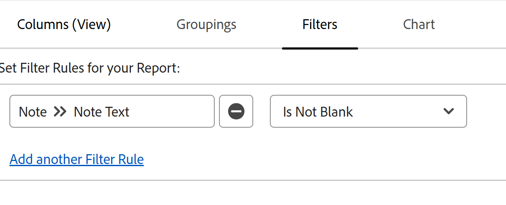

# Exibir todas as atualizações em um relatório de Nota

<!--

(NOTE: Alina: ***This is a report and it is in the Getting Started/ Updates section because I think it makes more sense to be in this area, where people want to view updates. - added this to this section from Reporting on 7/3/2018 ) 

-->

A área Atualizações de um objeto exibe um número máximo de 200 atualizações por padrão. Para visualizar todas as atualizações que qualquer um dos usuários inseriu para um objeto, você pode criar um relatório de Nota que exibe todas as atualizações.

>[!NOTE]
>
>Você pode criar um relatório para exibir atualizações em objetos na Pré-visualização com o relatório de Lançamento. Para obter mais informações, consulte [Relatório na área Atualizações com um relatório de Entrada de Diário](../../reports-and-dashboards/reports/creating-and-managing-reports/create-journal-entry-report.md).

## Requisitos de acesso

Você deve ter o seguinte acesso para executar as etapas deste artigo:

<table style="table-layout:auto"> 
 <col> 
 </col> 
 <col> 
 </col> 
 <tbody> 
  <tr> 
   <td role="rowheader"><strong>plano do Adobe Workfront</strong></td> 
   <td> 
Qualquer
 </td> 
  </tr> 
  <tr> 
   <td role="rowheader"><strong>Licença da Adobe Workfront*</strong></td> 
   <td> 
Novo: Padrão 

   
Atual: Plano
 </td> 
  </tr> 
  <tr> 
   <td role="rowheader"><strong>Configurações de nível de acesso</strong></td> 
   <td> 
Editar acesso a:
 
    <ul> 
     <li> 
Criar relatórios, painéis e calendários
 </li> 
     <li> 
Criar filtros, visualizações e agrupamentos
 </li> 
    </ul> </td> 
  </tr> 
  <tr> 
   <td role="rowheader"><strong>Permissões de objeto</strong></td> 
   <td> 
Exibir
 
<b>Nota</b>

   
Se você não tiver a permissão Exibir ou superior a um objeto, as informações desse objeto não serão exibidas no relatório.
  </td> 
  </tr> 
 </tbody> 
</table>

*Para obter informações, consulte [Requisitos de acesso no Adobe Workfront](/help/quicksilver/administration-and-setup/add-users/access-levels-and-object-permissions/access-level-requirements-in-documentation.md).

## Criar um relatório de Nota

Criar um relatório para Observações para qualquer objeto é idêntico, independentemente do objeto.

Por exemplo, para criar um relatório de Notas para todas as notas de um projeto:

1. Clique no ícone  do **Menu principal**, no canto superior direito do Adobe Workfront.

1. Clique em **Relatórios**.
1. Clique em **Novo Relatório** e escolha **Nota**.

1. (Opcional) Clique em **Exibições** e depois em **Adicionar Coluna** para adicionar o **Nome** do **Projeto** no modo de exibição do relatório. 

1. (Opcional) Clique em **Agrupamentos** e depois em **Adicionar Agrupamento** para agrupar pelo **Nome do Projeto**, se estiver relatando vários projetos ao mesmo tempo.\
   Isso garante que as notas sejam agrupadas por seus respectivos projetos, facilitando a leitura do relatório. 

1. (Opcional) Clique em **Filtros** e depois em **Adicionar uma Regra de Filtro**.
1. Adicione um filtro para **Nota** > **Texto da Nota** > **Não Está em Branco**.

   

   >[!TIP]
   >
   >   Se um campo de projeto foi atualizado, mas nenhuma nota foi adicionada no momento da atualização, o **Texto da Nota** da atualização é exibido como **(Nenhum texto adicionado à atualização)**.

1. (Opcional) Adicione outro filtro para **Projeto** > **Nome** > **Igual a** e adicione um ou vários nomes de projeto para os quais deseja exibir anotações.
1. Clique em **Salvar + Fechar**.\
   Todas as atualizações inseridas no projeto por todos os usuários com permissões para, pelo menos, Visualizar o projeto são exibidas no relatório.
