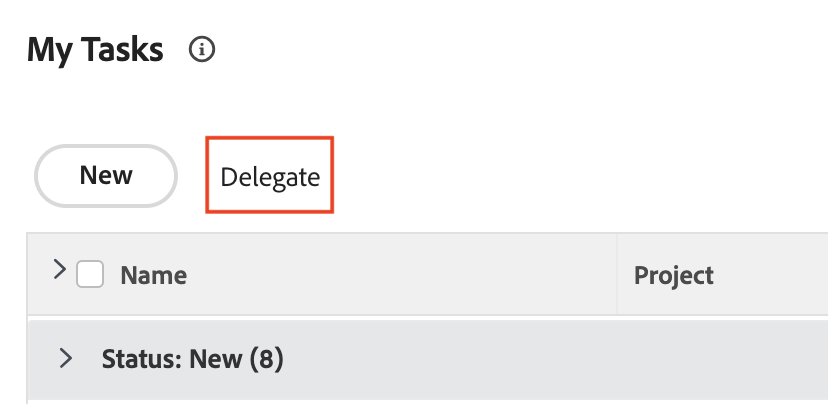

# Mudar da página inicial herdada para a nova página inicial

A página inicial herdada será removida do Workfront em 17/10 com a versão do quarto trimestre. Este artigo fornece informações sobre qual funcionalidade estará disponível na nova página inicial, bem como recomendações para os administradores do Workfront que migram os usuários para a nova experiência na página inicial.

Para obter mais informações sobre a descontinuação da Página inicial herdada, consulte o [Guia de descontinuação da página inicial herdada](/help/quicksilver/product-announcements/announcements/legacy-home-deprecation.md).

## Entenda o que está mudando de Página inicial herdada para Nova página inicial

### Lista de trabalho

#### Organizar trabalho com o widget Meu trabalho

O widget Meu trabalho foi criado no formato de widget para refletir a lista de trabalho Página inicial herdada o mais próximo possível. Os usuários podem agrupar e filtrar sua Lista de trabalho no widget Meu trabalho com filtros e agrupamentos semelhantes:

| **Filtro** | **Agrupamento** |
|------------|-----------|
| - Trabalhando em   - Pronto para iniciar   - Não está pronto   - Solicitado   - Delegado   - Concluído | - Projeto   - Status   - Data de Vencimento   - Nada |

**Agrupamentos herdados do Início não disponíveis no Novo Início**

* Data de conclusão planejada - Renomeado para data de vencimento na nova página inicial
* Início planejado
* Data de confirmação
* Minhas Prioridades

| **Residência Herdada** | **Nova Página Inicial** |
|------------|-----------|
|  |  |

#### Delegar trabalho

Os usuários ainda podem delegar trabalho da Nova página inicial nos seguintes widgets:

* Meu trabalho
* Minhas tarefas
* Meus problemas
* Aguardando minhas aprovações

Os usuários podem encontrar trabalho delegado a eles nos seguintes widgets:

* Widget Meu trabalho usando o filtro Delegado a mim
* Aguardando minhas aprovações usando o filtro Aprovações delegadas

| **Residência Herdada** | **Nova Página Inicial** |
|------------|-----------|
|  |  |

#### Usar a exibição de calendário

A exibição de calendário não está mais disponível na Página inicial nova; no entanto, uma substituição de calendário está no roteiro para Prioridades.

#### Criar uma tarefa pessoal

Os usuários não podem mais criar uma tarefa pessoal exatamente da mesma forma que faziam na Página inicial herdada. Em vez disso, os usuários podem criar itens por fazer.

#### Exibir aprovações que enviei

Os usuários não podem visualizar as aprovações que enviaram na Nova página inicial. Se os usuários em sua organização precisarem dessa funcionalidade, você poderá criar um relatório de aprovações como uma solução alternativa ou voto favorável ou publicar um comentário aqui nas seguintes publicações da comunidade:

* [Adicionar o widget &quot;Aprovações que enviei&quot; à nova página inicial](https://experienceleaguecommunities.adobe.com/t5/workfront-ideas/add-quot-approvals-i-submitted-quot-widget-to-new-home/idc-p/704664#M25269)
* [Adicionar &quot;Aprovações que enviei&quot; à nova página inicial](https://experienceleaguecommunities.adobe.com/t5/workfront-ideas/add-quot-approvals-i-submitted-quot-widget-to-new-home/idc-p/704664#M25269)

#### Adicionar itens à Minha Prioridade

Os usuários não têm mais acesso a um recurso Minha prioridade na Nova página inicial. Estamos introduzindo uma nova coluna Meu foco com Prioridades que substituirá isso.

Os usuários podem usar o widget Quadros para rastrear itens de alta prioridade, se desejado.

### Atualizar itens de trabalho

Na página inicial Herdada, os usuários podiam usar o painel direito para atualizar seus trabalhos. Na Nova página inicial, os usuários agora usam o painel Resumo para atualizar o trabalho. Este é o mesmo painel de Resumo disponível em Projetos, Tarefas, Problemas e Documentos.

#### Usar o painel Resumo

No Resumo, os usuários podem

* Atualizar o percentual concluído
* Adicionar uma atualização
* Navegue até a área Documentos para fazer upload de um documento
* Exibir detalhes do item de trabalho e atualizar campos personalizados
Os administradores do Workfront podem personalizar quais campos aparecem no Resumo no modelo de Layout. Para obter mais informações, consulte [Personalizar Início e Resumo usando um modelo de layout](/help/quicksilver/administration-and-setup/customize-workfront/use-layout-templates/customize-home-summary-layout-template.md).
* Alterar o status do item de trabalho
* Exibir subtarefas
* Registrar de tempo
* Exibir processos de aprovação anexados
* Upload de arquivos - Essa funcionalidade é nova

| **Residência Herdada** | **Nova Página Inicial** |
|------------|-----------|
|  |  |

#### Abrir o painel de resumo

Os usuários podem abrir o painel Resumo ao passar o mouse sobre o item de trabalho e clicar no ícone **Resumo** .

Para obter informações adicionais sobre como usar o painel Resumo, consulte [Visão geral do resumo](/help/quicksilver/workfront-basics/the-new-workfront-experience/summary-overview.md).

#### Usar ações rápidas

Além do painel Resumo, os usuários também podem usar ações rápidas para

* Registrar de tempo
* Adicionar uma atualização
* Atualizar um formulário personalizado
* Carregar um arquivo

Para localizar o menu de ações rápidas, passe o mouse sobre o item de trabalho. A lista de ações rápidas é exibida próximo ao botão **Trabalhar nisto** ou **Concluído**.

### Exibir aprovações e solicitações de equipe

Os usuários ainda podem gerenciar aprovações e solicitações de equipe na Nova página inicial usando os seguintes widgets:

* Aguardando minha aprovação
* Todas as aprovações
* Solicitações de equipe

Para obter informações sobre como adicionar widgets à Nova Página Inicial, consulte [Adicionar, editar ou remover widgets na Nova Página Inicial](/help/quicksilver/workfront-basics/using-home/new-home/add-edit-remove-widgets-in-new-home.md).

## Saiba mais sobre widgets disponíveis

Os widgets são a base da Nova página inicial. Ao adicionar widgets à Página inicial, os usuários podem escolher o tipo de informação que é exibida para melhor atender às suas necessidades de trabalho. Alguns widgets só estão disponíveis para tipos específicos de licença, pois os objetos que eles rastreiam só estão disponíveis para essas licenças.

Os administradores do Workfront podem personalizar quais widgets estão disponíveis na Nova página inicial, usando um modelo de layout. Para obter mais informações, consulte [Personalizar nova Página Inicial usando um modelo de layout](/help/quicksilver/administration-and-setup/customize-workfront/use-layout-templates/customize-new-home-layout-template.md).

+++ Expandir para ver uma lista detalhada dos widgets disponíveis
Abaixo estão os 11 widgets atualmente disponíveis para escolher, bem como um resumo das informações que eles exibem:

* **Meu trabalho**\
   Exibe todas as tarefas, problemas e solicitações atribuídas em um único local. Você pode clicar no botão Trabalhar nisso para começar a trabalhar em um item ou no botão Concluído para marcá-los como concluídos. Você também pode atualizar informações (Status, Condição, Percentual concluído) sobre tarefas e problemas, tempo de registro e adicionar atualizações do widget Meu trabalho.

* **Quadros**\
    Exibe todos os painéis que você criou ou que foi convidado a usar. Você também pode criar um novo quadro com base nos seguintes modelos: Quadro básico, Quadro Kanban, Quadro retrospectivo, Quadro dinâmico.

* **Meus projetos**\
    Exibe _projetos que você possui_ ou _projetos nos quais você está_ em uma lista. Você pode usar filtros, visualizações ou agrupamentos existentes para personalizar a lista ou pode criar um projeto diretamente do widget.

* **Minhas tarefas**\
    Exibe tarefas que são atribuídas a você em uma lista. Você pode usar filtros, visualizações ou agrupamentos existentes para personalizar a lista ou pode criar uma tarefa diretamente do widget. Você também pode delegar suas tarefas enquanto estiver fora do escritório.

* **Meus problemas**\
    Exibe os problemas atribuídos a você em uma lista. Você pode usar filtros, visualizações ou agrupamentos existentes para personalizar a lista ou pode criar um problema diretamente do widget. Este widget inclui apenas problemas cujos projetos associados estão definidos como Atuais e não inclui projetos concluídos. Você também pode delegar seus problemas enquanto estiver fora do escritório.

* **Minhas solicitações**\
    Exibe todas as solicitações que você submeteu, um filtro para exibir somente solicitações abertas e um botão que abre o painel de resumo de uma solicitação.

* **Solicitações da equipe**\
    Exibe todas as solicitações pendentes para as equipes nas quais você está, classificadas por equipe, bem como botões para atribuir diretamente uma solicitação a um usuário ou para trabalhar nela você mesmo.

* **Aguardando minha aprovação**\
    Exibe todas as suas aprovações atribuídas ou delegadas pendentes, um botão para delegar aprovações e botões para tomar decisões de aprovação diretamente no dispositivo.

* **Todas as aprovações**\
        Exibe dois gráficos com informações sobre o tempo médio de aprovação e as decisões, bem como exibições de lista de aprovações pendentes e vencidas. Este recurso faz parte de uma versão em fases e, no momento, está disponível apenas para clientes específicos.

* **Menções**\
    Exibe threads de comentários recentes de toda a Workfront, semelhantes à página Minhas atualizações. Você pode usar o botão responder para compor uma resposta no widget. Este widget também mostra comentários feitos sobre tarefas e problemas atribuídos a você, atribuídos a outro usuário, de sua propriedade, do qual você é o contato principal ou que você criou, desde que a tarefa ou problema tenha sido atualizado nos últimos 30 dias.

* **Tarefas pendentes**\
    Este widget exclusivo permite adicionar itens a uma lista de verificação pessoal que você pode editar livremente. As tarefas são rastreadas como tarefas no seu projeto pessoal e permanecem por até duas semanas após a conclusão.

  >[!NOTE]
  >
  >Você deve ter permissão para criar tarefas para criar tarefas no widget de tarefas, e somente as tarefas pessoais inseridas pelo usuário atual aparecerão no widget.

+++

  

### Exibir widgets disponíveis para cada tipo de licença

Por padrão, a Página inicial é preenchida com alguns widgets específicos com base no seu tipo de licença. As tabelas abaixo descrevem quais widgets os usuários de cada tipo de licença veem quando navegam pela primeira vez para a Nova página inicial.

<table border="1" class="inlineTable">
    <tr>
        <td><b>Novo tipo de licença</b></td>
        <td><b>Widgets padrão</b></td>
    </tr>
    <tr>
        <td>Padrão</td>
        <td>Meus projetos, Meu trabalho, Menções, Tarefas pendentes</td>
    </tr>
    <tr>
        <td>Leve</td>
        <td>Meu trabalho, esperando minha aprovação</td>
    </tr>
    <tr>
        <td>Colaborador</td>
        <td>Minhas solicitações, Menções, Aguardando minha aprovação, Quadros</td>
    </tr>
    <tr>
        <td>Externo</td>
        <td>Aguardando minha aprovação</td>
    </tr>
</table>

<table border="1" class="inlineTable">
    <tr>
        <td><b>Tipo de licença atual</b></td>
        <td><b>Widgets padrão</b></td>
    </tr>
    <tr>
        <td>Plano</td>
        <td>Meus Projetos, Menções, Tarefas</td>
    </tr>
    <tr>
        <td>Trabalho</td>
        <td>Meu trabalho, menções, tarefas</td>
    </tr>
    <tr>
        <td>Revisar</td>
        <td>Meu trabalho, menções</td>
    </tr>
    <tr>
        <td>Solicitar</td>
        <td>Meus projetos, aguardando minha aprovação</td>
    </tr>
    <tr>
        <td>Contribuir</td>
        <td>Meu trabalho, menções</td>
    </tr>
    <tr>
        <td>Externo</td>
        <td>Aguardando minha aprovação</td>
    </tr>
</table>

## Preparar para a descontinuação

Para ajudar a minimizar a interrupção para você e sua organização, veja a seguir algumas recomendações que ajudarão a facilitar a transição.

### Iniciar a transição para a Nova página inicial

Nossa principal recomendação é começar a transição para uma nova casa o mais rápido possível. Em termos organizacionais, isso significa que o administrador personaliza as experiências dos usuários por meio de modelos de layout (semelhantes à Página inicial herdada), para garantir que cada usuário tenha o que precisa.

Recomendamos aos administradores:

1. Crie um layout padrão de Nova página inicial usando modelos de layout (ou, opcionalmente, crie um para cada usuário, equipe, grupo ou função de trabalho que exija um layout exclusivo). Consulte [Personalizar nova Página Inicial usando um modelo de layout](/help/quicksilver/administration-and-setup/customize-workfront/use-layout-templates/customize-new-home-layout-template.md) para obter mais informações.

1. Atribua os novos modelos de layout a um pequeno número de usuários de teste, que podem verificar se os widgets e as configurações gerais atendem às necessidades de trabalho.

1. Reatribua o restante dos usuários ao layout Nova página inicial.

Fazer isso o mais rápido possível dará aos usuários tempo para se ajustarem à nova experiência e personalizar suas Novas páginas iniciais para melhor atender às suas necessidades individuais. Consulte [Remover, adicionar e reorganizar widgets na nova Página Inicial](/help/quicksilver/workfront-basics/using-home/new-home/add-edit-remove-widgets-in-new-home.md) para obter informações sobre como um usuário pode personalizar os widgets em sua própria nova Página Inicial.