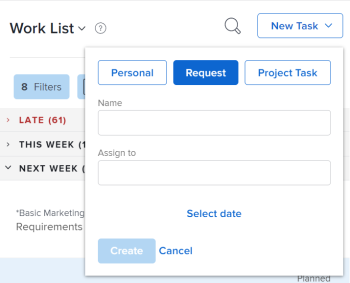

# Criar itens de trabalho a partir da Área da página inicial

<!--

(NOTE: From Courtney: Need to rename)

-->

Você pode criar itens de trabalho a partir da [!UICONTROL Início] área. Você pode criar tarefas pessoais para si mesmo, solicitar trabalho de outros usuários ou adicionar tarefas a projetos específicos.

## Requisitos de acesso

Você deve ter o seguinte acesso para executar as etapas deste artigo:

<table style="table-layout:auto"> 
 <col> 
 <col> 
 <tbody> 
  <tr> 
   <td role="rowheader"><strong>[!DNL Adobe Workfront plan*]</strong></td> 
   <td> 
Qualquer Um
 </td> 
  </tr> 
  <tr> 
   <td role="rowheader"><strong>[!DNL Adobe Workfront] licença*</strong></td> 
   <td> 
[!UICONTROL Work] ou superior
 </td> 
  </tr> 
  <tr> 
   <td role="rowheader"><strong>Configurações de nível de acesso*</strong></td> 
   <td> 
[!UICONTROL Worker]
 
<b>Nota</b>
 
   
Se você ainda não tiver acesso, pergunte ao seu [!DNL Workfront] administrador se eles definirem restrições adicionais no seu nível de acesso. Para obter informações sobre como uma [!DNL Workfront] administrador pode modificar seu nível de acesso, consulte <a href="../../../administration-and-setup/add-users/configure-and-grant-access/create-modify-access-levels.md" class="MCXref xref">Criar ou modificar níveis de acesso personalizados</a>.
 </td> 
  </tr> 
  <tr> 
   <td role="rowheader"><strong>Permissões de objeto</strong></td> 
   <td> 
[!UICONTROL Editar] acesso ou superior em tarefas
 
Para obter informações sobre como solicitar acesso adicional, consulte <a href="../../../workfront-basics/grant-and-request-access-to-objects/request-access.md" class="MCXref xref">Solicitar acesso a objetos </a>.
 </td> 
  </tr> 
 </tbody> 
</table>

&#42;Para descobrir que plano, tipo de licença ou acesso você tem, entre em contato com o [!DNL Workfront] administrador.

## Criar uma tarefa pessoal

É possível criar uma tarefa pessoal que esteja disponível somente para você no [!UICONTROL Início] área:

1. Clique em **[!UICONTROL Menu principal]**  no canto superior direito e clique em **[!UICONTROL Início]**.
1. Clique em **[!UICONTROL Nova tarefa]** > **[!UICONTROL Pessoal]**.

   

1. No **[!UICONTROL Nome]** especifique um nome para a tarefa.
1. (Opcional) Clique em **[!UICONTROL Selecionar data]**, em seguida, selecione a data de vencimento da tarefa. Isso define o [!UICONTROL Data de Término Planejada] para a tarefa.\
   Você pode alterar a **[!UICONTROL Data de Término Planejada]** clicando na data no painel direito ou editando a variável **[!UICONTROL Isso será feito até]** data diretamente na tarefa.

1. Clique em **[!UICONTROL Criar]** para salvar a tarefa.\
   A tarefa é atribuída a você e está disponível no [!UICONTROL Início] área.

>[!NOTE]
>
>* Quando você cria uma tarefa pessoal, ela é armazenada em um projeto &quot;oculto&quot; que não pode ser pesquisado no [!UICONTROL Workfront]. O nome do projeto é &quot;&lt; Nome do usuário > Tarefas &quot;. O &quot;Nome de usuário&quot; é o nome completo do usuário que criou a tarefa. Você pode acessar este projeto somente quando clica na tarefa pessoal na [!UICONTROL Início] da navegação estrutural da tarefa, por exemplo.
>
>* Diferentemente das tarefas de projeto comuns, as tarefas pessoais têm um conjunto limitado de campos que são visíveis na interface do Workfront e não influenciam a linha do tempo ou o progresso de nenhum projeto. Reatribuir uma tarefa pessoal a outro usuário adiciona todos os campos de tarefa a uma tarefa pessoal, mas a tarefa permanece no projeto pessoal do usuário que criou a tarefa.
>
>
>* As tarefas pessoais são exibidas na folha de horas somente quando têm horas registradas ou estão fixadas na folha de horas. Você só pode fixar uma tarefa pessoal em uma folha de horas quando há horas registradas para a tarefa. Para obter mais informações, consulte [Registrar tempo](../../../timesheets/create-and-manage-timesheets/log-time.md).
> 
>* Recomendamos que você crie um projeto e mova quaisquer tarefas pessoais para ele, se quiser fazer com que as tarefas pessoais façam parte do fluxo de trabalho normal.
>
> ![[!UICONTROL Projeto para tarefas pessoais]](assets/createworkitems-personal--project-350x105.png)

## Solicitar trabalho de outro usuário

Você pode solicitar trabalho de outro usuário diretamente da área da Página inicial. Quando você solicita trabalho de outro usuário conforme descrito nesta seção, a tarefa é exibida como uma solicitação na área Página inicial do usuário até que o usuário clique em **[!UICONTROL Trabalhar na tarefa]**.

Para solicitar trabalho a outro usuário da [!UICONTROL Início] área:

1. Clique em **[!UICONTROL Menu principal]**  no canto superior direito e clique em **[!UICONTROL Início]**.
1. Clique em **[!UICONTROL Nova tarefa]** e selecione **[!UICONTROL Solicitação]**.

   

1. No **[!UICONTROL Nome]** especifique um nome para a tarefa.
1. No **[!UICONTROL Atribuir a]** comece digitando o nome do usuário, da equipe ou da função que deseja atribuir e, em seguida, clique no nome quando ele for exibido no menu suspenso.
1. No [!UICONTROL Adicionar como] selecione se deseja adicionar uma tarefa ou problema.
1. Clique em **[!UICONTROL Selecionar data]**, em seguida, selecione a data e a hora de vencimento da tarefa.
1. Clique em **[!UICONTROL Criar]** para salvar a tarefa.\
   A tarefa é exibida como uma solicitação de trabalho no [!UICONTROL Início] área do usuário designado.

## Adicionar uma tarefa ou problema a um projeto

Você pode adicionar uma tarefa ou problema a um projeto existente diretamente da área da página inicial:

1. Clique em **[!UICONTROL Menu principal]**  no canto superior direito e clique em **Início**.
1. Clique em **[!UICONTROL Nova tarefa]** e selecione **[!UICONTROL Tarefa do projeto]**.

   

1. No **[!UICONTROL Nome]** especifique um nome para a tarefa ou problema.
1. No **[!UICONTROL Atribuir a]** comece digitando o nome do usuário, da equipe ou da função que deseja atribuir e, em seguida, clique no nome quando ele for exibido no menu suspenso.
1. Comece digitando o nome do projeto no qual deseja criar a tarefa ou problema e clique no nome quando ele aparecer no menu suspenso.

   >[!IMPORTANT]
   >
   >A tarefa ou problema aparece no [!UICONTROL Lista de trabalho] somente quando o projeto [!UICONTROL Status] está definida como [!UICONTROL Atual].

1. (Condicional) Para criar um problema, selecione **[!UICONTROL Problema]** do **[!UICONTROL Adicionar como]** menu suspenso. Por padrão, **[!UICONTROL Tarefa]** está selecionada.

1. Clique em **[!UICONTROL Selecionar data]**, em seguida, selecione a data e a hora de vencimento da tarefa.
1. Clique em **[!UICONTROL Criar]** para salvar a tarefa.
