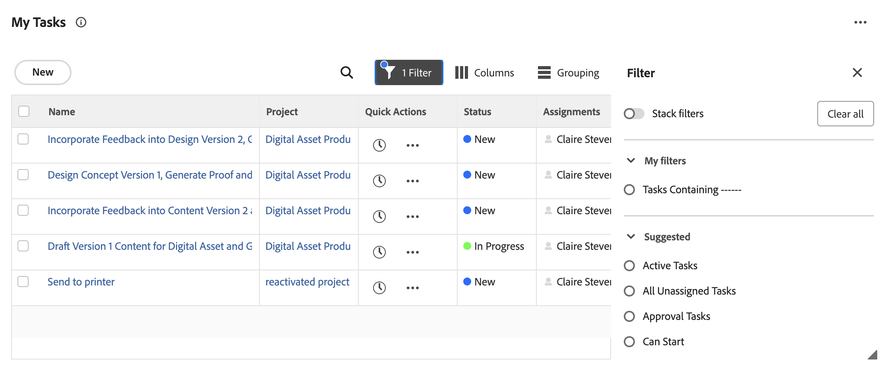
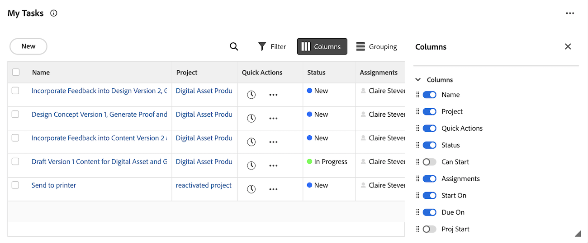

# Exibir itens na [!UICONTROL lista de trabalho] na área [!UICONTROL Página Inicial]

<!-- Audited: 1/2024 -->

Cada widget contém sua própria lista de trabalho. As listas de trabalho exibem todos os itens de trabalho atribuídos a você. Você pode controlar quais itens são exibidos na sua [!UICONTROL lista de trabalho], usando filtros e agrupamentos.

>[!IMPORTANT]
>
>* Para exibir tarefas e problemas nos widgets da Página inicial, o projeto principal deles deve estar no status Atual ou em um status que equivale a atual.
>* Os projetos também devem estar no status Atual ou em um status que equivale a atual para ser exibido na Página inicial.

## Requisitos de acesso

+++ Expanda para visualizar os requisitos de acesso para a funcionalidade neste artigo.

<table style="table-layout:auto"> 
 <col> 
 </col> 
 <col> 
 </col> 
 <tbody> 
  <tr> 
   <td role="rowheader"><strong>[!DNL Adobe Workfront package]</strong></td> 
   <td> 
Qualquer
 </td> 
  </tr> 
  <tr> 
   <td role="rowheader"><strong>[!DNL Adobe Workfront] licença</strong></td> 
   <td><ul><li>[!UICONTROL Contributor] somente para aprovações</li> <li>[!UICONTROL Padrão] ou superior para todos os outros objetos</li> 
Ou
 
  </ul><ul><li>[!UICONTROL Review] somente para aprovações</li> <li>[!UICONTROL Trabalho] ou superior para todos os outros objetos</li> </td> 
  </tr> </ul>
  <tr> 
   <td role="rowheader"><strong>Configurações de nível de acesso</strong></td> 
   <td> 
[!UICONTROL Exibir] ou superior acesso a Projetos, Tarefas, Problemas e Documentos
 </td> 
  </tr> 
  <tr> 
   <td role="rowheader"><strong>Permissões de objeto</strong></td> 
   <td> 
Contribute permissões ou superior para as tarefas e problemas que você precisa trabalhar
  </td> 
  </tr> 
 </tbody> 
</table>

Para obter informações, consulte [Requisitos de acesso na documentação do Workfront](/help/quicksilver/administration-and-setup/add-users/access-levels-and-object-permissions/access-level-requirements-in-documentation.md).

+++

## Requisitos para itens de trabalho serem exibidos na lista de trabalho

Há requisitos internos para os quais os itens de trabalho são exibidos em determinadas listas de trabalho do widget. Os itens de trabalho devem atender a estes requisitos para serem exibidos nas listas de trabalho dos seguintes widgets.

### Widget Minhas tarefas

As tarefas devem atender aos seguintes requisitos para serem exibidas no widget Minhas tarefas:

* O status da tarefa não é igual a Concluído.
* O usuário logado deve ser atribuído à tarefa.
* O status da tarefa não é igual a Concluído.
* O projeto ao qual a tarefa pertence deve estar em um status que seja igual a Atual.

### Widget Meus problemas

Os problemas devem atender aos seguintes requisitos para serem exibidos no widget Meus problemas:

* O usuário logado deve ser atribuído ao problema.
* O status do problema não é igual a Concluído.
* Não há um objeto não resolvido anexado ao problema.
* O status do problema não é igual a Concluído.
* O projeto ao qual o problema pertence deve estar em um status que seja igual a Atual.

### Widget Minhas equipes

As solicitações de equipe devem atender aos seguintes requisitos para serem exibidas no widget Minhas equipes:

* O usuário logado pertence à equipe à qual o item de trabalho está atribuído.
* O status do item de trabalho não é igual a Concluído.
* O item de trabalho não tem um processo de aprovação não resolvido anexado.
* O item de trabalho não é uma tarefa recorrente.
* O projeto ao qual o item de trabalho pertence deve estar em um status igual a Atual.

## Filtrar seu trabalho

Você pode filtrar itens na [!UICONTROL Lista de Trabalho] de um widget para ver apenas tipos específicos de itens. Por exemplo, você pode filtrar a [!UICONTROL Lista de Trabalho] de Meu Trabalho para exibir somente problemas ou solicitações.

>[!NOTE]
>
>As opções de filtro são armazenadas no navegador. Se você usar consistentemente o mesmo navegador no mesmo computador (e não limpar os dados do site), os filtros selecionados não serão alterados. Se você alternar navegadores ou computadores, os filtros serão revertidos para a opção padrão, que é com todos os filtros desmarcados.

Para filtrar o trabalho:

1. Clique no **[!UICONTROL Menu Principal]**  no canto superior direito e clique em **[!UICONTROL Página Inicial]**.
1. (Condicional) Clique em **Personalizar** para adicionar um dos seguintes widgets:

   | Dispositivo | Descrição |
   |--------------|---------------------------------------------------------------------------------------------------|
   | Quadros | Exibe todos os painéis que você criou ou que foi convidado a usar |
   | Meu trabalho | Exibe tarefas e problemas atribuídos a você |
   | Meus projetos | Exibe os projetos que você possui ou os projetos em que você está |
   | Minhas tarefas | Exibe as tarefas atribuídas a você |
   | Meus problemas | Exibe os problemas atribuídos a você |
   | Minhas solicitações | Exibe todas as solicitações que você enviou |
   | Minhas aprovações | Exibe todas as aprovações pendentes, atribuídas, delegadas e enviadas |

1. Clique no ícone **Filtro**  no canto superior direito da lista de trabalho do widget.
1. Escolha um filtro **Sugerido** ou um filtro que você tenha criado.
Para obter informações detalhadas sobre os filtros sugeridos, consulte [Visão geral dos filtros de widget da página inicial](/help/quicksilver/workfront-basics/using-home/using-the-home-area/widget-filter-overview-home.md).
1. (Opcional) Ative **Empilhar filtros** para selecionar várias opções de filtro.

   

## Agrupar seu trabalho

Você pode agrupar o widget [!UICONTROL lista de trabalho] para manter seus itens de trabalho organizados.

Para agrupar a lista de trabalho:

1. Clique no **[!UICONTROL Menu Principal]**  no canto superior direito e clique em **[!UICONTROL Página Inicial]**.
1. (Condicional) Clique em **Personalizar** para adicionar um dos seguintes widgets:

   | Dispositivo | Descrição |
   |--------------|---------------------------------------------------------------------------------------------------|
   | Quadros | Exibe todos os painéis que você criou ou que foi convidado a usar |
   | Meu trabalho | Exibe tarefas e problemas atribuídos a você |
   | Meus projetos | Exibe os projetos que você possui ou os projetos em que você está |
   | Minhas tarefas | Exibe as tarefas atribuídas a você |
   | Meus problemas | Exibe os problemas atribuídos a você |
   | Minhas solicitações | Exibe todas as solicitações que você enviou |
   | Minhas aprovações | Exibe todas as aprovações pendentes, atribuídas, delegadas e enviadas |

1. Clique no ícone do **Grupo**  no canto superior direito da lista de trabalho do widget.
1. Escolha um agrupamento **Sugerido** ou um agrupamento que você tenha criado.
   

## Personalizar colunas da lista de trabalho

Você pode escolher quais colunas aparecerão na lista de trabalho do widget:

1. Clique no **[!UICONTROL Menu Principal]**  no canto superior direito e clique em **[!UICONTROL Página Inicial]**.
1. (Condicional) Clique em **Personalizar** para adicionar um dos seguintes widgets:

   | Dispositivo | Descrição |
   |--------------|---------------------------------------------------------------------------------------------------|
   | Quadros | Exibe todos os painéis que você criou ou que foi convidado a usar |
   | Meu trabalho | Exibe tarefas e problemas atribuídos a você |
   | Meus projetos | Exibe os projetos que você possui ou os projetos em que você está |
   | Minhas tarefas | Exibe as tarefas atribuídas a você |
   | Meus problemas | Exibe os problemas atribuídos a você |
   | Minhas solicitações | Exibe todas as solicitações que você enviou |
   | Minhas aprovações | Exibe todas as aprovações pendentes, atribuídas, delegadas e enviadas |

1. Clique no ícone **Coluna**  no canto superior direito da lista de trabalho de widgets.
1. Ative ou desative as colunas de acordo com suas preferências.
1. (Opcional) Clique no ícone **Arrastar**  para reordenar as colunas.
   

## Exibir itens atrasados

[!DNL Adobe Workfront] usa as seguintes datas para determinar se as solicitações de trabalho estão atrasadas:

* **Tarefas**: [!UICONTROL Data de Término Planejada]
* **Problemas**: [!UICONTROL Data de Término Planejada]
* **Documentos**: [!UICONTROL Data de envio]
* **Folhas de horas**: [!UICONTROL Data de envio]
* **Aprovações**: [!UICONTROL Data de envio]
* **Aprovações de provas**: [!UICONTROL Prazo da prova]

