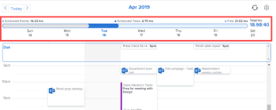

# Exibição do [!UICONTROL Calendário da página inicial]

<!--

Updated for QS except for section about expanding a work item in the list--this isn't working yet in QS.

-->

O modo de exibição [!UICONTROL Calendário da Página Inicial] na área [!UICONTROL Página Inicial] permite que você visualize e gerencie sua semana de trabalho e atribuições de trabalho em um calendário de trabalho pessoal visível somente para você. Você pode usá-lo para programar quando quiser fazer seu trabalho. E você pode integrá-lo a calendários externos, como um calendário do [!UICONTROL Microsoft Outlook].

>[!NOTE]
>
>A exibição do [!UICONTROL Calendário da página inicial] é diferente dos relatórios do [!UICONTROL Calendário]. Para obter mais informações sobre relatórios do [!UICONTROL Calendário], consulte a [[!UICONTROL Visão geral dos relatórios do Calendário]](../../../reports-and-dashboards/reports/calendars/calendar-reports-overview.md).

Se você precisar de instruções sobre como configurar o seu [!UICONTROL Calendário da Página Inicial], consulte [Definir as configurações de exibição do [!UICONTROL Calendário da Página Inicial]](../../../workfront-basics/using-home/using-the-home-area/configure-home-calendar-view.md).

Para obter informações sobre como acessar o modo de exibição [!UICONTROL Calendário da página inicial], consulte [Exibir o [!UICONTROL Calendário da página inicial]](../../../workfront-basics/using-home/using-the-home-area/view-home-calendar.md).

Para obter informações sobre como integrar o seu [!UICONTROL Calendário da Página Inicial] a um calendário externo, consulte [[!UICONTROL Definir as configurações de exibição do [!UICONTROL Calendário da Página Inicial]]](../../../workfront-basics/using-home/using-the-home-area/configure-home-calendar-view.md).

As seções restantes neste artigo explicam as seções e funções da Exibição [!UICONTROL Calendário da Página Inicial] com mais detalhes.

## Lista de trabalho no [!UICONTROL Calendário da página inicial]

Itens de trabalho (tarefas, problemas, solicitações e aprovações) atribuídos a você, seus grupos, suas equipes e suas funções são exibidos na [!UICONTROL lista de trabalho] à esquerda do Calendário, na área [!UICONTROL Página inicial].

Você pode arrastar seus itens de trabalho da [!UICONTROL lista de trabalho] para seu [!UICONTROL Calendário da Página Inicial] para agendar quando deseja trabalhar neles. Para saber mais sobre como agendar seu trabalho, consulte [Usar a exibição [!UICONTROL Calendário da página inicial]](../../../workfront-basics/using-home/using-the-home-area/use-home-calendar-view.md).

Você pode clicar em um item de trabalho na lista para visualizar e atualizar seu progresso nele.

Dependendo do item, as seguintes informações poderão ser exibidas à esquerda do calendário para o item selecionado na lista de trabalho:

* **[!UICONTROL Nome do projeto]**: exibido na parte superior esquerda do item de trabalho. Este é o projeto ao qual o item está associado. No exemplo acima, o título do projeto é &quot;Campanha do último trimestre de 2020&quot;.
* **[!UICONTROL Nome do item de trabalho]**: exibido abaixo do nome do projeto. No exemplo acima, o título do item de trabalho é &quot;Edição de 15 de setembro&quot;.
* **[!UICONTROL Concluído]**: clique neste botão para alterar o status da sua atribuição de trabalho para [!UICONTROL Concluído]. Esse botão só é exibido quando você está atribuído à tarefa ou problema.
* **[!UICONTROL Concluído com minha parte]**: clique no botão [!UICONTROL Concluído com minha parte] para alterar o status da sua atribuição de trabalho para [!UICONTROL Concluído].
* **[!UICONTROL Planejado]**: exibe as horas que um gerenciador de recursos alocou para o trabalho a ser concluído no item. Para saber mais sobre as horas planejadas, consulte [visão geral das Horas planejadas](../../../manage-work/tasks/task-information/planned-hours.md).

* **[!UICONTROL Registrado]**: Exibe as horas que você fez logon no item de trabalho em uma folha de horas ou na guia [!UICONTROL Atualizações] para o item. Para saber mais, consulte [Registrar tempo em um item de trabalho na área [!UICONTROL Página inicial]](../../../workfront-basics/using-home/using-the-home-area/log-time-on-work-item-in-home.md)

* **[!UICONTROL Agendado]**: exibe as horas agendadas para o item de trabalho no modo de exibição [!UICONTROL Calendário]. Para saber mais sobre como mover itens de trabalho para o modo de exibição [!UICONTROL Calendário], consulte [Agendar itens de trabalho no [!UICONTROL Calendário da Página Inicial]](../../../workfront-basics/using-home/using-the-home-area/use-home-calendar-view.md#scheduling-work-items-in-home-calendar) em [Usar o modo de exibição [!UICONTROL Calendário da Página Inicial]](../../../workfront-basics/using-home/using-the-home-area/use-home-calendar-view.md).

* **[!UICONTROL Detalhes]**: clique neste botão para exibir os detalhes do item de trabalho no painel direito da exibição [!UICONTROL Calendário].
* **[!UICONTROL Trabalhar nisto]**: clique neste botão para aceitar a atribuição para trabalhar no item.

## Barra de alocação

Ao configurar seu [!UICONTROL Calendário da Página Inicial], você especifica o número de horas que normalmente trabalha em uma semana (consulte [Definir suas configurações de exibição do [!UICONTROL Calendário da Página Inicial]](../../../workfront-basics/using-home/using-the-home-area/configure-home-calendar-view.md)). [!DNL Adobe Workfront] usa este número para determinar o total de horas de trabalho alocáveis.

A barra [!UICONTROL Alocação] é uma representação visual do número de horas na semana de trabalho e como você as está usando.

As cores na barra [!UICONTROL Alocação] indicam as seguintes informações:

* **Cinza**: número de horas agendadas para eventos de calendários integrados. Para obter mais informações sobre a integração de calendários, consulte a seção [Definir as configurações de exibição do [!UICONTROL Calendário da página inicial]](../../../workfront-basics/using-home/using-the-home-area/configure-home-calendar-view.md#configuring-your-home-calendar-view) em [Definir as configurações de exibição do [!UICONTROL Calendário da página inicial]](../../../workfront-basics/using-home/using-the-home-area/configure-home-calendar-view.md).

* **Azul**: número de horas agendadas para [!DNL Workfront] itens de trabalho atribuídos a você. Você pode agendar trabalhos arrastando itens da [!UICONTROL Lista de Trabalho] e soltando-os no calendário. Para obter mais informações sobre como agendar trabalhos, consulte a seção [Agendar itens de trabalho no seu [!UICONTROL Calendário da Página Inicial]](../../../workfront-basics/using-home/using-the-home-area/use-home-calendar-view.md#scheduling-work-items-in-home-calendar) em [Usar a exibição [!UICONTROL Calendário da Página Inicial]](../../../workfront-basics/using-home/using-the-home-area/use-home-calendar-view.md).

* **Azul-claro**: o número de horas livres disponíveis para alocação.
* **Vermelho**(não mostrado acima): eventos agendados e itens de trabalho que excederam o número de horas disponíveis para a semana.

## Barra de [!UICONTROL Conclusão]

A barra [!UICONTROL Data de Conclusão] do [!UICONTROL Calendário da Página Inicial] exibe os itens que vencem na semana exibida no momento, de acordo com sua [!UICONTROL Data de Conclusão Planejada].

>[!NOTE]
>
>Se você tiver integrado o calendário do Microsoft ao calendário do [!DNL Workfront], os itens na barra [!UICONTROL Vencimento] não aparecerão no calendário do Microsoft, a menos que você os tenha arrastado da Lista de Trabalho para o Calendário do [!DNL Workfront]. Para obter mais informações, consulte a seção [Lista de trabalho no [!UICONTROL Calendário da página inicial]](#work-list-on-the-home-calendar) acima e o artigo [Definir as configurações de exibição do [!UICONTROL Calendário da página inicial]](../../../workfront-basics/using-home/using-the-home-area/configure-home-calendar-view.md).
