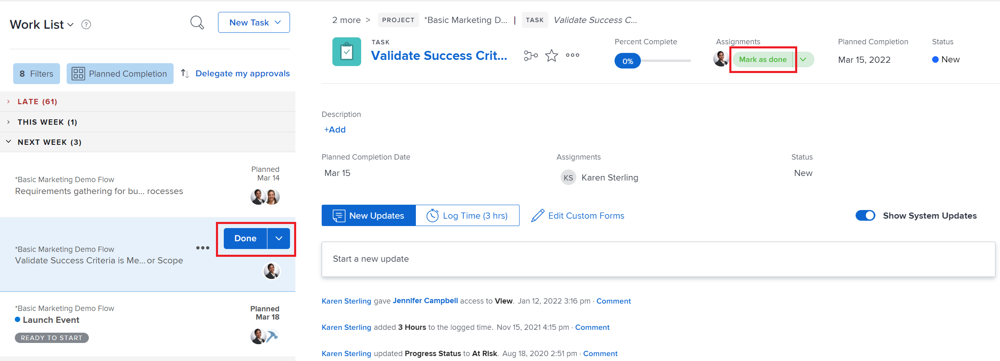

# Marcar um item como [!UICONTROL Concluído] na área [!UICONTROL Página inicial]

Você pode marcar uma tarefa ou problema como Concluído se for o designado da tarefa ou do problema. Quando você marca uma tarefa ou problema como [!UICONTROL Concluído], o status da tarefa ou problema é alterado para [!UICONTROL Concluído].

>[!NOTE]
>
>Você não verá o botão [!UICONTROL Concluído], a menos que seja um dos recursos atribuídos à tarefa ou ao problema.

## Requisitos de acesso

Você deve ter o seguinte acesso para executar as etapas deste artigo:

<table style="table-layout:auto"> 
 <col> 
 </col> 
 <col> 
 </col> 
 <tbody> 
  <tr> 
   <td role="rowheader"><strong>[!DNL Adobe Workfront plan*]</strong></td> 
   <td> 
Qualquer
 </td> 
  </tr> 
  <tr> 
   <td role="rowheader"><strong>[!DNL Adobe Workfront] licença*</strong></td> 
   <td> 
[!UICONTROL Work] ou superior
 </td> 
  </tr> 
  <tr> 
   <td role="rowheader"><strong>Configurações de nível de acesso*</strong></td> 
   <td> 
Acesso de [!UICONTROL Editar] a Tarefas e Problemas
 
Observação: se você ainda não tiver acesso, pergunte ao administrador do [!DNL Workfront] se ele definiu restrições adicionais no seu nível de acesso. Para obter informações sobre como um administrador do [!DNL Workfront] pode modificar seu nível de acesso, consulte <a href="../../../administration-and-setup/add-users/configure-and-grant-access/create-modify-access-levels.md" class="MCXref xref">Criar ou modificar níveis de acesso personalizados</a>.
 </td> 
  </tr> 
  <tr> 
   <td role="rowheader"><strong>Permissões de objeto</strong></td> 
   <td> 
permissões do Contribute ou superior para as tarefas e problemas que você precisa para trabalhar
 
Para obter informações sobre como solicitar acesso adicional, consulte <a href="../../../workfront-basics/grant-and-request-access-to-objects/request-access.md" class="MCXref xref">Solicitar acesso aos objetos </a>.
 </td> 
  </tr> 
 </tbody> 
</table>

&#42;Para saber qual plano, tipo de licença ou acesso você tem, contate o administrador do [!DNL Workfront].

## Marcar uma tarefa ou problema como [!UICONTROL Concluído]

Somente o usuário atribuído à tarefa ou problema pode marcá-la como [!UICONTROL Concluído].

1. Clique no **[!UICONTROL Menu principal]**  no canto superior direito e em **[!UICONTROL Página inicial]**.
1. Na **[!UICONTROL Lista de Trabalho]**, localize todos os itens que estão aguardando para serem trabalhados.
1. Siga um destes procedimentos:

* Clique em **[!UICONTROL Concluído]** no item de trabalho.\
   Consulte [Entender as opções do botão [!UICONTROL Concluído]](#understand-the-options-of-the-done-button) para obter informações mais detalhadas sobre como esse botão pode aparecer.

* Selecione o item que deseja marcar como concluído e, no painel direito, clique em **[!UICONTROL Atualizar status]** e altere o status do item para um status que corresponda a [!UICONTROL Concluído] ou [!UICONTROL Fechado].

## Entenda as opções do botão [!UICONTROL Concluído]

Por padrão, clicar no botão [!UICONTROL Concluído] em um item de trabalho altera o status desse item para [!UICONTROL Concluído] (para tarefas) ou [!UICONTROL Resolvido] (para problemas).

O administrador do [!DNL Adobe Workfront] pode personalizar quais status estão associados ao botão [!UICONTROL Concluído] e aplicar essas personalizações à Equipe Doméstica.

Dependendo de quantos status estão associados ao botão [!UICONTROL Concluído] ou de quantos recursos estão atribuídos à tarefa ou ao problema, a aparência do botão [!UICONTROL Concluído] pode mudar.

* [Botão [!UICONTROL Concluído] associado a um status](#done-button-associated-with-one-status)
* [Botão [!UICONTROL Concluído] associado a vários status](#done-button-associated-with-multiple-statuses)
* [Botão [!UICONTROL Concluído] para itens atribuídos a vários recursos](#done-button-for-items-assigned-to-multiple-resources)

### Botão [!UICONTROL Concluído] associado a um status

Quando o botão [!UICONTROL Concluído] estiver associado a um status e o item de trabalho for atribuído somente a você, o botão exibirá **[!UICONTROL Concluído]**. Ao clicar nela, o status da tarefa ou do problema é alterado para o status associado ao botão [!UICONTROL Concluído].

Para entender qual status está associado ao botão [!UICONTROL Concluído], verifique as [!UICONTROL Configurações de Equipe] da sua Equipe Doméstica para a seção [!UICONTROL Botão Concluído], conforme descrito em [Editar configurações de equipe](../../../people-teams-and-groups/create-and-manage-teams/edit-team-settings.md).

Se você não estiver atribuído a uma Equipe interna, o status padrão será escolhido ao clicar em [!UICONTROL Concluído], conforme descrito acima em [Entenda as opções do botão [!UICONTROL Concluído]](#understand-the-options-of-the-done-button).

### Botão [!UICONTROL Concluído] associado a vários status

Quando o botão [!UICONTROL Concluído] estiver associado a mais de um status, o botão mostrará a palavra **[!UICONTROL Concluído]**, seguida por um menu suspenso. Neste cenário, você não pode simplesmente clicar em [!UICONTROL Concluído]. Você deve selecionar um status no menu suspenso. Selecione o status que melhor se ajusta à conclusão do item de trabalho. Ao fazer isso, você altera o status do item de trabalho.

Para entender como você pode associar vários status ao botão [!UICONTROL Concluído], consulte [Configurar o botão [!UICONTROL Concluído] para tarefas](../../../people-teams-and-groups/create-and-manage-teams/configure-the-done-button-for-tasks.md) e [Configurar o botão [!UICONTROL Concluído] para problemas](../../../people-teams-and-groups/create-and-manage-teams/configure-the-done-button-for-issues.md).

<!--

-->

### Botão [!UICONTROL Concluído] para itens atribuídos a vários recursos

Quando a tarefa ou o problema for atribuído a mais de um recurso, o botão mostrará a palavra **[!UICONTROL Concluído]**, seguida por um menu suspenso. No menu suspenso, você tem a opção de escolher entre **[!UICONTROL Concluído com minha parte]** (que permite que os membros da equipe saibam que você está concluído com sua parte da tarefa) ou o status associado ao botão [!UICONTROL Concluído] (que conclui o item). Depois de selecionar **[!UICONTROL Concluído com minha parte]**, o item de trabalho será removido da Lista de Trabalho, mas permanecerá na Lista de Trabalho daqueles ainda atribuídos ao item de trabalho.\
Se o botão Concluído estiver associado a vários status, eles serão listados em **Concluído com minha parte**.

>[!NOTE]
>
>Em uma tarefa ou problema com vários atribuídos, cada usuário é responsável por indicar que sua própria atribuição na tarefa ou problema foi realmente concluída. Por esse motivo, cada destinatário deve clicar em [!UICONTROL Concluído] para mostrar que concluiu o trabalho atribuído a ele no item.

