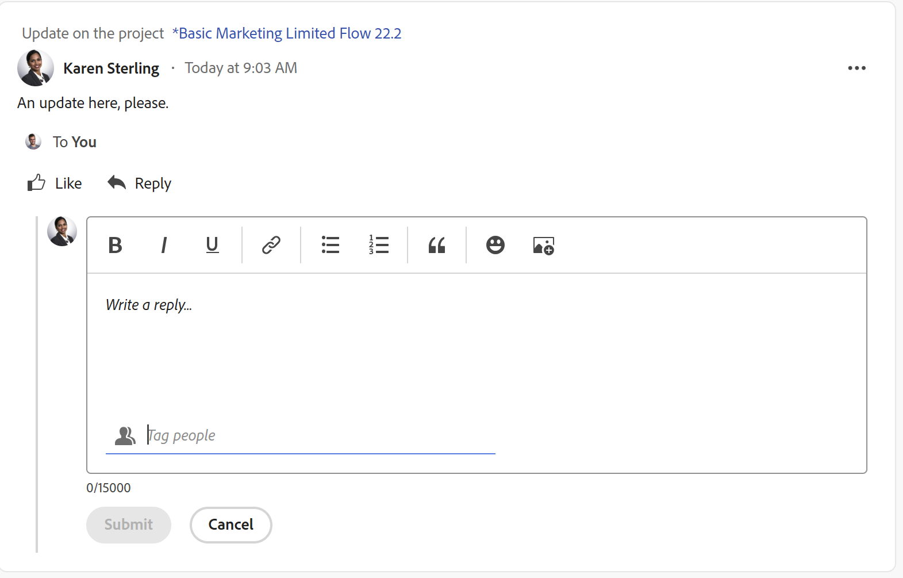

# Usar a área [!UICONTROL Minhas atualizações]

<!--The highlighted information on this page refers to functionality not yet generally available. It is available only in the Preview environment for all customers. After the monthly releases to Production, the same features are also available in the Production environment for customers who enabled fast releases.    

For information about fast releases, see [Enable or disable fast releases for your organization](/help/quicksilver/administration-and-setup/set-up-workfront/configure-system-defaults/enable-fast-release-process.md). -->

Você pode usar a área [!UICONTROL Minhas atualizações] para revisar rapidamente as aprovações que estão aguardando sua decisão ou as conversas incluídas em.

Como usuário com uma licença de [!UICONTROL Revisão], você pode localizar a área [!UICONTROL Minhas Atualizações] no [!UICONTROL Menu Principal] por padrão, e a área [!UICONTROL Minhas Atualizações] é a página inicial padrão para você.

Para obter informações sobre [!DNL Adobe Workfront] licenças, consulte [[!DNL Adobe Workfront] visão geral das licenças](../../../administration-and-setup/add-users/access-levels-and-object-permissions/wf-licenses.md).

Se você tiver um tipo de licença diferente de Revisão, o administrador do [!DNL Workfront] ou do Grupo deverá adicionar a área [!UICONTROL Minhas Atualizações] ao modelo de layout para exibi-la no Menu Principal. Para obter informações, consulte [Personalizar o [!UICONTROL Menu Principal] usando um modelo de layout](../../../administration-and-setup/customize-workfront/use-layout-templates/customize-main-menu.md).

## Requisitos de acesso

+++ Expanda para visualizar os requisitos de acesso para a funcionalidade neste artigo.

<table style="table-layout:auto"> 
 <col> 
 <col> 
 <tbody> 
  <tr> 
   <td role="rowheader"><strong>[!DNL Adobe Workfront package]</strong></td> 
   <td> 
Qualquer
 </td> 
  </tr> 
  <tr> 
   <td role="rowheader"><strong>[!DNL Adobe Workfront] licença</strong></td> 
   <td> 
Colaborador ou superior

   
Solicitação ou superior
 </td> 
  </tr> 
  <tr> 
   <td role="rowheader"><strong>Configuração do nível de acesso</strong></td> 
   <td> 
Acesso de visualização ou superior a qualquer objeto para o qual você esteja marcado em uma conversa ou precise resolver uma aprovação (Projetos, Tarefas, Problemas, Documentos)
 </td> 
  </tr> 
  <tr> 
   <td role="rowheader"><strong>Permissões de objeto</strong></td> 
   <td> 
Permissões [!UICONTROL View] ou superior para projetos, tarefas, problemas, documentos nos quais você está marcado em uma conversa ou precisa resolver uma aprovação
 </td> 
  </tr> 
 </tbody> 
</table>

Para obter informações, consulte [Requisitos de acesso na documentação do Workfront](/help/quicksilver/administration-and-setup/add-users/access-levels-and-object-permissions/access-level-requirements-in-documentation.md).

+++

## Pré-requisitos

Você deve ter o seguinte antes de começar:

* Se você tiver uma licença do [!DNL Workfront] diferente de [!UICONTROL Revisão], o administrador do [!DNL Workfront] ou do Grupo deverá adicionar a área [!UICONTROL Minhas Atualizações] ao [!UICONTROL Menu Principal] usando um modelo de layout e atribuir você a esse modelo.

* Por padrão, os usuários com licença de revisão podem exibir a área [!UICONTROL Minhas atualizações] no [!UICONTROL Menu Principal].

## Acessar a área [!UICONTROL Minhas atualizações]

{{step1-to-my-updates}}

A área [!UICONTROL Minhas atualizações] é aberta.

As aprovações e solicitações de acesso atribuídas a você estão listadas na primeira metade da página, em **Minhas atualizações**.

1. (Opcional) Role até a parte inferior da área [!UICONTROL **Minhas atualizações**] e clique na seta para a direita para exibir mais aprovações exibidas em páginas adicionais.

   >[!TIP]
   >
   >As primeiras cinco aprovações ou solicitações de acesso são exibidas por padrão. As aprovações restantes são exibidas em páginas adicionais. Você pode exibir um máximo de 2000 aprovações na área [!UICONTROL Minhas atualizações].

   

1. (Opcional) Expanda o menu suspenso **[!UICONTROL Filtro]**  no canto superior direito da seção **[!UICONTROL Minhas Atualizações]** e selecione um dos seguintes:

   <table style="table-layout:auto"> 
    <col> 
    </col> 
    <col> 
    </col> 
    <tbody> 
     <tr> 
      <td role="rowheader"><strong>[!UICONTROL Tudo]</strong></td> 
      <td>Aprovações enviadas a você ou delegadas a você por outro usuário. Para obter informações sobre como delegar aprovações, consulte <a href="../../../review-and-approve-work/manage-approvals/delegate-approval-requests.md" class="MCXref xref">Delegar solicitação de aprovação</a>. </td> 
     </tr> 
     <tr> 
      <td role="rowheader"><strong>[!UICONTROL Aprovações Delegadas]</strong></td> 
      <td>Aprovações delegadas a você por outro usuário. </td> 
     </tr> 
     <tr> 
      <td role="rowheader"><strong>[!UICONTROL Minhas Aprovações]</strong></td> 
      <td> 
Aprovações enviadas a você. 
 
Para obter mais informações sobre como aprovar itens, consulte <a href="../../../review-and-approve-work/manage-approvals/approving-work.md" class="MCXref xref">Aprovando trabalho </a>.
 </td> 
     </tr> 
    </tbody> 
   </table>

1. Para aprovar ou rejeitar um item ou sugerir alterações em um documento antes da aprovação, faça o seguinte:

   1. (Opcional) Clique no ícone **suspenso**  ao lado da sua decisão de aprovação (**[!UICONTROL Aprovar]**, **[!UICONTROL Alterações]**,**[!UICONTROL Rejeitar]**) e adicione um comentário, depois clique em **[!UICONTROL Adicionar]**.

      Ou

      Clique em **[!UICONTROL Ignorar]** se não quiser inserir um comentário.

      

      >[!NOTE]
      >
      >A opção [!UICONTROL Alterações] é exibida somente para aprovações de documentos.

      Dependendo do ícone suspenso selecionado, o item será aprovado, rejeitado ou, no caso de uma aprovação de documento, aprovado com uma solicitação para fazer alterações adicionais.

      >[!TIP]
      >
      >Se não quiser adicionar um comentário à sua decisão, você pode clicar no botão **[!UICONTROL Aprovar]**, **[!UICONTROL Rejeitar]** ou **[!UICONTROL Alterações]** e a decisão de aprovação será concedida imediatamente.
      >
      >
      >
      >
      >Para obter mais informações sobre aprovação de trabalho, consulte [Aprovando trabalho](../../../review-and-approve-work/manage-approvals/approving-work.md).

1. Clique em **[!UICONTROL Conceder acesso]** para conceder a solicitação de acesso enviada a você

   Ou

   Expanda o menu suspenso **[!UICONTROL Alterar acesso]** para modificar o acesso solicitado antes de concedê-lo.

   

1. (Opcional) Clique em **[!UICONTROL Ignorar]** para limpar a solicitação de acesso da sua lista de aprovação sem concedê-la.
1. Clique em **[!UICONTROL Delegar minhas aprovações]** para delegar as aprovações enviadas a você, caso não esteja disponível para tomar decisões de aprovação por algum tempo. Para obter mais informações sobre a delegação de aprovações, consulte [Delegar solicitação de aprovação](../../../review-and-approve-work/manage-approvals/delegate-approval-requests.md).
1. Role até a área **[!UICONTROL Menções]** abaixo das suas aprovações. Aqui, você pode exibir todos os itens nos quais foi incluído em uma conversa.

   >[!TIP]
   >
   >As primeiras 50 menções são exibidas por padrão.

1. (Opcional) Clique em **[!UICONTROL Mostrar mais atualizações]** para exibir mais menções.
1. (Opcional) Clique em **[!UICONTROL Responder]** para responder a um comentário e siga um destes procedimentos:
   * Comece a digitar uma resposta
   * Use a barra de ferramentas Rich Text para formatar o texto, adicionar links, listas, emojis, aspas ou imagens à mensagem
   * Adicione usuários ou equipes para notificá-los sobre a sua resposta.

     Para obter mais informações sobre como responder a atualizações, consulte [Trabalho de atualização](/help/quicksilver/workfront-basics/updating-work-items-and-viewing-updates/update-work.md).

     Quando terminar de adicionar a resposta, clique em **[!UICONTROL Enviar]**.

     

1. (Opcional) Clique em **[!UICONTROL Fixar página atual]** para fixar a área [!UICONTROL Minhas atualizações] na navegação superior.
