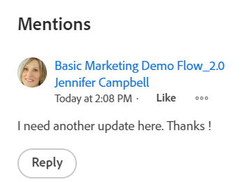

# Use o [!UICONTROL Minhas atualizações] area

<!--

(NOTE: there is a similar article like this in the "My Work" folder that is conditioned for Classic only)

-->

Você pode usar o [!UICONTROL Minhas atualizações] para revisar rapidamente as aprovações que aguardam sua decisão ou as conversas nas quais você foi incluído.

Como um usuário com uma [!UICONTROL Revisão] licença, você pode encontrar a [!UICONTROL Minhas atualizações] na [!UICONTROL Menu principal] por padrão e [!UICONTROL Minhas atualizações] área é a página de aterrissagem padrão para você.

Para obter informações sobre [!DNL Adobe Workfront] licenças, consulte [[!DNL Adobe Workfront] visão geral das licenças](../../../administration-and-setup/add-users/access-levels-and-object-permissions/wf-licenses.md).

Se você tiver um tipo de licença diferente de Revisar, a variável [!DNL Workfront] ou O administrador do grupo deve adicionar o [!UICONTROL Minhas atualizações] para exibir o modelo de layout no Menu principal. Para obter mais informações, consulte [Personalize o [!UICONTROL Menu principal] uso de um modelo de layout](../../../administration-and-setup/customize-workfront/use-layout-templates/customize-main-menu.md).

## Requisitos de acesso

Você deve ter o seguinte acesso para executar as etapas neste artigo:

<table style="table-layout:auto"> 
 <col> 
 <col> 
 <tbody> 
  <tr> 
   <td role="rowheader"><strong>[!DNL Adobe Workfront plan*]</strong></td> 
   <td> 
Qualquer Um
 </td> 
  </tr> 
  <tr> 
   <td role="rowheader"><strong>[!DNL Adobe Workfront] licença*</strong></td> 
   <td> 
[!UICONTROL Solicitação] ou superior
 </td> 
  </tr> 
  <tr> 
   <td role="rowheader"><strong>Configurações de nível de acesso*</strong></td> 
   <td> 
Exibir acesso ou superior a quaisquer objetos para os quais você tenha tags em uma conversa ou precise resolver uma aprovação (Projetos, Tarefas, Problemas, Documentos)
 
Observação: Se ainda não tiver acesso, pergunte ao seu [!DNL Workfront] administrador se eles definirem restrições adicionais em seu nível de acesso. Para obter informações sobre como uma [!DNL Workfront] administrador pode modificar seu nível de acesso, consulte <a href="../../../administration-and-setup/add-users/configure-and-grant-access/create-modify-access-levels.md" class="MCXref xref">Criar ou modificar níveis de acesso personalizados</a>.
 </td> 
  </tr> 
  <tr> 
   <td role="rowheader"><strong>Permissões de objeto</strong></td> 
   <td> 
Permissões da [!UICONTROL View] ou superior a projetos, tarefas, problemas, documentos nos quais você está marcado em uma conversa ou precisa resolver uma aprovação
 
Para obter informações sobre como solicitar acesso adicional, consulte <a href="../../../workfront-basics/grant-and-request-access-to-objects/request-access.md" class="MCXref xref">Solicitar acesso a objetos </a>.
 </td> 
  </tr> 
 </tbody> 
</table>

Para descobrir qual plano, tipo de licença ou acesso você tem, entre em contato com seu [!DNL Workfront] administrador.

## Pré-requisitos

Você deve ter o seguinte antes de começar:

* Se você tiver uma [!DNL Workfront] licença diferente de [!UICONTROL Revisão], seu [!DNL Workfront] ou O administrador do grupo deve adicionar o [!UICONTROL Minhas atualizações] para a [!UICONTROL Menu principal] usar um modelo de layout e atribuí-lo a esse modelo.

* Os usuários da licença de revisão podem visualizar o [!UICONTROL Minhas atualizações] na sua [!UICONTROL Menu principal] por padrão.

## Acesse o [!UICONTROL Minhas atualizações] area

1. Clique em **[!UICONTROL Minhas atualizações]** no **[!UICONTROL Menu principal]**.

   

   O [!UICONTROL Minhas atualizações] será aberta.

   As aprovações e solicitações de acesso atribuídas a você são listadas na primeira metade da página, em Minhas atualizações.

   

1. (Opcional) Role até a parte inferior da [!UICONTROL Minhas atualizações] e clique na seta apontando para a direita para exibir mais aprovações que são exibidas em páginas adicionais.

   >[!TIP]
   >
   >As cinco primeiras aprovações ou solicitações de acesso são exibidas por padrão. As aprovações restantes são exibidas em páginas adicionais. Você pode exibir no máximo 2000 aprovações na [!UICONTROL Minhas atualizações] área.

   

1. (Opcional) Expanda a **[!UICONTROL Filtro]** menu suspenso  no canto superior direito do **[!UICONTROL Minhas atualizações]** e selecione dentre as seguintes opções:

   <table style="table-layout:auto"> 
    <col> 
    </col> 
    <col> 
    </col> 
    <tbody> 
     <tr> 
      <td role="rowheader"><strong>[!UICONTROL Tudo]</strong></td> 
      <td>Aprovações enviadas a você ou delegadas a você por outro usuário. Para obter informações sobre a delegação de aprovações, consulte <a href="../../../review-and-approve-work/manage-approvals/delegate-approval-requests.md" class="MCXref xref">Delegar solicitação de aprovação</a>. </td> 
     </tr> 
     <tr> 
      <td role="rowheader"><strong>[!UICONTROL Aprovações delegadas]</strong></td> 
      <td>Aprovações delegadas a você por outro usuário. </td> 
     </tr> 
     <tr> 
      <td role="rowheader"><strong>[!UICONTROL Minhas aprovações]</strong></td> 
      <td> 
Aprovações enviadas a você. 
 
Para obter mais informações sobre aprovação de itens, consulte <a href="../../../review-and-approve-work/manage-approvals/approving-work.md" class="MCXref xref">Aprovar trabalho </a>.
 </td> 
     </tr> 
    </tbody> 
   </table>

1. Para aprovar ou rejeitar um item ou sugerir alterações em um documento antes de aprovar, faça o seguinte:

   1. (Opcional) Clique no botão **lista suspensa** ícone  ao lado da decisão de aprovação (**[!UICONTROL Aprovar]**, **[!UICONTROL Alterações]**,**[!UICONTROL Rejeitar]**) e adicionar um comentário, em seguida, clique em **[!UICONTROL Adicionar]**.

      Ou

      Clique em **[!UICONTROL Ignorar]** se não quiser inserir um comentário.

      

      >[!NOTE]
      >
      >O [!UICONTROL Alterações] é exibida somente para aprovações de documento.

      Dependendo do ícone suspenso selecionado, o item é aprovado, rejeitado ou, no caso de aprovação de documento, aprovado com uma solicitação para fazer alterações adicionais.

      >[!TIP]
      >
      >Se não quiser adicionar um comentário à sua decisão, clique no botão **[!UICONTROL Aprovar]**, **[!UICONTROL Rejeitar]** ou **[!UICONTROL Alterações]** e a decisão de aprovação é concedida imediatamente.
      >
      >
      >      >

      Para obter mais informações sobre aprovação de trabalho, consulte [Aprovar trabalho](../../../review-and-approve-work/manage-approvals/approving-work.md).

1. Clique em **[!UICONTROL Conceder acesso]** para conceder o pedido de acesso enviado a você

   Ou

   Expanda o **[!UICONTROL Alterar acesso]** menu suspenso para modificar o acesso solicitado antes de concedê-lo.

   

1. (Opcional) Clique em **[!UICONTROL Ignorar]** para limpar a solicitação de acesso da sua lista de aprovação sem concedê-la.
1. Clique em **[!UICONTROL Delegar minhas aprovações]** para delegar as aprovações enviadas a você, caso não esteja disponível para tomar decisões de aprovação por algum tempo. Para obter mais informações sobre delegação de aprovações, consulte [Delegar solicitação de aprovação](../../../review-and-approve-work/manage-approvals/delegate-approval-requests.md).
1. Role para **[!UICONTROL Menções]** sob suas aprovações. Aqui, você pode visualizar todos os itens onde foi incluído em uma conversa.

   

   >[!TIP]
   >
   >As primeiras 50 menções são exibidas por padrão.

1. (Opcional) Clique em **[!UICONTROL Mostrar mais atualizações]** para exibir mais menções.
1. (Opcional) Clique em **[!UICONTROL Responder]** para responder a um comentário, insira sua resposta e clique em **[!UICONTROL Responder]** novamente.

   Para obter mais informações sobre como atualizar itens, consulte [Atualizar trabalho](../../../workfront-basics/updating-work-items-and-viewing-updates/update-work.md).

1. (Opcional) Clique em **[!UICONTROL Fixar página atual]** para fixar o [!UICONTROL Minhas atualizações] para sua navegação superior.
