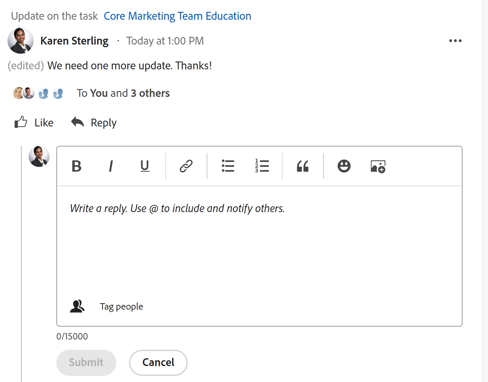

# Use o [!UICONTROL Minhas atualizações] área

<!--

(NOTE: there is a similar article like this in the "My Work" folder that is conditioned for Classic only)

-->

Você pode usar o [!UICONTROL Minhas atualizações] área para revisar rapidamente as aprovações que estão aguardando sua decisão ou as conversas que você incluiu.

Como usuário com uma [!UICONTROL Revisão] licença, você pode encontrar a [!UICONTROL Minhas atualizações] na área [!UICONTROL Menu principal] por padrão e a variável [!UICONTROL Minhas atualizações] é a página inicial padrão para você.

Para obter informações sobre [!DNL Adobe Workfront] licenças, consulte [[!DNL Adobe Workfront] visão geral das licenças](../../../administration-and-setup/add-users/access-levels-and-object-permissions/wf-licenses.md).

Se você tiver um tipo de licença diferente de Revisar, a [!DNL Workfront] ou O administrador de grupo deve adicionar o [!UICONTROL Minhas atualizações] ao modelo de layout para exibi-lo no menu principal. Para obter informações, consulte [Personalize o [!UICONTROL Menu principal] uso de um modelo de layout](../../../administration-and-setup/customize-workfront/use-layout-templates/customize-main-menu.md).

## Requisitos de acesso

Você deve ter o seguinte acesso para executar as etapas deste artigo:

<table style="table-layout:auto"> 
 <col> 
 <col> 
 <tbody> 
  <tr> 
   <td role="rowheader"><strong>[!DNL Adobe Workfront plan]</strong></td> 
   <td> 
Qualquer
 </td> 
  </tr> 
  <tr> 
   <td role="rowheader"><strong>[!DNL Adobe Workfront] licença*</strong></td> 
   <td> 
Novo: Colaborador ou superior

   Ou   
   
Atual: [!UICONTROL Request] ou superior
 </td> 
  </tr> 
  <tr> 
   <td role="rowheader"><strong>Configuração do nível de acesso</strong></td> 
   <td> 
Acesso de visualização ou superior a qualquer objeto para o qual você esteja marcado em uma conversa ou precise resolver uma aprovação (Projetos, Tarefas, Problemas, Documentos)
 </td> 
  </tr> 
  <tr> 
   <td role="rowheader"><strong>Permissões de objeto</strong></td> 
   <td> 
Permissões [!UICONTROL View] ou superior para projetos, tarefas, problemas, documentos nos quais você está marcado em uma conversa ou precisa resolver uma aprovação
 </td> 
  </tr> 
 </tbody> 
</table>

*Para descobrir que plano, tipo de licença ou acesso você tem, entre em contato com o [!DNL Workfront] administrador. Para obter mais informações, consulte [Requisitos de acesso na documentação do Workfront](/help/quicksilver/administration-and-setup/add-users/access-levels-and-object-permissions/access-level-requirements-in-documentation.md).

## Pré-requisitos

Você deve ter o seguinte antes de começar:

* Se você tiver uma [!DNL Workfront] licença diferente de [!UICONTROL Revisão], seu [!DNL Workfront] ou O administrador de grupo deve adicionar o [!UICONTROL Minhas atualizações] para a área [!UICONTROL Menu principal] usando um modelo de layout e atribua a você esse modelo.

* Revisar — os usuários da licença podem visualizar o [!UICONTROL Minhas atualizações] na sua [!UICONTROL Menu principal] por padrão.

## Acesse o [!UICONTROL Minhas atualizações] área

1. Clique em **[!UICONTROL Minhas atualizações]** no **[!UICONTROL Menu principal]**.

   

   A variável [!UICONTROL Minhas atualizações] é aberta.

   As aprovações e solicitações de acesso atribuídas a você estão listadas na primeira metade da página, em **Minhas atualizações**.

   

1. (Opcional) Role até a parte inferior da [!UICONTROL Minhas atualizações] e clique na seta à direita para exibir mais aprovações exibidas em páginas adicionais.

   >[!TIP]
   >
   >As primeiras cinco aprovações ou solicitações de acesso são exibidas por padrão. As aprovações restantes são exibidas em páginas adicionais. Você pode exibir um máximo de 2000 aprovações na [!UICONTROL Minhas atualizações] área.

   

1. (Opcional) Expanda a janela **[!UICONTROL Filtro]** menu suspenso  no canto superior direito da **[!UICONTROL Minhas atualizações]** e selecione uma das seguintes opções:

   <table style="table-layout:auto"> 
    <col> 
    </col> 
    <col> 
    </col> 
    <tbody> 
     <tr> 
      <td role="rowheader"><strong>[!UICONTROL Tudo]</strong></td> 
      <td>Aprovações enviadas a você ou delegadas a você por outro usuário. Para obter informações sobre como delegar aprovações, consulte <a href="../../../review-and-approve-work/manage-approvals/delegate-approval-requests.md" class="MCXref xref">Delegar solicitação de aprovação</a>. </td> 
     </tr> 
     <tr> 
      <td role="rowheader"><strong>[!UICONTROL Aprovações Delegadas]</strong></td> 
      <td>Aprovações delegadas a você por outro usuário. </td> 
     </tr> 
     <tr> 
      <td role="rowheader"><strong>[!UICONTROL Minhas Aprovações]</strong></td> 
      <td> 
Aprovações enviadas a você. 
 
Para obter mais informações sobre aprovação de itens, consulte <a href="../../../review-and-approve-work/manage-approvals/approving-work.md" class="MCXref xref">Aprovar trabalho </a>.
 </td> 
     </tr> 
    </tbody> 
   </table>

1. Para aprovar ou rejeitar um item ou sugerir alterações em um documento antes da aprovação, faça o seguinte:

   1. (Opcional) Clique no link **menu suspenso** ícone  ao lado da sua decisão de aprovação (**[!UICONTROL Aprovar]**, **[!UICONTROL Alterações]**,**[!UICONTROL Rejeitar]**), adicione um comentário e clique em **[!UICONTROL Adicionar]**.

      Ou

      Clique em **[!UICONTROL Ignorar]** se não quiser inserir um comentário.

      

      >[!NOTE]
      >
      >A variável [!UICONTROL Alterações] é exibida somente para aprovações de documentos.

      Dependendo do ícone suspenso selecionado, o item será aprovado, rejeitado ou, no caso de uma aprovação de documento, aprovado com uma solicitação para fazer alterações adicionais.

      >[!TIP]
      >
      >Se não quiser adicionar um comentário à sua decisão, clique no link **[!UICONTROL Aprovar]**, **[!UICONTROL Rejeitar]** ou **[!UICONTROL Alterações]** e a decisão de aprovação é concedida imediatamente.
      >
      >
      >
      >
      >Para obter mais informações sobre aprovação de trabalho, consulte [Aprovar trabalho](../../../review-and-approve-work/manage-approvals/approving-work.md).

1. Clique em **[!UICONTROL Conceder acesso]** para conceder a solicitação de acesso enviada

   Ou

   Expanda a **[!UICONTROL Alterar acesso]** menu suspenso para modificar o acesso solicitado antes de concedê-lo.

   

1. (Opcional) Clique em **[!UICONTROL Ignorar]** para limpar a solicitação de acesso da sua lista de aprovação sem concedê-la.
1. Clique em **[!UICONTROL Delegar minhas aprovações]** para delegar as aprovações enviadas a você se não estiver disponível para tomar decisões de aprovação por algum tempo. Para obter mais informações sobre a delegação de aprovações, consulte [Delegar solicitação de aprovação](../../../review-and-approve-work/manage-approvals/delegate-approval-requests.md).
1. Role para a **[!UICONTROL Menções]** abaixo de suas aprovações. Aqui, você pode exibir todos os itens nos quais foi incluído em uma conversa.

   

   >[!TIP]
   >
   >As primeiras 50 menções são exibidas por padrão.

1. (Opcional) Clique em **[!UICONTROL Mostrar mais atualizações]** para ver mais menções.
1. (Opcional) Clique em **[!UICONTROL Responder]** para responder a um comentário e siga um destes procedimentos:
   * Comece a digitar uma resposta
   * Use a barra de ferramentas Rich Text para formatar o texto, adicionar links, listas, emojis, aspas ou imagens à mensagem
   * Adicione usuários ou equipes para notificá-los sobre a sua resposta.

     Quando terminar de adicionar a resposta, clique em **[!UICONTROL Responder]** novamente.

     
1. (Opcional) Clique em **[!UICONTROL Fixar página atual]** para fixar o [!UICONTROL Minhas atualizações] à sua navegação superior.
