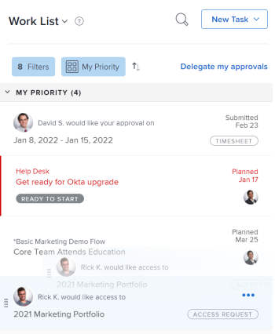

# Priorize o trabalho no [!UICONTROL Início] area

Você pode priorizar itens da [!UICONTROL Lista de Trabalho] em [!UICONTROL Início]. Itens adicionados a [!UICONTROL Minha prioridade] são prioridades somente para você. Eles não são priorizados para ninguém, e ninguém pode priorizá-los para você. É possível adicionar até 20 itens sob a variável [!UICONTROL Minha prioridade] [!UICONTROL Ordenar por] opção.

## Requisitos de acesso

Você deve ter o seguinte acesso para executar as etapas neste artigo:

<table style="table-layout:auto"> 
 <col> 
 </col> 
 <col> 
 </col> 
 <tbody> 
  <tr> 
   <td role="rowheader"><strong>[!DNL Adobe Workfront plan*]</strong></td> 
   <td> 
Qualquer Um
 </td> 
  </tr> 
  <tr> 
   <td role="rowheader"><strong>[!DNL Adobe Workfront] licença*</strong></td> 
   <td> 
[!UICONTROL Trabalho] ou superior
 </td> 
  </tr> 
  <tr> 
   <td role="rowheader"><strong>Configurações de nível de acesso*</strong></td> 
   <td> 
Acesso à [!UICONTROL Editar] para tarefas e problemas
 
Observação: Se ainda não tiver acesso, pergunte ao seu [!DNL Workfront] administrador se eles definirem restrições adicionais em seu nível de acesso. Para obter informações sobre como uma [!DNL Workfront] administrador pode modificar seu nível de acesso, consulte <a href="../../../administration-and-setup/add-users/configure-and-grant-access/create-modify-access-levels.md" class="MCXref xref">Criar ou modificar níveis de acesso personalizados</a>.
 </td> 
  </tr> 
  <tr> 
   <td role="rowheader"><strong>Permissões de objeto</strong></td> 
   <td> 
Contribua com permissões ou mais para as tarefas e problemas que deseja priorizar
 
Para obter informações sobre como solicitar acesso adicional, consulte <a href="../../../workfront-basics/grant-and-request-access-to-objects/request-access.md" class="MCXref xref">Solicitar acesso a objetos </a>.
 </td> 
  </tr> 
 </tbody> 
</table>

Para descobrir qual plano, tipo de licença ou acesso você tem, entre em contato com seu [!DNL Workfront] administrador.

## Adicionar itens a [!UICONTROL Minha prioridade]

Você pode adicionar qualquer item atribuído a você em [!UICONTROL Lista de Trabalho] para [!UICONTROL Minha prioridade]. Novos itens são adicionados na parte inferior da lista.

1. Clique no botão **[!UICONTROL Menu principal]**  no canto superior direito, em seguida, clique em **[!UICONTROL Início]**.
1. No painel esquerdo, verifique se **[!UICONTROL Agrupar por]** O menu suspenso é classificado por uma das seguintes opções:

   * [!UICONTROL Conclusão planejada]
   * [!UICONTROL Início planejado]
   * [!UICONTROL Data de confirmação]
   * [!UICONTROL Projeto]

1. Passe o mouse sobre um item de trabalho e clique no botão **[!UICONTROL Mais]** ícone .

1. Selecionar **[!UICONTROL Adicionar a minha prioridade]**.

   

## Priorizar itens usando o [!UICONTROL Minha prioridade] agrupamento

Você pode priorizar seu trabalho depois de selecionar [!UICONTROL Minha prioridade] no menu suspenso agrupamento , colocando os itens mais importantes na parte superior da lista. As prioridades definidas são visíveis somente para você. Ninguém mais pode priorizar o trabalho para você.

Você deve adicionar itens de trabalho a [!UICONTROL Minha prioridade] antes de começar a priorizar.

Para obter mais informações, consulte a seção [Adicionar itens a [!UICONTROL Minha prioridade]](#add-items-to-my-priority) neste artigo.

1. Clique no botão **[!UICONTROL Menu principal]**  no canto superior direito, em seguida, clique em **[!UICONTROL Início]**.
1. No painel esquerdo, clique no botão **[!UICONTROL Agrupar por]** menu suspenso e selecione **[!UICONTROL Minha prioridade]**.

1. Selecione um item de trabalho e arraste-o e solte-o no lugar certo para priorizá-lo em sua lista.

   

## Remover itens de [!UICONTROL Minha prioridade]

Você pode remover itens de [!UICONTROL Minha prioridade] ao concluir o item de trabalho ou removê-lo manualmente usando o [!UICONTROL Mais] ícone . Se você não tiver sido atribuído de um item de trabalho, ele também será removido de [!UICONTROL Minha prioridade].

1. Clique no botão **[!UICONTROL Menu principal]**  no canto superior direito, em seguida, clique em **[!UICONTROL Início]**.
1. No painel esquerdo, clique no botão **[!UICONTROL Mais]** ícone e selecione **[!UICONTROL Remover de Minha Prioridade]**.

   ![[!UICONTROL [!UICONTROL Remover da Minha Prioridade]]](assets/getting-started-remove-from-priority-nwe-350x395.png)
