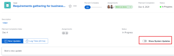

# Atualizar ou editar um item de trabalho no [!UICONTROL Início] área

<!--Audited: April 2024-->

Você pode exibir e adicionar atualizações a um item de trabalho na [!UICONTROL Início] área em [!DNL Adobe Workfront]. Você também pode editar outros dados relacionados ao item de trabalho se tiver acesso para editá-lo.

## Requisitos de acesso

Você deve ter o seguinte acesso para executar as etapas deste artigo:

<table style="table-layout:auto"> 
 <col> 
 </col> 
 <col> 
 </col> 
 <tbody> 
  <tr> 
   <td role="rowheader"><strong>[!DNL Adobe Workfront plan]</strong></td> 
   <td> 
Qualquer
 </td> 
  </tr> 
  <tr> 
   <td role="rowheader"><strong>[!DNL Adobe Workfront] licença*</strong></td> 
   <td> 
Novo: Padrão

   Ou

Atual: [!UICONTROL Trabalho] ou superior
 </td> 
  </tr> 
  <tr> 
   <td role="rowheader"><strong>Configuração do nível de acesso</strong></td> 
   <td> 
Acesso de [!UICONTROL Editar] a Tarefas e Problemas
 </td> 
  </tr> 
  <tr> 
   <td role="rowheader"><strong>Permissões de objeto</strong></td> 
   <td> 
Permissões do Contribute ou superior para as tarefas e problemas que você precisa trabalhar
 </td> 
  </tr> 
 </tbody> 
</table>

*Para descobrir que plano, tipo de licença ou acesso você tem, entre em contato com o [!DNL Workfront] administrador. Para obter mais informações, consulte [Requisitos de acesso na documentação do Workfront](/help/quicksilver/administration-and-setup/add-users/access-levels-and-object-permissions/access-level-requirements-in-documentation.md).

## Exibir atualizações em um item de trabalho

Você pode exibir atualizações em qualquer item de trabalho na [!UICONTROL Lista de trabalho]:

1. Clique em **[!UICONTROL Menu principal]**  no canto superior direito, ou na guia **Menu principal**  no canto superior esquerdo, se disponível, clique em **[!UICONTROL Início]**.
1. No **[!UICONTROL Lista de trabalho]** selecione o item onde deseja exibir as atualizações.\
   As atualizações são exibidas no painel direito.

1. (Opcional) Para filtrar as atualizações do sistema de modo que apenas as atualizações do usuário sejam exibidas, alterne **[!UICONTROL Mostrar atualizações do sistema]** para Desativado.

   

## Fornecer atualizações em um item de trabalho

Você pode fornecer atualizações em qualquer item de trabalho no [!UICONTROL Trabalho] Lista:

1. Clique em **[!UICONTROL Menu principal]**  no canto superior direito, ou na guia **Menu principal**  no canto superior esquerdo, se disponível, clique em **[!UICONTROL Início]**.
1. No **[!UICONTROL Lista de trabalho]** selecione o item no qual deseja fornecer uma atualização.
1. No painel direito, clique em **[!UICONTROL Atualizar]** para exibir um campo de texto.

   

1. No campo fornecido, especifique a atualização.
1. (Opcional) Especifique qualquer uma das seguintes informações:\
   **[!UICONTROL Data de confirmação]:** Selecione uma data no seletor de datas quando confirmar a conclusão do item de trabalho.\
   **[!UICONTROL Como está indo?]:** Selecione uma nova condição para a tarefa ou problema. Para obter mais informações sobre condições de tarefas e problemas, consulte [Atualizar condição para tarefas e problemas](../../../manage-work/projects/updating-work-in-a-project/update-condition-for-tasks-and-issues.md).\
   **[!UICONTROL Status]:** Selecione um novo status para a tarefa ou problema. Para obter mais informações sobre status de tarefas, consulte [Atualizar status da tarefa](../../../manage-work/projects/updating-work-in-a-project/update-task-status.md). Para obter mais informações sobre status de problemas, consulte [Acessar a lista de status de problemas do sistema](../../../administration-and-setup/customize-workfront/creating-custom-status-and-priority-labels/issue-statuses.md).\
   **[!UICONTROL Barra de conclusão]:** Indique a porcentagem de trabalho concluído deslizando a barra de progresso para a porcentagem desejada. Você também pode clicar duas vezes na barra de conclusão e inserir o percentual concluído.

1. Clique em **[!UICONTROL Atualizar]**.

## Editar um item de trabalho

É possível editar qualquer campo em qualquer item de trabalho que você tenha acesso para editar.

1. Clique em **[!UICONTROL Menu principal]**  no canto superior direito, ou na guia **Menu principal**  no canto superior esquerdo, se disponível, clique em **[!UICONTROL Início]**.
1. No **[!UICONTROL Lista de trabalho]** selecione o item que deseja editar.\
   Todos os campos que você tem acesso para visualizar são exibidos no painel direito.

1. No painel direito, passe o mouse sobre o campo que deseja editar.\
   Se você tiver direitos para editar o campo, ele será realçado quando você passar o mouse sobre ele.

   

1. Clique no campo que deseja editar e faça a atualização desejada.
1. Clique em longe do campo para salvar as alterações.
