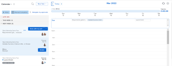

# Visualize o [!UICONTROL Calendário doméstico]

Você pode usar o [!UICONTROL Calendário] exibir em [!DNL Adobe Workfront Home] para gerenciar todos os itens de trabalho atribuídos em um local. Seu [!UICONTROL Calendário doméstico] A exibição do é visível somente para você e somente você pode gerenciar a [!UICONTROL Calendário doméstico].

Para saber mais sobre o Calendário inicial, consulte [Exibição de calendário principal](../../../workfront-basics/using-home/using-the-home-area/home-calendar-view.md).

## Requisitos de acesso

Você deve ter o seguinte acesso para executar as etapas neste artigo:

<table style="table-layout:auto"> 
 <col> 
 </col> 
 <col> 
 </col> 
 <tbody> 
  <tr> 
   <td role="rowheader"><strong>[!DNL Adobe Workfront plan*]</strong></td> 
   <td> 
Qualquer Um
 </td> 
  </tr> 
  <tr> 
   <td role="rowheader"><strong>[!DNL Adobe Workfront] licença*</strong></td> 
   <td> 
[!UICONTROL Trabalho] ou superior
 </td> 
  </tr> 
  <tr> 
   <td role="rowheader"><strong>Configurações de nível de acesso*</strong></td> 
   <td> 
Acesso à [!UICONTROL Editar] para tarefas e problemas
 
Observação: Se ainda não tiver acesso, pergunte ao seu [!DNL Workfront] administrador se eles definirem restrições adicionais em seu nível de acesso. Para obter informações sobre como uma [!DNL Workfront] administrador pode modificar seu nível de acesso, consulte <a href="../../../administration-and-setup/add-users/configure-and-grant-access/create-modify-access-levels.md" class="MCXref xref">Criar ou modificar níveis de acesso personalizados</a>.
 </td> 
  </tr> 
  <tr> 
   <td role="rowheader"><strong>Permissões de objeto</strong></td> 
   <td> 
Permissões do [!UICONTROL Contribute] ou superior para as tarefas e problemas que deseja adicionar ao calendário
 
Para obter informações sobre como solicitar acesso adicional, consulte <a href="../../../workfront-basics/grant-and-request-access-to-objects/request-access.md" class="MCXref xref">Solicitar acesso a objetos </a>.
 </td> 
  </tr> 
 </tbody> 
</table>

&#42;Para descobrir qual plano, tipo de licença ou acesso você tem, entre em contato com seu [!DNL Workfront] administrador.

## Visualize o [!DNL Workfront] [!UICONTROL Calendário doméstico]

1. Clique no botão **[!UICONTROL Início]** ícone  no canto superior esquerdo do Adobe Workfront.

   >[!NOTE]
   >
   >Seu [!DNL Workfront] O administrador pode fazer as seguintes alterações no [!UICONTROL Início] ícone no seu ambiente:
   >
   >* Substitua por uma imagem personalizada para ilustrar sua organização. Nesse caso, o ícone terá uma aparência diferente da mostrada neste artigo.
   >* Substitua a página vinculada a ela por uma página diferente. Nesse caso, clique no botão **[!UICONTROL Menu principal]**  no canto superior direito da página, em seguida, clique em **[!UICONTROL Início]**.

1. Clique em **[!UICONTROL Lista de Trabalho]** no canto superior esquerdo de Início e clique em **[!UICONTROL Calendário]** no menu suspenso.

   

   O [!UICONTROL Calendário doméstico] exibição é exibida.

   

   Todos os itens de trabalho atribuídos a você ou atribuídos a seus grupos, equipes ou funções são exibidos no painel esquerdo.

   Você pode gerenciar seu dia de trabalho arrastando e soltando tarefas do painel esquerdo para o calendário. Para saber como preencher [!UICONTROL Calendário doméstico], consulte [Use o [!UICONTROL Calendário doméstico] exibir](../../../workfront-basics/using-home/using-the-home-area/use-home-calendar-view.md).
