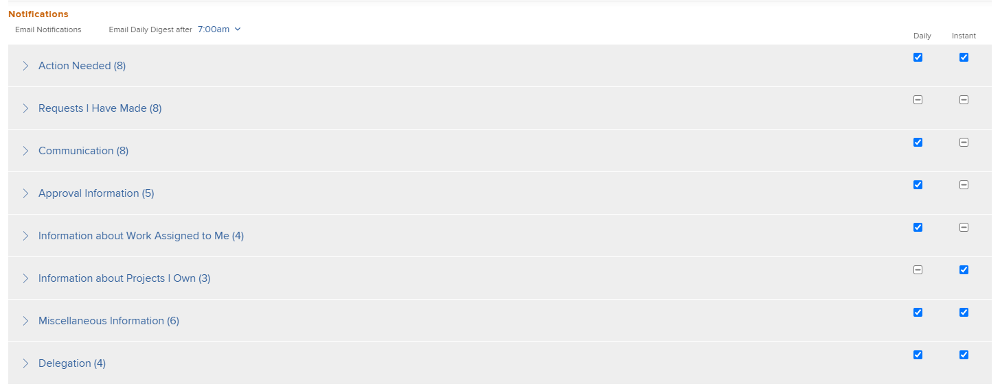
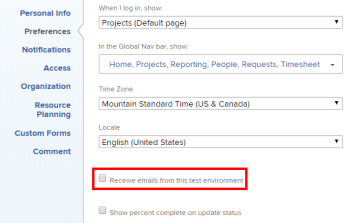

# Modificar suas próprias notificações por email

<!-- Audited: 1/2024 -->

O administrador do Adobe [!DNL Workfront] configura quais notificações por email os usuários recebem quando os eventos ocorrem no Workfront (conforme descrito em [[!UICONTROL Configurar notificações de evento] para todos no sistema](../../administration-and-setup/manage-workfront/emails/configure-event-notifications-for-everyone-in-the-system.md)).

O administrador do seu grupo também pode configurar quais notificações serão ativadas para você e os usuários do seu [!UICONTROL Grupo Padrão]. Se o [!UICONTROL Grupo Doméstico] for um subgrupo, você receberá as notificações ativadas para o grupo de nível superior acima do seu grupo.

Você pode personalizar ainda mais esse conteúdo configurando quais notificações você recebe. Você também pode escolher se deseja receber notificações conforme os eventos ocorrem ou em um email de resumo diário.

Para obter mais informações sobre notificações por email, consulte [[!DNL Adobe Workfront] notificações](../../workfront-basics/using-notifications/wf-notifications.md).

>[!NOTE]
>
>* Se você ativar um tipo de notificação e descobrir que não está recebendo notificações desse tipo, pode ser porque esse tipo não se aplica à sua função.
>* O administrador [!DNL Workfront] ou um administrador de grupo não pode configurar notificações para [!DNL Workfront Goals]. Para obter mais informações sobre quais notificações o administrador do [!DNL Workfront] pode configurar, consulte [Configurar notificações de eventos para todos no sistema](../../administration-and-setup/manage-workfront/emails/configure-event-notifications-for-everyone-in-the-system.md). Para obter informações sobre como configurar notificações individuais para [!DNL Workfront Goals], continue lendo este artigo.
>

## Requisitos de acesso

+++ Expanda para visualizar os requisitos de acesso para a funcionalidade neste artigo.

<table style="table-layout:auto"> 
 <col> 
 </col> 
 <col> 
 </col> 
 <tbody> 
  <tr> 
   <td role="rowheader"><strong>[!DNL Adobe Workfront package]</strong></td> 
   <td> 
Qualquer
 </td> 
  </tr> 
  <tr> 
   <td role="rowheader"><strong>[!DNL Adobe Workfront] licença</strong></td> 
   <td> 
Colaborador ou Superior

   
Solicitação ou superior

   </td> 
  </tr> 
 </tbody> 
</table>

Para obter informações, consulte [Requisitos de acesso na documentação do Workfront](/help/quicksilver/administration-and-setup/add-users/access-levels-and-object-permissions/access-level-requirements-in-documentation.md).

+++

## Exibir e modificar as configurações de notificação por email

{{step1-click-profile-pic}}

1. Clique no ícone **[!UICONTROL Mais]**  ao lado do seu nome e clique em **[!UICONTROL Editar]**.

1. Na caixa **[!UICONTROL Editar Pessoa]** exibida, vá para a seção **[!UICONTROL Notificações]**.

1. Clique em uma categoria para exibir as configurações de notificação relacionadas a essa categoria.

   

1. Marque ou desmarque as caixas de seleção à direita para especificar se deseja receber ou não notificações diariamente, instantaneamente ou ambas.

   Você também pode usar as caixas de seleção de uma categoria para ativar ou desativar todas as notificações nessa categoria.

   >[!NOTE]
   >
   >Se você for um membro da equipe de um projeto, continuará a receber notificações por email sobre ele até ser removido da equipe, mesmo se não tiver mais acesso ao projeto. Para obter instruções sobre como remover usuários de uma equipe, consulte [Remover usuários de projetos](../../manage-work/projects/manage-projects/remove-users-from-projects.md).

   Na categoria **[!UICONTROL Comunicação]**, você pode selecionar notificações individuais somente para entrega instantânea. Para que as notificações sejam entregues em um resumo diário, selecione todas elas.

   Se todas as notificações por email de uma determinada categoria estiverem ativadas, a caixa no título da categoria será exibida como selecionada. Se todas as notificações por email em uma determinada categoria estiverem desativadas, a caixa será desmarcada. Se algumas notificações forem ativadas e outras forem desativadas, a caixa de seleção de categoria aparecerá como uma linha reta.\
   Quando você modifica uma configuração de notificação, o rótulo **[!UICONTROL Editado]** é exibido para essa configuração de notificação, para que você saiba que a configuração de notificação foi modificada.

1. Se você selecionou alguma notificação para ser enviada como resumo diário, selecione a hora do dia que deseja recebê-la na parte superior da seção **[!UICONTROL Notificações]** no menu **[!UICONTROL Resumo diário por email após]**.

   

   O resumo diário inclui eventos que atendem aos critérios das notificações 24 horas antes da hora selecionada. Você recebe um email de resumo diário para cada tipo de notificação.\
   O resumo diário pode chegar depois do tempo selecionado, dependendo de quantos emails estão na fila para entrega no sistema. A hora listada é a hora local especificada nas configurações do navegador.

1. (Condicional e opcional) Ao modificar as configurações de notificações por email no ambiente de Pré-visualização, habilite a configuração **[!UICONTROL Receber emails deste ambiente de teste]** para receber emails. Os emails não são gerados automaticamente do ambiente de Pré-visualização.

   

1. Clique em **[!UICONTROL Salvar alterações]**.
