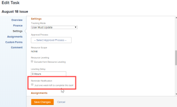

# Anexar uma notificação de lembrete a um objeto

Você pode associar notificações de lembrete a vários tipos de objeto diferentes: Projetos, Tarefas, Problemas, Folhas de horas, Modelos, Tarefas de modelo e Perfis de folha de horas recorrentes.

Antes de anexar notificações de lembrete a um objeto, um administrador do [!DNL Adobe Workfront] deve criar a notificação, conforme descrito em [Configurar notificações de lembrete](../../administration-and-setup/manage-workfront/emails/set-up-reminder-notifications.md).

As etapas para anexar notificações de lembrete são as mesmas, independentemente do tipo de objeto ao qual você as está anexando.

## Requisitos de acesso

+++ Expanda para visualizar os requisitos de acesso da funcionalidade neste artigo.

<table style="table-layout:auto"> 
 <col> 
 </col> 
 <col> 
 </col> 
 <tbody> 
  <tr> 
   <td role="rowheader">[!DNL Adobe Workfront package]</td> 
   <td> 
Qualquer
 </td> 
  </tr> 
  <tr> 
   <td role="rowheader">[!DNL Adobe Workfront] licença</td> 
   <td> 
   
Padrão

   
Trabalho ou maior
 </td> 
  </tr> 
  <tr> 
   <td role="rowheader">Permissões de objeto</td> 
   <td> 
Gerenciar acesso ao objeto
  </td> 
  </tr> 
 </tbody> 
</table>

Para obter informações, consulte [Requisitos de acesso na documentação do Workfront](/help/quicksilver/administration-and-setup/add-users/access-levels-and-object-permissions/access-level-requirements-in-documentation.md).

+++

## Anexar notificações de lembrete a um objeto

1. Vá para o objeto ao qual deseja anexar a notificação de lembrete.
1. Clique no ícone Editar .
1. No painel esquerdo da caixa **[!UICONTROL Editar]** exibida, clique em **[!UICONTROL Configurações]**.

1. Em **[!UICONTROL Notificação de Lembrete]**, selecione as notificações que deseja anexar ao objeto.

   Neste exemplo, o objeto que está sendo editado é uma tarefa:

   

   Se o administrador do [!DNL Workfront] tiver criado várias notificações de lembrete, você poderá anexar várias notificações a um único objeto.

1. Clique em **[!UICONTROL Salvar alterações]**.

   Se precisar de ajuda para testar a entrega de uma notificação de lembrete, consulte o administrador do [!DNL Workfront].
