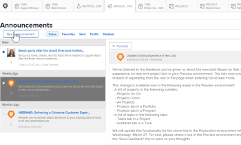

# Exibir e gerenciar notificações no aplicativo

As Notificações no aplicativo mantêm você informado sobre dois tipos de informações: notificações de anúncio e notificações de item de trabalho. Eles estão disponíveis no aplicativo web e no aplicativo móvel.

Para obter uma lista do item de trabalho e notificações de comunicado que você pode receber, consulte [Visão geral das notificações no aplicativo](../../workfront-basics/using-notifications/in-app-notifications-overview.md).

>[!NOTE]
>
>* As notificações no aplicativo para atividades de trabalho não estão vinculadas às notificações por email no [!DNL Workfront]. Para obter mais informações, consulte [[!DNL Adobe Workfront] notificações](../../workfront-basics/using-notifications/wf-notifications.md)
>* As notificações no aplicativo não podem ser personalizadas.
>

## Requisitos de acesso

+++ Expanda para visualizar os requisitos de acesso para a funcionalidade neste artigo. 

<table style="table-layout:auto"> 
 <col> 
 </col> 
 <col> 
 </col> 
 <tbody> 
  <tr> 
   <td role="rowheader"><strong>[!DNL Adobe Workfront] pacote</strong></td> 
   <td> 
Qualquer
 </td> 
  </tr> 
  <tr> 
   <td role="rowheader"><strong>[!DNL Adobe Workfront] licença</strong></td> 
   <td> 
   
Colaborador ou superior

   
Solicitação ou superior
 </td> 
  </tr> 
 </tbody> 
</table>

Para obter informações, consulte [Requisitos de acesso na documentação do Workfront](/help/quicksilver/administration-and-setup/add-users/access-levels-and-object-permissions/access-level-requirements-in-documentation.md).

+++

## Exibir notificações

O ícone numerado no canto superior direito de [!DNL Workfront] exibe o número de notificações que você ainda não confirmou.

>[!NOTE]
>
>Você pode exibir todas as notificações no aplicativo, tanto do aplicativo web quanto do aplicativo móvel. Somente algumas dessas notificações são enviadas como notificações por push no aplicativo móvel. Para obter mais informações sobre notificações no aplicativo móvel, consulte [[!DNL Adobe Workfront] for iOS](../../workfront-basics/mobile-apps/using-the-workfront-mobile-app/workfront-for-ios.md) ou [[!DNL Adobe Workfront] for Android](../../workfront-basics/mobile-apps/using-the-workfront-mobile-app/workfront-for-android.md).

1. Clique no ícone numerado  no canto superior direito de [!DNL Workfront] para abrir a lista de notificações.

   Suas notificações não lidas mais recentes aparecem abaixo do ícone numerado, com o mais recente no topo.

   

   O ícone de número exibe uma lista rolável com até 80 notificações. Para ver mais, você pode clicar em **[!UICONTROL Todas as notificações]** na parte inferior da lista para exibir até 500 notificações. As notificações são excluídas automaticamente após 30 dias.

   Na parte inferior de cada notificação, o [!UICONTROL tipo de notificação] e um ícone de identificação correspondente são exibidos. Isso o ajudará a identificar o que aconteceu com o item [!DNL Workfront] mencionado e alertá-lo se você tiver um item de ação:

   * As notificações de anúncios são indicadas pelo ícone [!UICONTROL anúncios]. 

   * Todas as outras notificações são indicadas por ícones que sugerem o tipo de item de trabalho ao qual estão associados.

     
O ícone à direita do ponto azul exibe um dos seguintes:

   * A foto do perfil da pessoa que digitou as informações, geralmente uma atualização sobre um objeto [!DNL Workfront] no qual você está trabalhando.
   * O logotipo [!DNL Workfront], se a notificação for um anúncio do sistema.

1. (Opcional) Se quiser visualizar a data em que recebeu uma notificação, passe o mouse sobre o indicador de dia ou hora no canto superior direito da notificação.

   

1. Clique na notificação que deseja exibir:

   * Se a notificação em que você clicar for sobre um item de trabalho, o objeto [!DNL Workfront] associado será aberto, mostrando a mensagem completa na guia **[!UICONTROL Atualizações]**. Você pode **[!UICONTROL Iniciar uma nova área de atualização]** ou **[!UICONTROL Digitar uma resposta]**.

     

   * Se a notificação em que você clicar for para um comunicado , a página **[!UICONTROL Avisos]** será exibida, listando todos os seus avisos. O anúncio em que você clicou é selecionado à esquerda e a mensagem é exibida à direita.

     

1. (Opcional) Baixe todos os anexos incluídos na mensagem de notificação ou baixe todos os anexos como um arquivo ZIP.

   

## Notificações de confirmação

Depois de exibir as notificações, você pode confirmá-las para limpá-las da lista [!UICONTROL Notificações] ou deixá-las para responder mais tarde.

Na página [!UICONTROL Notificações], você pode exibir notificações atuais e limpas. Você também pode trazer as notificações limpas de volta para a lista [!UICONTROL Notificações].

* [Notificações de confirmação](#acknowledge-notifications)
* [Exibir notificações confirmadas](#view-acknowledged-notifications)

### Notificações de confirmação

Clicar no ícone numerado para abrir a lista Notificações não reconhece automaticamente que você leu todas as notificações.

Para confirmar uma notificação e limpá-la na lista Notificações:

1. Clique no ícone numerado  no canto superior direito de [!DNL Workfront] para abrir a lista de notificações.
1. Siga um destes procedimentos:

   * Clique no ponto azul no canto superior esquerdo da notificação.
   * Se a notificação for para um item de trabalho (em vez de um anúncio), clique na notificação para ir para o item.
   * Se a notificação for para um comunicado, clique na notificação para abrir a página **[!UICONTROL Avisos]**.
   * Clique em **[!UICONTROL Todas as notificações]** no canto inferior direito da lista de notificações para exibir a página **[!UICONTROL Notificações]** e clique em **[!UICONTROL Marcar tudo como visto]** no canto superior direito do Workfront.

### Exibir notificações confirmadas

Para exibir notificações que você já confirmou:

1. Clique no ícone numerado  no canto superior direito de [!DNL Workfront] para abrir a lista de notificações.
1. Clique em **[!UICONTROL Todas as notificações]** no canto inferior direito da lista de notificações.
1. Na página **[!UICONTROL Notificações]** que aparece, role para baixo para exibir suas notificações anteriores.
1. (Opcional) Para trazer uma notificação confirmada de volta para sua lista de notificações, clique no círculo azul ao lado da notificação.

## Excluir uma notificação de notificação

Não é possível excluir notificações de item de trabalho. [!DNL Workfront] exclui todas as notificações (sejam elas lidas ou não) após 30 dias.

No entanto, é possível excluir uma notificação. Você também pode acessar um anúncio excluído dentro de 30 dias após a exclusão. [!DNL Workfront] não exclui automaticamente anúncios.

* [Excluir uma notificação](#delete-an-announcement)
* [Acessar e restaurar um comunicado excluído recentemente](#access-and-restore-an-announcement-you-deleted-recently)

### Excluir uma notificação

1. Clique no ícone numerado  no canto superior direito de [!DNL Workfront] para abrir a lista de notificações.
1. Clique em **[!UICONTROL Avisos]** ou **[!UICONTROL Exibir Todos os Avisos]**.

1. Na página **[!DNL Announcements]** exibida, clique no anúncio que deseja excluir na lista à esquerda e clique em **[!UICONTROL Excluir]** no canto superior direito da página.

### Acessar e restaurar um comunicado excluído recentemente

Você pode acessar uma notificação que excluiu nos últimos 30 dias.

1. Clique no ícone numerado  no canto superior direito de [!DNL Workfront] para abrir a lista de notificações.
1. Clique em **[!UICONTROL Avisos]** ou **[!UICONTROL Exibir Todos os Avisos]**.

1. Na página **[!UICONTROL Avisos]** que é exibida, clique em **[!UICONTROL Excluídos]**.

1. Clique na mensagem que deseja exibir.
1. (Opcional) Se quiser restaurar a notificação, clique em **[!UICONTROL Mover para a Caixa de Entrada]** acima e à direita do corpo da notificação.
