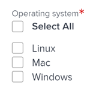

# Editar informações em campos de formulário personalizados

{{preview-fast-release-general}}

<!--Audited: 10/2025-->

Você pode editar informações em um formulário personalizado depois que o formulário for anexado a um objeto. Para obter informações sobre como adicionar formulários personalizados a objetos, consulte [Adicionar um formulário personalizado a um objeto](../../workfront-basics/work-with-custom-forms/add-a-custom-form-to-an-object.md).

## Requisitos de acesso

+++ Expanda para visualizar os requisitos de acesso para a funcionalidade neste artigo.

<table style="table-layout:auto"> 
 <col> 
 <col> 
 <tbody> 
  <tr> 
   <td role="rowheader"> 
Pacote do Adobe Workfront
 </td> 
   <td>Qualquer</td> 
  </tr> 
  <tr> 
   <td role="rowheader"> 
Licença do Adobe Workfront
 </td> 
   <td> 
Colaborador ou superior
 
   
Solicitação ou superior
 </td> 
  </tr> 
  <tr data-mc-conditions=""> 
   <td role="rowheader">Configurações de nível de acesso</td> 
   <td> 
Editar o acesso ao objeto para o qual deseja editar o formulário personalizado
 </td> 
  </tr> 
  <tr data-mc-conditions=""> 
   <td role="rowheader"> 
Permissões de objeto
 </td> 
   <td> 
    <ul> 
     <li> 
Permissões do Contribute ou superior no objeto para o qual você deseja editar o formulário personalizado
 </li> 
     <li>
Visualize as permissões nos campos que deseja editar.
</li> 
     <li>
Editar permissões para as seções no formulário em que os campos que você deseja editar estão localizados
</li> 
    </ul></td> 
  </tr> 
 </tbody> 
</table>

Para obter informações, consulte [Requisitos de acesso na documentação do Workfront](/help/quicksilver/administration-and-setup/add-users/access-levels-and-object-permissions/access-level-requirements-in-documentation.md).

+++

<!--Old:
<table style="table-layout:auto"> 
 <col> 
 <col> 
 <tbody> 
  <tr> 
   <td role="rowheader"> 
Adobe Workfront plan*
 </td> 
   <td>Team or higher</td> 
  </tr> 
  <tr> 
   <td role="rowheader"> 
Adobe Workfront licenses*
 </td> 
   <td> 
Request or higher
 </td> 
  </tr> 
  <tr data-mc-conditions=""> 
   <td role="rowheader">Access level*</td> 
   <td> 
Edit access to the object for which you want to edit the custom form
 
Note: If you still don't have access, ask your Workfront administrator if they set additional restrictions in your access level. For information on how a Workfront administrator can change your access level, see <a href="../../administration-and-setup/add-users/configure-and-grant-access/create-modify-access-levels.md" class="MCXref xref">Create or modify custom access levels</a>.
 </td> 
  </tr> 
  <tr data-mc-conditions=""> 
   <td role="rowheader"> 
Object permissions
 </td> 
   <td> 
    <ul> 
     <li> 
Contribute or higher permissions on the object for which you want to edit the custom form
 </li> 
     <li>View permissions on the fields you want to edit. For information about sharing permissions for custom fields, see <a href="/help/quicksilver/administration-and-setup/customize-workfront/create-manage-custom-forms/form-designer/manage-a-form/share-custom-fields.md" class="MCXref xref">Configure sharing for custom fields and widgets</a>.</li> 
     <li> 
Edit permissions for the sections on the form where the fields you want to edit are located
 </li> 
    </ul> 
For information on requesting additional access for objects, see <a href="../../workfront-basics/grant-and-request-access-to-objects/request-access.md" class="MCXref xref">Request access to objects </a>.
 </td> 
  </tr> 
 </tbody> 
</table>-->

## Pré-requisitos

* O administrador do Workfront ou um usuário do plano com acesso administrativo a formulários personalizados deve criar formulários personalizados em seu ambiente. Para obter mais informações, consulte [Criar um formulário personalizado](/help/quicksilver/administration-and-setup/customize-workfront/create-manage-custom-forms/form-designer/design-a-form/design-a-form.md).
* Você deve ter formulários personalizados anexados a um objeto.

  Para obter informações sobre como aplicar formulários personalizados a um objeto, consulte [Adicionar um formulário personalizado a um objeto](../../workfront-basics/work-with-custom-forms/add-a-custom-form-to-an-object.md).

## Editar informações em um formulário personalizado

A edição de informações em um formulário personalizado anexado a um objeto é idêntica para todos os objetos. Para obter informações sobre quais objetos podem ter um formulário personalizado, consulte [Visão geral dos formulários personalizados](../../administration-and-setup/customize-workfront/create-manage-custom-forms/custom-forms-overview.md).

1. Vá para um objeto para o qual deseja editar informações no formulário personalizado.
1. Clique em **`<Object type>`Detalhes** no painel esquerdo.

   Por exemplo, ao editar informações em um formulário personalizado de projeto, clique em **Detalhes do projeto**.

1. Role até o formulário personalizado. Quando houver um formulário personalizado anexado ao objeto, o nome do formulário será exibido como uma área na seção Detalhes.
1. Se necessário, clique na seta  à esquerda do nome do formulário personalizado para expandi-lo.
1. Ao lado do canto superior direito da página, clique no ícone Editar .
1. Comece a inserir informações em qualquer campo ao qual você tenha acesso.

   

   Ou

   Se nenhuma informação tiver sido inserida ainda no formulário, clique em **Adicionar+** para os campos aos quais você tem acesso e comece a inserir informações.

   

   Se vários formulários personalizados estiverem anexados ao objeto, você poderá fazer isso para cada formulário.

   Dependendo do tipo de campo em que você está trabalhando, considere o seguinte:

   * É possível selecionar apenas uma opção para campos de botão de opção.
   * É possível selecionar uma ou várias opções em um campo de caixa de seleção, dependendo de como o criador do formulário configurou o campo.
   * É possível selecionar uma ou várias opções em um campo suspenso de seleção múltipla, dependendo de como o criador do formulário configurou o campo.
   * Você pode formatar campos de texto (negrito, itálico ou sublinhado) somente se o usuário que criou o formulário os configurar como um Campo de texto com o tipo de campo Formatação. Campos de Texto de Linha Única e Campos de Texto de Parágrafo não podem ser formatados.
   * Você só poderá atualizar a hora do dia em um tipo de campo Data se o usuário que criou o formulário o tiver incluído ao criar o campo.

   >[!NOTE]
   >
   >Os campos que permitem várias seleções podem limitar o número de opções que você pode escolher. As caixas de seleção e as listas suspensas de várias seleções estão limitadas a 5000 seleções.

   Para obter informações sobre todos os tipos de campo, consulte [Criar um formulário personalizado](/help/quicksilver/administration-and-setup/customize-workfront/create-manage-custom-forms/form-designer/design-a-form/design-a-form.md).

1. Clique em **Salvar alterações**.

   >[!IMPORTANT]
   >
   >É necessário preencher todos os campos obrigatórios no formulário antes de salvá-lo. O nome de um campo obrigatório é seguido por um asterisco.
   >
   >

   Quando alguém altera dados em outro objeto referenciado por campos personalizados calculados em seu objeto, as alterações não são refletidas automaticamente no objeto. Para obter informações sobre como atualizar manualmente todos os campos personalizados calculados em seu objeto, consulte [Recalcular todos os campos personalizados calculados para um objeto](#recalculate-all-calculated-custom-fields-for-an-object) neste artigo.

   Quando campos dependentes da página são modificados, os campos calculados no formulário personalizado são recalculados dinamicamente em tempo real. Você pode ver o novo valor do campo calculado sem salvar o formulário, mas ele não é realmente aplicado ao formulário e ao objeto até que você salve as alterações. Isso se aplica aos campos calculados em formulários padrão, bem como formulários personalizados.

   Você também pode atualizar manualmente todos os campos personalizados calculados de um objeto ao editá-lo em massa junto com outros objetos em uma lista. Para obter instruções, consulte [Recalcular todos os campos personalizados calculados para vários objetos em uma lista ao editar os objetos](#recalculate-all-calculated-custom-fields-for-multiple-objects-in-a-list-when-editing-the-objects) neste artigo.

## Recalcular todos os campos personalizados calculados para um objeto  {#recalculate-all-calculated-custom-fields-for-an-object}

>[!IMPORTANT]
>
>Você deve ter um formulário personalizado com campos calculados anexados ao objeto antes de seguir as etapas desta seção.

1. Vá para a página principal do objeto cujos campos personalizados você deseja recalcular.
1. Clique no menu **Mais**  à direita do nome do objeto e clique em **Recalcular Expressões**.

   Isso recalcula todos os campos personalizados no formulário do objeto.

## Recalcular todos os campos personalizados calculados para vários objetos em uma lista ao editar os objetos {#recalculate-all-calculated-custom-fields-for-multiple-objects-in-a-list-when-editing-the-objects}

<!--

(NOTE: this will need to be edited when the bulk edit for objects update in NW)

-->

Dependendo dos objetos para os quais você deseja recalcular as expressões personalizadas, faça isso nas seguintes áreas:

* Em uma lista de objetos, no menu Mais na parte superior da lista.
* Na caixa Editar, ao selecionar e editar vários objetos em massa.

Para recalcular manualmente os campos personalizados de vários objetos editando-os em massa a partir de uma lista ou relatório:

1. Ir para uma lista de objetos que contêm formulários personalizados com campos calculados.
1. Selecione os objetos cujos campos personalizados calculados você deseja atualizar.
1. Clique no **ícone Editar**.
1. Clique em **Forms Personalizado** no menu esquerdo e selecione **Recalcular Expressões Personalizadas**.
1. Clique em **Salvar** **Alterações**.

   O Workfront calcula todos os campos personalizados para todos os objetos selecionados.

Para recalcular expressões personalizadas de uma lista de objetos:

1. Vá para uma lista de projetos ou relatório e selecione um ou vários projetos.
1. Clique no menu **Mais**  e em **Recalcular Expressões Personalizadas**.

O Workfront calcula imediatamente todos os campos personalizados para todos os projetos selecionados.
Nem todas as listas de todos os objetos têm esse recurso.

>[!NOTE]
>
>Dependendo da complexidade de seus projetos, recomendamos não selecionar um grande número de projetos ao recalcular campos personalizados calculados em massa para garantir o desempenho ideal. Alguns itens que podem tornar um projeto muito complexo podem ser várias dependências ou atribuições ou um grande número de campos personalizados.

