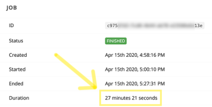

# [!DNL CloudConvert] módulos

Em um cenário do Adobe Workfront Fusion, é possível automatizar os fluxos de trabalho que usam o CloudConvert, bem como conectá-lo a vários aplicativos e serviços de terceiros. O [!DNL CloudConvert] os módulos permitem monitorar e gerenciar tarefas, tarefas e importar e exportar arquivos em seu [!DNL CloudConvert] conta.

<table style="table-layout:auto">
 <col> 
 <col> 
 <tbody> 
  <tr> 
   <td role="rowheader">[!DNL Adobe Workfront] plano*</td>
  <td> 
[!UICONTROL Pro] ou superior
 </td>
  </tr> 
  <tr data-mc-conditions=""> 
   <td role="rowheader">[!DNL Adobe Workfront] licença*</td>
   <td> 
[!UICONTROL Plano], [!UICONTROL Trabalho]
 </td> 
  </tr> 
  <tr> 
   <td role="rowheader">[!DNL Adobe Workfront Fusion] licença**</td> 
   <td> 
[!UICONTROL [!DNL Workfront Fusion] para automação e integração de trabalho] 
 </td> 
  </tr> 
  <tr> 
   <td role="rowheader">Produto</td> 
   <td>Sua organização deve comprar [!DNL Adobe Workfront Fusion] bem como [!DNL Adobe Workfront] para usar a funcionalidade descrita neste artigo.</td> 
  </tr> 
 </tbody> 
</table>

## Connect [!DNL CloudConvert] para [!DNL Workfront Fusion] {#connect-cloudconvert-to-workfront-fusion}

Para conectar seu [!DNL CloudConvert] para [!DNL Workfront Fusion], é necessário obter a chave de API do [!DNL CloudConvert] conta.

1. Faça logon no [!DNL CloudConvert] e abra sua [!UICONTROL Painel].
1. Abra o **[!UICONTROL Autorização] > [!UICONTROL Chaves de API]** seção.
1. Clique em **[!UICONTROL Criar nova chave de API]**.
1. Insira o nome da chave da API, ative os escopos que deseja usar e clique em **[!UICONTROL Criar]**.
1. Copie o token fornecido e armazene-o em um local seguro.
1. Em [!DNL Workfront Fusion], comece a criar um cenário e abra o [!DNL CloudConvert] do módulo **[!UICONTROL Criar uma conexão]** caixa de diálogo.

   Para obter instruções, consulte [Crie um cenário em [!DNL Adobe Workfront Fusion]](../../workfront-fusion/scenarios/create-a-scenario.md).

1. Insira o token salvo na etapa 5 e clique em **[!UICONTROL Continuar]** para estabelecer a conexão.

## [!DNL CloudConvert] módulos e seus campos {#cloudconvert-modules-and-their-fields}

Ao configurar [!DNL CloudConvert] módulos, [!DNL Workfront Fusion] exibe os campos listados abaixo. Junto com esses, [!DNL CloudConvert] podem ser exibidos, dependendo de fatores como seu nível de acesso no aplicativo ou serviço. Um título em negrito em um módulo indica um campo obrigatório.

Se o botão de mapa for exibido acima de um campo ou função, é possível usá-lo para definir variáveis e funções para esse campo. Para obter mais informações, consulte [Mapear informações de um módulo para outro no [!DNL Adobe Workfront Fusion]](../../workfront-fusion/mapping/map-information-between-modules.md).

* [Tarefas comuns](#common-tasks)
* [Trabalhos](#jobs)
* [Tarefas](#tasks)
* [Outro](#other)

### Tarefas comuns

* [Capturar um site](#capture-a-website)
* [[!UICONTROL Converter um arquivo]](#convert-a-file)
* [Criar um arquivo](#create-an-archive)
* [Mesclar arquivos](#merge-files)
* [Otimizar um arquivo](#optimize-a-file)

#### [!UICONTROL Capturar um site]

Esse módulo de ação captura um site especificado e o salva no formato PDF, JPG ou PNG.

Especifique o URL do site e outras informações, como onde deseja armazenar as informações.

O módulo retorna a ID do arquivo e quaisquer campos associados, juntamente com quaisquer campos e valores personalizados que a conexão acessa. Você pode mapear essas informações em módulos subsequentes do cenário.

<table style="table-layout:auto">
 <col> 
 <col> 
 <tbody> 
  <tr> 
   <td role="rowheader">[!UICONTROL Connection]</td> 
   <td> 
Para obter instruções sobre como conectar seu [!DNL CloudConvert] para [!DNL Workfront Fusion], consulte <a href="#connect-cloudconvert-to-workfront-fusion" class="MCXref xref">Connect [!DNL CloudConvert] para [!DNL Workfront Fusion]</a> neste artigo.
 </td> 
  </tr> 
  <tr> 
   <td role="rowheader">[!UICONTROL URL]</td> 
   <td>Insira o URL do site que você deseja capturar. </td> 
  </tr> 
  <tr> 
   <td role="rowheader">[!UICONTROL Formato de saída] </td> 
   <td>Selecione se deseja salvar o site capturado no formato PNG, JPG ou PDF. </td> 
  </tr> 
  <tr> 
   <td role="rowheader">[!UICONTROL Nome do arquivo] </td> 
   <td>Insira um nome de arquivo (incluindo extensão) para o arquivo de saída do target.</td> 
  </tr> 
  <tr> 
   <td role="rowheader">[!UICONTROL Cabeçalhos] </td> 
   <td> 
(Opcional) Defina os cabeçalhos da solicitação. 
 
Isso é útil, por exemplo, quando o URL especificado requer autorização. 
 </td> 
  </tr> 
  <tr> 
   <td role="rowheader"> 
[!UICONTROL Conversão e opções específicas do mecanismo] 
 </td> 
   <td>Especifique as opções de conversão e específicas do mecanismo. Para exibir as opções disponíveis, consulte <a href="https://cloudconvert.com/api/v2/convert#convert-tasks">[!DNL CloudConvert] API</a> documentação para <code>input_format</code> e <code>output_format</code>.</td> 
  </tr> 
  <tr> 
   <td role="rowheader">[!UICONTROL Baixar um arquivo] </td> 
   <td> 
Ative essa opção se também desejar incluir dados de arquivo na saída do módulo.
 </td> 
  </tr> 
 </tbody> 
</table>

#### [!UICONTROL Converter um arquivo]

Converte um arquivo em um formato de saída selecionado.

<table style="table-layout:auto">
 <col> 
 <col> 
 <tbody> 
  <tr> 
   <td role="rowheader">[!UICONTROL Connection]</td> 
   <td> 
Para obter instruções sobre como conectar seu [!DNL CloudConvert] para [!DNL Workfront Fusion], consulte <a href="#connect-cloudconvert-to-workfront-fusion" class="MCXref xref">Connect [!DNL CloudConvert] para [!DNL Workfront Fusion]</a> neste artigo.
 </td> 
  </tr> 
  <tr> 
   <td role="rowheader">[!UICONTROL Arquivo de entrada]</td> 
   <td>Selecione se deseja fazer upload de um arquivo usando [!DNL Workfront Fusion] ou forneça o URL do qual o arquivo será carregado.</td> 
  </tr> 
  <tr> 
   <td role="rowheader">[!UICONTROL Fazer upload de um arquivo]</td> 
   <td> 
Selecione um arquivo de origem de um módulo anterior ou mapeie o nome e os dados do arquivo de origem.
 </td> 
  </tr> 
  <tr> 
   <td role="rowheader">[!UICONTROL Importar um arquivo do URL]</td> 
   <td> 
    <ul> 
     <li> 
<strong>[!UICONTROL URL]</strong> 
 
Insira o URL do arquivo que deseja converter.
 </li> 
     <li> 
<strong>[!UICONTROL Cabeçalhos]</strong>
 
Defina os cabeçalhos da solicitação (opcional). Isso é útil, por exemplo, quando o URL especificado requer a autorização.
 </li> 
    </ul> </td> 
  </tr> 
  <tr> 
   <td role="rowheader">[!UICONTROL Formato]</td> 
   <td>Selecione se deseja especificar o formato de entrada do arquivo que deseja converter. Se não for especificado, a extensão do arquivo de entrada será usada como o formato de entrada.</td> 
  </tr> 
  <tr data-mc-conditions=""> 
   <td role="rowheader">[!DNL Input Format]</td> 
   <td>Selecione o formato atual do arquivo.</td> 
  </tr> 
  <tr data-mc-conditions=""> 
   <td role="rowheader">[!UICONTROL Formato de saída]</td> 
   <td>Selecione o formato de arquivo de destino para o qual deseja converter o arquivo.</td> 
  </tr> 
  <tr data-mc-conditions=""> 
   <td role="rowheader">[!UICONTROL Nome do arquivo]</td> 
   <td>Escolha um nome de arquivo (incluindo extensão) para o arquivo de saída de destino.</td> 
  </tr> 
  <tr data-mc-conditions=""> 
   <td role="rowheader"> 
[!UICONTROL Conversão e opções específicas do mecanismo] 
 </td> 
   <td>Especifique as opções de conversão e específicas do mecanismo. Para exibir as opções disponíveis, consulte <a href="https://cloudconvert.com/api/v2/convert#convert-tasks">[!DNL CloudConvert] API</a> documentação para <code>input_format</code> e <code>output_format</code>.</td> 
  </tr> 
  <tr data-mc-conditions=""> 
   <td role="rowheader">[!UICONTROL Baixar um arquivo] </td> 
   <td> 
Ative essa opção se também desejar incluir dados de arquivo na saída do módulo.
 </td> 
  </tr> 
 </tbody> 
</table>

#### [!UICONTROL Criar um arquivo]

Permite adicionar um ou vários arquivos ao arquivo ZIP, RAR, 7Z, TAR, TAR.GZ ou TAR.BZ2.

<table style="table-layout:auto"> 
 <col> 
 <col> 
 <tbody> 
  <tr> 
   <td role="rowheader">[!UICONTROL Connection]</td> 
   <td> 
Para obter instruções sobre como conectar seu [!DNL CloudConvert] para [!DNL Workfront Fusion], consulte <a href="#connect-cloudconvert-to-workfront-fusion" class="MCXref xref">Connect [!DNL CloudConvert] para [!DNL Workfront Fusion]</a> neste artigo.
 </td> 
  </tr> 
  <tr> 
   <td role="rowheader"> 
[!UICONTROL Arquivos de entrada]
 </td> 
   <td> 
Especifique os arquivos que deseja adicionar ao arquivo.
 </td> 
  </tr> 
  <tr> 
   <td role="rowheader">[!UICONTROL Fazer upload de um arquivo]</td> 
   <td> 
Selecione um arquivo de origem de um módulo anterior ou mapeie o nome e os dados do arquivo de origem.
 </td> 
  </tr> 
  <tr> 
   <td role="rowheader"> 
[!UICONTROL Importar um arquivo do URL]
 </td> 
   <td> 
<strong>[!UICONTROL URL]</strong> 
 
Insira o URL do arquivo que deseja arquivar.
 
<strong>[!UICONTROL Cabeçalhos]</strong> 
 
Defina os cabeçalhos da solicitação (opcional). Isso é útil, por exemplo, quando o URL especificado requer a autorização.
 </td> 
  </tr> 
  <tr> 
   <td role="rowheader">[!UICONTROL Formato de saída]</td> 
   <td> 
 Selecione o formato de destino do arquivo arquivado.
 </td> 
  </tr> 
  <tr> 
   <td role="rowheader">[!UICONTROL Nome do arquivo]</td> 
   <td> 
 Insira o nome do arquivo (incluindo a extensão) para o arquivo de saída do target.
 </td> 
  </tr> 
  <tr> 
   <td role="rowheader">[!UICONTROL Conversão e opções específicas do mecanismo] </td> 
   <td> 
Especifique as opções de conversão e específicas do mecanismo. Para exibir as opções disponíveis, consulte <a href="https://cloudconvert.com/api/v2/convert#convert-tasks">[!DNL CloudConvert] API</a> documentação para <code>input_format</code> e <code>output_format</code>.
 </td> 
  </tr> 
  <tr> 
   <td role="rowheader">[!UICONTROL Baixar um arquivo]</td> 
   <td> 
Ative essa opção se também desejar incluir dados de arquivo na saída do módulo.
 </td> 
  </tr> 
 </tbody> 
</table>

#### [!UICONTROL Mesclar arquivos]

Une pelo menos dois arquivos em um PDF. Se os arquivos de entrada não forem PDF, eles serão convertidos automaticamente em PDF.

<table style="table-layout:auto">
 <col> 
 <col> 
 <tbody> 
  <tr> 
   <td role="rowheader">[!UICONTROL Connection]</td> 
   <td> 
Para obter instruções sobre como conectar seu [!DNL CloudConvert] para [!DNL Workfront Fusion], consulte <a href="#connect-cloudconvert-to-workfront-fusion" class="MCXref xref">Connect [!DNL CloudConvert] para [!DNL Workfront Fusion]</a> neste artigo.
 </td> 
  </tr> 
  <tr> 
   <td role="rowheader"> 
[!UICONTROL Arquivos de entrada]
 </td> 
   <td> 
Especifique os arquivos que deseja mesclar.
 </td> 
  </tr> 
  <tr> 
   <td role="rowheader">[!UICONTROL Fazer upload de um arquivo]</td> 
   <td> 
Selecione um arquivo de origem de um módulo anterior ou mapeie o nome e os dados do arquivo de origem.
 </td> 
  </tr> 
  <tr> 
   <td role="rowheader"> 
[!UICONTROL Importar um arquivo do URL]
 </td> 
   <td> 
<strong>[!UICONTROL URL]</strong> 
 
Insira o URL do arquivo que deseja arquivar.
 
<strong>[!UICONTROL Cabeçalhos]</strong> 
 
Defina os cabeçalhos da solicitação (opcional). Isso é útil, por exemplo, quando o URL especificado requer a autorização.
 </td> 
  </tr> 
  <tr> 
   <td role="rowheader">[!UICONTROL Formato de saída]</td> 
   <td> 
 Selecione o formato de destino do arquivo mesclado.
 </td> 
  </tr> 
  <tr> 
   <td role="rowheader">[!UICONTROL Nome do arquivo]</td> 
   <td> 
 Insira o nome do arquivo (incluindo a extensão) para o arquivo de saída do target.
 </td> 
  </tr> 
  <tr> 
   <td role="rowheader">[!UICONTROL Conversão e opções específicas do mecanismo] </td> 
   <td> 
Especifique as opções de conversão e específicas do mecanismo. Para exibir as opções disponíveis, consulte <a href="https://cloudconvert.com/api/v2/convert#convert-tasks">[!DNL CloudConvert] API</a> documentação para <code>input_format</code> e <code>output_format</code>.
 </td> 
  </tr> 
  <tr> 
   <td role="rowheader">[!UICONTROL Baixar um arquivo]</td> 
   <td> 
Ative essa opção se também desejar incluir dados de arquivo na saída do módulo.
 </td> 
  </tr> 
 </tbody> 
</table>

#### [!UICONTROL Otimizar um arquivo]

Esse módulo de ação otimiza e compacta um arquivo no formato PDF, PNG ou JPG.

Especifique o arquivo e os parâmetros para otimizá-lo e armazená-lo.

O módulo retorna a ID do arquivo e quaisquer campos associados, juntamente com quaisquer campos e valores personalizados que a conexão acessa. Você pode mapear essas informações em módulos subsequentes do cenário.

Ao configurar esse módulo, os seguintes campos são exibidos.

<table style="table-layout:auto">
 <col> 
 <col> 
 <tbody> 
  <tr> 
   <td role="rowheader">[!UICONTROL Connection]</td> 
   <td> 
Para obter instruções sobre como conectar seu [!DNL CloudConvert] para [!DNL Workfront Fusion], consulte <a href="#connect-cloudconvert-to-workfront-fusion" class="MCXref xref">Connect [!DNL CloudConvert] para [!DNL Workfront Fusion]</a> neste artigo.
 </td> 
  </tr> 
  <tr> 
   <td role="rowheader">[!UICONTROL Arquivo de entrada]</td> 
   <td>Selecione se deseja fazer upload de um arquivo usando o Workfront Fusion ou fornecer o URL do qual o arquivo será carregado.</td> 
  </tr> 
  <tr> 
   <td role="rowheader"> 
[!UICONTROL Fazer upload de um arquivo]
 </td> 
   <td> 
Selecione um arquivo de origem de um módulo anterior ou mapeie o nome e os dados do arquivo de origem.
 </td> 
  </tr> 
  <tr> 
   <td role="rowheader">[!UICONTROL Importar um arquivo do URL] </td> 
   <td> 
    <ul> 
     <li><strong>[!UICONTROL URL]</strong>: Insira o URL do arquivo que deseja converter.</li> 
     <li><strong>[!UICONTROL Cabeçalhos]</strong>: (Opcional) Defina os cabeçalhos da solicitação. Isso é útil, por exemplo, quando o URL especificado requer autorização.</li> 
    </ul> </td> 
  </tr> 
  <tr> 
   <td role="rowheader">[!UICONTROL Otimização para] </td> 
   <td> 
Selecione o perfil de otimização para necessidades específicas do target.
 
    <ul> 
     <li> 
<strong>[!UICONTROL Web]</strong>: Otimização para a Web (Padrão)
 
      <ul> 
       <li>Remova dados redundantes e desnecessários para a Web</li> 
       <li>Amostra para baixo, clipe e compactação inteligente de imagens</li> 
       <li>Unir e subdefinir fontes</li> 
       <li>Converter cores em RGB</li> 
      </ul> </li> 
    </ul> 
    <ul> 
     <li> 
<strong>[!UICONTROL Imprimir]</strong>: Otimização para impressão
 
      <ul> 
       <li> 
Remova dados redundantes e desnecessários para impressão
 </li> 
       <li> 
Amostra para baixo, clipe e compactação inteligente de imagens
 </li> 
       <li> 
Unir e subdefinir fontes
 </li> 
       <li> 
Converter cores em CMYK
 </li> 
      </ul> </li> 
     <li> 
<strong>[!UICONTROL Arquivo]</strong>: Otimização para fins de arquivamento
 
      <ul> 
       <li> 
Remova dados redundantes e desnecessários para arquivamento
 </li> 
       <li> 
Compactar imagens de forma inteligente
 </li> 
       <li> 
Unir e subdefinir fontes
 </li> 
      </ul> </li> 
     <li> 
<strong>[!UICONTROL Imagens digitalizadas]</strong>: Otimização de imagens digitalizadas
 
      <ul> 
       <li> 
Perfil otimizado para PDF que consistem principalmente em imagens raster
 </li> 
       <li> 
Comprima as imagens sem reduzir significativamente a qualidade visual
 </li> 
      </ul> </li> 
     <li> 
<strong>[!UICONTROL redução máxima do tamanho]</strong>: Otimização para redução máxima de tamanho
 
      <ul> 
       <li> 
Usar a compactação máxima possível
 </li> 
       <li> 
Pode reduzir a qualidade visual
 </li> 
      </ul> </li> 
    </ul> </td> 
  </tr> 
  <tr> 
   <td role="rowheader">[!UICONTROL Formato de entrada] </td> 
   <td>Selecione o formato do arquivo de entrada que deseja otimizar. </td> 
  </tr> 
  <tr> 
   <td role="rowheader">[!UICONTROL Nome do arquivo]</td> 
   <td> 
Insira um nome de arquivo (incluindo extensão) para o arquivo de saída do target.
 </td> 
  </tr> 
  <tr> 
   <td role="rowheader">[!UICONTROL Conversão e opções específicas do mecanismo]</td> 
   <td> 
Especifique as opções de conversão e específicas do mecanismo. Para exibir as opções disponíveis, consulte <a href="https://cloudconvert.com/api/v2/convert#convert-tasks">[!DNL CloudConvert] API</a> documentação para <code>input_format</code> e <code>output_format</code>.
 </td> 
  </tr> 
  <tr> 
   <td role="rowheader">[!UICONTROL Baixar um arquivo]</td> 
   <td> 
Ative essa opção se também desejar incluir dados de arquivo na saída do módulo.
 </td> 
  </tr> 
 </tbody> 
</table>

### Trabalhos

* [[!UICONTROL Criar um trabalho (avançado)]](#create-a-job-advanced)
* [[!UICONTROL Novo Evento de Trabalho]](#new-job-event)
* [[!UICONTROL Listar Tarefas]](#list-jobs)
* [[!UICONTROL Obter um trabalho]](#get-a-job)
* [[!UICONTROL Excluir um trabalho]](#delete-a-job)

#### [!UICONTROL Criar um trabalho (avançado)]

Esse módulo cria um trabalho. Um trabalho pode ser uma ou várias tarefas identificadas na variável [!UICONTROL Nome] e vinculadas entre si usando a variável [!UICONTROL Entrada] campo.

<table style="table-layout:auto">
 <col> 
 <col> 
 <tbody> 
  <tr> 
   <td role="rowheader">[!UICONTROL Connection]</td> 
   <td> 
Para obter instruções sobre como conectar seu [!DNL CloudConvert] para [!DNL Workfront Fusion], consulte <a href="#connect-cloudconvert-to-workfront-fusion" class="MCXref xref">Connect [!DNL CloudConvert] para [!DNL Workfront Fusion]</a> neste artigo.
 </td> 
  </tr> 
  <tr> 
   <td role="rowheader">[!UICONTROL Arquivos de entrada]</td> 
   <td> 
Selecione se deseja fazer upload de um arquivo usando [!DNL Workfront Fusion]ou forneça o URL do qual o arquivo será carregado.
 </td> 
  </tr> 
  <tr> 
   <td role="rowheader">[!UICONTROL Fazer upload de um arquivo]</td> 
   <td> 
Selecione um arquivo de origem de um módulo anterior ou mapeie o nome e os dados do arquivo de origem.
 </td> 
  </tr> 
  <tr> 
   <td role="rowheader"> 
[!UICONTROL Importar um arquivo do URL]
 </td> 
   <td> 
    <ul> 
     <li><strong>[!UICONTROL URL]</strong>: Insira o URL do arquivo que deseja processar.</li> 
     <li><strong>[!UICONTROL Cabeçalhos]</strong>: (Opcional) Defina os cabeçalhos da solicitação. Isso é útil, por exemplo, quando o URL especificado requer autorização.</li> 
    </ul> </td> 
  </tr> 
  <tr> 
   <td role="rowheader"> 
[!UICONTROL Tarefas]
 </td> 
   <td> 
Adicione tarefas que serão executadas dentro da tarefa.
 
Encontre as descrições dos campos das operações na seção correspondente.
 
    <ul> 
     <li><a href="#convert-a-file" class="MCXref xref">[!UICONTROL Converter um arquivo]</a> </li> 
     <li><a href="#capture-a-website" class="MCXref xref">[!UICONTROL Capturar um site]e</a> </li> 
     <li><a href="#optimize-a-file" class="MCXref xref">[!UICONTROL Otimizar um arquivo]</a> </li> 
     <li><a href="#create-an-archive" class="MCXref xref">[!UICONTROL Criar um arquivo]</a> </li> 
     <li><a href="#merge-files" class="MCXref xref">[!UICONTROL Mesclar arquivos]</a> </li> 
    </ul> 
    <ul> 
     <li> 
<strong>[!UICONTROL Executar um comando]</strong> 
 
Para obter mais informações sobre como executar um comando, consulte o <a href="https://cloudconvert.com/api/v2/command#command-tasks">[!DNL CloudConvert] Documentação da API</a>.
 </li> 
     <li> 
<strong>[!UICONTROL Exportar um arquivo para URL temporário]</strong> 
 
 Especifique o nome da tarefa e o nome da tarefa de entrada (por exemplo, Conversão).
 </li> 
    </ul> </td> 
  </tr> 
  <tr> 
   <td role="rowheader">[!UICONTROL Tag] </td> 
   <td> 
Insira uma tag. Tags são strings arbitrárias para identificar o trabalho. Eles não têm efeito e podem ser usados para associar o trabalho a uma ID.
 </td> 
  </tr> 
 </tbody> 
</table>

#### [!UICONTROL Excluir um trabalho]

Esse módulo exclui uma tarefa, incluindo todas as tarefas e dados.

>[!NOTE]
>
>Os trabalhos são excluídos automaticamente 24 horas após terem terminado.

<table style="table-layout:auto">
 <col> 
 <col> 
 <tbody> 
  <tr> 
   <td role="rowheader">[!UICONTROL Connection]</td> 
   <td> 
Para obter instruções sobre como conectar seu [!DNL CloudConvert] para [!DNL Workfront Fusion], consulte <a href="#connect-cloudconvert-to-workfront-fusion" class="MCXref xref">Connect [!DNL CloudConvert] para [!DNL Workfront Fusion]</a> neste artigo.
 </td> 
  </tr> 
  <tr> 
   <td role="rowheader">[!UICONTROL ID do trabalho]</td> 
   <td> 
Insira ou mapeie a ID do trabalho que deseja excluir.
 </td> 
  </tr> 
 </tbody> 
</table>

#### [!UICONTROL Obter um trabalho]

Este módulo recupera detalhes da tarefa.

<table style="table-layout:auto">
 <col> 
 <col> 
 <tbody> 
  <tr> 
   <td role="rowheader">[!UICONTROL Connection]</td> 
   <td> 
Para obter instruções sobre como conectar seu [!DNL CloudConvert] para [!DNL Workfront Fusion], consulte <a href="#connect-cloudconvert-to-workfront-fusion" class="MCXref xref">Connect [!DNL CloudConvert] para [!DNL Workfront Fusion]</a> neste artigo.
 </td> 
  </tr> 
  <tr> 
   <td role="rowheader">[!UICONTROL ID do trabalho]</td> 
   <td> 
Insira ou mapeie a ID do trabalho sobre o qual deseja recuperar detalhes.
 </td> 
  </tr> 
 </tbody> 
</table>

#### [!UICONTROL Listar Tarefas]

Esse módulo recupera todas as tarefas que foram executadas em sua conta do .

<table style="table-layout:auto">
 <col> 
 <col> 
 <tbody> 
  <tr> 
   <td role="rowheader">[!UICONTROL Connection]</td> 
   <td> 
Para obter instruções sobre como conectar seu [!DNL CloudConvert] para [!DNL Workfront Fusion], consulte <a href="#connect-cloudconvert-to-workfront-fusion" class="MCXref xref">Connect [!DNL CloudConvert] para [!DNL Workfront Fusion]</a> neste artigo.
 </td> 
  </tr> 
  <tr> 
   <td role="rowheader">[!UICONTROL Status] </td> 
   <td> 
Selecione o status do trabalho para filtrar as tarefas retornadas.
 </td> 
  </tr> 
  <tr> 
   <td role="rowheader">[!UICONTROL Limite] </td> 
   <td> 
Defina o número de trabalhos que o Workfront Fusion 2.0 retornará durante um ciclo de execução.
 </td> 
  </tr> 
 </tbody> 
</table>

#### [!UICONTROL Novo Evento de Trabalho]

Aciona quando um trabalho em sua conta ou tarefa é criado, finalizado ou falha.

>[!NOTE]
>
>* A tarefa criada pela [!UICONTROL Criar um trabalho (avançado)] O módulo consiste em *several* tarefas.
>* O [!UICONTROL Novo Evento de Trabalho] também é acionado quando um *individual* A tarefa é criada, terminou ou falhou.
>

<table style="table-layout:auto">
 <col> 
 <col> 
 <tbody> 
  <tr> 
   <td role="rowheader">[!UICONTROL Nome do Webhook]</td> 
   <td>Insira o nome do webhook. </td> 
  </tr> 
  <tr> 
   <td role="rowheader">[!UICONTROL Connection]</td> 
   <td> 
Para obter instruções sobre como conectar seu [!DNL CloudConvert] para [!DNL Workfront Fusion], consulte <a href="#connect-cloudconvert-to-workfront-fusion" class="MCXref xref">Connect [!DNL CloudConvert] para [!DNL Workfront Fusion]</a> neste artigo.
 </td> 
  </tr> 
  <tr> 
   <td role="rowheader">[!UICONTROL Formato de saída] </td> 
   <td>Selecione se deseja salvar o site capturado no formato PNG, JPG ou PDF. </td> 
  </tr> 
  <tr> 
   <td role="rowheader">[!UICONTROL Evento]</td> 
   <td>Selecione se o módulo é acionado quando a tarefa ou tarefa é criada, finaliza ou falha.</td> 
  </tr> 
 </tbody> 
</table>

>[!NOTE]
>
>* Se estiver trabalhando com o Array Aggregator (por exemplo, se você tiver muitos arquivos em diferentes formatos para converter), use o **[!UICONTROL Não sei o formato de entrada]** na [!UICONTROL Adicionar uma tarefa] caixa de diálogo. Caso contrário, o erro será retornado.
>* Vinculação de tarefas dentro da tarefa (nome > entrada, nome > entrada,...):
>
>  >

### Tarefas

* [[!UICONTROL Obter uma tarefa]](#get-a-task)
* [[!UICONTROL Baixar um arquivo]](#download-a-file)
* [[!UICONTROL Listar Tarefas]](#list-tasks)
* [[!UICONTROL Repetir uma Tarefa]](#retry-a-task)
* [[!UICONTROL Cancelar uma tarefa]](#cancel-a-task)
* [[!UICONTROL Excluir uma tarefa]](#delete-a-task)

#### [!UICONTROL Cancelar uma tarefa]

Esse módulo cancela uma tarefa que tem um status de espera ou processamento.

<table style="table-layout:auto">
 <col> 
 <col> 
 <tbody> 
  <tr> 
   <td role="rowheader">[!UICONTROL Connection]</td> 
   <td> 
Para obter instruções sobre como conectar seu [!DNL CloudConvert] para [!DNL Workfront Fusion], consulte <a href="#connect-cloudconvert-to-workfront-fusion" class="MCXref xref">Connect [!DNL CloudConvert] para [!DNL Workfront Fusion]</a> neste artigo.
 </td> 
  </tr> 
  <tr> 
   <td role="rowheader">[!UICONTROL ID da tarefa]</td> 
   <td> 
 Insira ou mapeie a ID da tarefa que deseja cancelar.
 </td> 
  </tr> 
 </tbody> 
</table>

#### [!UICONTROL Excluir uma tarefa]

Exclua uma tarefa, incluindo todos os dados.

>[!NOTE]
>
>As tarefas são excluídas automaticamente 24 horas após o término.

<table style="table-layout:auto"> 
 <col> 
 <col> 
 <tbody> 
  <tr> 
   <td role="rowheader">[!UICONTROL Connection]</td> 
   <td> 
Para obter instruções sobre como conectar seu [!DNL CloudConvert] para [!DNL Workfront Fusion], consulte <a href="#connect-cloudconvert-to-workfront-fusion" class="MCXref xref">Connect [!DNL CloudConvert] para [!DNL Workfront Fusion]</a> neste artigo.
 </td> 
  </tr> 
  <tr> 
   <td role="rowheader">[!UICONTROL ID da tarefa]</td> 
   <td> 
 Insira (mapa) a ID da tarefa que deseja excluir.
 </td> 
  </tr> 
 </tbody> 
</table>

#### [!UICONTROL Baixar um arquivo]

Esse módulo recupera o nome do arquivo e os dados do arquivo da tarefa especificada.

<table style="table-layout:auto">
 <col> 
 <col> 
 <tbody> 
  <tr> 
   <td role="rowheader">[!UICONTROL Connection]</td> 
   <td> 
Para obter instruções sobre como conectar seu [!DNL CloudConvert] para [!DNL Workfront Fusion], consulte <a href="#connect-cloudconvert-to-workfront-fusion" class="MCXref xref">Connect [!DNL CloudConvert] para [!DNL Workfront Fusion]</a> neste artigo.
 </td> 
  </tr> 
  <tr> 
   <td role="rowheader">[!UICONTROL ID da tarefa]</td> 
   <td> 
 Insira ou mapeie a ID da tarefa da qual deseja baixar o arquivo.
 </td> 
  </tr> 
 </tbody> 
</table>

#### [!UICONTROL Obter uma tarefa]

Esse módulo recupera detalhes da tarefa.

<table style="table-layout:auto">
 <col> 
 <col> 
 <tbody> 
  <tr> 
   <td role="rowheader">[!UICONTROL Connection]</td> 
   <td> 
Para obter instruções sobre como conectar seu [!DNL CloudConvert] para [!DNL Workfront Fusion], consulte <a href="#connect-cloudconvert-to-workfront-fusion" class="MCXref xref">Connect [!DNL CloudConvert] para [!DNL Workfront Fusion]</a> neste artigo.
 </td> 
  </tr> 
  <tr> 
   <td role="rowheader">[!UICONTROL ID da tarefa]</td> 
   <td> 
Insira ou mapeie a ID da tarefa sobre a qual deseja recuperar detalhes.
 </td> 
  </tr> 
 </tbody> 
</table>

#### [!UICONTROL Listar Tarefas]

Esse módulo recupera todas as tarefas em sua conta com base nas configurações de filtro.

<table style="table-layout:auto">
 <col> 
 <col> 
 <tbody> 
  <tr> 
   <td role="rowheader">[!UICONTROL Connection]</td> 
   <td> 
Para obter instruções sobre como conectar seu [!DNL CloudConvert] para [!DNL Workfront Fusion], consulte <a href="#connect-cloudconvert-to-workfront-fusion" class="MCXref xref">Connect [!DNL CloudConvert] para [!DNL Workfront Fusion]</a> neste artigo.
 </td> 
  </tr> 
  <tr> 
   <td role="rowheader">[!UICONTROL Status] </td> 
   <td> 
Selecione o status da tarefa para filtrar as tarefas retornadas.
 </td> 
  </tr> 
  <tr> 
   <td role="rowheader">[!UICONTROL ID do trabalho] </td> 
   <td> 
Insira ou mapeie a ID do trabalho para retornar somente as tarefas dentro do trabalho especificado.
 </td> 
  </tr> 
  <tr> 
   <td role="rowheader">[!UICONTROL Operação] </td> 
   <td> 
Informe o tipo de operação para retornar somente tarefas com a operação especificada. 
 
Observação: Use o módulo [!UICONTROL List Possible Operations] para recuperar operações.
 </td> 
  </tr> 
  <tr> 
   <td role="rowheader">[!UICONTROL Limite] </td> 
   <td> 
Insira ou mapeie o número máximo de registros que você deseja que o módulo retorne durante cada ciclo de execução de cenário.
 </td> 
  </tr> 
 </tbody> 
</table>

#### [!UICONTROL Repetir uma Tarefa]

Esse módulo cria uma nova tarefa, com base nas configurações (carga) de outra tarefa.

<table style="table-layout:auto">
 <col> 
 <col> 
 <tbody> 
  <tr> 
   <td role="rowheader">[!UICONTROL Connection]</td> 
   <td> 
Para obter instruções sobre como conectar seu [!DNL CloudConvert] para [!DNL Workfront Fusion], consulte <a href="#connect-cloudconvert-to-workfront-fusion" class="MCXref xref">Connect [!DNL CloudConvert] para [!DNL Workfront Fusion]</a> neste artigo.
 </td> 
  </tr> 
  <tr> 
   <td role="rowheader">[!UICONTROL ID da tarefa]</td> 
   <td> 
 Insira ou mapeie a ID da tarefa a partir da qual deseja criar uma nova tarefa.
 </td> 
  </tr> 
 </tbody> 
</table>

### Outro

* [[!UICONTROL Obter Minhas Informações]](#get-my-info)
* [[!UICONTROL Faça uma chamada de API]](#make-an-api-call)

#### [!UICONTROL Obter Minhas Informações]

Recupera detalhes da conta autenticada sobre o usuário atual.

<table style="table-layout:auto">
 <col> 
 <col> 
 <tbody> 
  <tr> 
   <td role="rowheader">[!UICONTROL Connection]</td> 
   <td> 
Para obter instruções sobre como conectar seu [!DNL CloudConvert] para [!DNL Workfront Fusion], consulte <a href="#connect-cloudconvert-to-workfront-fusion" class="MCXref xref">Connect [!DNL CloudConvert] para [!DNL Workfront Fusion]</a> neste artigo.
 </td> 
  </tr> 
 </tbody> 
</table>

#### [!UICONTROL Faça uma chamada de API]

Permite executar uma chamada de API personalizada.

<table style="table-layout:auto"> 
 <col> 
 <col> 
 <tbody> 
  <tr> 
   <td role="rowheader">[!UICONTROL Connection]</td> 
   <td> 
Para obter instruções sobre como conectar sua conta do [Fusion App] ao Workfront Fusion, consulte <a href="../../workfront-fusion/connections/connect-to-fusion-general.md" class="MCXref xref" data-mc-variable-override="">Criar uma conexão com o Adobe Workfront Fusion - Instruções básicas</a>
 </td> 
  </tr> 
  <tr> 
   <td role="rowheader">[!UICONTROL URL]</td> 
   <td> 
Insira um caminho relativo a <code>https://api.cloudconvert.com/</code>. Por exemplo: <code>/v2/tasks</code>
 
Para obter a lista de endpoints disponíveis, consulte <a href="https://cloudconvert.com/api/v2">[!DNL CloudConvert] Documentação da API v2</a>.
 </td> 
  </tr> 
  <tr> 
   <td role="rowheader">[!UICONTROL Método]</td> 
   td&gt; 
Selecione o método de solicitação HTTP que você precisa configurar a chamada da API. Para obter mais informações, consulte <a href="../../workfront-fusion/modules/http-request-methods.md" class="MCXref xref" data-mc-variable-override="">Métodos de solicitação HTTP em [!DNL Adobe Workfront Fusion]</a>.
 </td> 
  </tr> 
  <tr> 
   <td role="rowheader">[!UICONTROL Cabeçalhos]</td> 
   <td> 
Adicione os cabeçalhos da solicitação no formato de um objeto JSON padrão.
 
Por exemplo, <code>{"Content-type":"application/json"}</code>
 
O Workfront Fusion 2.0 adiciona os cabeçalhos de autorização para você.
 </td> 
  </tr> 
  <tr> 
   <td role="rowheader">[!UICONTROL Sequência de consulta]</td> 
   <td> 
Adicione a query para a chamada de API no formato de um objeto JSON padrão.
 
Por exemplo: <code>{"name":"something-urgent"}</code>
 </td> 
  </tr> 
  <tr> 
   <td role="rowheader">[!UICONTROL Corpo]</td> 
   <td> 
Adicione o conteúdo do corpo para a chamada da API no formato de um objeto JSON padrão.Ao usar declarações condicionais como <code>if</code> no JSON, coloque as aspas fora da declaração condicional.
 </td> 
  </tr> 
 </tbody> 
</table>

**Exemplo:** Listar Tarefas

A chamada à API a seguir retorna todas as tarefas da conta do CloudFront:

URL: `/v2/tasks`

Método: `GET`

As correspondências da pesquisa podem ser encontradas na Saída do módulo em [!UICONTROL Pacote] > [!UICONTROL Corpo] > [!UICONTROL dados].

No nosso exemplo, 6 tarefas foram retornadas:

## Solução de problemas {#troubleshooting}

Consulte a tabela a seguir para obter possíveis erros e suas soluções:

<table style="table-layout:auto">
 <col> 
 <col> 
 <thead> 
  <tr> 
   <th> 
Erro
 </th> 
   <th>Próximas etapas</th> 
  </tr> 
 </thead> 
 <tbody> 
  <tr> 
   <td role="rowheader"> 
[!UICONTROL O tamanho do arquivo de saída excede o limite permitido para o seu cenário.] 
 </td> 
   <td> 
Consulte os limites de tamanho do arquivo.
 </td> 
  </tr> 
  <tr> 
   <td role="rowheader"> 
[!UICONTROL Você excedeu o tempo máximo de conversão.] 
 </td> 
   <td> 
O livre [!DNL CloudConvert] o plano oferece 25 minutos de conversão por dia. Se seu uso exceder o limite do plano gratuito, você poderá alternar para um pacote ou assinatura (pré-pago).
 </td> 
  </tr> 
  <tr> 
   <td role="rowheader"> 
[!UICONTROL Falha ao ler o tamanho do quadro: Não foi possível procurar 1508. � /output/JLIADSA00137P0.mp3: Argumento inválido.] 
 </td> 
   <td> 
Esse erro é lançado, por exemplo, ao converter arquivos de MP3 para WAV. Certifique-se de ter selecionado a região correta, pois ela encontrará referências a arquivos, mas não apenas ao arquivo correto.
 </td> 
  </tr> 
  <tr> 
   <td role="rowheader"> 
[!UICONTROL RuntimeError:] 
 
[!UICONTROL Número máximo de repetições excedido.] 
 </td> 
   <td> 
Localize o [!DNL CloudConvert] no seu trabalho [!DNL CloudConvert] lista de tarefas do painel e verifique a duração da tarefa:
 
  
 
O [!DNL CloudConvert] &gt; O tempo limite do módulo [!UICONTROL Converter um arquivo] é definido como 3 minutos. Se a duração do trabalho exceder 3 minutos (possivelmente devido a uma sobrecarga temporária do [!DNL CloudConvert] ), o módulo aciona o erro mencionado acima.
 
Nesse caso, considere uma destas opções:
 
    <ul> 
     <li>Ative o <strong>[!UICONTROL Permitir armazenamento de execuções incompletas]</strong> nas configurações de cenário para armazenar as execuções incompletas para resolução manual posterior. Opcionalmente, você pode anexar uma rota de tratamento de erros ao [!DNL CloudConvert] com a diretiva [!UICONTROL Break] para resolver as execuções incompletas automaticamente.</li> 
     <li>Desative o <strong>Opção [!UICONTROL Baixar um arquivo]</strong> no [!DNL CloudConvert] &gt; [!UICONTROL Converter um arquivo] módulo. Nesse caso, o módulo não esperará pelo resultado da conversão. Para obter o resultado da conversão, crie um novo cenário e use a variável [!DNL CloudConvert] &gt; [!UICONTROL Novo evento de trabalho] acionador.</li> 
    </ul> </td> 
  </tr> 
 </tbody> 
</table>

## Exemplo de fluxo de trabalho para [!DNL CloudConvert] conector

>[!INFO]
>
>**Exemplo:** Conversão de um vídeo do formato MOV para MP4
>
>1. Visita [https://cloudconvert.com/video-converter](https://>cloudconvert.com/video-converter)
>1. Clique em **[!UICONTROL Selecionar arquivo]** e escolha seu arquivo MOV de amostra.
>1. Clique na lista suspensa, ao lado de **[!UICONTROL Converter em]** e escolha **[!UICONTROL MP4]**.
>
>1. Clique no botão **[!UICONTROL chave inglesa]** ícone .
>1. Configure as configurações de compactação MP4 conforme necessário.
>1. Clique em **[!UICONTROL Converter]**.
>1. Quando a conversão estiver concluída, clique em **[!UICONTROL Baixar]**.
>1. Revise o vídeo convertido.
>1. Repita as etapas de 1 a 8 até encontrar as configurações de conversão ideais para a etapa 5.
>1. Visita [https://cloudconvert.com/api/v2/convert#convert-tasks](https://cloudconvert.com/api/v2/convert#convert-tasks)
>1. Choose **[!UICONTROL mov]** para **[!UICONTROL input_format]** campo.
>
>1. Choose **[!UICONTROL mp4]** para **[!UICONTROL output_format]** campo.
>
>1. Uma lista de todos os parâmetros possíveis, como video_codec, crf etc. será exibida.
>1. No Workfront Fusion 2.0, insira o **[!UICONTROL CloudConvert]** > **[!UICONTROL Converter um arquivo]** em seu cenário.
>
>1. Abra as configurações do módulo.
>1. Configure o módulo conforme mostrado abaixo:

>
>   
>
>1. Certifique-se de incluir todas as configurações no campo Conversão e opções específicas do mecanismo : para cada configuração da etapa 5, localize o parâmetro correspondente da etapa 13 e seu valor correspondente.

