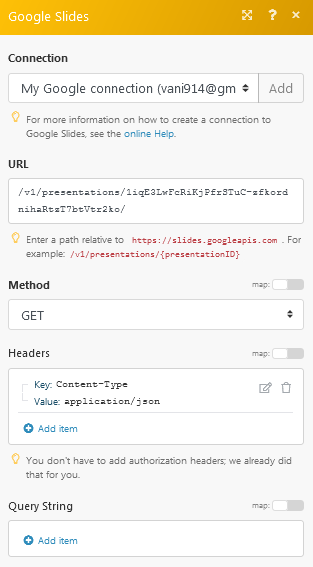

# [!DNL Google Slides] módulos

A variável [!DNL Adobe Workfront Fusion] [!DNL Google Slides] Os módulos permitem criar, atualizar, listar e/ou excluir apresentações e carregar imagens para apresentações em seu [!DNL Google Slides] conta.

Para utilizar [!DNL Google Slides] com [!DNL Workfront Fusion], é necessário dispor de um [!DNL Google] conta. Se você não tiver um [!DNL Google] conta ainda, você pode criar uma no [!DNL Google] Página de ajuda da conta.

Você também precisa [!DNL Google Slides] no seu [!DNL Google Drive].

## Requisitos de acesso

Você deve ter o seguinte acesso para usar a funcionalidade neste artigo:

<table style="table-layout:auto"> 
 <col> 
 <col> 
 <tbody> 
  <tr> 
   <td role="rowheader">[!DNL Adobe Workfront] plano*</td>
  <td> 
[!UICONTROL Pro] ou superior
 </td>
  </tr> 
  <tr data-mc-conditions=""> 
   <td role="rowheader">[!DNL Adobe Workfront] licença*</td>
   <td> 
[!UICONTROL Plano], [!UICONTROL Trabalho]
 </td> 
  </tr> 
  <tr> 
   <td role="rowheader">[!DNL Adobe Workfront Fusion] licença**</td> 
   <td>
   
Requisito de licença atual: Não [!DNL Workfront Fusion] requisito de licença.

   
Ou

   
Requisito de licença herdada: [!UICONTROL [!DNL Workfront Fusion] para Automação e integração do trabalho] 

   </td> 
  </tr> 
  <tr> 
   <td role="rowheader">Produto</td> 
   <td>
   
Requisito atual do produto: se você tiver o [!UICONTROL Select] ou o [!UICONTROL Prime] [!DNL Adobe Workfront] Planejar, sua organização deve comprar [!DNL Adobe Workfront Fusion] bem como [!DNL Adobe Workfront] para usar a funcionalidade descrita neste artigo. [!DNL Workfront Fusion] está incluído no [!UICONTROL Ultimate] [!DNL Workfront] plano.

   
Ou

   
Requisito de produto herdado: sua organização deve comprar [!DNL Adobe Workfront Fusion] bem como [!DNL Adobe Workfront] para usar a funcionalidade descrita neste artigo.

   </td> 
  </tr> 
 </tbody> 
</table>

Para descobrir que plano, tipo de licença ou acesso você tem, entre em contato com o [!DNL Workfront] administrador.

Para obter informações sobre [!DNL Adobe Workfront Fusion] licenças, consulte [[!DNL Adobe Workfront Fusion] licenças](../../workfront-fusion/get-started/license-automation-vs-integration.md).

## Pré-requisitos

Para usar [!DNL Google Slides] módulos, você deve ter uma [!DNL Google] conta.

## [!DNL Google Slides] módulos e seus campos

Ao configurar [!DNL Google Slides] módulos, o Workfront Fusion exibe os campos listados abaixo. Junto com esses, [!DNL Google Slides] Os campos podem ser exibidos, dependendo de fatores como seu nível de acesso no aplicativo ou serviço. Um título em negrito em um módulo indica um campo obrigatório.

Se você vir o botão de mapa acima de um campo ou função, poderá usá-lo para definir variáveis e funções para esse campo. Para obter mais informações, consulte [Mapear informações de um módulo para outro no [!DNL Adobe Workfront Fusion]](../../workfront-fusion/mapping/map-information-between-modules.md).

* [Apresentação](#presentation)
* [Outro](#other)

### Apresentação

* [[!UICONTROL Assistir Presentations]](#watch-presentations)
* [[!UICONTROL Listar Presentations]](#list-presentations)
* [[!UICONTROL Obter uma Apresentação]](#get-a-presentation)
* [[!UICONTROL Obter uma página/miniatura]](#get-a-pagethumbnail)
* [[!UICONTROL Criar uma Apresentação a Partir de um Modelo]](#create-a-presentation-from-a-template)
* [[!UICONTROL Carregar uma Imagem para uma Apresentação]](#upload-an-image-to-a-presentation)
* [[!UICONTROL Atualizar um gráfico]](#refresh-a-chart)
* [[!UICONTROL Adicionar/Excluir um Slide]](#adddelete-a-slide)

#### [!UICONTROL Assistir Presentations]

Dispara quando uma nova apresentação é criada ou atualizada.

<table style="table-layout:auto"> 
 <col> 
 <col> 
 <tbody> 
  <tr> 
   <td role="rowheader">[!UICONTROL Conexão] </td> 
   <td> 
Para obter instruções sobre como conectar seu [!DNL Google Slides] conta para [!DNL Workfront Fusion], consulte <a href="../../workfront-fusion/connections/connect-to-fusion-general.md" class="MCXref xref" data-mc-variable-override="">Criar uma conexão com o [!DNL Adobe Workfront Fusion] - Instruções básicas</a>
 </td> 
  </tr> 
  <tr> 
   <td role="rowheader">[!UICONTROL Observar] </td> 
   <td> 
Selecione a opção para assistir às apresentações:
 
    <ul> 
     <li> 
[!UICONTROL Data de Criação]
 </li> 
     <li> 
[!UICONTROL Data de Modificação]
 </li> 
    </ul> </td> 
  </tr> 
  <tr> 
   <td role="rowheader">[!UICONTROL Limite]</td> 
   <td> 
O número máximo de apresentações que o Workfront Fusion deve retornar durante um ciclo de execução de cenário.
 </td> 
  </tr> 
 </tbody> 
</table>

#### [!UICONTROL Listar Presentations]

Recupera uma lista de todas as apresentações.

<table style="table-layout:auto"> 
 <col> 
 <col> 
 <tbody> 
  <tr> 
   <td role="rowheader">[!UICONTROL Conexão] </td> 
   <td> 
Para obter instruções sobre como conectar seu [!DNL Google Slides] conta para [!DNL Workfront Fusion], consulte <a href="../../workfront-fusion/connections/connect-to-fusion-general.md" class="MCXref xref" data-mc-variable-override="">Criar uma conexão com o [!DNL Adobe Workfront Fusion] - Instruções básicas</a>
 </td> 
  </tr> 
  <tr> 
   <td role="rowheader">[!UICONTROL Escolher um local de unidade]</td> 
   <td> 
Selecione o [!DNL Google Drive] onde estão localizadas as apresentações que deseja listar:
 
    <ul> 
     <li>[!UICONTROL Minha Unidade]</li> 
     <li>[!UICONTROL Compartilhado Comigo]</li> 
     <li>[!UICONTROL [!DNL Google] Unidade compartilhada]</li> 
    </ul> </td> 
  </tr> 
  <tr> 
   <td role="rowheader">[!UICONTROL ID da Pasta]</td> 
   <td> 
Escolha o local da pasta das apresentações que deseja listar.
 </td> 
  </tr> 
  <tr> 
   <td role="rowheader">[!UICONTROL Limite]</td> 
   <td> 
O número máximo de apresentações [!DNL Workfront Fusion] deve retornar durante um ciclo de execução de cenário.
 </td> 
  </tr> 
 </tbody> 
</table>

#### [!UICONTROL Obter uma Apresentação]

Obtém a versão mais recente de uma apresentação especificada.

<table style="table-layout:auto"> 
 <col> 
 <col> 
 <tbody> 
  <tr> 
   <td role="rowheader">[!UICONTROL Conexão] </td> 
   <td> 
Para obter instruções sobre como conectar seu [!DNL Google Slides] conta para [!DNL Workfront Fusion], consulte <a href="../../workfront-fusion/connections/connect-to-fusion-general.md" class="MCXref xref" data-mc-variable-override="">Criar uma conexão com o [!DNL Adobe Workfront Fusion] - Instruções básicas</a>
 </td> 
  </tr> 
  <tr> 
   <td role="rowheader">[!UICONTROL Escolher uma unidade]</td> 
   <td> 
Selecione o [!DNL Google Drive] onde estão localizadas as apresentações que deseja listar:
 
    <ul> 
     <li>[!UICONTROL Minha Unidade]</li> 
     <li>[!UICONTROL Compartilhado Comigo]</li> 
     <li>[!UICONTROL [!DNL Google] Unidade compartilhada]</li> 
    </ul> </td> 
  </tr> 
  <tr> 
   <td role="rowheader">[!UICONTROL ID da Apresentação]</td> 
   <td> 
 Selecione a apresentação que deseja recuperar.
 </td> 
  </tr> 
 </tbody> 
</table>

#### [!UICONTROL Obter uma página/miniatura]

Obtém a versão mais recente da página especificada ou da miniatura de uma página na apresentação.

<table style="table-layout:auto"> 
 <col> 
 <col> 
 <tbody> 
  <tr> 
   <td role="rowheader">[!UICONTROL Conexão] </td> 
   <td> 
Para obter instruções sobre como conectar seu [!DNL Google Slides] conta para [!DNL Workfront Fusion], consulte <a href="../../workfront-fusion/connections/connect-to-fusion-general.md" class="MCXref xref" data-mc-variable-override="">Criar uma conexão com o [!DNL Adobe Workfront Fusion] - Instruções básicas</a>
 </td> 
  </tr> 
  <tr> 
   <td role="rowheader">[!UICONTROL ID da Apresentação]</td> 
   <td> 
 Selecione a ID de apresentação que deseja recuperar.
 </td> 
  </tr> 
  <tr> 
   <td role="rowheader">[!UICONTROL ID de Objeto de Página]</td> 
   <td> 
 Selecione o slide para o qual deseja exibir os detalhes do objeto da página.
 </td> 
  </tr> 
  <tr> 
   <td role="rowheader">[!UICONTROL Mostrar Miniatura de Página]</td> 
   <td> 
 Marque a caixa de seleção se desejar exibir as informações de miniatura da página.
 </td> 
  </tr> 
 </tbody> 
</table>

#### [!UICONTROL Criar uma Apresentação a Partir de um Modelo]

Cria uma nova apresentação substituindo todas as tags, como `{{Name}}`, `{{Email}}` em um modelo com os dados fornecidos.

<table style="table-layout:auto"> 
 <col> 
 <col> 
 <tbody> 
  <tr> 
   <td role="rowheader">[!UICONTROL Conexão] </td> 
   <td> 
Para obter instruções sobre como conectar seu [!DNL Google Slides] conta para [!DNL Workfront Fusion], consulte <a href="../../workfront-fusion/connections/connect-to-fusion-general.md" class="MCXref xref" data-mc-variable-override="">Criar uma conexão com o [!DNL Adobe Workfront Fusion] - Instruções básicas</a>
 </td> 
  </tr> 
  <tr> 
   <td role="rowheader">[!UICONTROL Título] </td> 
   <td> 
Insira um nome para a nova apresentação.
 </td> 
  </tr> 
  <tr> 
   <td role="rowheader">[!UICONTROL Copiar uma Apresentação]</td> 
   <td> 
 Selecione a opção se estiver copiando uma apresentação existente:
 
    <ul> 
     <li>[!UICONTROL Por Mapeamento]</li> 
     <li>[!UICONTROL Por Lista Suspensa]</li> 
    </ul> </td> 
  </tr> 
  <tr> 
   <td role="rowheader">[!UICONTROL Cópia de ID de Apresentação Existente]</td> 
   <td> 
 Insira o Caminho ou a ID de uma apresentação existente que você deseja copiar. Este campo aparecerá se você estiver criando a apresentação [!UICONTROL Por Mapeamento].
 </td> 
  </tr> 
  <tr> 
   <td role="rowheader">[!UICONTROL Escolher uma unidade]</td> 
   <td> 
Selecione o [!DNL Google Drive] onde estão localizadas as apresentações que deseja listar:
 
    <ul> 
     <li>[!UICONTROL Minha Unidade]</li> 
     <li>[!UICONTROL Compartilhado Comigo]</li> 
     <li>[!UICONTROL [!DNL Google] Unidade compartilhada]</li> 
    </ul> 
Este campo aparecerá se você estiver criando a apresentação [!UICONTROL By Dropdown].
 </td> 
  </tr> 
  <tr> 
   <td role="rowheader">[!UICONTROL ID da Apresentação]</td> 
   <td> 
 Selecione a ID da apresentação que deseja usar como modelo.
 </td> 
  </tr> 
  <tr> 
   <td role="rowheader">[!UICONTROL Valores] </td> 
   <td> 
Adicione os valores:
 
    <ul> 
     <li><strong>[!UICONTROL Marca]</strong>: digite a tag que deseja substituir na apresentação. Por exemplo, <code>&#123;&#123;Name&#125;&#125;</code></li> 
     <li><strong>[!UICONTROL Substituiu Valor]</strong>: digite o valor pelo qual a tag existente deve ser substituída. Por exemplo, se uma string <tr><ul><tr><tr><tr><code>&#123;&#123;Name&#125;&#125;/code> in the presentation and the replaced value is Sample, then the <code>&#123;&#123;Name}}</code> will be replaced by <code>Sample</code>.</li> 
    </ul> </td> 
  </tr> 
   
   <td role="rowheader">[!UICONTROL New Drive Location]</td> 
   <td> 
Select the [!DNL Google Drive] where you want to store or add the new presentation:
 
     
     <li>[!UICONTROL My Drive]</li> 
     <li>[!UICONTROL Shared With Me]</li> 
     <li>[!UICONTROL [!DNL Google] Shared Drive]</li> 
    </ul> </td> 
  </tr> 
   
   <td role="rowheader"> 
[!UICONTROL New Document's Location]
 </td> 
   <td> 
Select the folder where you want to store or add the presentation.
 </td> 
  </tr> 
   
   <td role="rowheader">[!UICONTROL Shared] </td> 
   <td> 
Select if you want to share the presentation.
 </td> 
  </tr> 
   
   <td role="rowheader">[!UICONTROL Sharing with Other's Email Address]</td> 
   <td> 
 Enter the email address with whom you want to share the presentation. If you are not entering an email address and selecting only shared field, the presentation is shareable to anyone.
 </td> 
  </tr> 
 </tbody> 
</table>

#### [!UICONTROL Carregar uma Imagem para uma Apresentação]

Carrega uma imagem com os dados fornecidos.

<table style="table-layout:auto"> 
 <col> 
 <col> 
 <tbody> 
  <tr> 
   <td role="rowheader">[!UICONTROL Conexão] </td> 
   <td> 
Para obter instruções sobre como conectar seu [!DNL Google Slides] conta para [!DNL Workfront Fusion], consulte <a href="../../workfront-fusion/connections/connect-to-fusion-general.md" class="MCXref xref" data-mc-variable-override="">Criar uma conexão com o [!DNL Adobe Workfront Fusion] - Instruções básicas</a>
 </td> 
  </tr> 
  <tr> 
   <td role="rowheader">[!UICONTROL Escolher uma Apresentação]</td> 
   <td> 
Escolha como deseja selecionar a apresentação na qual você está fazendo upload de uma imagem.
 
    <ul> 
     <li>[!UICONTROL Por Mapeamento]</li> 
     <li>[!DNL By Dropdown]</li> 
    </ul> </td> 
  </tr> 
  <tr> 
   <td role="rowheader">[!UICONTROL Escolher uma unidade]</td> 
   <td> 
Selecione o [!DNL Google Drive] onde estão localizadas as apresentações que deseja listar:
 
    <ul> 
     <li>[!UICONTROL Minha Unidade]</li> 
     <li>[!UICONTROL Compartilhado Comigo]</li> 
     <li>[!UICONTROL [!DNL Google] Unidade compartilhada]</li> 
    </ul> 
Este campo aparecerá se você estiver criando a apresentação [!UICONTROL By Dropdown].
 </td> 
  </tr> 
  <tr> 
   <td role="rowheader">[!UICONTROL ID da Apresentação]</td> 
   <td> 
 Selecione a ID da Apresentação da apresentação na qual você está fazendo upload de uma imagem.
 </td> 
  </tr> 
  <tr> 
   <td role="rowheader">[!UICONTROL Valores]</td> 
   <td> 
Valores Adicione os valores:
 
    <ul> 
     <li><strong>[!UICONTROL Marca]</strong>: digite a tag à qual você deseja adicionar o URL.</li> 
     <li><strong>[!UICONTROL URL da imagem]</strong>: digite o caminho ou URL para a imagem que você deseja fazer upload.</li> 
    </ul> 
Observação: as imagens devem ter menos de 50 MB, não podem exceder 25 megapixels e devem estar no formato PNG, JPEG ou GIF.
 </td> 
  </tr> 
 </tbody> 
</table>

#### [!UICONTROL Atualizar um gráfico]

Atualiza os dados do gráfico armazenados em uma apresentação especificada por ID.

<table style="table-layout:auto"> 
 <col> 
 <col> 
 <tbody> 
  <tr> 
   <td role="rowheader">[!UICONTROL Conexão] </td> 
   <td> 
Para obter instruções sobre como conectar seu [!DNL Google Slides] conta para [!DNL Workfront Fusion], consulte <a href="../../workfront-fusion/connections/connect-to-fusion-general.md" class="MCXref xref" data-mc-variable-override="">Criar uma conexão com o [!DNL Adobe Workfront Fusion] - Instruções básicas</a>
 </td> 
  </tr> 
  <tr> 
   <td role="rowheader">[!UICONTROL Escolher uma unidade]</td> 
   <td> 
Selecione o [!DNL Google Drive] onde estão localizadas as apresentações que deseja listar:
 
    <ul> 
     <li>[!UICONTROL Minha Unidade]</li> 
     <li>[!UICONTROL Compartilhado Comigo]</li> 
     <li>[!UICONTROL [!DNL Google] Unidade compartilhada]</li> 
    </ul> </td> 
  </tr> 
  <tr> 
   <td role="rowheader">[!UICONTROL ID da Apresentação]</td> 
   <td> 
Selecione a ID de Apresentação da apresentação que inclui o gráfico que você deseja atualizar.
 </td> 
  </tr> 
  <tr> 
   <td role="rowheader">[!UICONTROL ID de Objeto de Gráfico]</td> 
   <td> 
 Selecione o Gráfico que deseja atualizar.
 </td> 
  </tr> 
 </tbody> 
</table>

#### [!UICONTROL Adicionar/Excluir um Slide]

Cria um slide vazio ou exclui um slide existente na apresentação especificada.

<table style="table-layout:auto"> 
 <col> 
 <col> 
 <tbody> 
  <tr> 
   <td role="rowheader">[!UICONTROL Conexão] </td> 
   <td> 
Para obter instruções sobre como conectar seu [!DNL Google Slides] conta para [!DNL Workfront Fusion], consulte <a href="../../workfront-fusion/connections/connect-to-fusion-general.md" class="MCXref xref" data-mc-variable-override="">Criar uma conexão com o [!DNL Adobe Workfront Fusion] - Instruções básicas</a>
 </td> 
  </tr> 
  <tr> 
   <td role="rowheader">[!UICONTROL Selecionar o método]</td> 
   <td> 
Escolha se deseja adicionar um novo slide ou excluir um slide.
 </td> 
  </tr> 
  <tr> 
   <td role="rowheader">[!DNL Presentation ID]</td> 
   <td> 
Selecione a ID da apresentação da apresentação para a qual deseja adicionar ou excluir um slide.
 </td> 
  </tr> 
  <tr> 
   <td role="rowheader">[!UICONTROL Tipo de layout predefinido]</td> 
   <td> 
 Selecione o layout de slide predefinido a ser usado pelo slide adicionado. Especifique valores para quaisquer campos adicionais (como [!UICONTROL Título]).
 
    <ul> 
     <li>[!UICONTROL Layout em branco, sem espaços reservados]</li> 
     <li>[!UICONTROL Layout com uma legenda na parte inferior]</li> 
     <li>[!UICONTROL Layout com um título e subtítulo]</li> 
     <li>[!UICONTROL Layout com um título e um corpo]</li> 
     <li>[!UICONTROL Layout com um título e duas colunas]</li> 
     <li>[!UICONTROL Layout com apenas um título]</li> 
     <li>[!UICONTROL Layout com um título de seção]</li> 
     <li>[!UICONTROL Layout com título e subtítulo em um lado e descrição no outro]</li> 
     <li>[!UICONTROL Layout com um título e um corpo, organizados em uma única coluna]</li> 
     <li>[!UICONTROL Layout com um ponto principal]</li> 
     <li>[!DNL Layout with a big number heading]</li> 
    </ul> 
Este campo estará disponível se você selecionou adicionar um slide.
 </td> 
  </tr> 
 </tbody> 
</table>

### Outro

* [[!UICONTROL Fazer uma chamada de API]](#make-an-api-call)
* [[!UICONTROL Inserir Links em uma Apresentação]](#insert-links-in-a-presentation)

#### [!UICONTROL Fazer uma chamada de API]

Executa uma chamada de API autorizada arbitrária.

<table style="table-layout:auto"> 
 <col> 
 <col> 
 <tbody> 
  <tr> 
   <td role="rowheader">[!UICONTROL Conexão] </td> 
   <td> 
Para obter instruções sobre como conectar seu [!DNL Google Slides] conta para [!DNL Workfront Fusion], consulte <a href="../../workfront-fusion/connections/connect-to-fusion-general.md" class="MCXref xref" data-mc-variable-override="">Criar uma conexão com o [!DNL Adobe Workfront Fusion] - Instruções básicas</a>
 </td> 
  </tr> 
  <tr> 
   <td role="rowheader">[!UICONTROL URL]</td> 
   <td> 
Insira um caminho relativo para https://developers.google.com/slides/. Por exemplo, Apresentação.
 
Para obter a lista de endpoints disponíveis, consulte o <a href="https://developers.google.com/slides/reference/rest">[!DNL Google Slides] Documentação da API</a>.
 </td> 
  </tr> 
  <tr> 
   <td role="rowheader">[!UICONTROL Método]</td> 
   <td> 
Selecione o método de solicitação HTTP necessário para configurar a chamada de API. Para obter mais informações, consulte <a href="../../workfront-fusion/modules/http-request-methods.md" class="MCXref xref">Métodos de solicitação HTTP em [!DNL Adobe Workfront Fusion]</a>.
 </td> 
  </tr> 
  <tr> 
   <td role="rowheader">[!UICONTROL Cabeçalhos]</td> 
   <td> 
Insira os cabeçalhos de solicitação desejados. Você não precisa adicionar cabeçalhos de autorização.
 </td> 
  </tr> 
  <tr> 
   <td role="rowheader">[!UICONTROL Cadeia de Consulta]</td> 
   <td> 
 Insira a string de consulta da solicitação.
 </td> 
  </tr> 
  <tr> 
   <td role="rowheader">[!UICONTROL Corpo]</td> 
   <td> 
Adicione o conteúdo do corpo para a chamada à API na forma de um objeto JSON padrão.
 
Nota:  
Ao usar declarações condicionais como <code>if</code> no JSON, coloque as aspas fora da declaração condicional.
 
     
Example: </b>"> 
      
  
 
     
 
 </td> 
  </tr> 
 </tbody> 
</table>

>[!INFO]
>
>**Exemplo:** Usando uma chamada de API, você pode obter os detalhes da apresentação da ID de apresentação inserida. É possível encontrar a ID da apresentação no URL ao abrir a apresentação no [!DNL Google Slides].
>
>
>
>A chamada de API a seguir retorna os detalhes da apresentação:
>
>
>
>As correspondências da pesquisa podem ser encontradas na Saída do módulo em [!UICONTROL Pacote] > [!UICONTROL Corpo] > [!UICONTROL presentationId].
>
>Em nosso exemplo, os detalhes da apresentação solicitada foram retornados:
>
>

#### [!UICONTROL Inserir Links em uma Apresentação]

Esse módulo torna clicáveis todos os links em uma apresentação ou insere um link em todos os textos de entrada correspondentes.

<table style="table-layout:auto"> 
 <col> 
 <col> 
 <tbody> 
  <tr> 
   <td role="rowheader">[!UICONTROL Conexão] </td> 
   <td> 
Para obter instruções sobre como conectar seu [!DNL Google Slides] conta para [!DNL Workfront Fusion], consulte <a href="../../workfront-fusion/connections/connect-to-fusion-general.md" class="MCXref xref" data-mc-variable-override="">Criar uma conexão com o [!DNL Adobe Workfront Fusion] - Instruções básicas</a>
 </td> 
  </tr> 
  <tr> 
   <td role="rowheader">[!UICONTROL Escolher uma Apresentação]</td> 
   <td> 
Escolha como deseja selecionar a apresentação na qual você está fazendo upload de uma imagem.
 
    <ul> 
     <li>[!UICONTROL Por Mapeamento]</li> 
     <li>[!UICONTROL Por Lista Suspensa]</li> 
    </ul> </td> 
  </tr> 
  <tr> 
   <td role="rowheader">[!UICONTROL Escolher uma unidade]</td> 
   <td> 
Selecione o [!DNL Google Drive] onde estão localizadas as apresentações que deseja listar:
 
    <ul> 
     <li>[!UICONTROL Minha Unidade]</li> 
     <li>[!UICONTROL Compartilhado Comigo]</li> 
     <li>[!UICONTROL [!DNL Google] Unidade compartilhada]</li> 
    </ul> 
Este campo aparecerá se você estiver criando a apresentação [!UICONTROL By Dropdown].
 </td> 
  </tr> 
  <tr> 
   <td role="rowheader">[!UICONTROL ID da Apresentação]</td> 
   <td> 
Escolha o local da pasta das apresentações que deseja listar.
 </td> 
  </tr> 
  <tr> 
   <td role="rowheader">[!UICONTROL Selecionar]</td> 
   <td> 
Selecione se deseja tornar clicáveis todos os links em uma apresentação ou se deseja inserir um link em todos os textos de entrada de correspondência.
 </td> 
  </tr> 
  <tr> 
   <td role="rowheader">[!UICONTROL Entradas de Texto]</td> 
   <td>Para cada item de texto ao qual você deseja adicionar um link, adicione o item, bem como seu link associado à lista. Toda vez que o item aparecer na apresentação, ele será vinculado automaticamente ao site especificado.</td> 
  </tr> 
 </tbody> 
</table>
