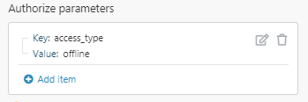

# [!UICONTROL HTTP] > [!UICONTROL Fazer uma solicitação do OAuth 2.0] módulo

>[!NOTE]
>
>[!DNL Adobe Workfront Fusion] exige um [!DNL Adobe Workfront Fusion] além de um [!DNL Adobe Workfront] licença.

Para criar um [!DNL Adobe Workfront Fusion] Solicitação HTTP(S) para servidores que exigem uma autorização OAuth 2.0, primeiro é necessário criar uma conexão OAuth. [!DNL Adobe Workfront Fusion] garante que todas as chamadas feitas com essa conexão tenham os cabeçalhos de autorização apropriados e atualizem automaticamente os tokens associados, quando necessário.

[!DNL Workfront Fusion] O suporta os seguintes fluxos de autenticação OAuth 2.0:

* Fluxo do código de autorização
* Fluxo implícito

Outros fluxos, como Fluxo de Credenciais de Senha do Proprietário de Recursos e Fluxo de Credenciais do Cliente, não são automaticamente compatíveis por meio deste módulo.

Para obter mais informações sobre a autenticação OAuth 2.0, consulte [A Estrutura de Autorização do OAuth 2.0](https://tools.ietf.org/html/rfc6749).

## Requisitos de acesso

Você deve ter o seguinte acesso para usar a funcionalidade neste artigo:

<table style="table-layout:auto">  
 <col> 
 <col> 
 <tbody> 
  <tr> 
    <td role="rowheader">[!DNL Adobe Workfront] plano*</td> 
   <td> 
[!UICONTROL Pro] ou superior
 </td> 
  </tr> 
  <tr data-mc-conditions=""> 
   <td role="rowheader">[!DNL Adobe Workfront] licença*</td> 
   <td> 
[!UICONTROL Plano], [!UICONTROL Trabalho]
 </td> 
  </tr> 
  <tr> 
   <td role="rowheader">[!DNL Adobe Workfront Fusion] licença**</td> 
   <td> 
[!UICONTROL [!DNL Workfront Fusion] para automação e integração de trabalho] 
  </td> 
  </tr> 
  <tr> 
   <td role="rowheader">Produto</td> 
   <td>Sua organização deve comprar [!DNL Adobe Workfront Fusion] bem como [!DNL Adobe Workfront] para usar a funcionalidade descrita neste artigo.</td> 
  </tr>
 </tbody> 
</table>

Para descobrir qual plano, tipo de licença ou acesso você tem, entre em contato com seu [!DNL Workfront] administrador.

Para obter informações sobre [!DNL Adobe Workfront Fusion] licenças, consulte [[!DNL Adobe Workfront Fusion] licenças](../../../workfront-fusion/get-started/license-automation-vs-integration.md)

## Criação de uma conexão para um [!DNL OAuth] solicitação

* [Instruções gerais para criar uma conexão no HTTP > Criar um módulo de solicitação OAuth 2.0](#general-instructions-for-creating-a-connection-in-the-http--make-an-oauth-20-request-module)
* [Instruções para criar uma conexão com o Google no HTTP >[!UICONTROL Tornar] um módulo de solicitação OAuth 2.0](#instructions-for-creating-a-connection-to-google-in-the-http-make-an-oauth-20-request-module)
* [Instruções para conexão com a API do Microsoft Graph por meio de HTTP > Criar um módulo de solicitação OAuth 2.0](#instructions-for-connecting-to-microsoft-graph-api-via-the-http--make-an-oauth-20-request-module)

### Instruções gerais para criar uma conexão no [!UICONTROL HTTP] > [!UICONTROL Fazer uma solicitação do OAuth 2.0] módulo

1. Crie um cliente OAuth no [!DNL target] serviço com o qual deseja [!DNL Adobe Workfront Fusion] para comunicar. Essa opção provavelmente é encontrada na variável [!UICONTROL Desenvolvedor] do serviço fornecido.

   1. Ao criar um cliente, insira o URL apropriado no `[!UICONTROL Redirect URL]` ou `[!UICONTROL Callback URL]` campo :

      | Américas / APAC | https://app.workfrontfusion.com/oauth/cb/oauth2 |
      |---|---|
      | EMEA | https://app-eu.workfrontfusion.com/oauth/cb/oauth2 |

   1. Após criar o cliente, o serviço fornecido exibe 2 chaves: `[!UICONTROL Client ID]` e `[!UICONTROL Client Secret]`. Alguns serviços chamam isso `[!UICONTROL App Key]` e `[!UICONTROL App Secret]` . Salve a chave e o segredo em um local seguro para que você possa fornecê-los ao criar a conexão no Workfront Fusion.

1. Encontre a `[!UICONTROL Authorize URI]` e `[!UICONTROL Token URI]` na documentação da API do serviço fornecido. Esses são endereços de URL através dos quais [!DNL Workfront Fusion] se comunica com o [!DNL target] serviço. Os endereços servem para autorização OAuth.

   >[!NOTE]
   >
   >Se o serviço usar o Fluxo implícito, será necessário apenas o `[!UICONTROL Authorize URI]`.

   >[!INFO]
   >
   >**Exemplo:** Endereços do Yahoo:
   >
   >* Autorizar URI:
   >
   >`https://api.login.yahoo.com/oauth2/request_auth`
   >
   >* URI do token:
   >
   >`https://api.login.yahoo.com/oauth2/get_token`

1. (Condicional) Se o serviço de destino usar escopos (direitos de acesso), verifique como o serviço separa escopos individuais e certifique-se de definir o separador nas configurações avançadas de acordo. Se o separador não estiver definido corretamente, [!DNL Workfront Fusion] falha ao criar a conexão e você recebe um erro de escopo inválido.
1. Após concluir as etapas acima, você pode começar a criar a conexão OAuth em [!DNL Workfront Fusion]. Adicione o módulo de solicitação e processamento de resposta HTTP(S) OAuth 2.0 ao seu cenário.
1. No campo Connection (Conexão do módulo), clique em **[!UICONTROL Adicionar]**.

1. Preencha os seguintes campos para criar uma conexão:

   <table style="table-layout:auto">  
    <col> 
    <col> 
    <tbody> 
     <tr> 
      <td role="rowheader">[!UICONTROL Nome da conexão] </td> 
      <td> 
Insira o nome da conexão.
 </td> 
     </tr> 
     <tr> 
      <td role="rowheader"> 
[!UICONTROL Tipo de fluxo]
 </td> 
      <td> 
Selecione o fluxo para obter tokens.
 
       <ul> 
        <li><strong>[!UICONTROL Código de autorização]</strong>: Insira o <code>[!UICONTROL Authorize URI]</code> e <code>[!UICONTROL Token URI]</code> na documentação da API do serviço.</li> 
        <li><strong>[!UICONTROL Implicado]</strong>: Insira o <code>[!UICONTROL Authorize URI]</code> na documentação da API do serviço.</li> 
       </ul> </td> 
     </tr> 
     <tr> 
      <td role="rowheader">[!UICONTROL Escopo] </td> 
      <td> 
Adicione escopos individuais. Você pode encontrar essas informações na documentação do desenvolvedor (API) do serviço em questão.
 </td> 
     </tr> 
     <tr> 
      <td role="rowheader">[!UICONTROL Separador de escopo] </td> 
      <td> 
Selecione por quais escopos inseridos acima devem ser separados. Você pode encontrar essas informações na documentação do desenvolvedor (API) do serviço em questão.
 
Aviso: Se o separador não estiver definido corretamente, [!DNL Workfront Fusion] falha ao criar a conexão e você recebe um erro de escopo inválido.
 </td> 
     </tr> 
     <tr> 
      <td role="rowheader">[!UICONTROL Client ID] </td> 
      <td> 
Insira a ID do cliente. Você obteve a ID do cliente ao criar um cliente OAuth no serviço que deseja conectar.
 </td> 
     </tr> 
     <tr> 
      <td role="rowheader">[!UICONTROL Segredo do cliente]</td> 
      <td> 
 Insira o Segredo do cliente. Você obteve o Segredo do cliente ao criar um cliente OAuth no serviço que deseja conectar.
 </td> 
     </tr> 
     <tr> 
      <td role="rowheader"> 
[!UICONTROL Autorizar parâmetros]
 </td> 
      <td> 
Adicione quaisquer parâmetros que deseja incluir na chamada de autorização. Os parâmetros padrão a seguir são sempre incluídos automaticamente e não precisam ser adicionados.
 
Parâmetros padrão:
 
       <ul> 
        <li> 
<strong>[!UICONTROL response_type]</strong> 
 
 <code>code </code>para [!UICONTROL Fluxo do código de autorização] e <code>token </code>para [!UICONTROL Implicit flow]
 </li> 
        <li> 
<strong>[!UICONTROL redirect_uri]</strong> 
 
         <table style="table-layout:auto">  
          <col> 
          <col> 
          <tbody> 
           <tr> 
            <td role="rowheader">Américas / APAC</td> 
            <td>https://app.workfrontfusion.com/oauth/cb/oauth2</td> 
           </tr> 
           <tr> 
            <td role="rowheader">EMEA </td> 
            <td>https://app-eu.workfrontfusion.com/oauth/cb/oauth2</td> 
           </tr> 
          </tbody> 
         </table> </li> 
        <li> 
<strong>[!UICONTROL client_id]</strong> 
 
 A ID do cliente recebida ao criar a conta
 </li> 
       </ul> </td> 
     </tr> 
     <tr> 
      <td role="rowheader"> 
[!UICONTROL Acessar parâmetros de token]
 </td> 
      <td> 
Adicione quaisquer parâmetros que deseja incluir na chamada do token. Os parâmetros padrão a seguir são sempre incluídos automaticamente e não precisam ser adicionados.
 
Parâmetros padrão:
 
       <ul> 
        <li><strong>[!UICONTROL grant_type]</strong>: <code>authorization_code</code></li> 
        <li> 
<strong>[!UICONTROL redirect_uri]:</strong> 
 
         <table style="table-layout:auto">  
          <col> 
          <col> 
          <tbody> 
           <tr> 
            <td role="rowheader">Américas / APAC</td> 
            <td>https://app.workfrontfusion.com/oauth/cb/oauth2</td> 
           </tr> 
           <tr> 
            <td role="rowheader">EMEA </td> 
            <td>https://app-eu.workfrontfusion.com/oauth/cb/oauth2</td> 
           </tr> 
          </tbody> 
         </table> </li> 
        <li><strong>[!UICONTROL client_id]</strong>: A ID do cliente recebida ao criar a conta é incluída automaticamente no corpo da solicitação</li> 
        <li><strong>client_secret</strong>: O Segredo do cliente recebido ao criar a conta é incluído automaticamente no corpo da solicitação</li> 
        <li><strong>código</strong>: O código retornado pela solicitação de autorização</li> 
       </ul> 
Nota:  
O padrão OAuth 2.0 é compatível com pelo menos dois métodos de autenticação de cliente durante essa etapa (<code>[!UICONTROL client_secret_basic]</code> e <code>[!UICONTROL client_secret_post]</code>). [!DNL Workfront Fusion] envia automaticamente a ID do cliente e o segredo especificados por meio da <code>[!UICONTROL client_secret_post]</code> método . Portanto, esses parâmetros são incluídos como parte do corpo da solicitação de token automaticamente. 
 
Para obter mais informações sobre a autenticação OAuth 2.0, consulte <a href="https://tools.ietf.org/html/rfc6749">A Estrutura de Autorização do OAuth 2.0</a>.
 
 </td> 
     </tr> 
     <tr> 
      <td role="rowheader"> 
[!UICONTROL Atualizar parâmetros de token]
 </td> 
      <td> 
Adicione quaisquer parâmetros que deseja incluir na chamada do token. Os parâmetros padrão a seguir são sempre incluídos automaticamente e não precisam ser adicionados.
 
Parâmetros padrão:
 
       <ul> 
        <li> 
<strong>[!UICONTROL grant_type]</strong>: <code>refresh_token</code>
 </li> 
        <li> 
<strong>[!UICONTROL refresh_token]</strong>: O token de atualização mais recente obtido pelo serviço ao qual está a ligar
 </li> 
        <li> 
<strong>[!UICONTROL client_id]</strong>: A ID do cliente recebida ao criar a conta é incluída automaticamente no corpo da solicitação
 </li> 
        <li> 
<strong>[!UICONTROL client_secret]</strong>: O Segredo do cliente recebido ao criar a conta é incluído automaticamente no corpo da solicitação
 </li> 
       </ul> 
Nota:  
O padrão OAuth 2.0 é compatível com pelo menos dois métodos de autenticação de cliente durante essa etapa (<code>[!UICONTROL client_secret_basic]</code> e <code>[!UICONTROL client_secret_post]</code>). [!DNL Workfront Fusion] envia automaticamente a ID do cliente e o segredo especificados por meio da <code>[!UICONTROL client_secret_post]</code> método . Portanto, esses parâmetros são incluídos como parte do corpo da solicitação de token automaticamente. 
 
Para obter mais informações sobre a autenticação OAuth 2.0, consulte <a href="https://tools.ietf.org/html/rfc6749">A Estrutura de Autorização do OAuth 2.0</a>.
 
 </td> 
     </tr> 
     <tr> 
      <td role="rowheader"> 
[!UICONTROL Cabeçalhos personalizados]
 </td> 
      <td> 
Especifique quaisquer chaves e valores adicionais a serem incluídos no cabeçalho das etapas do [!UICONTROL Token] e do R[!UICONTROL Atualizar Token].
 
Nota:  
O padrão OAuth 2.0 é compatível com pelo menos dois métodos de autenticação de cliente durante essa etapa (<code>[!UICONTROL client_secret_basic]</code> e <code>[!UICONTROL client_secret_post]</code>). [!DNL Workfront Fusion] não suporta automaticamente a variável <code>[!UICONTROL client_secret_basic]</code> método . Se o serviço ao qual você está se conectando espera que a ID do cliente e o Segredo do cliente sejam combinados em uma única string e, em seguida, em base64 sejam codificados no cabeçalho da Autorização, você deverá adicionar esse cabeçalho e valor de chave aqui.
 
 Para obter mais informações sobre a autenticação OAuth 2.0, consulte <a href="https://tools.ietf.org/html/rfc6749">A Estrutura de Autorização do OAuth 2.0</a>.
 
 </td> 
     </tr> 
     <tr> 
      <td role="rowheader"> 
[!UICONTROL Token placement]
 </td> 
      <td> 
Selecione se deseja enviar o token no [!UICONTROL header], na [!UICONTROL query string] ou em ambos ao se conectar ao URL especificado.
 
Tokens são enviados mais comumente no cabeçalho da solicitação.
 </td> 
     </tr> 
     <tr> 
      <td role="rowheader">[!UICONTROL Nome do token do cabeçalho] </td> 
      <td> 
Insira o nome do token de autorização no cabeçalho. Padrão: <code>[!UICONTROL Bearer]</code>.
 </td> 
     </tr> 
     <tr> 
      <td role="rowheader">[!UICONTROL Nome do parâmetro da string de consulta] </td> 
      <td> 
Insira o nome do token de autorização na string de consulta. Padrão: <code>[!UICONTROL access_token]</code>.
 </td> 
     </tr> 
    </tbody> 
   </table>

1. Clique em **[!UICONTROL Continuar]** para salvar configurações de conexão.
1. Continue para [Configuração do módulo de solicitação OAuth 2.0](#oauth-20-request-module-setup).

### Instruções para criação de uma conexão com o [!DNL Google] no [!UICONTROL HTTP] >[!UICONTROL Faça um módulo de solicitação do OAuth 2.0]

O exemplo a seguir mostra como usar o [!UICONTROL HTTP] > [!UICONTROL Faça um OAuth 2.0] solicitação do módulo para se conectar ao [!DNL Google].

1. Certifique-se de ter criado um projeto, configurado as configurações do OAuth e gerado suas credenciais conforme descrito em [Connect [!DNL Adobe Workfront Fusion] para [!DNL Google Services] usando um cliente OAuth personalizado](../../../workfront-fusion/connections/connect-fusion-to-google-using-oauth.md).
1. Abra o [!UICONTROL HTTP] >[!UICONTROL Fazer uma solicitação do OAuth 2.0] módulo.
1. Clique em **[!UICONTROL Adicionar]** ao lado da caixa de conexão.
1. Insira os seguintes valores:

   <table style="table-layout:auto">  
    <col> 
    <col> 
    <tbody> 
     <tr> 
      <td role="rowheader">[!UICONTROL Nome da conexão] </td> 
      <td> 
Insira o nome da conexão.
 </td> 
     </tr> 
     <tr> 
      <td role="rowheader"> 
[!UICONTROL Tipo de fluxo]
 </td> 
      <td> 
[!UICONTROL Código de autorização]
 </td> 
     </tr> 
     <tr> 
      <td role="rowheader">[!UICONTROL Autorizar URI]</td> 
      <td><code>https://accounts.google.com/o/oauth2/v2/auth</code> </td> 
     </tr> 
     <tr> 
      <td role="rowheader">[!UICONTROL Token URI]</td> 
      <td><code>https://www.googleapis.com/oauth2/v4/token</code> </td> 
     </tr> 
     <tr> 
      <td role="rowheader">[!UICONTROL Escopo] </td> 
      <td> 
Adicione escopos individuais. Para obter mais informações sobre escopos, consulte <a href="https://developers.google.com/identity/protocols/oauth2/scopes">Escopos OAuth 2.O para [!DNL Google] APIs</a> no [!DNL Google] documentação.
 </td> 
     </tr> 
     <tr> 
      <td role="rowheader">[!UICONTROL Separador de escopo] </td> 
      <td> 
[!UICONTROL SPACE]
 </td> 
     </tr> 
     <tr> 
      <td role="rowheader">[!UICONTROL Client ID] </td> 
      <td> 
Insira seu [!DNL Google] ID do cliente. 
 
Para criar uma ID de cliente, consulte <a href="../../../workfront-fusion/connections/connect-fusion-to-google-using-oauth.md#create2" class="MCXref xref">Criar credenciais do OAuth</a> em <a href="../../../workfront-fusion/connections/connect-fusion-to-google-using-oauth.md" class="MCXref xref">[!DNL Connect Adobe Workfront Fusion] para [!DNL Google Services] usando um cliente OAuth personalizado</a>.
 </td> 
     </tr> 
     <tr> 
      <td role="rowheader">[!UICONTROL Segredo do cliente]</td> 
      <td> 
Insira seu [!DNL Google] Segredo do cliente. 
 
Para criar um segredo de cliente, consulte <a href="../../../workfront-fusion/connections/connect-fusion-to-google-using-oauth.md#create2" class="MCXref xref">Criar credenciais do OAuth</a> em <a href="../../../workfront-fusion/connections/connect-fusion-to-google-using-oauth.md" class="MCXref xref">[!DNL Connect Adobe Workfront Fusion] para [!DNL Google] Serviços que usam um cliente OAuth personalizado</a>.
 </td> 
     </tr> 
     <tr> 
      <td role="rowheader"> 
[!UICONTROL Autorizar parâmetros]
 </td> 
      <td> 
Adicionar <code>[!UICONTROL access_type]</code> - <code>[!UICONTROL offline] </code>par de valor-chave.
 
  
 
Observação: Em caso de problemas de autenticação, por exemplo, com a atualização de token, tente adicionar a variável <code>[!UICONTROL prompt] </code>- <code>[!UICONTROL consent] </code>par de valor-chave.
 </td> 
     </tr> 
    </tbody> 
   </table>

1. Clique em **[!UICONTROL Continuar]** para salvar configurações de conexão.
1. Continue para [Configuração do módulo de solicitação OAuth 2.0](#oauth-20-request-module-setup).

### Instruções para conexão com [!DNL Microsoft Graph API] através da [!UICONTROL HTTP] > [!UICONTROL Fazer uma solicitação do OAuth 2.0] módulo

Para obter instruções sobre [!DNL Microsoft Graph API], consulte [Chame o [!DNL MS Graph REST API] através da [!DNL Adobe Workfront Fusion] [!UICONTROL HTTP] > [!UICONTROL Fazer uma solicitação do OAuth 2.0] módulo](../../../workfront-fusion/connections/call-the-ms-graph-rest-api-.md).

## Configuração do módulo de solicitação OAuth 2.0

Quando tiver estabelecido um [!DNL Oauth 2]Conexão .0 conforme descrito em [Criação de uma conexão para um [!DNL OAuth] solicitação](#creating-a-connection-for-an-oauth-request), continue configurando o módulo conforme desejado. Todos os tokens de autorização são incluídos automaticamente nesta solicitação e em qualquer outra solicitação que use a mesma conexão.

Ao configurar o [!UICONTROL HTTP] >[!UICONTROL Fazer uma solicitação do OAuth 2.0] módulo, [!DNL Workfront Fusion] exibe os campos listados abaixo. Um título em negrito em um módulo indica um campo obrigatório.

Se o botão de mapa for exibido acima de um campo ou função, é possível usá-lo para definir variáveis e funções para esse campo. Para obter mais informações, consulte [Mapear informações de um módulo para outro no [!DNL Adobe Workfront Fusion]](../../../workfront-fusion/mapping/map-information-between-modules.md).

<!--

-->

<table style="table-layout:auto">  
 <col> 
 <col> 
 <tbody> 
  <tr data-mc-conditions=""> 
   <td role="rowheader">[!UICONTROL Connection]</td> 
   <td> 
Para obter informações sobre como configurar uma conexão, consulte <a href="#creating-a-connection-for-an-oauth-request" class="MCXref xref">Criação de uma conexão para uma solicitação OAuth</a> neste artigo.
 </td> 
  </tr> 
  <tr> 
   <td role="rowheader">[!UICONTROL Avaliar todos os estados como erros (exceto para 2xx e 3xx]) </td> 
   <td> 
Use essa opção para configurar o tratamento de erros.
 
Para obter mais informações, consulte <a href="../../../workfront-fusion/errors/error-handling.md" class="MCXref xref">Tratamento de erros em [!DNL Adobe Workfront Fusion]</a>.
 </td> 
  </tr> 
  <tr> 
   <td role="rowheader">[!UICONTROL URL] </td> 
   <td> 
Insira o URL para o qual você deseja enviar uma solicitação, como um endpoint da API, site da Web, etc.
 </td> 
  </tr> 
  <tr> 
   <td role="rowheader"> 
[!UICONTROL Método]
 </td> 
   <td> 
Selecione o método de solicitação HTTP que você precisa configurar a chamada da API. Para obter mais informações, consulte <a href="../../../workfront-fusion/modules/http-request-methods.md" class="MCXref xref">Métodos de solicitação HTTP em [!DNL Adobe Workfront Fusion]</a>.
 </td> 
  </tr> 
  <tr> 
   <td role="rowheader">[!UICONTROL Cabeçalhos] </td> 
   <td> 
Adicione os cabeçalhos da solicitação no formato de um objeto JSON padrão. Por exemplo, <code>{"Content-type":"application/json"}</code>
 </td> 
  </tr> 
  <tr> 
   <td role="rowheader">[!UICONTROL Sequência de consulta]</td> 
   <td> 
 Insira os pares de valor-chave da consulta desejados.
 </td> 
  </tr> 
  <tr> 
   <td role="rowheader"> 
[!UICONTROL Tipo de corpo]
 </td> 
   <td> 
O Corpo HTTP são os bytes de dados transmitidos em uma mensagem de transação HTTP imediatamente após os cabeçalhos, se houver algum para ser usado.
 
    <ul> 
     <li> 
<strong>[!UICONTROL bruto]</strong> 
 
O tipo de corpo bruto geralmente é adequado para a maioria das solicitações de corpo HTTP, mesmo em situações em que a documentação do desenvolvedor não especifica dados para enviar.
 
Especifique um formulário de análise dos dados no campo [!UICONTROL Content type] .
 
Apesar do tipo de conteúdo selecionado, os dados são inseridos em qualquer formato estipulado ou exigido pela documentação do desenvolvedor.
 </li> 
     <li> 
<strong>[!UICONTROL Aplicativo/x-www-form-urlencoded]</strong> 
 
Esse tipo de corpo é para POST usando dados <code>[!UICONTROL application/x-www-form-urlencoded]</code>.
 
Para <code>[!UICONTROL application/x-www-form-urlencoded]</code>, o corpo da mensagem HTTP enviada para o servidor é essencialmente uma sequência de consulta. As chaves e os valores são codificados em pares de valores chave separados por <code>&amp;</code> e com um <code>=</code> entre a chave e o valor. 
 
Para dados binários, <code>use [!UICONTROL multipart/form-data]</code> em vez disso.
 
      
Example: </b>">
       <b>Exemplo: </b> 
       
Exemplo do formato de solicitação HTTP resultante:
 
       
<code>field1=value1&amp;field2=value2</code> 
 
      
 </li> 
     <li> 
<strong>[!UICONTROL Multipart/form-data]</strong> 
 
O [!UICONTROL Multipart/form-data] é uma solicitação HTTP multipart usada para enviar arquivos e dados. Geralmente é usado para fazer upload de arquivos para o servidor.
 
Adicione campos a serem enviados na solicitação. Cada campo deve conter um par de valor chave.
 
      <ul> 
       <li> 
<strong>[!UICONTROL Texto]</strong> 
 
Insira a chave e o valor a ser enviado dentro do corpo da solicitação.
 </li> 
       <li> 
<strong>[!UICONTROL Arquivo]</strong> 
 
Insira a chave e especifique o arquivo de origem que deseja enviar no corpo da solicitação.
 
Mapeie o arquivo que deseja fazer upload do módulo anterior (como [!UICONTROL HTTP] &gt;[!UICONTROL Obter um arquivo] ou [!UICONTROL Google Drive] &gt;[!UICONTROL Baixar um arquivo)] ou insira o nome do arquivo e os dados do arquivo manualmente.
 </li> 
      </ul> </li> 
    </ul> </td> 
  </tr> 
  <tr> 
   <td role="rowheader"> 
[!UICONTROL Analisar resposta]
 </td> 
   <td> 
Ative essa opção para analisar automaticamente as respostas e converter as respostas JSON e XML de forma que não precise usar os módulos [!UICONTROL JSON] &gt; [!UICONTROL Analisar JSON] ou [!UICONTROL XML] &gt; [!UICONTROL Analisar XML] .
 
Antes de usar conteúdo JSON ou XML analisado, execute o módulo uma vez manualmente para que ele possa reconhecer o conteúdo da resposta e mapeá-lo em módulos subsequentes.
 </td> 
  </tr> 
  <tr> 
   <td role="rowheader">[!UICONTROL Tempo limite] </td> 
   <td> 
Insira o tempo limite da solicitação em segundos (1-300). O padrão é 40 segundos.
 </td> 
  </tr> 
  <tr> 
   <td role="rowheader">[!UICONTROL Compartilhar cookies com outros módulos HTTP]</td> 
   <td> 
 Ative essa opção para compartilhar cookies do servidor com todos os módulos HTTP no seu cenário.
 </td> 
  </tr> 
  <tr> 
   <td role="rowheader">[!UICONTROL Certificado autoassinado]</td> 
   <td> 
 Carregue seu certificado se quiser usar o TLS usando seu certificado autoassinado.
 </td> 
  </tr> 
  <tr> 
   <td role="rowheader">[!UICONTROL Rejeitar conexões que estejam usando certificados não verificados (autoassinados)] </td> 
   <td> 
Ative essa opção para rejeitar conexões que estejam usando certificados TLS não verificados.
 </td> 
  </tr> 
  <tr> 
   <td role="rowheader">[!UICONTROL Seguir redirecionamento]</td> 
   <td> 
 Ative essa opção para seguir os redirecionamentos de URL com respostas 3xx.
 </td> 
  </tr> 
  <tr> 
   <td role="rowheader">[!UICONTROL Seguir todos os redirecionamentos] </td> 
   <td> 
Ative essa opção para seguir os redirecionamentos de URL com todos os códigos de resposta.
 </td> 
  </tr> 
  <tr> 
   <td role="rowheader"> 
[!UICONTROL Desativar a serialização de várias chaves da mesma sequência de consulta como matrizes]
 </td> 
   <td> 
Por padrão, [!DNL Workfront Fusion] O lida com vários valores para a mesma chave de parâmetro da string de consulta de URL que os arrays. Por exemplo, <code>www.test.com?foo=bar&amp;foo=baz</code> será convertido em <code>www.test.com?foo[0]=bar&amp;foo[1]=baz</code>. Ative essa opção para desativar esse recurso. 
 </td> 
  </tr> 
  <tr> 
   <td role="rowheader">[!UICONTROL Solicitar conteúdo compactado]</td> 
   <td> 
 Ative essa opção para solicitar uma versão compactada do site.
 
Isso adiciona uma <code>[!UICONTROL Accept-Encoding]</code> para solicitar conteúdo compactado.
 </td> 
  </tr> 
  <tr> 
   <td role="rowheader">[!UICONTROL Usar TLS mútuo]</td> 
   <td> 
Ative essa opção para usar o TLS mútuo na solicitação HTTP.
 
Para obter mais informações sobre TLS Mútuos, consulte <a href="../../../workfront-fusion/apps-and-their-modules/http-modules/use-mtls-in-http-modules.md" class="MCXref xref">Usar TLS mútuo em módulos HTTP em [!DNL Adobe Workfront Fusion]</a>.
 </td> 
  </tr> 
 </tbody> 
</table>
