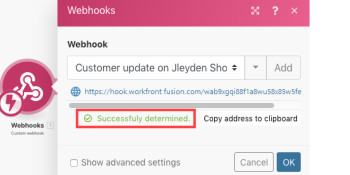

# Webhooks


>[!IMPORTANT]
>
>A documentação do Adobe Workfront Fusion foi movida para um novo local.
>
>As informações neste artigo agora podem ser encontradas nos artigos:
>
>* [Webhooks](https://experienceleague.adobe.com/docs/workfront-fusion/using/references/apps-and-their-modules/universal-connectors/webhooks-updated.html)
>* [Configurar um webhook para um serviço Web sem um conector](https://experienceleague.adobe.com/docs/workfront-fusion/using/create-scenarios/add-modules/receive-a-webhook-from-a-web-service.html)
>
>Atualize todos os marcadores.
>
>Este artigo não está mais sendo atualizado e será removido em breve.

<!--This information moved to the webhooks article in the create scenarios folders in the new repo-->

Um webhook é uma chamada HTTP acionada por um evento. Você pode usar webhooks para ativar módulos de acionador instantâneo. Qualquer aplicativo conectado à Internet e que permita solicitações HTTP pode enviar webhooks para o Adobe Workfront Fusion.

## Requisitos de acesso

Você deve ter o seguinte acesso para usar a funcionalidade neste artigo:

<table style="table-layout:auto"> 
 <col> 
 <col> 
 <tbody> 
  <tr> 
   <td role="rowheader">[!DNL Adobe Workfront] plano*</td> 
   <td> <p>[!UICONTROL Pro] ou superior</p> </td> 
  </tr> 
  <tr data-mc-conditions=""> 
   <td role="rowheader">[!DNL Adobe Workfront] licença*</td> 
   <td> <p>[!UICONTROL Plano], [!UICONTROL Trabalho]</p> </td> 
  </tr> 
  <tr> 
   <td role="rowheader">[!DNL Adobe Workfront Fusion] licença**</td> 
   <td>
   <p>Requisito de licença atual: nenhum requisito de licença [!DNL Workfront Fusion].</p>
   <p>Ou</p>
   <p>Requisito de licença herdada: [!UICONTROL [!DNL Workfront Fusion] para Automação e Integração do Trabalho] </p>
   </td> 
  </tr> 
  <tr> 
   <td role="rowheader">Produto</td> 
   <td>
   <p>Requisito atual do produto: se você tiver o plano [!UICONTROL Select] ou [!UICONTROL Prime] [!DNL Adobe Workfront], sua organização deve comprar [!DNL Adobe Workfront Fusion] e [!DNL Adobe Workfront] para usar a funcionalidade descrita neste artigo. [!DNL Workfront Fusion] está incluído no plano [!DNL Workfront] da [!UICONTROL Ultimate].</p>
   <p>Ou</p>
   <p>Requisito de produto herdado: sua organização deve comprar o [!DNL Adobe Workfront Fusion] e o [!DNL Adobe Workfront] para usar a funcionalidade descrita neste artigo.</p>
   </td> 
  </tr>
 </tbody> 
</table>

&#42;Para saber qual plano, tipo de licença ou acesso você tem, contate o administrador do Workfront.

&#42;&#42;Para obter informações sobre [!DNL Adobe Workfront Fusion] licenças, consulte [[!DNL Adobe Workfront Fusion] licenças](../../workfront-fusion/get-started/license-automation-vs-integration.md)

## Usar um webhook em [!DNL Workfront Fusion]

>[!NOTE]
>
>Para chamar um webhook de terceiros (um webhook de saída), use um dos módulos HTTP. Para obter mais informações, consulte [Módulos HTTP](../../workfront-fusion/apps-and-their-modules/http-modules/http-modules-1.md).

Para usar um webhook para conectar um aplicativo a [!DNL Workfront Fusion]:

1. Adicione o módulo de gatilho instantâneo **[!UICONTROL Webhooks]** >**[!UICONTROL Webhook personalizado]** ao seu cenário.

1. Clique em **[!UICONTROL Adicionar]** ao lado do campo Webhook e insira um nome para o novo webhook.
1. (Opcional) Clique Em **[!UICONTROL Configurações Avançadas]**.
1. No campo **[!UICONTROL Restrições de IP]**, insira uma lista separada por vírgulas dos endereços IP dos quais o módulo pode aceitar dados.
1. Clique em **[!UICONTROL Salvar]**

Depois de criar um webhook, um URL exclusivo é exibido. Esse é o endereço para o qual o webhook envia dados. O Workfront Fusion valida os dados enviados para esse endereço e, em seguida, os transmite para processamento no cenário.

>[!NOTE]
>
>Depois de criar um webhook, você pode usá-lo em mais de um cenário por vez.

### Configurar a estrutura de dados do webhook {#configure-the-webhook-s-data-structure}

Para reconhecer a estrutura de dados da carga de entrada, [!DNL Workfront Fusion] analisa os dados de exemplo enviados para o endereço exibido. Você pode fornecer os dados de amostra fazendo uma alteração no serviço ou aplicativo que fará com que esse serviço ou aplicativo chame o webhook. Por exemplo, você pode remover um arquivo.

Ou você pode seguir as etapas abaixo para enviar os dados de exemplo pelo módulo [!UICONTROL HTTP] > [!UICONTROL Fazer uma solicitação].

1. Criar um novo cenário com o módulo **[!UICONTROL HTTP]** > **[!UICONTROL Fazer uma solicitação]**

1. Configure o módulo com os seguintes valores:

   <table style="table-layout:auto"> 
    <col> 
    <col> 
    <tbody> 
     <tr> 
      <td role="rowheader"><p>[!UICONTROL URL] </p></td> 
      <td>Insira o URL do webhook. Você pode encontrar esse URL no módulo [!UICONTROL Webhooks] que você usou para configurar o webhook.</td> 
     </tr> 
     <tr> 
      <td role="rowheader">[!UICONTROL Método] </td> 
      <td><p>[!UICONTROL POST]</p></td> 
     </tr> 
     <tr> 
      <td role="rowheader">[!UICONTROL Tipo de corpo]</td> 
      <td><p> [!UICONTROL Bruto]</p></td> 
     </tr> 
     <tr> 
      <td role="rowheader">[!UICONTROL Tipo de conteúdo]</td> 
      <td><p> JSON (application/json)</p></td> 
     </tr> 
     <tr> 
      <td role="rowheader">[!UICONTROL Solicitar conteúdo]</td> 
      <td><p>JSON bruto esperado no webhook</p></td> 
     </tr> 
    </tbody> 
   </table>

   

1. Abra o cenário com o módulo [!UICONTROL Webhooks] em uma guia ou janela separada do navegador.
1. No módulo de webhooks, clique em **[!UICONTROL Redeterminar a estrutura de dados]**.

   Não é necessário desvincular outros módulos do módulo webhooks.

1. Alterne para o cenário com o módulo [!UICONTROL HTTP] e execute-o.
1. Volte para o cenário com o módulo Webhooks.

   Uma mensagem &quot;[!UICONTROL Determinado com êxito]&quot; significa que o módulo determinou com êxito a estrutura de dados.

   

1. Clique em **[!UICONTROL OK]** para salvar a estrutura de dados.

   Os itens do webhook agora estão disponíveis no painel de mapeamento para uso com módulos subsequentes no cenário.

## A fila de webhook

Se um webhook receber dados e não houver um cenário ativo esperando esses dados, os dados serão armazenados na fila. Depois que você ativa o cenário, ele processa todos os pacotes aguardando na fila sequencialmente.

>[!IMPORTANT]
>
>As filas de webhook são compartilhadas entre cenários que utilizam o mesmo webhook. Se um dos cenários for desativado, todos os dados recebidos serão mantidos na fila.

## Formatos de dados de entrada compatíveis

[!DNL Workfront Fusion] dá suporte a 3 formatos de dados de entrada: [!UICONTROL Cadeia de Caracteres de Consulta], [!UICONTROL Dados de Formulário] e [!UICONTROL JSON].

[!DNL Workfront Fusion] valida todos os dados recebidos em relação à estrutura de dados selecionada. Em seguida, dependendo das configurações do cenário, os dados são armazenados na fila para processamento ou processados imediatamente.

Se qualquer parte dos dados não passar na validação, [!DNL Workfront Fusion] retornará um código de status HTTP 400 e especificará, no corpo da resposta HTTP, o motivo pelo qual os dados recebidos falharam nas verificações de validação. Se a validação dos dados de entrada tiver êxito, o Workfront Fusion retornará um status &quot;[!UICONTROL 200 Accepted]&quot;.

* [[!UICONTROL Cadeia de consulta]](#query-string)
* [[!UICONTROL Dados do formulário]](#form-data)
* [[!UICONTROL JSON]](#json)

### [!UICONTROL Cadeia de consulta]

```
GET https://app.workfrontfusion.com/wh/<yourunique32characterslongstring>?name=<yourname>&job=automate
```

### [!UICONTROL Dados do formulário]

```
POST https://app.workfrontfusion.com/wh/<yourunique32characterslongstring>

Content-Type: application/x-www-form-urlencoded

name=<yourname>&job=automate
```

#### Dados de formulário multiparte

```
POST https://app.workfrontfusion.com/wh/<yourunique32characterslongstring>


Content-Type: multipart/form-data; boundary=---generatedboundary

---generatedboundary

Content-Disposition: form-data; name="file"; filename="file.txt"


Content-Type: text/plain


Content of file.txt


---generatedboundary

Content-Disposition: form-data; name="name"

Workfront Fusion

---generatedboundary
```

Para receber arquivos codificados com `multipart/form-data`, você deve configurar uma estrutura de dados com um campo do tipo `collection` que contenha os campos aninhados `name`, `mime` e `data`. O campo `name` é um tipo `text` e contém o nome do arquivo carregado. O `mime` é um tipo `text` e contém um arquivo no formato MIME. O campo `data` é um tipo `buffer` e contém dados binários para o arquivo que está sendo transferido.

Para obter mais informações sobre o formato MIME, consulte [módulos MIME](../../workfront-fusion/apps-and-their-modules/mime.md).

### [!UICONTROL JSON]

```
POST https://app.workfrontfusion.com/wh/<yourunique32characterslongstring>

Content-Type: application/json

{"name": "Workfront Fusion", "job": "automate"}
```

>[!TIP]
>
>Se quiser acessar o JSON original, ative a passagem JSON ao configurar o webhook.
>
>1. Clique em **[!UICONTROL Adicionar]** para adicionar um novo webhook.
>1. Clique em **[!UICONTROL Mostrar configurações avançadas]**.
>1. Clique em **[!UICONTROL passagem JSON]**.
>

## Cabeçalhos do Webhook

Para acessar os cabeçalhos do webhook, habilite Obter cabeçalhos de solicitação ao configurar o webhook.

1. Clique em **[!UICONTROL Adicionar]** para adicionar um novo webhook.
1. Clique em **[!UICONTROL Mostrar configurações avançadas]**.
1. Clique em **[!UICONTROL Obter cabeçalhos de solicitação]**.

Você pode extrair um valor de cabeçalho específico com a combinação das funções `map()` e `get()`.

>[!INFO]
>
>**Exemplo:**
>
>O exemplo abaixo mostra uma fórmula que extrai o valor do cabeçalho `authorization` da matriz `Headers[]`. A fórmula é usada em um filtro que compara o valor extraído com o texto fornecido para passar apenas webhooks se houver uma correspondência.
>
>
>
>Para obter mais informações sobre como obter um elemento de matriz com uma determinada chave, consulte [Mapear um elemento de matriz com uma determinada chave](../../workfront-fusion/mapping/map-information-between-modules.md#mapping) no artigo [Mapear informações de um módulo para outro no Adobe Workfront Fusion](../../workfront-fusion/mapping/map-information-between-modules.md).

## Resposta a webhooks

A resposta padrão para uma chamada de webhook é o texto &quot;Accepted&quot;. A resposta é retornada ao aplicativo que chamou o webhook durante a execução do módulo Webhook personalizado.

* [Testar a resposta a um webhook](#test-the-response-to-a-webhook)
* [Exemplo de resposta do HTML](#html-response-example)
* [Exemplo de redirecionamento](#redirect-example)

### Testar a resposta a um webhook

1. Inclua o módulo **[!UICONTROL Webhook]** personalizado em seu cenário.
1. Adicione um novo webhook ao módulo.
1. Copie o URL do webhook para a área de transferência.
1. Execute o cenário.

   O ícone de relâmpago no módulo [!UICONTROL Webhook personalizado] muda para pontos giratórios. Isso mostra que o módulo agora está aguardando a chamada de webhook.

1. Abra uma nova janela do navegador, cole a URL copiada na barra de endereços e pressione **[!UICONTROL Enter]**.

   O módulo [!UICONTROL Webhook] personalizado foi acionado e o navegador exibirá uma nova página.

Se quiser personalizar a resposta do webhook, empregue o módulo Resposta do Webhook.

A configuração do módulo contém dois campos: [!UICONTROL Status] e [!UICONTROL Corpo].

* O campo [!UICONTROL Status] contém códigos de status de resposta HTTP como 2xx para Êxito (por exemplo, `200` para OK), 3xx para Redirecionamento (por exemplo, `307` para Redirecionamento Temporário), 4xx para Erros de Cliente (por exemplo, `400` para Solicitação Inválida) e assim por diante.

* O campo [!UICONTROL Corpo] contém tudo que será aceito pela chamada do webhook. Pode ser texto simples, HTML, XML, JSON e assim por diante.

  >[!TIP]
  >
  >Recomendamos definir o cabeçalho `Content-Type` para o tipo MIME correspondente: `text/plain` para texto sem formatação, `text/html` para HTML, `application/json` para JSON, `application/xml` para XML e assim por diante. Para obter mais informações sobre tipos MIME, consulte [módulos MIME](../../workfront-fusion/apps-and-their-modules/mime.md).

O tempo limite para enviar uma resposta é de 40 segundos. Se a resposta não estiver disponível nesse período, o Workfront Fusion retornará um status &quot;200 Aceito&quot;.

### Exemplo de resposta do HTML

>[!INFO]
>
>**Exemplo:**
>
>Configure o módulo [!UICONTROL Resposta do Webhook] da seguinte maneira:
>
><table style="table-layout:auto"> 
&gt; <col> 
&gt; <col> 
&gt; <tbody> 
&gt;  <tr> 
&gt;   <td role="rowheader">[!UICONTROL Status] </td> 
&gt;   <td> <p>Código de status HTTP de sucesso 2xx, por exemplo, 200</p> </td> 
&gt;  </tr> 
&gt;  <tr> 
&gt;   <td role="rowheader">[!UICONTROL Corpo] </td> 
&gt;   <td> <p>código HTML</p> </td> 
&gt;  </tr> 
&gt;  <tr> 
&gt;   <td role="rowheader"> <p>[!UICONTROL Cabeçalhos personalizados]</p> </td> 
&gt;   <td> 
&gt;    <ul> 
&gt;     <li><strong>Chave</strong>: Tipo de conteúdo</li> 
&gt;     <li><strong>Valor</strong>: texto/html</li> 
&gt;    </ul> </td> 
&gt;  </tr> 
&gt; </tbody> 
&gt;</table>
>
>
>
>Isso produzirá uma resposta HTML que é exibida em um navegador da Web:
>
>

### Exemplo de redirecionamento

>[!INFO]
>
>**Exemplo:** Configure o módulo [!UICONTROL Resposta do Webhook] da seguinte maneira:
>
><table style="table-layout:auto"> 
&gt; <col> 
&gt; <col> 
&gt; <tbody> 
&gt;  <tr> 
&gt;   <td role="rowheader">[!UICONTROL Status] </td> 
&gt;   <td> <p>Código de status HTTP de redirecionamento 3xx, por exemplo, 303</p> </td> 
&gt;  </tr> 
&gt;  <tr> 
&gt;   <td role="rowheader"> <p>[!UICONTROL Cabeçalhos personalizados]</p> </td> 
&gt;   <td> 
&gt;    <ul> 
&gt;     <li><strong>[!UICONTROL Chave]</strong>: Localização</li> 
&gt;     <li><strong>[!UICONTROL Valor]</strong>: A URL para a qual você deseja redirecionar.</li> 
&gt;    </ul> </td> 
&gt;  </tr> 
&gt; </tbody> 
&gt;</table>
>
>

## Desativação do Webhook

Os webhooks são desativados automaticamente se qualquer uma das seguintes situações se aplicar:

* O webhook não foi conectado a nenhum cenário por mais de 5 dias
* O webhook é usado somente em cenários inativos, que ficaram inativos por mais de 30 dias.

Os webhooks desativados são excluídos e não registrados automaticamente se não estiverem conectados a nenhum cenário e estiverem com o status desativado por mais de 30 dias.


## Solução de problemas

### Itens ausentes no painel de mapeamento

Se alguns itens estiverem ausentes no painel de mapeamento na configuração dos módulos após o módulo [!UICONTROL Webhooks] > [!UICONTROL Webhook personalizado], clique no módulo **[!UICONTROL Webhooks] > [!UICONTROL Webhook personalizado]** para abrir a configuração e clique em **[!UICONTROL Redeterminar a estrutura de dados]**:


Siga as etapas descritas na seção [Configurar a estrutura de dados do webhook](#configure-the-webhook-s-data-structure) neste artigo.
