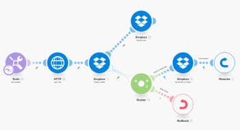
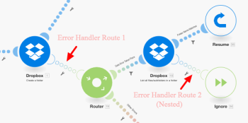

# Tratamento de erros avançado no [!DNL Adobe Workfront Fusion]

As técnicas avançadas de manipulação de erros incluem filtragem e aninhamento.

## Requisitos de acesso

Você deve ter o seguinte acesso para usar a funcionalidade neste artigo:

<table style="table-layout:auto">
 <col> 
 <col> 
 <tbody> 
  <tr> 
   <td role="rowheader">[!DNL Adobe Workfront] plano*</td> 
   <td> 
[!UICONTROL Pro] ou superior
 </td> 
  </tr> 
  <tr data-mc-conditions=""> 
   <td role="rowheader">[!DNL Adobe Workfront] licença*</td> 
   <td> 
[!UICONTROL Plano], [!UICONTROL Trabalho]
 </td> 
  </tr> 
  <tr> 
   <td role="rowheader">Licença [!UICONTROL Adobe Workfront Fusion]**</td> 
   <td>
   
Requisito de licença atual: Não [!DNL Workfront Fusion] requisito de licença.

   
Ou

   
Requisito de licença herdada: [!UICONTROL [!DNL Workfront Fusion] para Automação e integração do trabalho] 

   </td> 
  </tr> 
  <tr> 
   <td role="rowheader">Produto</td> 
   <td>
   
Requisito atual do produto: se você tiver o [!UICONTROL Select] ou o [!UICONTROL Prime] [!DNL Adobe Workfront] Planejar, sua organização deve comprar [!DNL Adobe Workfront Fusion] bem como [!DNL Adobe Workfront] para usar a funcionalidade descrita neste artigo. [!DNL Workfront Fusion] está incluído no [!UICONTROL Ultimate] [!DNL Workfront] plano.

   
Ou

   
Requisito de produto herdado: sua organização deve comprar [!DNL Adobe Workfront Fusion] bem como [!DNL Adobe Workfront] para usar a funcionalidade descrita neste artigo.

   </td> 
  </tr> 
 </tbody> 
</table>

Para descobrir que plano, tipo de licença ou acesso você tem, entre em contato com o [!DNL Workfront] administrador.

Para obter informações sobre [!DNL Adobe Workfront Fusion] licenças, consulte [[!DNL Adobe Workfront Fusion] licenças](../../workfront-fusion/get-started/license-automation-vs-integration.md).

## Filtros

Há dois tipos de filtragem que podem ocorrer em uma rota de manipulador de erros.

* [Adicionar um filtro à rota do manipulador de erros](#adding-a-filter-to-the-error-handler-route)
* [Adicionar um roteador seguido de filtros à rota do manipulador de erros](#adding-a-router-followed-by-filters-to-the-error-handler)

### Adicionar um filtro à rota do manipulador de erros

Você pode usar um filtro para controlar quais erros são manipulados pela rota do manipulador de erros. Isso permite processar apenas tipos específicos de erros. Se um erro não passar pelo filtro, ele será tratado como se não houvesse nenhuma rota de manipulador de erros definida para o módulo fornecido.

>[!INFO]
>
>**Exemplo:**
>
>

### Adicionar um [!UICONTROL Roteador] seguido por filtros para o manipulador de erros

>[!INFO]
>
>
>
>Neste exemplo, o erro ocorre no estado [!UICONTROL Criar uma pasta] módulo (A), que tem uma rota regular e uma rota de manipulador de erros. O último é seguido por um roteador com uma rota que tem um filtro que define um tipo específico de erro (Ocorre o erro de dados) e a outra que é a rota padrão para todos os outros erros. A primeira rota termina com o [!UICONTROL Retomar] diretiva que contém valores substitutos para o cenário retomar do módulo A ([!UICONTROL Criar uma pasta]), enquanto a segunda rota termina com o [!UICONTROL Reversão] diretiva que interrompe a execução do cenário imediatamente.

Consulte [Processamento de erros no [!DNL Adobe Workfront Fusion]](../../workfront-fusion/errors/error-processing.md) para obter mais informações sobre vários tipos de erros e sobre como [!DNL Workfront Fusion] processa e os avalia.

### O exemplo de cenário

Você pode configurar esse exemplo de cenário para entender como esses filtros funcionam para a manipulação de erros.

Usar um existente [!DNL Dropbox] pasta para carregar um arquivo em vez de criar um novo

Se você usar o [!UICONTROL Criar uma pasta] módulo ativado [!DNL Dropbox] e uma pasta com o mesmo nome já existir, o módulo exibirá um Erro de dados como mostrado abaixo:

O cenário completo:

1. A variável [!UICONTROL Ferramentas] > [!UICONTROL Definir variável] o módulo contém o nome da pasta
1. A variável [!UICONTROL HTTP] >[!UICONTROL Obter um arquivo] O módulo busca o arquivo que precisa ser carregado na pasta
1. A variável [!UICONTROL Dropbox] >[!UICONTROL Criar uma pasta] O módulo lança um erro se uma pasta já existir com o mesmo nome que a mapeada no módulo
1. A rota do manipulador de erros (bolhas transparentes) contém um roteador para filtrar os erros
1. A primeira rota é para um tipo específico de erro chamado Erro de Dados, pois já sabemos disso:

   1. Se ocorrer um Erro de dados e os detalhes do erro passarem pelo filtro, a variável [!UICONTROL Dropbox] >[!UICONTROL Listar todos os arquivos/subpastas em um módulo de pasta] lista todas as pastas em [!DNL Dropbox]
   1. O filtro subsequente corresponde aos nomes da pasta
   1. A variável [!UICONTROL Retomar] diretiva especifica a ID da pasta e o caminho da pasta existente e a execução do cenário continua a partir da [!UICONTROL Dropbox] >[!UICONTROL Criar uma pasta] módulo, mas em vez de tentar criar uma nova pasta, desta vez ele usa os valores do [!UICONTROL Retomar] diretiva para ir para o próximo módulo e fazer upload do arquivo na pasta existente

1. A segunda rota é para todos os outros erros e termina com o [!UICONTROL Reversão] diretiva que resulta na interrupção imediata do cenário

Veja abaixo uma explicação detalhada da 5ª declaração:

Para usar a pasta existente nos módulos subsequentes ([!UICONTROL Carregar um arquivo] abaixo), você precisa adicionar uma rota de manipulador de erros ao módulo e buscar o caminho da pasta a ser mapeado na variável [!UICONTROL Retomar] módulo de diretiva que segue:

O filtro na primeira rota é definido para lidar apenas com o erro específico (Erro de dados) que aparece quando uma pasta com o mesmo nome já existe:

A variável [!UICONTROL Dropbox] >[!UICONTROL Listar todos os arquivos em uma pasta] O módulo de está configurado para retornar todas as pastas na pasta de destino. O filtro a seguir passa apenas aquele que estávamos tentando criar originalmente (o nome da pasta é armazenado no 33. Nome da pasta (item):

Por fim, a [!UICONTROL Retomar] diretiva fornece o caminho da Pasta como saída para o módulo com falha. Observe que a ID da pasta foi deixada em branco, pois não é necessária para o[!UICONTROL Carregar um arquivo]Módulo &#39;:

## Aninhamento

Independentemente de onde um módulo esteja localizado, as rotas do manipulador de erros podem ser criadas e implementadas em todos os módulos, exceto roteadores. Portanto, é possível criar uma rota de manipulador de erros para um módulo que já faz parte de uma rota de manipulador de erros existente criada para outro módulo.

Este é um exemplo de uma rota de manipulador de erro aninhada:

Nesse cenário, a segunda rota do manipulador de erros é aninhada na primeira rota do manipulador de erros. Assim, se a variável [!UICONTROL Dropbox] >[!UICONTROL Criar um módulo de pasta] encontra um erro, a execução é movida para a Rota 1 se a variável [!UICONTROL Ocorre um erro de dados] for transmitido, o próximo módulo será executado seguido pela variável [!UICONTROL Retomar] módulo de diretiva se um erro não ocorrer com o [!UICONTROL Dropbox] >[!UICONTROL Listar todos os arquivos/subpastas] em um módulo de pasta.

No entanto, se ocorrer um erro com esse [!DNL Dropbox] , a execução é movida para a Rota 2 do Manipulador de Erros e termina com [!UICONTROL Ignorar] diretiva. A variável [!UICONTROL Retomar diretiva] nesse caso, o módulo não é executado.

Essa é uma combinação de filtragem e aninhamento de manipuladores de erro.

