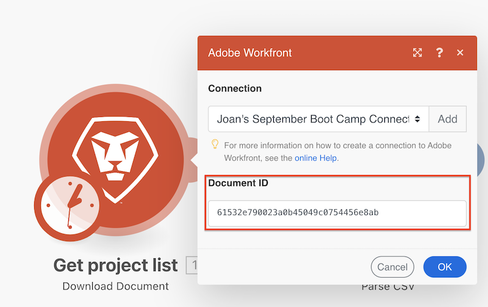
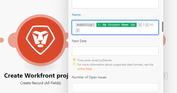

# Mapear itens usando funções em [!DNL Adobe Workfront Fusion]

>[!IMPORTANT]
>
>A documentação do Adobe Workfront Fusion foi movida para um novo local.
>
>As informações neste artigo agora podem ser encontradas no artigo:
>
>* [Mapear um item usando funções](https://experienceleague.adobe.com/docs/workfront-fusion/using/create-scenarios/map-data/map-using-functions.html)
>
>Atualize todos os marcadores.
>
>Este artigo não está mais sendo atualizado e será removido em breve.

Ao mapear itens, você pode usar funções para criar fórmulas simples ou complexas. As funções disponíveis no [!DNL Adobe Workfront Fusion] são semelhantes às funções no Excel e em algumas linguagens de programação:

* Eles avaliam a lógica geral, matemática, texto, datas e matrizes.
* Elas permitem executar lógica condicional e transformações de valores de item, como converter um texto em maiúsculas, cortar texto, converter uma data em um formato diferente e muito mais.

Para obter mais informações, consulte [Mapear informações de um módulo para outro no Adobe Workfront Fusion](../../workfront-fusion/mapping/map-information-between-modules.md).

## Requisitos de acesso

Você deve ter o seguinte acesso para usar a funcionalidade neste artigo:

<table style="table-layout:auto">

<col>  
 <col>  
 <tbody>  
  <tr>  
   <td role="rowheader">[!DNL Adobe Workfront] plano</td>  
   <td> 
Qualquer
 </td>  
  </tr>  
  <tr data-mc-conditions="">  
   <td role="rowheader">[!DNL Adobe Workfront] licença</td>  
   <td> 
Novo: [!UICONTROL Padrão]

Ou

Atual: [!UICONTROL Trabalho] ou superior
 </td>  
  </tr>  
  <tr>  
   <td role="rowheader">[!DNL Adobe Workfront Fusion] licença**</td>  
   <td> 
   
Atual: nenhum requisito de licença [!DNL Workfront Fusion].
 
   
Ou
 
   
Herdados: Qualquer um 
 
   </td>  
  </tr>  
  <tr>  
   <td role="rowheader">Produto</td>  
   <td> 
   
Novo:
 <ul><li>[!UICONTROL Select] ou [!UICONTROL Prime] Plano [!DNL Workfront]: sua organização deve comprar [!DNL Adobe Workfront Fusion].</li><li>Plano [!DNL Workfront] da [!UICONTROL Ultimate] [!DNL Workfront Fusion] incluído.</li></ul> 
   
Ou
 
   
Atual: sua organização deve comprar o [!DNL Adobe Workfront Fusion].
 
   </td>  
  </tr> 
 </tbody>  
</table>

Para obter mais detalhes sobre as informações nesta tabela, consulte [Requisitos de acesso na documentação do Workfront](/help/quicksilver/administration-and-setup/add-users/access-levels-and-object-permissions/access-level-requirements-in-documentation.md).

Para obter informações sobre [!DNL Adobe Workfront Fusion] licenças, consulte [[!DNL Adobe Workfront Fusion] licenças](../../workfront-fusion/get-started/license-automation-vs-integration.md).

## Visão geral da guia Mapeamento

Para abrir o painel [!UICONTROL mapeamento] para um campo:

1. Clique em **Cenários** no painel esquerdo.
1. Escolha um cenário.

### Guias do painel Mapeamento

Estas são as guias no painel de mapeamento:

* **Funções gerais**  - Consulte [Funções gerais em [!DNL Adobe Workfront Fusion]](../../workfront-fusion/functions/general-functions.md) para obter mais informações.

* **Funções matemáticas**  - Consulte [Funções matemáticas em [!DNL Adobe Workfront Fusion]](../../workfront-fusion/functions/math-functions.md) para obter mais informações.

* **Funções de texto e binárias**  - Consulte [Funções de cadeia de caracteres em [!DNL Adobe Workfront Fusion]](../../workfront-fusion/functions/string-functions.md) para obter mais informações.

* **Data e hora**  - Consulte as [funções de data e hora em [!DNL Adobe Workfront Fusion]](../../workfront-fusion/functions/date-and-time-functions.md) e os artigos abaixo para obter mais informações:

   * [Tokens para formatação de data e hora em  [!DNL Adobe Workfront Fusion]](../../workfront-fusion/functions/tokens-for-date-and-time-formatting.md)
   * [Tokens para análise de data e hora em  [!DNL Adobe Workfront Fusion]](../../workfront-fusion/functions/tokens-for-date-and-time-parsing.md)

* **Funções para trabalhar com matrizes**  - Consulte [Funções de matriz em [!DNL Adobe Workfront Fusion]](../../workfront-fusion/functions/array-functions.md) para obter mais informações.

* **Mapear outras funções**  exibe os itens que você pode mapear de outros módulos. Nem sempre essa guia está disponível.

## Inserir funções em campos

Para inserir uma função em um campo:

1. Clique no nome da função.

   Ou

   Arraste a função para o campo.

>[!BEGINSHADEBOX]

**Exemplo:** alguns tipos de dados impedem que os usuários insiram mais do que um determinado número de caracteres. Você pode usar a função substring para limitar um valor a um determinado número de caracteres.

Neste exemplo, a função de subsequência de caracteres limita o nome do projeto a 50 caracteres.

>[!ENDSHADEBOX]

## Aninhamento de funções

É possível aninhar funções entre si.

## Usar funções [!DNL Google Sheets]

Se [!DNL Workfront Fusion] não tiver uma função que você queira usar, mas sim [!DNL Google Sheets], você poderá usá-la seguindo estas etapas:

1. Em [!DNL Google Sheets], crie uma nova planilha vazia.
1. Em [!DNL Workfront Fusion], abra seu cenário.
1. Adicione o módulo **[!DNL Google Sheets]** >**[!UICONTROL Atualizar uma célula]** ao cenário.

   Para obter instruções sobre como adicionar um módulo, consulte [Adicionar um módulo em um cenário](../../workfront-fusion/scenarios/create-a-scenario.md#add) no artigo [Criar um cenário em [!DNL Adobe Workfront Fusion]](../../workfront-fusion/scenarios/create-a-scenario.md).

1. Configure o módulo:

   1. Escolha a planilha recém-criada no campo **[!UICONTROL Planilha]**.
   1. Insira a fórmula que contém as funções [!DNL Google Sheets] no campo **[!UICONTROL Valor]**.

      Você pode usar a saída dos módulos anteriores como de costume.

      

1. Insira o módulo **[!UICONTROL Google Sheets] >[!UICONTROL Get a cell]** para obter o resultado calculado.
1. Configure o módulo, usando a mesma ID de célula que você usou na etapa 4.

   
