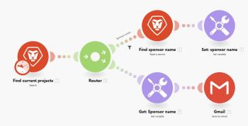

# Termos básicos em [!DNL Adobe Workfront Fusion]

>[!NOTE]
>
>[!DNL Adobe Workfront Fusion] exige uma licença [!DNL Adobe Workfront Fusion] além de uma licença [!UICONTROL Adobe Workfront].

<table style="table-layout:auto">
 <col> 
 <col> 
 <tbody> 
  <tr> 
   <td role="rowheader"> 
Ação
 </td> 
   <td>Um módulo que permite ler ou gravar pacotes de ou em um aplicativo ou serviço selecionado.</td> 
  </tr> 
  <tr> 
   <td role="rowheader"> 
[!UICONTROL Agregador]
 </td> 
   <td> 
Um tipo de módulo que mescla vários pacotes (várias matrizes de dados) em um único pacote. Para obter mais informações, consulte o módulo <a href="../../workfront-fusion/modules/aggregator-module.md" class="MCXref xref">[!UICONTROL Aggregator] no [!UICONTROL Adobe Workfront Fusion]</a>.
 </td> 
  </tr> 
  <tr> 
   <td role="rowheader">Chave de API</td> 
   <td>Um código exclusivo que identifica o usuário, desenvolvedor ou programa que está chamando a API de um software, usado para autenticação. Como os módulos do [!DNL Adobe Workfront Fusion] funcionam conectando as APIs, as chaves de API às vezes são necessárias. As chaves de API são distribuídas pelo aplicativo que as requer. Por exemplo, se você precisar de uma chave de API para [!DNL ActiveCampaign], solicite-a na sua conta [!DNL ActiveCampaign].</td> 
  </tr> 
  <tr> 
   <td role="rowheader">Aplicativo ou serviço</td> 
   <td> 
Um aplicativo de software, mais comumente.
 
Um aplicativo também pode ser uma função especial que manipula dados, como um iterador ou agregador. 
 
Um serviço é uma fonte de pacotes que podem incluir uma API da Web, uma página da Web, diferentes tipos de servidores (FTP, SMTP, IMAP) e assim por diante. 
  </td> 
  </tr> 
  <tr> 
   <td role="rowheader">Conector de aplicativo</td> 
   <td>Um aplicativo que se conecta a outro sistema.</td> 
  </tr> 
  <tr> 
   <td role="rowheader"> 
Pacote
 </td> 
   <td> 
Um pacote é uma unidade básica que é retornada ou recebida pelos módulos. Um pacote consiste em itens.
 </td> 
  </tr> 
  <tr> 
   <td role="rowheader"> 
[!UICONTROL Conexão]
 </td> 
   <td> 
Ao adicionar um aplicativo ou serviço a um cenário, é provável que você tenha que primeiro criar uma conexão entre [!DNL Workfront Fusion] e o aplicativo ou serviço para recuperar ou enviar os dados selecionados. Para obter mais informações, consulte <a href="../../workfront-fusion/connections/about-connecting-wf-fusion-to-app-or-service.md" class="MCXref xref">Visão geral das conexões</a>.
 </td> 
  </tr> 
  <tr> 
   <td role="rowheader"> 
Ciclo
 </td> 
   <td> 
Um ciclo se refere a duas fases da execução do cenário: operação e confirmação. O cenário pode consistir em um ou mais ciclos. Para obter informações mais detalhadas, consulte <a href="../../workfront-fusion/scenarios/scenario-execution-cycles-phases.md" class="MCXref xref">Execução do cenário, ciclos e fases em [!DNL Adobe Workfront Fusion]</a>.
 </td> 
  </tr> 
  <tr> 
   <td role="rowheader"> 
Armazenamento de dados
 </td> 
   <td> 
Uma ferramenta que armazena dados de cenários ou permite transferir dados entre cenários individuais ou execuções de cenário. Para obter mais informações, consulte <a href="../../workfront-fusion/modules/data-stores.md" class="MCXref xref">Repositórios de Dados no [!UICONTROL Adobe Workfront Fusion]</a>.
 </td> 
  </tr> 
  <tr> 
   <td role="rowheader"> 
Transferência de dados
 </td> 
   <td> 
A quantidade de dados transferidos por meio do cenário. Para obter mais informações, consulte <a href="../../workfront-fusion/scenarios/scenario-detail.md" class="MCXref xref">Detalhes do cenário no [!UICONTROL Adobe Workfront Fusion]</a>.
 </td> 
  </tr> 
  <tr> 
   <td role="rowheader"> 
Filtro
 </td> 
   <td> 
Recursos adicionais que podem ser aplicados entre dois módulos. Um filtro permite trabalhar somente com pacotes que se encaixem em determinados critérios. Há vários filtros diferentes que podem ser aplicados. Para obter mais informações, consulte <a href="../../workfront-fusion/scenarios/add-a-filter-to-a-scenario.md" class="MCXref xref">Adicionar um filtro a um cenário no [!UICONTROL Adobe Workfront Fusion]</a>.
 </td> 
  </tr> 
  <tr> 
   <td role="rowheader"> 
ID
 </td> 
   <td> 
Um nome usado para identificar exclusivamente um pacote. Uma ID geralmente é usada para diferenciar um pacote que deve ser atualizado ou excluído de um determinado serviço.
 </td> 
  </tr> 
  <tr> 
   <td role="rowheader"> 
Itens
 </td> 
   <td> 
Uma parte de um pacote. Os pacotes podem consistir em vários itens. Há vários tipos diferentes de itens: texto, número, booleano (sim/não), data, hora, buffer (dados binários), coleções, menu de seleção, matriz e validação.
 </td> 
  </tr> 
  <tr> 
   <td role="rowheader"> 
[!UICONTROL Iterador]
 </td> 
   <td> 
Um tipo de módulo que permite que você pegue um pacote de dados (uma matriz de dados) e divida em pacotes separados. Para obter mais informações, consulte o módulo <a href="../../workfront-fusion/modules/iterator-module.md" class="MCXref xref">[!UICONTROL Iterator] em [!DNL Adobe Workfront Fusion]</a>.
 </td> 
  </tr> 
  <tr> 
   <td role="rowheader"> 
Módulo
 </td> 
   <td> 
Uma única etapa em um cenário que executa uma função, como criar um registro, no aplicativo ou serviço associado.
 
Cada aplicativo ou serviço tem vários módulos que definem como ele responde a uma solicitação.
 
Há quatro tipos de módulos: ações, acionadores, iteradores e agregadores.
 
  
 
Para obter mais informações, consulte <a href="../../workfront-fusion/modules/module-types.md" class="MCXref xref">Tipos de módulos</a>.
 </td> 
  </tr> 
  <tr> 
   <td role="rowheader"> 
Operação
 </td> 
   <td> 
Uma tarefa executada por um módulo.

Para obter mais informações, consulte <a href="../../workfront-fusion/get-started/operations-in-workfront-fusion.md" class="MCXref xref">Operações em [!DNL Adobe Workfront Fusion]</a>.

  </tr> 
  <tr> 
   <td role="rowheader">Chaves públicas/privadas</td> 
   <td>As chaves públicas e privadas são usadas para criptografar e descriptografar dados. A chave pública pode ser distribuída e qualquer pessoa com a chave pública pode criptografar dados, mas somente a chave privada pode descriptografá-los. Da mesma forma, um usuário com uma chave privada pode criptografar dados que qualquer pessoa com a chave pública pode descriptografar. A criptografia de chave privada garante que os dados vieram do proprietário da chave privada e serve como validação da fonte de dados.</td> 
  </tr> 
  <tr> 
   <td role="rowheader"> 
[!UICONTROL Roteador]
 </td> 
   <td>Permite duplicar dados ou adicionar novas rotas a um cenário, de modo a reencaminhar os dados e lidar com diferentes grupos de dados separadamente. Para obter mais informações, consulte o módulo <a href="../../workfront-fusion/modules/router-module.md" class="MCXref xref">[!UICONTROL Router] em [!DNL Adobe Workfront Fusion]</a>.</td> 
  </tr> 
  <tr> 
   <td role="rowheader"> 
Cenário
 </td> 
   <td> 
Uma série criada pelo usuário de etapas automatizadas, cada uma representada e executada por um módulo. A finalidade de um cenário é mover e manipular dados.
 
  
 
 Para obter mais informações, consulte <a href="../../workfront-fusion/scenarios/create-a-scenario.md" class="MCXref xref">Criar um cenário no[!UICONTROL Adobe Workfront Fusion]</a>.
 </td> 
  </tr> 
  <tr> 
   <td role="rowheader"> 
Transações
 </td> 
   <td> 
[!DNL Workfront Fusion] O usa o processamento transacional para capturar o ciclo de vida do cenário. Uma transação consiste em várias fases durante as quais os dados são transformados de um estado consistente para outro. Há quatro fases: inicialização, operação (leitura ou gravação), confirmação/reversão e finalização.
 </td> 
  </tr> 
  <tr> 
   <td role="rowheader"> 
Acionador
 </td> 
   <td> 
Um módulo que permite capturar pacotes que foram adicionados ou atualizados desde a última execução de um cenário. Há dois tipos de acionadores: sondagem e instantâneo (webhooks). Para obter mais informações, consulte <a href="../../workfront-fusion/webhooks/instant-triggers-webhooks.md" class="MCXref xref">Acionadores instantâneos (webhooks) em [!DNL Adobe Workfront Fusion]</a>.
 </td> 
  </tr> 
  <tr> 
   <td role="rowheader"> 
Webhook
 </td> 
   <td> 
Um tipo especial de acionador que permite executar um cenário imediatamente após a disponibilização de um novo pacote. Para obter mais informações, consulte <a href="../../workfront-fusion/webhooks/instant-triggers-webhooks.md" class="MCXref xref">Acionadores instantâneos (webhooks) no [!UICONTROL Adobe Workfront Fusion]</a>.
 </td> 
  </tr> 
 </tbody> 
</table>
