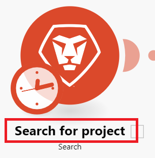

# Criar um cenário básico em [!DNL Adobe Workfront Fusion]

O papel de [!DNL Adobe Workfront Fusion] é automatizar seus processos para que você possa se concentrar em novas tarefas em vez de repetir as mesmas tarefas repetidamente. Ele funciona vinculando ações em e entre aplicativos e serviços para criar um cenário que transfere e transforma seus dados automaticamente. O cenário que você cria observa dados em um aplicativo ou serviço e processa esses dados para fornecer o resultado desejado.

Este exemplo orienta você no processo de criação de um cenário que procura uma tarefa [!DNL Workfront] no Workfront e a converte em um projeto.

<!--# Access requirements

You must have the following access to use the functionality in this article:

<table style="table-layout:auto">
 <col> 
 <col> 
 <tbody> 
  <tr> 
   <td role="rowheader">[!DNL Adobe Workfront] plan*</td> 
   <td> 
[!DNL Pro] or higher
 </td> 
  </tr> 
  <tr data-mc-conditions=""> 
   <td role="rowheader">[!DNL Adobe Workfront] license*</td> 
   <td> 
[!UICONTROL Plan], [!UICONTROL Work]
 </td> 
  </tr> 
  <tr> 
   <td role="rowheader">[!UICONTROL Adobe Workfront Fusion] license**</td> 
   <td>
   
Current license requirement: No [!DNL Workfront Fusion] license requirement.

   
Or

   
Legacy license requirement: [!UICONTROL [!DNL Workfront Fusion] for Work Automation and Integration] 

   </td> 
  </tr> 
  <tr> 
   <td role="rowheader">Product</td> 
   <td>
   
Current product requirement: If you have the [!UICONTROL Select] or [!UICONTROL Prime] [!DNL Adobe Workfront] Plan, your organization must purchase [!DNL Adobe Workfront Fusion] as well as [!DNL Adobe Workfront] to use functionality described in this article. [!DNL Workfront Fusion] is included in the [!UICONTROL Ultimate] [!DNL Workfront] plan.

   
Or

   
Legacy product requirement: Your organization must purchase [!DNL Adobe Workfront Fusion] as well as [!DNL Adobe Workfront] to use functionality described in this article.

   </td> 
  </tr> 
 </tbody> 
</table>
To find out what plan, license type, or access you have, contact your [!DNL Workfront] administrator.

For information on [!DNL Adobe Workfront Fusion] licenses, see [[!DNL Adobe Workfront Fusion] licenses](../../workfront-fusion/get-started/license-automation-vs-integration.md).

-->

## Criar um cenário de prática

### Começar a criar o cenário

1. Na área **Cenários**, clique em **Criar um novo cenário**.

   <!--To locate the Scenarios area, see navigation article-->

   O editor de cenários é exibido, contendo um módulo vazio no centro.

   <!--picture?-->

1. Selecione o nome do espaço reservado **[!UICONTROL Novo cenário]** no canto superior esquerdo e digite um nome.
1. Continue com [Adicione e configure o primeiro módulo](#add-and-configure-the-first-module) abaixo.

### Adicionar e configurar o primeiro módulo

1. Clique no módulo vazio para escolher o aplicativo do qual você selecionará um módulo.

   Uma lista de aplicativos é exibida à direita do módulo.

1. Selecione **[!DNL Adobe Workfront]**. Se não estiver visível, clique na barra de pesquisa na parte inferior da lista, digite &quot;Workfront&quot; e selecione-a quando ela aparecer na lista.

   A lista é alterada para exibir todos os módulos [!DNL Workfront] que você pode usar.

1. Clique no módulo **[!UICONTROL Pesquisa]**.

   A janela de configuração do módulo é aberta.

1. Na caixa [!UICONTROL Conexão], selecione sua conexão com o Workfront.

   Se você não tiver uma conexão Workfront, consulte [Criar uma conexão com o [!DNL Adobe Workfront Fusion]](/help/quicksilver/workfront-fusion/connections/connect-to-fusion-general.md)
1. Na caixa [!UICONTROL Tipo de Registro], selecione **[!UICONTROL Tarefa]**. Isso define o módulo para pesquisar somente tarefas.

   Você pode encontrar **[!UICONTROL Tarefa]** na lista se começar a digitar a palavra &quot;[!UICONTROL tarefa].&quot;

1. Na caixa **[!UICONTROL Conjunto de Resultados]**, selecione **[!UICONTROL Primeiro Registro Correspondente]**.

   Isso define o módulo para retornar somente o primeiro registro encontrado que atenda aos critérios.
1. Na área **[!UICONTROL Critérios de pesquisa]**, configure os critérios para retornar a tarefa específica.

   1. Na primeira caixa em [!UICONTROL Critérios de Pesquisa], selecione o campo que deseja incluir na pesquisa. Para este exemplo, selecione **[!UICONTROL Nome]**.

      Você pode encontrar **[!UICONTROL Nome]** na lista se começar a digitar a palavra &quot;[!UICONTROL nome].&quot;
   1. Para o operador, clique na seta suspensa ao lado de **Existe** e altere para [!UICONTROL **Contém (não diferencia maiúsculas de minúsculas)**].

      Isso permite que o módulo encontre projetos com as palavras escolhidas em seu nome, mesmo se você não inserir o nome inteiro ou inserir o nome com a caixa incorreta (como todas em maiúsculas).
   1. No último campo em [!UICONTROL Critério de Pesquisa], digite uma palavra ou frase que você sabe que está no nome da tarefa que você está procurando.

1. Na lista **[!UICONTROL Saídas]**, selecione os campos nos quais deseja que o módulo faça a saída. Para este exemplo, selecione os campos **[!UICONTROL ID]** e **[!UICONTROL Name]**.

   >[!TIP]
   >
   >Você pode usar **Cmd+F** (SO [!DNL Mac]) ou **Ctrl-F** (SO [!DNL Windows]) para localizar um campo rapidamente.

1. Clique em **[!UICONTROL OK]** para salvar a configuração do módulo.

1. Clique com o botão direito do mouse no módulo, clique em **[!UICONTROL Renomear]**, digite um nome que descreva o que você deseja que o módulo faça (como &quot;Procurar tarefa&quot;) e clique em **[!UICONTROL OK]**.

   O nome aparece logo abaixo do módulo. Abaixo disso, [!DNL Workfront Fusion] inclui uma breve descrição do tipo de ação executada pelo módulo.

   

1. Continue com [Adicionar e configurar o segundo módulo](#add-and-configure-the-second-module).

## Adicionar e configurar o segundo módulo

1. Passe o mouse sobre o círculo parcial à direita do do módulo e clique em **[!UICONTROL Adicionar outro módulo]**.
1. Selecione [!DNL Adobe Workfront] na lista de aplicativos e escolha o módulo **[!UICONTROL Converter objeto]**.
1. No campo [!UICONTROL Conexão], selecione a mesma conexão Workfront usada no módulo anterior.
1. No campo **[!UICONTROL Tipo de registro]**, selecione **[!UICONTROL Tarefa]**, pois o módulo converterá uma tarefa.
1. No campo **[!UICONTROL Converter em]**, selecione **Projeto**.
1. Ao lado do campo ID de tarefa, clique no botão de alternância do mapa para ativá-lo.

   O botão fica azul quando é ativado. Isso permite mapear a ID da tarefa do módulo anterior.

   
1. Clique no campo **[!UICONTROL ID da Tarefa]**.

   É aberto um painel que permite selecionar o que será usado como a ID da tarefa que você deseja converter em um projeto. Como você ativou o mapeamento, o painel inclui a saída de qualquer módulo anterior. Você selecionou ID como uma saída do módulo anterior, de modo que ele agora está disponível no painel.

   Esse painel é chamado de painel de mapeamento. Para obter mais informações sobre o painel de mapeamento, consulte [Mapear informações de um módulo para outro](/help/quicksilver/workfront-fusion/mapping/map-information-between-modules.md).
1. Selecione **ID** no painel de mapeamento.

   Um bloco ID é exibido no campo ID. Ela mostra o número do módulo do qual é mapeado e o campo que é mapeado.

   

1. Clique no campo **ID do Modelo**, comece digitando o nome do modelo do Workfront que deseja usar para este projeto e selecione-o quando ele aparecer na lista.
1. Clique em **[!UICONTROL OK]** para salvar a configuração do módulo.

1. Clique com o botão direito do mouse no módulo, clique em **[!UICONTROL Renomear]**, digite um nome que descreva o que você deseja que o módulo faça (como &quot;Converter em projeto&quot;) e clique em **[!UICONTROL OK]**.

1. Continue para [Testar o cenário](#test-the-scenario).

## Testar o cenário

Antes de ativar o cenário, é importante testá-lo executando-o pelo menos uma vez e visualizando os resultados. Isso ajuda você a entender como os dados fluem pelo cenário e encontrar erros.

Para este cenário, um teste bem-sucedido resultaria na localização da nova tarefa e sua conversão em um projeto.

1. Clique em **[!UICONTROL Executar uma vez]** no canto inferior esquerdo do editor de cenários.
1. Depois que o cenário terminar de ser executado, clique no balão acima do primeiro módulo para exibir informações sobre o pacote de dados que o módulo processou, incluindo dados obtidos da tarefa que o módulo retornou.

1. Clique na bolha do inspetor de execução acima do segundo módulo para ver a entrada (a tarefa) e a saída (o projeto convertido).

   Para obter mais informações sobre os dados nas bolhas de inspeção, consulte:

   * Para obter informações gerais, consulte [Fluxo de execução do cenário em [!DNL Adobe Workfront Fusion]](/help/quicksilver/workfront-fusion/scenarios/scenario-execution-flow.md).
   * Para obter informações sobre pacotes processados, consulte [Execução do cenário, ciclos e fases em [!DNL Adobe Workfront Fusion]](/help/quicksilver/workfront-fusion/scenarios/scenario-execution-cycles-phases.md).

1. Em [!DNL Workfront Fusion], clique em **[!UICONTROL Salvar]** próximo ao canto inferior esquerdo para salvar seu progresso no cenário.

   >[!IMPORTANT]
   >
   >Salve com frequência à medida que você aprimora e testa um cenário.

>[!TIP]
>
>Recomendamos a prática opcional, mas útil, de adicionar observações sobre cada módulo.
>
>1. Clique com o botão direito do mouse em um módulo [!DNL Workfront] e clique em **[!UICONTROL Adicionar uma observação]**.
>1. Na nota exibida, digite uma visão geral do módulo.
>
>    Você pode adicionar várias notas para um módulo.
>
>1. Feche a área **[!UICONTROL Notas]**.
>
>     Depois de adicionar uma observação a um cenário, um ponto laranja é exibido no ícone  das **[!UICONTROL Notas]**, na parte inferior do editor de cenários.
>
>1. Clique no ícone **[!UICONTROL Notas]**  para exibir suas notas.
>

## Ativar o cenário

A última etapa na criação de um cenário é ativá-lo.

Como esse cenário está procurando uma tarefa específica, não há necessidade de ativá-la. Ativar um cenário faz com que ele seja executado de acordo com um agendamento ou quando uma ação específica ocorre em um aplicativo. Após ativar um cenário, por padrão, ele é executado a cada 15 minutos. Você pode alterar isso definindo quando e com que frequência deseja que ele seja executado.

Para obter mais informações sobre como ativar cenários, consulte [Ativar ou desativar um cenário no [!UICONTROL Adobe Workfront Fusion]](/help/quicksilver/workfront-fusion/scenarios/activate-or-inactivate-scenario.md).

Para obter informações sobre agendamentos, consulte [Agendar um cenário no [!UICONTROL Adobe Workfront Fusion]](/help/quicksilver/workfront-fusion/scenarios/schedule-a-scenario.md).

## Próximas etapas

* [Adicione um módulo de acionador](/help/quicksilver/workfront-fusion/get-started/build-practice-scenarios/add-trigger-to-simple-scenario.md) para permitir que o cenário procure novas solicitações periodicamente e as converta em projetos.
* Adicione um webhook para permitir que o cenário seja executado sempre que uma solicitação for inserida.
* Adicione um filtro para garantir que somente determinadas solicitações sejam convertidas em projetos.
* Adicione uma função que personalize o nome do novo projeto.
* Adicione o tratamento de erros para garantir que o cenário seja resiliente contra erros.
