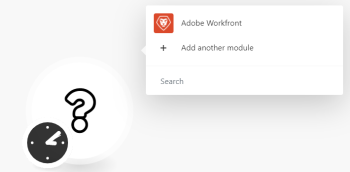
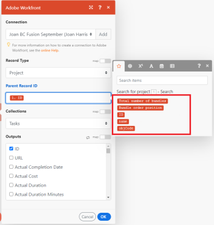

# Criar um cenário de automação de prática no [!DNL Adobe Workfront Fusion]

Este artigo descreve como criar um cenário de automação com o Adobe Workfront Fusion. Cenários de automação automatizam processos do Workfront, incluindo manipulação e transformação de dados. Esse exemplo orienta você pelo processo de criação de um cenário que pesquisa um projeto e retorna todas as tarefas associadas a esse projeto.

Para obter instruções sobre como criar um cenário de integração que conecta aplicativos separados, consulte [Criar um cenário de integração de prática no Adobe Workfront Fusion](../../workfront-fusion/get-started/create-a-practice-scenario.md).

Para obter mais informações sobre a funcionalidade disponível com cada licença do Workfront Fusion, consulte [Licenças do Adobe Workfront Fusion](../../workfront-fusion/get-started/license-automation-vs-integration.md).

## Requisitos de acesso

Você deve ter o seguinte acesso para usar a funcionalidade neste artigo:

<table style="table-layout:auto">
 <col> 
 <col> 
 <tbody> 
  <tr> 
   <td role="rowheader">[!DNL Adobe Workfront] plano*</td> 
   <td> 
[!DNL Pro] ou superior
 </td> 
  </tr> 
  <tr data-mc-conditions=""> 
   <td role="rowheader">[!DNL Adobe Workfront] licença*</td> 
   <td> 
[!UICONTROL Plano], [!UICONTROL Trabalho]
 </td> 
  </tr> 
  <tr> 
   <td role="rowheader">Licença [!UICONTROL Adobe Workfront Fusion]**</td> 
   <td>
   
Requisito de licença atual: Não [!DNL Workfront Fusion] requisito de licença.

   
Ou

   
Requisito de licença herdada: [!UICONTROL [!DNL Workfront Fusion] para Automação e integração do trabalho] 

   </td> 
  </tr> 
  <tr> 
   <td role="rowheader">Produto</td> 
   <td>
   
Requisito atual do produto: se você tiver o [!UICONTROL Select] ou o [!UICONTROL Prime] [!DNL Adobe Workfront] Planejar, sua organização deve comprar [!DNL Adobe Workfront Fusion] bem como [!DNL Adobe Workfront] para usar a funcionalidade descrita neste artigo. [!DNL Workfront Fusion] está incluído no [!UICONTROL Ultimate] [!DNL Workfront] plano.

   
Ou

   
Requisito de produto herdado: sua organização deve comprar [!DNL Adobe Workfront Fusion] bem como [!DNL Adobe Workfront] para usar a funcionalidade descrita neste artigo.

   </td> 
  </tr> 
 </tbody> 
</table>
Para descobrir que plano, tipo de licença ou acesso você tem, entre em contato com o [!DNL Workfront] administrador.

Para obter informações sobre [!DNL Adobe Workfront Fusion] licenças, consulte [[!DNL Adobe Workfront Fusion] licenças](../../workfront-fusion/get-started/license-automation-vs-integration.md).

## Criar um cenário de prática

O papel da [!DNL Adobe Workfront Fusion] O é automatizar seus processos para que você possa se concentrar em novas tarefas, em vez de repetir as mesmas tarefas repetidamente. Ele funciona vinculando ações em e entre aplicativos e serviços para criar um cenário que transfere e transforma seus dados automaticamente. O cenário que você cria observa dados em um aplicativo ou serviço e processa esses dados para fornecer o resultado desejado.

Um cenário é composto de uma série de módulos que indicam como os dados devem ser transformados em um aplicativo ou transferidos entre aplicativos e serviços da Web.
Este exemplo orienta você no processo de criação de um cenário que procura por um [!DNL Workfront] projeto e retorna as tarefas no projeto.

A criação de um cenário consiste em várias tarefas principais:

## Escolha os aplicativos e nomeie o cenário

1. Entre no seu [!DNL Workfront Fusion] conta.
1. Clique em **[!UICONTROL Cenários]**  no painel esquerdo.

   >[!NOTE]
   >
   >Se você não vir o painel de navegação esquerdo ou seus ícones, clique no botão  ícone.

   No cinza [!UICONTROL Pastas] que é exibido, você pode organizar seus cenários em pastas.

   Na parte superior da área principal à direita, é possível visualizar **[!UICONTROL Todos]** cenários que você criou, seu **[!UICONTROL Cenários ativos]**, **[!UICONTROL Cenários inativos]**, e **[!UICONTROL Conceitos]**. Conceitos são cenários que precisam de mais trabalho antes [!DNL Workfront Fusion] O pode classificá-los como ativos ou inativos.

<!--
   
-->

1. No [!UICONTROL Pastas] clique no botão **[!UICONTROL Adicionar pasta]** ícone , em seguida, digite um nome como &quot;Cenários de prática&quot; para a primeira pasta.

1. Abra a pasta e clique em **[!UICONTROL Criar um novo cenário]** no canto superior direito da página.

   A landing page que é exibida permite pré-carregar todos os aplicativos que você deseja usar no cenário que você vai criar.

1. Para este exercício, pesquise e selecione a variável **[!DNL Workfront]** aplicativo.
1. Clique em **[!UICONTROL Continuar]** no canto superior direito.

   O editor de cenários exibe, contendo um módulo vazio no centro, a variável [!DNL Workfront] aplicativo que você pré-carregou e algumas opções na barra de ferramentas na parte inferior.

<!--
   
-->

Quando você começar a criar um novo cenário, é uma boa ideia começar criando um nome para ele.

1. Selecione o **[!UICONTROL Novo cenário]** nome do espaço reservado no canto superior esquerdo e digite um nome como &quot;Cenário de prática 1&quot;.
1. Continuar com [Adicionar e configurar o primeiro módulo](#add-and-configure-the-first-module) abaixo.

## Adicionar e configurar o primeiro módulo

O módulo vazio com um ponto de interrogação representa o módulo acionador que você precisa adicionar. Esse módulo iniciará o cenário sempre que for executado. O ícone de relógio no módulo vazio indica que é um módulo agendado.

Este módulo conterá os dados que você deseja que o cenário observe.

Neste exemplo, não estamos usando um módulo acionador. Em vez disso, esse cenário começa com uma pesquisa.

1. Clique no módulo vazio para escolher o aplicativo do qual você selecionará um módulo.

   O aplicativo pré-carregado anteriormente é exibido ao lado do módulo vazio. É possível adicionar outros aplicativos que tenham módulos usando o [!UICONTROL Pesquisar] caixa.

   

1. Clique em **[!DNL Workfront]**.

   A lista muda para exibir tudo [!DNL Workfront] que você pode usar como módulo acionador.

1. Clique no módulo de pesquisa **[!UICONTROL Pesquisar]**.

   Agora, é necessário estabelecer uma conexão autenticada com o [!DNL Workfront] conta. Cada módulo adicionado a um cenário deve ter uma conexão com seu aplicativo.

1. No **[!DNL Workfront]** caixa, em **[!UICONTROL Conexão]**, clique em **[!UICONTROL Adicionar]**, digite um nome para a conexão, como &quot;Conta do Olivia no Workfront&quot; e clique em **[!UICONTROL Continuar]**.
1. Autentique a conexão na janela que é exibida.

   O processo para autenticar uma conexão pode variar um pouco entre os aplicativos. O processo a seguir é específico do [!DNL Workfront], mas o processo é semelhante a muitos aplicativos.

   1. Insira seu [!DNL Workfront] domínio e, em seguida, clique em **[!UICONTROL Continuar]**.
   1. Efetue logon no [!DNL Workfront].
   1. Examinar o acesso que [!DNL Workfront Fusion] está solicitando e clique em **[!UICONTROL Permitir acesso]**.

   Se precisar de ajuda, consulte [Sobre a conexão [!DNL Adobe Workfront Fusion] para um aplicativo ou serviço](../../workfront-fusion/connections/about-connecting-wf-fusion-to-app-or-service.md).

## Configurar o primeiro módulo

Depois que você se conectar [!DNL Workfront Fusion] ao seu [!DNL Workfront] conta, você pode especificar um [!DNL Workfront] fila de solicitações à qual você tem acesso e os dados nela que deseja que o primeiro módulo processe.

1. No [!UICONTROL Tipo de registro] , selecione **[!UICONTROL Projeto]**. Isso define o módulo para pesquisar somente projetos.

   >[!TIP]
   >
   >Você pode encontrar **[!UICONTROL Projeto]** na lista se você começar a digitar a palavra &quot;[!UICONTROL projeto].&quot;

1. No **[!UICONTROL Conjunto de resultados]** , selecione **[!UICONTROL Primeiro registro correspondente]**. Isso define o módulo para retornar somente o primeiro registro encontrado que atenda aos critérios. Neste exemplo, precisamos apenas de um registro retornado.
1. No **[!UICONTROL Critérios de pesquisa]** , configuraremos um filtro para retornar ao projeto específico.

   1. Na primeira caixa, em [!UICONTROL Critérios de pesquisa], selecione o campo no qual deseja pesquisar os valores. Para este exemplo, selecione **[!UICONTROL Nome]**.
   1. Para o operador, selecione [!UICONTROL Contém (não diferencia maiúsculas de minúsculas)]. Isso permite que o módulo encontre projetos com as palavras escolhidas em seu nome, mesmo se você não inserir o nome inteiro ou inserir o nome com a caixa incorreta (como todas em maiúsculas).
   1. No último campo em [!UICONTROL Critérios de pesquisa], digite uma palavra ou frase que você sabe que está no nome do projeto que está procurando.

1. No **[!UICONTROL Saídas]** selecione os campos que devem ser gerados para a ocorrência. Para este exemplo, selecione a variável **[!UICONTROL ID]** e **[!UICONTROL Nome]** campos.

   >[!TIP]
   >
   >Você pode usar **Cmd+F** ([!DNL Mac] OS) ou **Ctrl-F** ([!DNL Windows] OS) para localizar um campo rapidamente.

1. Clique em **[!UICONTROL OK]**.

   >[!NOTE]
   >
   >(Somente informações) Como esse não é um módulo acionador, você não escolhe onde iniciá-lo. Ao usar um módulo de acionador, você agora selecionaria onde iniciá-lo.
   >
   >
   >Para obter mais informações, consulte [Escolha onde um módulo de acionador começa em [!DNL Adobe Workfront Fusion]](../../workfront-fusion/modules/choose-where-trigger-module-starts.md).

1. Clique com o botão direito do mouse no módulo e clique em **[!UICONTROL Renomear]**, digite um nome que descreva o que você deseja que o módulo faça (como &quot;Pesquisar por projeto&quot;) e clique em **[!UICONTROL OK]**.

   O nome aparece logo abaixo do módulo. Abaixo disso, [!DNL Workfront Fusion] O inclui uma breve descrição do tipo de ação executada pelo módulo.

   

1. Continuar com [Adicionar e configurar o segundo módulo](#add-and-configure-the-second-module).

## Adicionar e configurar o segundo módulo

1. Clique no círculo parcial à direita do do módulo para **[!UICONTROL Adicionar outro módulo]**.
1. Selecionar [!DNL Workfront] na lista de aplicativos, escolha o módulo de pesquisa **[!UICONTROL Ler registros relacionados]**.
1. Você já criou uma conexão com [!DNL Workfront] para o módulo anterior. Não é necessário criá-lo novamente aqui, mas você deve verificar se esse módulo está usando a mesma conexão que o módulo anterior.\
   No **[!UICONTROL Conexão]** selecione a conexão criada para o módulo anterior.
1. Clique em **[!UICONTROL Tipo de registro]** e selecione **[!UICONTROL Projeto]**, pois queremos ler registros relacionados a um projeto.

   >[!TIP]
   >
   >Você pode encontrar **[!UICONTROL Projeto]** na lista se você começar a digitar a palavra &quot;projeto&quot;.

1. Clique em **[!UICONTROL ID do Registro Pai]** campo. Este campo requer a Workfront ID do projeto do qual você deseja retornar tarefas.

   Clicar no campo abre a lista de variáveis que podem ser usadas na variável **[!UICONTROL ID do Registro Pai]** para identificar o projeto no Workfront.

   

1. Clique na variável **[!UICONTROL ID]** para adicioná-lo à **[!UICONTROL ID do Registro Pai]** campo. Isso permite que a ID retornada do primeiro módulo seja usada como o identificador do projeto com o qual você deseja trabalhar no segundo módulo, o que garante que as tarefas retornadas pertençam a esse projeto.
1. No **[!UICONTROL Coleções]** selecione **[!UICONTROL Tarefas]**. Isso indica que o módulo retornará tarefas associadas ao projeto escolhido.
1. Clique em **[!UICONTROL OK]**

   Agora você tem um cenário de trabalho.

1. Dê um nome ao segundo módulo, como &quot;Retornar tarefas associadas ao projeto&quot;, e continue com [Testar o cenário](#test-the-scenario).

## Testar o cenário

Antes de ativar o cenário, é importante testá-lo executando-o pelo menos uma vez e visualizando os resultados. Isso ajuda você a entender como os dados fluem pelo cenário e encontrar erros.

Escolhemos ter 1 projeto retornado, bem como as tarefas associadas a esse projeto. Se você executar o cenário, isso é o que deve acontecer.

1. Clique em **[!UICONTROL Executar uma vez]** no canto inferior esquerdo do editor de cenários.
1. Depois que o cenário terminar de ser executado, clique no balão acima do primeiro módulo.

   

   Na caixa que aparece, você pode visualizar informações sobre o pacote de dados que o módulo processou, incluindo os dados reais que foram obtidos do projeto que o módulo retornou.

   

1. Clique na bolha do inspetor de execução acima do Segundo módulo para ver a entrada de informações e a saída, que é uma coleção de tarefas contidas no projeto.

   

   Você pode saber mais sobre como ler as informações de execução do cenário nos seguintes artigos:

   * Para obter informações gerais, consulte [Fluxo de execução de cenário em [!DNL Adobe Workfront Fusion]](../../workfront-fusion/scenarios/scenario-execution-flow.md).
   * Para obter informações sobre pacotes processados, consulte [Execução de cenário, ciclos e fases em [!DNL Adobe Workfront Fusion]](../../workfront-fusion/scenarios/scenario-execution-cycles-phases.md).

1. Entrada [!DNL Workfront Fusion], clique em **[!UICONTROL Salvar]**  próximo ao canto inferior esquerdo para salvar seu progresso no cenário.

   >[!IMPORTANT]
   >
   >Salve com frequência à medida que você aprimora e testa um cenário.

>[!TIP]
>
>Recomendamos a prática opcional, mas útil, de adicionar observações sobre cada módulo.
>
>1. Clique com o botão direito do mouse em uma [!DNL Workfront] e clique em **[!UICONTROL Adicionar uma observação]**.
>1. Na nota exibida, digite uma visão geral do módulo.
>
>    Você pode adicionar várias notas para um módulo.
>
>1. Feche o **[!UICONTROL Notas]** área.
>
>     Depois de adicionar uma nota a um cenário, um ponto laranja é exibido no **[!UICONTROL Notas]** ícone  na parte inferior do editor de cenários.
>
>1. Clique em **[!UICONTROL Notas]** ícone  para exibir suas notas.
>

## Ativar o cenário

Este cenário de exemplo não tem um módulo acionador. Se esse fosse um cenário usado para dados reais, ele começaria com um módulo de acionamento e a última coisa que você faria é ativá-lo. Após ativar um cenário, por padrão, ele é executado a cada 15 minutos. Você pode alterar isso definindo quando e com que frequência deseja que ele seja executado.

Para obter mais informações sobre a ativação de cenários, consulte [Ativar ou desativar um cenário no [!UICONTROL Adobe Workfront Fusion]](../../workfront-fusion/scenarios/activate-or-inactivate-scenario.md).

Para obter informações sobre programações, consulte [Agendar um cenário no [!UICONTROL Adobe Workfront Fusion]](../../workfront-fusion/scenarios/schedule-a-scenario.md).
