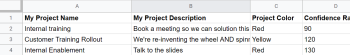
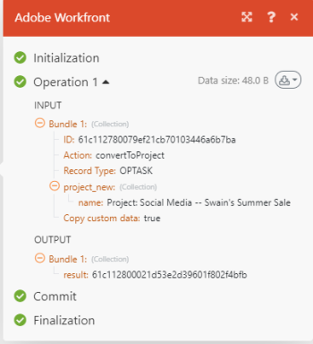

# Criar um cenário de integração de prática no Adobe Workfront Fusion

Este artigo descreve como criar um cenário de integração com o Adobe Workfront Fusion. Os cenários de integração conectam aplicativos separados, permitindo que seus dados fluam por diferentes aplicativos.

Para criar um cenário de integração, sua organização deve ter uma [!DNL Workfront Fusion for Work Automation and Integration] licença.

Para obter instruções sobre como criar um cenário de automação somente com o Workfront, consulte [Criar um cenário de automação de prática no Adobe Workfront Fusion](../../workfront-fusion/get-started/create-a-practice-automation-scenario.md)

Para obter mais informações sobre licenças do Workfront Fusion, consulte [Licenças do Adobe Workfront Fusion](../../workfront-fusion/get-started/license-automation-vs-integration.md).

>[!NOTE]
>
>Sua organização pode não permitir o acesso às Planilhas do Google. Se esse for o caso, você não poderá configurar essa integração, mas as informações apresentadas aqui podem ser usadas como um exemplo geral de como os cenários de integração funcionam.

## Requisitos de acesso

Você deve ter o seguinte acesso para usar a funcionalidade neste artigo:

<table style="table-layout:auto"> 
 <col> 
 <col> 
 <tbody> 
  <tr> 
    <td role="rowheader">[!DNL Adobe Workfront] plano*</td> 
   <td> 
[!DNL Pro] ou superior
 </td> 
  </tr> 
  <tr data-mc-conditions=""> 
   <td role="rowheader">[!DNL Adobe Workfront] licença*</td> 
   <td> 
[!UICONTROL Plano], [!UICONTROL Trabalho]
 </td> 
  </tr> 
  <tr> 
   <td role="rowheader">Licença [!UICONTROL Adobe Workfront Fusion]**</td> 
   <td>
   
Requisito de licença atual: Não [!DNL Workfront Fusion] requisito de licença.

   
Ou

   
Requisito de licença herdada: [!UICONTROL [!DNL Workfront Fusion] para Automação e integração do trabalho] 

   </td> 
  </tr> 
  <tr> 
   <td role="rowheader">Produto</td> 
   <td>
   
Requisito atual do produto: se você tiver o [!UICONTROL Select] ou o [!UICONTROL Prime] [!DNL Adobe Workfront] Planejar, sua organização deve comprar [!DNL Adobe Workfront Fusion] bem como [!DNL Adobe Workfront] para usar a funcionalidade descrita neste artigo. [!DNL Workfront Fusion] está incluído no [!UICONTROL Ultimate] [!DNL Workfront] plano.

   
Ou

   
Requisito de produto herdado: sua organização deve comprar [!DNL Adobe Workfront Fusion] bem como [!DNL Adobe Workfront] para usar a funcionalidade descrita neste artigo.

   </td> 
  </tr> 
 </tbody> 
</table>

Para descobrir que plano, tipo de licença ou acesso você tem, entre em contato com o [!DNL Workfront] administrador.

Para obter informações sobre [!DNL Adobe Workfront Fusion] licenças, consulte [[!DNL Adobe Workfront Fusion] licenças](../../workfront-fusion/get-started/license-automation-vs-integration.md).

## Criar um cenário de prática

O papel da [!DNL Adobe Workfront Fusion] O é automatizar seus processos para que você possa se concentrar em novas tarefas, em vez de repetir as mesmas tarefas repetidamente. Ele funciona vinculando ações em e entre aplicativos e serviços para criar um cenário que transfere e transforma seus dados automaticamente. O cenário que você cria observa dados em um aplicativo ou serviço e processa esses dados para fornecer o resultado desejado.

Um cenário é composto de uma série de módulos que indicam como os dados devem ser transformados em um aplicativo ou transferidos entre aplicativos e serviços da Web.

Para explicar como criar um cenário e reforçar as práticas recomendadas ao aprender a usar o [!DNL Workfront Fusion], este artigo o orienta pelo processo passo a passo. Criaremos um cenário que cria um novo registro no [!DNL Workfront] para cada linha em uma [!DNL Google Sheets] planilha eletrônica.

>[!TIP]
>
>Um cenário como esse seria útil se você tivesse uma planilha que listasse projetos que precisam ser trabalhados usando projetos no [!DNL Workfront]. O cenário pode &quot;observar&quot; a planilha em busca de novas linhas e adicionar um novo projeto no [!DNL Workfront] para cada um.

A criação de um cenário consiste em várias tarefas principais:

## Escolha os aplicativos e nomeie o cenário

1. Baixar este [planilha](https://cdn.experience.workfront.com/Documentation/Workfront+Fusion/Fusion+Practice+Scenario+Sample+Sheet.xlsx), em seguida, carregue-o no seu [!DNL Google Drive] para uso durante este exercício.

   Ou

   Crie ou encontre seu próprio simples [!DNL Google Sheets] planilha semelhante a esta:

   

1. Entre no seu [!DNL Workfront Fusion] conta.
1. Clique em **[!UICONTROL Cenários]**  no painel esquerdo.

   >[!NOTE]
   >
   >Se você não vir o painel de navegação esquerdo ou seus ícones, clique no botão  ícone.

   No cinza [!UICONTROL Pastas] que é exibido, você pode organizar seus cenários em pastas.

   Na parte superior da área principal à direita, é possível visualizar **[!UICONTROL Todos]** cenários que você criou, seu **[!UICONTROL Cenários ativos]** e **[!UICONTROL Cenários inativos]**, e **[!UICONTROL Conceitos]**, que são cenários que precisam de mais trabalho antes [!DNL Workfront Fusion] O pode classificá-los como ativos ou inativos.

<!--
   
-->

1. No [!UICONTROL Pastas] clique no botão **[!UICONTROL Adicionar pasta]** ícone , em seguida, digite um nome como &quot;Cenários de prática&quot; para a primeira pasta.

1. Abra a pasta e clique em **[!UICONTROL Criar um novo cenário]** no canto superior direito da página.

   A landing page que é exibida permite pré-carregar todos os aplicativos que você deseja usar no cenário que você vai criar.

1. Para este exercício, pesquise e selecione a variável **[!UICONTROL Planilhas Google]** aplicativo.
1. Clique em **[!UICONTROL Continuar]** no canto superior direito.

   O editor de cenários exibe, contendo um módulo vazio no centro, a variável [!DNL Google Sheets] aplicativo que você pré-carregou e algumas opções na barra de ferramentas na parte inferior.

<!--
   
-->

Quando você começar a criar um novo cenário, é uma boa ideia começar criando um nome para ele.

1. Selecione o **[!UICONTROL Novo cenário]** nome do espaço reservado no canto superior esquerdo e digite um nome como &quot;Cenário de prática 1&quot;.
1. Continuar com [Adicionar e configurar o primeiro módulo](#add-and-configure-the-first-module) abaixo.

## Adicionar e configurar o primeiro módulo

O módulo vazio com um ponto de interrogação representa o módulo acionador que você precisa adicionar. Esse módulo iniciará o cenário sempre que for executado. O ícone de relógio no módulo vazio indica que é um módulo agendado.

Este módulo conterá os dados que você deseja que o cenário observe.

1. Clique no módulo vazio para escolher o aplicativo do qual você selecionará um módulo.

   O aplicativo pré-carregado anteriormente é exibido ao lado do módulo vazio. É possível adicionar outros aplicativos que tenham módulos usando o [!UICONTROL Pesquisar] caixa.

   

1. Clique em **[!DNL Google Sheets]**.

   A lista muda para exibir tudo [!DNL Google Sheets] que você pode usar como módulo acionador.

1. Clique no módulo acionador **[!UICONTROL Aguardar Registros]**.

   Agora é necessário estabelecer uma conexão autenticada com sua conta do Google. Cada módulo adicionado a um cenário deve ter uma conexão com seu aplicativo.

1. No **[!DNL Google Sheets]** caixa, em **[!UICONTROL Conexão]**, clique em **[!UICONTROL Adicionar]**, digite um nome para a conexão, como &quot;Conta do Olivia no Google&quot; e clique em **[!UICONTROL Continuar]**.
1. Autentique a conexão na janela que é exibida.

   O processo para autenticar uma conexão pode variar um pouco entre os aplicativos. Talvez seja necessário fazer logon no aplicativo. Normalmente, é necessário clicar em um **[!UICONTROL Permitir]** botão. Se precisar de ajuda, consulte [Sobre a conexão [!DNL Adobe Workfront Fusion] para um aplicativo ou serviço](../../workfront-fusion/connections/about-connecting-wf-fusion-to-app-or-service.md).

## Configurar o primeiro módulo

Depois que você se conectar [!DNL Workfront Fusion] ao seu [!DNL Google Sheets] conta, você pode especificar um [!DNL Google Sheets] planilha que você tem acesso e os dados que deseja que o primeiro módulo processe.

1. Clique em **[!UICONTROL Planilha]** e selecione o **[!UICONTROL Cenário de prática do Workfront Fusion] #1** na lista exibida.

   Esta planilha contém 2 planilhas (guias), portanto, precisamos especificar qual planilha contém os dados desejados:

1. No **[!UICONTROL Planilha]** selecione **[!UICONTROL Projetos]**.

   Nossa planilha contém cabeçalhos e queremos que o módulo os use para identificar os dados que queremos processar:

   

1. Sair **[!UICONTROL Sim]** selecionado para **[!UICONTROL A tabela contém cabeçalhos]**.

1. No **[!UICONTROL Linha com cabeçalhos]** você poderia especificar um intervalo de linhas que deseja incluir, mas vamos deixar o padrão A1:Z1 aqui para este exercício.
1. No **[!UICONTROL Limite]** , digite 1.

   Dessa forma, sempre que você executar o cenário, o módulo processará apenas uma linha na planilha. Isso é útil para simplificar suas execuções de teste enquanto você está criando o cenário.

1. Clique em **[!UICONTROL OK]**.

   A variável **[!UICONTROL Escolher onde começar]** A caixa solicita que você especifique onde deseja que o módulo inicie o processamento na planilha.

1. Clique em **[!UICONTROL Escolher manualmente]**, selecione a opção superior na lista exibida e clique em **[!UICONTROL OK]**.
1. Clique com o botão direito do mouse no módulo e clique em **[!UICONTROL Renomear]**, em seguida, digite um nome que descreva o que você deseja que o módulo faça (como &quot;Assista à lista do projeto&quot;) e clique em **[!UICONTROL OK]**.

   O nome aparece logo abaixo do módulo. Abaixo disso, [!DNL Workfront Fusion] O inclui uma breve descrição do tipo de ação executada pelo módulo.

   

1. Continuar com [Adicionar e configurar o segundo módulo](#add-and-configure-the-second-module).

## Adicionar e configurar o segundo módulo

1. Clique no círculo parcial à direita do do módulo para **[!UICONTROL Adicionar outro módulo]**.

   Esse segundo módulo precisa ser um [!DNL Workfront] módulo, mas não pré-carregamos o [!DNL Workfront] aplicativo.

1. Para encontrar o [!DNL Workfront] aplicativo, comece a digitar &quot;[!DNL Workfront]&quot; e clique no aplicativo quando ele aparecer.
1. Na lista de [!DNL Workfront] que for exibido, clique em **[!UICONTROL Criar registro]**.

1. Como você fez antes com o aplicativo Google Sheets, clique em **[!UICONTROL Adicionar]** no [!DNL Workfront] para adicionar uma conexão entre o Workfront Fusion e o Workfront.

   Agora começaremos a especificar o que queremos fazer com os dados da planilha.

1. Clique em **[!UICONTROL Tipo de registro]** e selecione **[!UICONTROL Projeto]** porque queremos criar um projeto no [!DNL Workfront] usando uma linha da planilha.

   >[!TIP]
   >
   >Você pode encontrar **[!UICONTROL Projeto]** na lista se você começar a digitar a palavra &quot;[!UICONTROL projeto].&quot;

   A caixa é expandida para exibir todas as opções disponíveis [!DNL Workfront] campos do projeto onde você pode colocar as informações encontradas pelo primeiro módulo.

   Vamos usar o **[!UICONTROL Nome]** campo: queremos que esse módulo nomeie cada projeto em [!DNL Workfront] usando o texto no correspondente [!UICONTROL Planilhas Google] linha.

1. Localize e clique no link **[!UICONTROL Nome]** campo.

   >[!TIP]
   >
   >Você pode usar **Cmd+F** ([!DNL Mac] OS) ou **Ctrl-F**([!DNL Windows] OS) para localizar um campo rapidamente.

   Essa ação abre a lista de variáveis que podem ser usadas no **[!UICONTROL Nome]** para definir o nome de cada projeto criado no Workfront.

   

   Observe que as variáveis próximas à parte superior da lista correspondem aos cabeçalhos das colunas na planilha.

   

   

1. Clique na variável **[!UICONTROL Nome do Meu Projeto (A)]** para adicioná-lo à **[!UICONTROL Nome]** campo.

   Você acabou de mapear os primeiros dados para esse cenário.

   Vamos mapear mais um dado da planilha para [!DNL Workfront]: a data de início de cada projeto.

1. Localize e clique no link **[!UICONTROL Data de Início Planejada]** e clique no botão **[!UICONTROL Data de Início Planejada (E)]** para obter dados dessa coluna na planilha.

1. Clique em **[!UICONTROL OK]**.

   Agora você tem um cenário de trabalho.

1. Dê um nome ao segundo módulo, como &quot;Criar projeto do Workfront&quot;, e continue com [Testar o cenário](#test-the-scenario).

## Testar o cenário

Antes de ativar o cenário, é importante testá-lo executando-o pelo menos uma vez e visualizando os resultados. Isso ajuda você a entender como os dados fluem pelo cenário e encontrar erros.

Escolhemos ter uma linha da planilha processada para criar um projeto no Workfront. Se você executar o cenário, isso é o que deve acontecer.

1. Clique em **[!UICONTROL Executar uma vez]** no canto inferior esquerdo do editor de cenários.
1. Depois que o cenário terminar de ser executado, clique na bolha acima da [!DNL Google Sheets] módulo.

   

   Na caixa que aparece, você pode exibir informações sobre o pacote de dados que o módulo processou, incluindo os dados reais que foram extraídos da planilha para a linha com a qual você começou.

   

1. Clique na bolha do inspetor de execução acima da [!DNL Workfront] para ver a entrada de informações e a saída, que é a ID do projeto agora criado no [!DNL Workfront]

   

   Você pode saber mais sobre como ler as informações de execução do cenário nos seguintes artigos:

   * Para obter informações gerais, consulte [Fluxo de execução de cenário em [!DNL Adobe Workfront Fusion]](../../workfront-fusion/scenarios/scenario-execution-flow.md).
   * Para obter informações sobre pacotes processados, consulte [Execução de cenário, ciclos e fases em [!DNL Adobe Workfront Fusion]](../../workfront-fusion/scenarios/scenario-execution-cycles-phases.md).

1. Ir para [!DNL Workfront] e procure por &quot;soho centro loft&quot; para ver o projeto que o cenário criou. Esta foi a última linha da planilha.
1. Entrada [!DNL Workfront Fusion], clique em **[!UICONTROL Salvar]**  próximo ao canto inferior esquerdo para salvar seu progresso no cenário.

   >[!IMPORTANT]
   >
   >Salve com frequência à medida que você aprimora e testa um cenário.

## Finalize o cenário e teste-o novamente

Ainda precisamos configurar o cenário para criar projetos para todas as outras linhas na planilha.

1. Clique em **[!UICONTROL Observar linhas]** que você criou para o Google Sheets.
1. Altere o **[!UICONTROL Limite]** a 100.

   Especificar um número maior do que o número de linhas que você sabe que estão na planilha garante que o cenário capturará todas elas.

1. Clique com o botão direito do mouse no **[!UICONTROL Observar linhas]** , clique em **[!UICONTROL Escolher onde começar]**, clique em **[!UICONTROL Todos]** e, em seguida, clique em **[!UICONTROL OK]**.

1. Clique em **[!UICONTROL Executar uma vez]** e observe o que acontece nas bolhas do inspetor de execução.

   A variável [!DNL Google] Planilhas **[!UICONTROL Observar linhas]** O módulo é executado uma vez para ler todas as linhas. Em seguida, o Workfront **[!UICONTROL Criar registro]** O módulo é executado 20 vezes para criar um projeto para cada uma das 20 linhas restantes na planilha.

1. Clique na bolha do inspetor de execução para a [!DNL Workfront] para exibir todas as 20 operações, clique em uma das operações para exibir as informações sobre o projeto criado.
1. Clique em **[!UICONTROL Salvar]**  próximo ao canto inferior esquerdo.
1. Ir para [!DNL Workfront] para ver os projetos criados pelo cenário.

>[!TIP]
>
>Recomendamos a prática opcional, mas útil, de adicionar observações sobre cada módulo.
>
>1. Clique com o botão direito do mouse no [!DNL Workfront] e clique em **[!UICONTROL Adicionar uma observação]**.
>1. Na nota exibida, digite uma visão geral do módulo.
>
>    Isso é útil porque você não precisará abrir o módulo continuamente para ver o que ele faz. Você pode digitar algo como &quot;Cria um projeto com Nome, Data de início planejada e Prioridade mapeada da planilha&quot;.
>
>    Para o [!UICONTROL Planilhas Google] você poderia digitar algo como &quot;Assistir lista de projetos para novas linhas/projetos adicionados&quot;.
>
>    Você pode adicionar várias notas para um módulo.
>
>1. Feche o **[!UICONTROL Notas]** área.
>
>    Depois de adicionar uma nota a um cenário, um ponto laranja é exibido no **[!UICONTROL Notas]** ícone  na parte inferior do editor de cenários.
>
>1. Clique em **[!UICONTROL Notas]** ícone  para exibir suas notas.
>

## Ativar o cenário

Se esse fosse um cenário que você usaria para dados reais, a última coisa que faria seria ativá-lo. Após ativar um cenário, por padrão, ele é executado a cada 15 minutos. Você pode alterar isso definindo quando e com que frequência deseja que ele seja executado.

Para obter mais informações sobre a ativação de cenários, consulte [Ativar ou desativar um cenário no Adobe Workfront Fusion](../../workfront-fusion/scenarios/activate-or-inactivate-scenario.md).

Para obter informações sobre programações, consulte [Programar um cenário no Adobe Workfront Fusion](../../workfront-fusion/scenarios/schedule-a-scenario.md).
