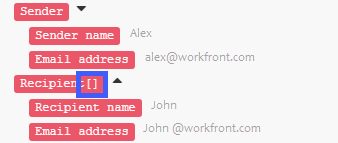
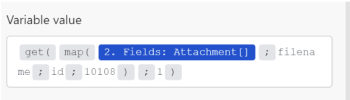

# Mapear informações de um módulo para outro no [!DNL Adobe Workfront Fusion]

O mapeamento é o processo de atribuição de saídas de um módulo, estruturadas em itens, a campos de entrada de outro módulo.

O painel de mapeamento é exibido ao clicar em um campo no qual você deseja inserir um valor de saída de um módulo anterior em um cenário. Em um módulo, em qualquer campo disponível para mapeamento, é possível criar uma fórmula usando qualquer combinação de funções e itens mapeados do painel de mapeamento com o texto estático digitado. Esses elementos podem ser aninhados entre si.

## Requisitos de acesso

Você deve ter o seguinte acesso para usar a funcionalidade neste artigo:

<table style="table-layout:auto">
 <col> 
 <col> 
 <tbody> 
  <tr> 
    <td role="rowheader">[!DNL Adobe Workfront] plano*</td> 
   <td> 
[!DNL Pro] ou superior
 </td> 
  </tr> 
  <tr data-mc-conditions=""> 
   <td role="rowheader">[!DNL Adobe Workfront] licença*</td> 
   <td> 
[!UICONTROL Plano], [!UICONTROL Trabalho]
 </td> 
  </tr> 
  <tr> 
   <td role="rowheader">Licença da [!UICONTROL Adobe Workfront Fusion]**</td> 
   <td> 
[!UICONTROL [!DNL Workfront Fusion] para automação e integração de trabalho] 
  </td> 
  </tr> 
  <tr> 
   <td role="rowheader">Produto</td> 
   <td>Sua organização deve comprar [!DNL Adobe Workfront Fusion] bem como [!DNL Adobe Workfront] para usar a funcionalidade descrita neste artigo.</td> 
  </tr> 
 </tbody> 
</table>

Para descobrir qual plano, tipo de licença ou acesso você tem, entre em contato com seu [!DNL Workfront] administrador.

Para obter informações sobre [!DNL Adobe Workfront Fusion] licenças, consulte [[!DNL Adobe Workfront Fusion] licenças](../../workfront-fusion/get-started/license-automation-vs-integration.md).

## Pacotes e itens

A operação de um módulo produz zero, um ou mais pacotes como sua saída. Um pacote consiste em um ou mais itens.

Para explorar a saída de um módulo:

1. Clique em **[!UICONTROL Executar uma vez]** para executar o módulo.
1. Clique na bolha acima do módulo.

   Um log contendo todas as fases do módulo é exibido. Você pode encontrar o pacote ou os pacotes gerados pela fase de operação de um módulo sob o **[!UICONTROL Saída]** cabeçalho. Cada pacote contém seus itens e os valores de cada item.

>[!INFO]
>
>**Exemplo:** Este exemplo mostra o módulo [!UICONTROL Email] > [!UICONTROL Assistir a emails]. Você pode ver que ele executou uma operação produzindo um único pacote que contém vários itens, como `Date`, `Email ID (UID)`, `size`e assim por diante.
>
>

>[!NOTE]
>
>As saídas dos módulos vinculadas entre um [!UICONTROL Iterador] e [!UICONTROL Agregador] não estão acessíveis além do [!UICONTROL Agregador] módulo.

## Mapear um item

Após criar uma sequência de módulos vinculando dois ou mais deles, cada módulo poderá processar valores de itens gerados pelos módulos que a precedem.

Para atribuir os itens aos campos de entrada de um módulo:

1. Clique no módulo que deve processar a saída do(s) módulo(s) anterior(es).
1. No painel Configurações do módulo que é exibido, clique em um campo no qual você deseja usar o valor de um item enviado de um módulo anterior.

   O painel de mapeamento é aberto.

1. Clique em um item no painel de mapeamento para inseri-lo no campo.
1. (Opcional) Para pesquisar um campo específico no painel de mapeamento, clique na barra de pesquisa do painel de mapeamento e digite o termo que deseja pesquisar. Clique no campo quando ele aparecer na lista.

   Os resultados da pesquisa contêm o termo de pesquisa e não diferenciam maiúsculas de minúsculas.

Para obter mais informações, consulte [Defina as configurações de um módulo em [!DNL Adobe Workfront Fusion]](../../workfront-fusion/modules/configure-a-modules-settings.md).

## Fórmulas

Você pode mapear vários itens em um campo, combiná-los com literais (valores fixos) e empregar Operadores e Funções para criar fórmulas complexas:

Você pode encontrar as funções e os operadores no painel de mapeamento em uma de suas guias.

A primeira guia  (mostrado ao abrir o painel) exibe os itens que você pode mapear de outros módulos.

As outras guias contêm os seguintes tipos de funções:

* **Funções gerais**  - Consulte [Funções gerais em [!DNL Adobe Workfront Fusion]](../../workfront-fusion/functions/general-functions.md) para obter mais informações.

* **Funções matemáticas**  - Consulte [Funções matemáticas em [!DNL Adobe Workfront Fusion]](../../workfront-fusion/functions/math-functions.md) para obter mais informações.

* **Funções binárias e de texto**  - Consulte [Funções de string em [!DNL Adobe Workfront Fusion]](../../workfront-fusion/functions/string-functions.md) para obter mais informações.

* **Data e hora**  - Consulte [Funções de data e hora em [!DNL Adobe Workfront Fusion]](../../workfront-fusion/functions/date-and-time-functions.md) e os artigos abaixo para obter mais informações.

   * [Tokens para formatação de data e hora em [!DNL Adobe Workfront Fusion]](../../workfront-fusion/functions/tokens-for-date-and-time-formatting.md)
   * [Tokens para análise de data e hora no Adobe Workfront Fusion](../../workfront-fusion/functions/tokens-for-date-and-time-parsing.md)

* **Funções para trabalhar com arrays**  - Consulte [Funções de matriz em [!DNL Adobe Workfront Fusion]](../../workfront-fusion/functions/array-functions.md) para obter mais informações.

>[!TIP]
>
>Ao criar uma fórmula complexa que deseja reutilizá-la em outro campo, clique no campo que contém a combinação, use Command-A ou Ctrl-A para selecioná-la, em seguida, copie e cole no outro campo.

Para obter mais informações sobre o mapeamento de itens usando funções, consulte [Mapear itens usando funções no [!DNL Adobe Workfront Fusion]](../../workfront-fusion/functions/map-using-functions.md).

## Coleções

Alguns itens podem conter vários valores de vários tipos. Esses são itens do tipo coleção.

Você pode identificar uma [!UICONTROL coleção] digite item pelo pequeno retângulo preto exibido à direita do rótulo do item e sua lista expandida automaticamente de subitens:

>[!NOTE]
>
>Na maioria dos casos, você mapeia os subitens da coleção em vez do item que representa a coleção inteira.

Para obter mais informações sobre coleções, consulte [Tipos de dados de item em [!UICONTROL Adobe Workfront Fusion]](../../workfront-fusion/mapping/item-data-types.md)

## Matrizes

Alguns itens podem conter vários elementos do mesmo tipo. Esses são itens do tipo matriz.

Você pode identificar um item do tipo matriz por colchetes no final do rótulo do item. Clique no pequeno retângulo preto à direita do rótulo do item para revelar os itens do elemento:

Para obter mais informações sobre arrays, consulte [Tipos de dados de item em [!DNL Adobe Workfront Fusion]](../../workfront-fusion/mapping/item-data-types.md)

### Mapear o primeiro elemento de uma matriz

Se você mapear um `Recipient name` , ele é exibido no campo assim:

O número entre colchetes é um índice que determina qual elemento da matriz será usado. É definido como 1 por padrão.

### Mapear o n-º elemento de uma matriz

Se quiser acessar outro elemento, clique nos colchetes e edite o valor do índice:

### Mapear o elemento de uma matriz com uma determinada chave

Algumas matrizes contêm várias coleções com itens de chave e valor. Normalmente, são vários metadados, atributos e assim por diante.

O exemplo a seguir mostra a saída do [!DNL Jira] Aplicativo.

Neste exemplo, obtemos um nome de arquivo de uma matriz de anexos para o anexo específico com uma ID 10108.

A saída de [!DNL Jira] tem esta aparência:

O requisito típico é procurar um elemento pelo seu valor de chave fornecido e obter o valor correspondente do item de valor. Isso pode ser feito com uma fórmula que empregue uma combinação da variável `map()` e `get()` funções.

Segue-se uma discriminação detalhada da fórmula:

1. O primeiro parâmetro da variável `map()` é o item de matriz inteiro.
1. O segundo parâmetro é o nome bruto do item de valor. Para obter o nome bruto, passe o mouse sobre o item no [!UICONTROL mapeamento] painel:

   

   >[!NOTE]
   >
   >Todos os parâmetros fazem distinção entre maiúsculas e minúsculas. Mesmo que neste exemplo específico o rótulo do item difira de seu nome bruto somente em maiúsculas, é necessário usar o nome bruto, que é todo um valor em minúsculas em contraste com o valor do rótulo.

1. O terceiro parâmetro é o nome bruto do item chave:

   

1. O quarto parâmetro é o valor de chave fornecido.

Porque a variável `map()` retorna uma matriz (como pode haver mais elementos com o valor de chave fornecido), é necessário aplicar a variável `get()` para obter seu primeiro elemento:

* O primeiro parâmetro do `get()` é o resultado da variável `map()` .

* O segundo parâmetro é o índice do elemento - um.

Para obter mais informações sobre o `map()` , consulte [Funções de matriz em [!DNL Adobe Workfront Fusion]](../../workfront-fusion/functions/array-functions.md).

Para obter mais informações sobre o `get()` , consulte [Funções gerais em [!DNL Adobe Workfront Fusion]](../../workfront-fusion/functions/general-functions.md).

## Conversão de elementos em uma série de pacotes

As matrizes podem ser convertidas em uma série de pacotes usando o [!UICONTROL Iterador] módulo. Para obter mais informações, consulte [[!UICONTROL Iterador] módulo em [!UICONTROL Adobe Workfront Fusion]](../../workfront-fusion/modules/iterator-module.md).

## Solução de problemas

### Itens ausentes no painel de mapeamento

Para cada módulo, o painel de mapeamento exibe todos os itens de saída, listados pelo autor do módulo. Em alguns casos, essa lista pode estar incompleta por vários motivos, e alguns itens podem estar ausentes. [!DNL Workfront Fusion] O pode descobrir automaticamente os itens de saída ausentes ao executar o módulo no editor de cenários. O procedimento exato difere um pouco dependendo do tipo do módulo:

#### Acionador instantâneo

1. Clique com o botão direito do mouse no módulo e depois clique em **[!UICONTROL Executar este módulo somente]** no menu exibido.

   Se não houver webhooks na fila, o módulo aguarda o processamento de um novo webhook.

1. Gere um webhook.

   Por exemplo, o módulo webhook **[!DNL Slack]>[!UICONTROL Analisar novos eventos]** (que observa novas mensagens de canal em um canal) envia uma mensagem para o canal.

1. Quando o módulo terminar de ser executado, clique na bolha acima do módulo para explorar sua saída completa.

   O painel de mapeamento conterá todos os itens que foram descobertos na saída do módulo.

#### Acionador de sondagem

1. Clique com o botão direito do mouse no módulo e depois clique em **[!UICONTROL Executar este módulo somente]** no menu exibido.
1. Se não houver saída, clique em **[!UICONTROL Escolha onde começar]** e ajuste as configurações.
1. Se não houver um evento a ser processado, crie um e volte para a etapa 2.

   Por exemplo, o módulo webhook **[!UICONTROL Gmail] >[!UICONTROL Assistir a emails]** envia um email para a pasta que o módulo está assistindo.

1. Quando o módulo terminar de ser executado, clique na bolha acima do módulo para explorar sua saída completa.

   O painel de mapeamento agora contém todos os itens que foram descobertos na saída do módulo.

#### Outros módulos

Você pode optar por executar:

* O cenário inteiro (ou apenas a parte que contém o módulo)

   Se o cenário começar com um acionador, consulte [Acionador instantâneo](#instant-trigger) ou [Acionador de sondagem](#polling-trigger) acima.

* Apenas o módulo único

Se optar por executar apenas o módulo único:

1. Clique com o botão direito do mouse no módulo e depois clique em **[!UICONTROL Executar este módulo somente]** no menu exibido.
1. Forneça valores de amostra para os itens de entrada, em seguida, clique em **[!UICONTROL OK]** .
1. Quando o módulo terminar de ser executado, clique na bolha acima do módulo para explorar sua saída completa.

   O painel de mapeamento agora contém todos os itens que foram descobertos na saída do módulo.
