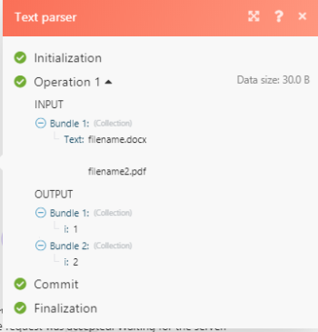
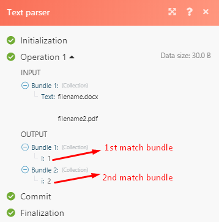

# Solução de problemas do analisador de texto em [!DNL Adobe Workfront Fusion]

Use essas informações se você não conseguir que um analisador de texto produza nenhuma saída.

## Requisitos de acesso

Você deve ter o seguinte acesso para usar a funcionalidade neste artigo:

<table style="table-layout:auto">
 <col> 
 <col> 
 <tbody> 
  <tr> 
    <td role="rowheader">[!DNL Adobe Workfront] plano*</td> 
   <td> 
[!DNL Pro] ou superior
 </td> 
  </tr> 
  <tr data-mc-conditions=""> 
   <td role="rowheader">[!DNL Adobe Workfront] licença*</td> 
   <td> 
[!UICONTROL Plano], [!UICONTROL Trabalho]
 </td> 
  </tr> 
  <tr> 
   <td role="rowheader">Licença [!UICONTROL Adobe Workfront Fusion]**</td> 
   <td>
   
Requisito de licença atual: Não [!DNL Workfront Fusion] requisito de licença.

   
Ou

   
Requisito de licença herdada: [!UICONTROL [!DNL Workfront Fusion] para Automação e integração do trabalho] 

   </td> 
  </tr> 
  <tr> 
   <td role="rowheader">Produto</td> 
   <td>
   
Requisito atual do produto: se você tiver o [!UICONTROL Select] ou o [!UICONTROL Prime] [!DNL Adobe Workfront] Planejar, sua organização deve comprar [!DNL Adobe Workfront Fusion] bem como [!DNL Adobe Workfront] para usar a funcionalidade descrita neste artigo. [!DNL Workfront Fusion] está incluído no [!UICONTROL Ultimate] [!DNL Workfront] plano.

   
Ou

   
Requisito de produto herdado: sua organização deve comprar [!DNL Adobe Workfront Fusion] bem como [!DNL Adobe Workfront] para usar a funcionalidade descrita neste artigo.

   </td> 
  </tr> 
 </tbody> 
</table>

Para descobrir que plano, tipo de licença ou acesso você tem, entre em contato com o [!DNL Workfront] administrador.

Para obter informações sobre [!DNL Adobe Workfront Fusion] licenças, consulte [[!DNL Adobe Workfront Fusion] licenças](../../workfront-fusion/get-started/license-automation-vs-integration.md).

## Solução de problemas

Exemplo de cenário de caso, você gostaria de analisar o tipo de arquivo de um documento de arquivo &quot;filename.docx&quot; e a extensão do nome de arquivo sempre varia de DOCX para PDF para CSV.

A expressão que você pode optar por usar nesse caso é [!DNL \..+]

Se você usar isso na expressão regex em regex101.com, receberá uma correspondência completa.

Na imagem acima, a extensão do arquivo foi correspondida corretamente. Se você pegar isso e tentar implementá-lo no analisador de texto:

você não receberá uma correspondência:

O motivo para isso é que o &quot;i&quot; mostra apenas o número de correspondências por correspondência, portanto, neste caso, temos 2 correspondências, portanto, depois do &quot;i&quot;, há um valor numérico 1 e 2. O caso de uso para isso é que, se você precisar corresponder ou transmitir dados por um filtro somente o segundo valor correspondente, poderá especificar qual valor é representado pelo valor numérico.

Para obter os valores de correspondência necessários para adicionar colchetes à parte que deseja analisar (por exemplo, para extrair somente de &quot;filename.docx&quot; - &quot;docx&quot;), de acordo com a expressão regex que estamos usando para esse cenário de caso, os colchetes devem ser aplicados em \.(.+)

Isso captura o DOCX, coloca-o em um grupo e deixa o &quot;.&quot; fora dele.

Na saída mostrada na figura abaixo, o grupo de captura corresponderá a qualquer caractere (exceto para terminadores de linha).

Outra solução alternativa que também incorpora o regex é usar a função de substituição

`{{replace("abcdefghijklmno pqr stuvw xyz.docx"; "/.\./"; ".")}}`

Em seguida, substituir `abcdefghijklmno pqr stuvw xyz.docx` com sua variável de nome de arquivo real.
