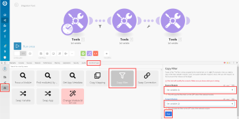

# Adicionar um filtro a um cenário em [!DNL Adobe Workfront Fusion]

>[!IMPORTANT]
>
>A documentação do Adobe Workfront Fusion foi movida para um novo local.
>
>As informações neste artigo agora podem ser encontradas no artigo:
>
>* [Adicionar um filtro a um cenário](https://experienceleague.adobe.com/docs/workfront-fusion/using/create-scenarios/add-modules/add-a-filter-to-a-scenario.html)
>
>Atualize todos os marcadores.
>
>Este artigo não está mais sendo atualizado e será removido em breve.

Em alguns cenários, é necessário trabalhar somente com pacotes que atendam a critérios específicos. Os filtros permitem selecionar esses pacotes.

<!--

For example, you could create a scenario with the [!UICONTROL Watch records] trigger for [!DNL Salesforce] to capture only records containing a specific word written by a specific author.

-->

Você pode adicionar um filtro entre dois módulos e verificar se os pacotes recebidos dos módulos anteriores atendem a condições de filtro específicas:

* Se isso acontecer, os pacotes serão transmitidos para o próximo módulo no cenário.
* Caso contrário, o processamento dos pacotes será encerrado.

## Requisitos de acesso

Você deve ter o seguinte acesso para usar a funcionalidade neste artigo:

<table style="table-layout:auto">
 <col> 
 <col> 
 <tbody> 
  <tr> 
    <td role="rowheader">[!DNL Adobe Workfront] plano*</td> 
   <td> 
[!DNL Pro] ou superior
 </td> 
  </tr> 
  <tr data-mc-conditions=""> 
   <td role="rowheader">[!DNL Adobe Workfront] licença*</td> 
   <td> 
[!UICONTROL Plano], [!UICONTROL Trabalho]
 </td> 
  </tr> 
  <tr> 
   <td role="rowheader">Licença [!UICONTROL Adobe Workfront Fusion]**</td> 
  <td>
   
Requisito de licença atual: nenhum requisito de licença [!DNL Workfront Fusion].

   
Ou

   
Requisito de licença herdada: [!UICONTROL [!DNL Workfront Fusion] para Automação e Integração do Trabalho], [!UICONTROL [!DNL Workfront Fusion] para Automação do Trabalho]

   </td>    </tr> 
  </tr> 
  <tr> 
   <td role="rowheader">Produto</td> 
   <td>
   
Requisito atual do produto: se você tiver o Plano [!DNL Adobe Workfront] da [!UICONTROL Select] ou da [!UICONTROL Prime], sua organização deve comprar o [!DNL Adobe Workfront Fusion] e o [!DNL Adobe Workfront] para usar a funcionalidade descrita neste artigo. [!DNL Workfront Fusion] está incluído no plano [!DNL Workfront] da [!UICONTROL Ultimate].

   
Ou

   
Requisito de produto herdado: sua organização deve comprar o [!DNL Adobe Workfront Fusion] e o [!DNL Adobe Workfront] para usar a funcionalidade descrita neste artigo.

   </td> 
  </tr> 
 </tbody> 
</table>

Para saber que plano, tipo de licença ou acesso você tem, contate o administrador do [!DNL Workfront].

Para obter informações sobre [!DNL Adobe Workfront Fusion] licenças, consulte [[!DNL Adobe Workfront Fusion] licenças](../../workfront-fusion/get-started/license-automation-vs-integration.md).

## Pré-requisitos

Você deve adicionar ambos os módulos a um cenário antes de poder adicionar um filtro entre eles.

## Adicione um filtro entre dois módulos:

1. Clique em **[!UICONTROL Cenários]**  no painel esquerdo e selecione o cenário para abri-lo.
1. No canto superior direito da janela, clique em **[!UICONTROL Editar]**.
1. Clique na linha de conexão entre os módulos.
1. Na caixa que é exibida, digite um **[!UICONTROL Rótulo]** para o filtro.
1. Defina um filtro **[!UICONTROL Condição]**.

   É possível inserir um ou dois operandos nas duas caixas. Se você inserir operandos em ambas as caixas, será possível selecionar um operador no menu suspenso entre elas para especificar a relação entre elas.

   >[!TIP]
   >
   >Nos campos de operando, você pode inserir valores da mesma forma que os mapearia, conforme descrito em [Mapear informações de um módulo para outro em [!DNL Adobe Workfront Fusion]](../../workfront-fusion/mapping/map-information-between-modules.md).

   Por exemplo, se você deseja que o filtro localize arquivos em [!DNL Adobe Workfront] terminando com XML e os transmita para [!DNL Dropbox], digite **[!UICONTROL Nome do arquivo]** na primeira caixa e .**[!UICONTROL xml]** na segunda caixa. No menu suspenso entre elas, você selecionaria **[!UICONTROL Termina com (sem distinção entre maiúsculas e minúsculas)]**. Esse filtro se aplicaria aos pacotes recebidos do primeiro módulo (Workfront). Somente pacotes contendo arquivos XML passariam para o próximo módulo ([!DNL Dropbox]).

   

1. Clique em **[!DNL OK]**.

## Copiar um filtro

Atualmente, o editor de cenários não inclui um recurso para copiar um filtro.

>[!NOTE]
>
>Se você copiar os módulos em ambos os lados do filtro, o filtro também será copiado.
>
>Para obter mais informações sobre como copiar módulos, consulte [Copiar módulos ou cenários em [!DNL Adobe Workfront Fusion]](../../workfront-fusion/scenarios/copy-modules-or-scenarios.md)

Para copiar um filtro sem copiar módulos, você pode usar o Chrome [!DNL Google] para a seguinte solução alternativa:

1. Instale a extensão [!UICONTROL [!DNL Adobe Workfront Fusion] DevTool Chrome].
1. Em [!DNL Workfront Fusion], abra o cenário.
1. Clique no menu de três pontos do Chrome e em **[!UICONTROL Mais ferramentas*]* > **[!UICONTROL Ferramentas do desenvolvedor]**.

1. No painel [!UICONTROL Ferramentas do desenvolvedor] que é exibido, na barra de menus na parte superior, clique na guia [!UICONTROL Workfront Fusion].

   

1. Clique no ícone  de **[!UICONTROL Ferramentas]** na barra lateral esquerda.

1. Clique em **[!UICONTROL Copiar Filtro]** e configure a ferramenta **[!UICONTROL Copiar Filtro]** no painel direito:

   1. Defina o **[!UICONTROL Módulo Source]** como o módulo logo após o filtro que você deseja copiar.
   1. Defina o **[!UICONTROL Módulo de Destino]** como o módulo logo antes do filtro que você deseja copiar.

1. Clique em **[!UICONTROL Executar]**.
