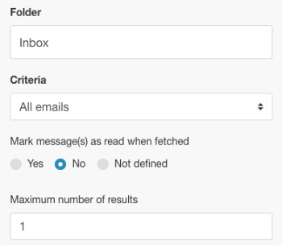
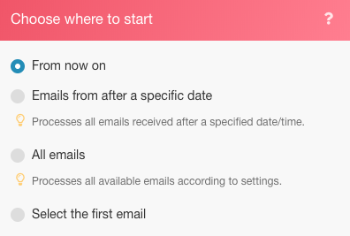
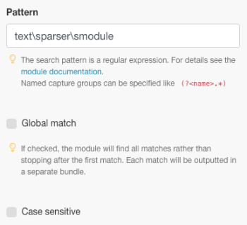

# [!DNL Adobe Workfront Fusion] exemplo de cenário: Conectar email, [!UICONTROL Analisador de texto], e [!DNL Google Sheets]

Este cenário ajuda você a criar um log de todas as mensagens de email e marcá-las para executar outras ações em uma planilha. Ele captura um corpo de email em duas tabelas separadas em uma planilha usando Expressões regulares (Regex) como padrões de pesquisa. O primeiro padrão pesquisa uma frase e o segundo busca a mesma frase e um endereço de email.

## Requisitos de acesso

Você deve ter o seguinte acesso para usar a funcionalidade neste artigo:

<table style="table-layout:auto"> 
 <col> 
 <col> 
 <tbody> 
  <tr> 
    <td role="rowheader">[!DNL Adobe Workfront] plano*</td> 
   <td> 
[!DNL Pro] ou superior
 </td> 
  </tr> 
  <tr data-mc-conditions=""> 
   <td role="rowheader">[!DNL Adobe Workfront] licença*</td> 
   <td> 
[!UICONTROL Plano], [!UICONTROL Trabalho]
 </td> 
  </tr> 
  <tr> 
   <td role="rowheader">Licença [!UICONTROL Adobe Workfront Fusion]**</td> 
   <td>
   
Requisito de licença atual: Não [!DNL Workfront Fusion] requisito de licença.

   
Ou

   
Requisito de licença herdada: [!UICONTROL [!DNL Workfront Fusion] para Automação e integração do trabalho] 

   </td> 
  </tr> 
  <tr> 
   <td role="rowheader">Produto</td> 
   <td>
   
Requisito atual do produto: se você tiver o [!UICONTROL Select] ou o [!UICONTROL Prime] [!DNL Adobe Workfront] Planejar, sua organização deve comprar [!DNL Adobe Workfront Fusion] bem como [!DNL Adobe Workfront] para usar a funcionalidade descrita neste artigo. [!DNL Workfront Fusion] está incluído no [!UICONTROL Ultimate] [!DNL Workfront] plano.

   
Ou

   
Requisito de produto herdado: sua organização deve comprar [!DNL Adobe Workfront Fusion] bem como [!DNL Adobe Workfront] para usar a funcionalidade descrita neste artigo.

   </td> 
  </tr> 
 </tbody> 
</table>

Para descobrir que plano, tipo de licença ou acesso você tem, entre em contato com o [!DNL Workfront] administrador.

Para obter informações sobre [!DNL Adobe Workfront Fusion] licenças, consulte [[!DNL Adobe Workfront Fusion] licenças](../../workfront-fusion/get-started/license-automation-vs-integration.md).

## Pré-requisitos

Este tutorial requer conhecimento básico de expressões regulares. Para saber mais sobre o Regex, visite [https://regexone.com](https://regexone.com/).

Adicione o primeiro módulo e configure-o

1. Pesquise por email e escolha **[!UICONTROL Assistir a emails]** como acionador.

   >[!NOTE]
   >
   >Embora seja possível conectar um [!DNL Google] conta usando a variável Emódulo de email, você também pode usar um [!DNL Gmail] módulo.

1. Conecte um [!DNL Google] ou qualquer outro cliente de e-mail baseado em IMAP (como [!DNL Outlook]).
1. Depois de conectado, selecione uma pasta cujos emails de entrada você deseja observar, como [!UICONTROL Caixa de entrada].
1. Em [!UICONTROL Critérios], escolha **[!UICONTROL Todos os emails]** (ou reduza para emails lidos ou não lidos).

   Você também pode optar por marcar os emails buscados como lidos ou não lidos.

1. Defina o [!UICONTROL Número máximo de resultados] a 1.

   

   Você pode alterar isso com base no volume de mensagens recebidas. No entanto, é recomendável definir um valor baixo e executar o cenário com mais frequência.

1. Clique em **[!UICONTROL Mostrar configurações avançadas]** na parte inferior.

   

1. Filtrar emails pelo [!UICONTROL Endereço do remetente], [!UICONTROL Assunto] e [!UICONTROL Frase].

   Isso permite que você assista somente a emails relevantes. Neste exemplo, adicionamos apenas um filtro Assunto e deixamos os outros 2 em branco.

   >[!NOTE]
   >
   >Adicionaremos um roteador para procurar frases em um email usando o [!UICONTROL Padrão de correspondência] e uma Expressão regular (Regex) como um padrão de pesquisa. Isso também nos permite criar um cenário de vários utilitários.

1. Quando a configuração estiver concluída e você for solicitado a especificar onde começar a assistir seus emails, clique em **[!DNL From now on]**.

   

1. Continue para [Pesquisar por [!UICONTROL Controle de fluxo] e adicionar um [!UICONTROL Roteador]](#search-for-flow-control-and-add-a-router)

## Pesquisar por [!UICONTROL Controle de fluxo] e adicionar um [!UICONTROL Roteador]

1. Adicione um roteador após qualquer módulo para dividir ou duplicar os dados antes de enviá-los para o próximo módulo.

   Aqui, usamos um [!UICONTROL Roteador] para enviar o texto do corpo do Email para duas tabelas separadas em uma [!DNL Google Sheet].

   

## Use o [!UICONTROL Analisador de texto] Módulo

1. Adicionar um [!UICONTROL Padrão de correspondência] transformador para procurar uma frase em um email.

   Procuraremos a frase &quot;[!UICONTROL módulo analisador de texto]&quot; em todos os emails de entrada para capturar o corpo do texto e o nome do remetente daqueles que correspondem a essa frase.

   1. Escreva o padrão como uma expressão regular:

      text\sparser\smodule

   1. (Opcional) Use qualquer uma das outras opções de Padrão.

      

      Várias linhas são úteis se o texto contiver várias linhas e você precisar pesquisar pelo padrão em cada linha. Para este tutorial, precisamos pesquisar o padrão no texto inteiro do corpo do email, portanto, vamos deixá-lo desmarcado.

   1. No [!UICONTROL Texto] , clique no atributo **Conteúdo do texto** na lista.

      

      Esse é o atributo que armazena o texto do corpo do email no qual pesquisaremos o padrão.

1. Adicionar outro [!UICONTROL Padrão de correspondência] que pesquisa a mesma frase e um endereço de email.

   Isso é particularmente útil se você tiver contas de cliente com vários usuários. Para economizar tempo, você pode clonar a variável [!UICONTROL Analisador de texto] módulo que acabou de criar e vinculá-lo ao roteador.

   

1. Edite o padrão da seguinte maneira:

   text\sparser\smodule.+\s([\w.-]+@[\w.-]+)

   

   Esse padrão pesquisa a frase &quot;[!UICONTROL módulo analisador de texto]&quot; e um endereço de email como john.doe@gmail.com e retorna somente o endereço de email.

   >[!NOTE]
   >
   >É importante escrever seu regex de acordo com a especificação dos endereços de email aceitos, mas o endereço acima cuida da maioria dos endereços de email padrão.

   * Se quiser pesquisar apenas o endereço de email, você pode usar o regex abaixo:

     ([\w.-]+@[\w.-]+)

   * Você também pode pesquisar somente por números de telefone usando o regex abaixo:

     ^[+]?\(?(\d{1,3})?[\s-]?\(?(\d{3})\)?[\s-]?\d{3}[\s-]?\d{3,4}
O padrão acima abrange os formatos mais comuns nos quais um número de telefone é escrito.

   Para testar seus padrões, recomendamos usar [[!DNL https://regex101.com]](https://regex101.com/) com [!DNL javascript] como o Sabor.

   O restante da configuração permanece o mesmo que o anterior.

## Adicione o [!DNL Google Sheets] módulos

Para [!DNL Sheets], precisamos primeiro criar uma planilha com os cabeçalhos necessários.

1. Crie uma planilha com as colunas sob as quais você deseja capturar os dados do usuário. (Você também pode usar um arquivo existente).

   Por exemplo, crie um chamado &quot;Dados de email: Tíquete de suporte&quot; com o Nome do remetente, Email do remetente e Conteúdo de email como colunas. Nomeie a planilha como &quot;contém: módulo do analisador de texto&quot;.

1. Adicione o [!UICONTROL Planilhas Google] módulo com **[!UICONTROL Adicionar uma linha]** como a ação.

   

1. Conecte seu [!DNL Google] conta (se ainda não tiver feito). Escolha o Arquivo criado anteriormente, em seguida, escolha a Planilha na qual você está capturando os dados.

   A configuração deve ter esta aparência:

   

1. Mapeie os atributos nos campos relevantes (colunas) para concluir a configuração do módulo.

   

1. Clonar o módulo que acabou de criar e vinculá-lo ao segundo [!UICONTROL Analisador de texto] módulo.

   1. Vá para a Planilha, duplique a planilha criada anteriormente e dê um nome a ela.

      Por exemplo, nomeie-o como &quot;contém: módulo do analisador de texto e email&quot;.

   1. Adicione outra coluna para armazenar o endereço de email que o corpo do email contém.

      Por exemplo, nomeie-o como &quot;Endereço de email compartilhado&quot;.

   1. Clique no clone [!DNL Google Sheets] módulo para definir a configuração.
   1. Altere a planilha para a nova que acabou de criar.
   1. Mapeie a saída do [!UICONTROL Padrão de correspondência] módulo ($1) para a coluna onde você deseja armazenar o endereço de email (Endereço de email compartilhado).

      

      

   1. Clique em **[!UICONTROL OK]**, salve o cenário e utilize-o para uma execução de teste.

      Você precisará enviar dois emails separados para o endereço de email conectado da seguinte maneira:

      * Contendo a frase &quot;[!UICONTROL módulo analisador de texto]&quot; (e sem endereço de email)

        

      * Contendo a frase acima e um endereço de email

        

        Se não houver erros na configuração, você verá que a primeira planilha captura todos os emails contendo a frase &quot;[!UICONTROL módulo analisador de texto]&quot;enquanto a segunda planilha captura somente aquelas que contêm a frase&quot;[!UICONTROL módulo analisador de texto]&quot; e um endereço de email. Você pode consultar as capturas de tela abaixo.

        Planilha 1:

        

        Planilha 2:

        

## Recursos

* [Exercícios gratuitos](https://regexone.com/) para saber mais sobre Expressões regulares
* [Saiba mais sobre a correspondência de números de telefone](https://regexone.com/problem/matching_phone_numbers) uso do Regex
* [Saiba mais sobre correspondência de email](https://regexone.com/problem/matching_emails) uso do Regex
* [Testar suas expressões regulares](https://regex101.com/)
