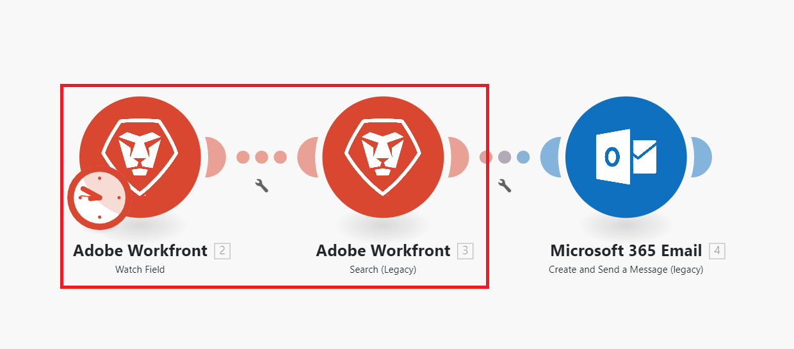

# Visão geral do cenário [!DNL Adobe Workfront Fusion]

>[!IMPORTANT]
>
>A documentação do Adobe Workfront Fusion foi movida para um novo local.
>
>As informações neste artigo agora podem ser encontradas no artigo:
>
>* [Visão geral do cenário](https://experienceleague.adobe.com/docs/workfront-fusion/using/get-started-with-fusion/understand-workfront-fusion/scenario-overview.html)
>
>Atualize todos os marcadores.
>
>Este artigo não está mais sendo atualizado e será removido em breve.

>[!NOTE]
>
>[!DNL Adobe Workfront Fusion] requer uma licença [!DNL Adobe Workfront Fusion] além de [!DNL Adobe Workfront license].

>[!IMPORTANT]
>
>[!DNL Workfront Fusion] cenários não devem ser confundidos com [!DNL Workfront Scenario Planner] cenários. Para obter informações sobre [!DNL Workfront Scenario Planner] cenários, consulte [A [!DNL Scenario Planner] visão geral](../../scenario-planner/scenario-planner-overview.md).

O papel de [!DNL Adobe Workfront Fusion] é automatizar seus processos para que você possa se concentrar em novas tarefas em vez de repetir as mesmas tarefas repetidamente. Ele funciona vinculando ações em e entre aplicativos e serviços para criar um cenário que transfere e transforma seus dados automaticamente. O cenário que você cria observa dados em um aplicativo ou serviço e processa esses dados para fornecer o resultado desejado.

Um cenário é composto de uma série de módulos que indicam como os dados devem ser transformados em um aplicativo ou transferidos entre aplicativos e serviços da Web.

## Visão geral dos elementos do cenário

Um cenário é criado com elementos diferentes. Entender a terminologia desses elementos facilita o uso da documentação.

### Cenário

Um **cenário** é uma série de etapas automatizadas criadas pelo usuário, criadas para mover e manipular dados. O termo &quot;cenário&quot; se refere a todo o grupo de etapas conectadas.

### Acionador

Um cenário começa com um **acionador**. O acionador observa dados novos e atualizados e inicia o cenário quando determinadas condições configuradas no módulo são aplicadas. Os acionadores podem ser configurados para iniciar um cenário em um agendamento (pesquisa) ou sempre que ocorrerem alterações de dados (instantâneo).

### Módulo

O acionador é seguido por um número de **módulos**. Um módulo representa uma única etapa em um cenário que executa uma ação específica. Os módulos são configurados e encadeados para criar cenários.

### Rota

Um cenário pode ser dividido em **rotas**. Uma rota é uma seção do cenário que pode ou não ser usada para um determinado pacote de dados. As rotas são configuradas usando um módulo de roteador e filtros.

### Segmento de cenário

Um segmento de cenário é uma seção de um cenário que consiste em uma série de módulos contíguos que se conectam ao mesmo aplicativo. Os segmentos de cenário geralmente representam um fluxo de trabalho curto no aplicativo.

### Conector

Um conector é o conjunto de módulos de um determinado aplicativo. O Workfront Fusion oferece conectores para muitos aplicativos de trabalho comuns, como Workfront, Salesforce e Jira, bem como conectores genéricos que podem ser usados para qualquer serviço da Web.

## Exemplo: automatizando processos em [!DNL Adobe Workfront]

>[!NOTE]
>
>Essa funcionalidade está disponível para as seguintes licenças:
>
>* [!UICONTROL [!DNL Workfront Fusion] para Automação de Trabalho]
>* [!UICONTROL [!DNL Workfront Fusion] para Automação e Integração do Trabalho]

O [!DNL Workfront Fusion] permite que você automatize fluxos de trabalho simples ou complexos no [!DNL Workfront], economizando tempo e garantindo que o processo seja executado de forma consistente.

Neste exemplo, o cenário é acionado quando um campo especificado é alterado em uma Tarefa ou Problema em [!DNL Workfront]. Quando acionado, o cenário obtém informações no projeto relacionado e cria uma atualização personalizada para uma pessoa atribuída a uma função específica no projeto.

## Exemplo: Conectando [!DNL Workfront] a outro aplicativo ou serviço Web

>[!NOTE]
>
>Essa funcionalidade está disponível para a seguinte licença:
>
>* [!UICONTROL [!DNL Workfront Fusion] para Automação e Integração do Trabalho]
>

O [!DNL Workfront Fusion] também pode se conectar a outros aplicativos e serviços Web. É possível acessar, importar, manipular ou exportar dados de outros aplicativos, integrando-os ao Workfront ou entre si. Muitos aplicativos têm [!DNL Workfront Fusion] conectores dedicados. Se não houver um conector dedicado para o aplicativo que deseja acessar, você pode usar os módulos [!UICONTROL HTTP] ou [!UICONTROL SOAP] do [!DNL Workfront Fusion] para se conectar ao aplicativo por meio da API.

Neste exemplo, o cenário é acionado quando um usuário é adicionado a uma planilha do [!DNL Excel]. O cenário verifica se o usuário está em [!DNL Workfront]. Caso contrário, o cenário cria o usuário em [!DNL Workfront] e adiciona sua ID de usuário do Workfront de volta à planilha.

Para obter uma lista de conectores dedicados, consulte [Aplicativos e seus módulos](../../workfront-fusion/apps-and-their-modules/apps-and-their-modules.md).

>[!IMPORTANT]
>
>O [!DNL Adobe Workfront Fusion] pode se conectar a quase qualquer serviço Web. Se o aplicativo com o qual você deseja trabalhar não tiver um conector [!DNL Workfront Fusion] dedicado, você poderá usar os seguintes módulos para se conectar diretamente ao serviço Web:
>
>* [[!UICONTROL HTTP] módulos](../../workfront-fusion/apps-and-their-modules/http-modules/http-modules-1.md)
>* [[!UICONTROL SOAP] módulo](../../workfront-fusion/apps-and-their-modules/soap-module.md)
>* [[!UICONTROL JSON] módulos](../../workfront-fusion/apps-and-their-modules/json-modules.md)
>
