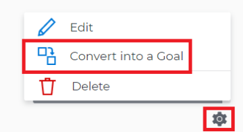

# Alinhar metas convertendo resultados e atividades em metas

Você pode alinhar duas metas manualmente ou converter os resultados e as atividades de uma meta existente em outra meta. O resultado ou a atividade convertida se torna a meta secundária da meta original.
Para obter informações sobre como alinhar manualmente duas metas, consulte [Alinhar metas ao conectá-las às Metas do Adobe Workfront](../../workfront-goals/goal-alignment/align-goals-by-connecting-them.md).

## Requisitos de acesso

<table style="table-layout:auto">
<col>
</col>
<col>
</col>
<tbody>
 <tr>
 <td role="rowheader">plano do Adobe Workfront</td>
 <td>
 
Qualquer

</td>
 </tr>
 <tr>
 <td role="rowheader">Licença da Adobe Workfront*</td>
 <td>
 
Nova licença: Contributor ou superior

 Ou
 
Licença atual: Solicitação ou superior
 
Para obter mais informações, consulte <a href="../../administration-and-setup/add-users/access-levels-and-object-permissions/wf-licenses.md" class="MCXref xref">visão geral das licenças da Adobe Workfront</a>.
 </td>
 </tr>
 <tr>
 <td role="rowheader">Produto*</td>
 <td>
 
 Novo requisito de produto, um dos seguintes: 

<ul>
<li>Um plano Select ou Prime Adobe Workfront e uma licença adicional do Adobe Workfront Goals.</li>
<li>Um plano do Ultimate Workfront que inclui o Workfront Goals por padrão. </li></ul>
 
Ou

 
Requisito atual do produto: um plano do Workfront e uma licença adicional para o Adobe Workfront Goals. 
 
Para obter informações, consulte <a href="../../workfront-goals/goal-management/access-needed-for-wf-goals.md" class="MCXref xref">Requisitos para usar as Metas do Workfront</a>. 
 </td>
 </tr>
 <tr>
 <td role="rowheader">Nível de acesso</td>
 <td> 
Editar acesso às Metas
 </td>
 </tr>
 <tr data-mc-conditions="">
 <td role="rowheader">Permissões de objeto</td>
 <td>
  

  
Exibir permissões ou mais altas para a meta para exibi-la

  
Gerenciar permissões para a meta para editá-la

  
Para obter informações sobre como compartilhar metas, consulte <a href="../../workfront-goals/workfront-goals-settings/share-a-goal.md" class="MCXref xref">Compartilhar uma meta no Workfront Goals</a>. 

  
 </td>
 </tr>
<tr>
   <td role="rowheader">
Modelo de layout
</td>
   <td> 
Todos os usuários, incluindo administradores do Workfront, devem receber um modelo de layout que inclui a área Metas no Menu principal. 
  
</td>
  </tr>
</tbody>
</table>

*Para obter mais informações, consulte [Requisitos de acesso na documentação do Workfront](/help/quicksilver/administration-and-setup/add-users/access-levels-and-object-permissions/access-level-requirements-in-documentation.md).

## Pré-requisitos

Você deve ter o seguinte antes de iniciar:

* Uma meta existente com resultados e atividades existentes.

  Para obter informações sobre como criar metas, consulte [Criar metas nas Metas do Adobe Workfront](../../workfront-goals/goal-management/create-goals.md).

>[!IMPORTANT]
>
>Uma meta pode ter até 1000 indicadores de progresso.

<!--drafted for goal redesign: At PRODUCTION: update the sentence above to remove Production/ Preview references-->

## Considerações ao converter resultados e atividades em metas

Às vezes, um resultado ou uma atividade pode ter um escopo maior do que o previsto e faria mais sentido que eles se tornassem objetivos. Você pode converter resultados e atividades de uma meta existente para uma nova meta. Esta é uma abordagem ascendente para alinhar metas.

Considere o seguinte ao converter resultados e atividades em metas:

* O resultado ou a atividade convertida se torna a meta secundária da meta original e as duas metas se tornam alinhadas.
* A meta recém-criada torna-se o único indicador de progresso da meta original, se não houver resultados ou atividades adicionais à meta original. Você deve adicionar resultados e atividades à meta secundária para poder rastrear o progresso nela.
* Converter um resultado ou atividade em meta é irreversível. Depois de convertida, a nova meta secundária nunca mais poderá se tornar um resultado ou atividade para a meta principal.

## Converter um resultado ou atividade em uma meta

<!--
Converting results and activities differs depending on what environment you use. 

### Convert a result or activity to a goal in the Production environment

1. Go to a goal that has a result or an activity that you want to convert to a goal.
1. Click the name of the goal to open the **Goal Details** panel.
1. Expand the **Results** or **Activities** right-pointing arrows to see a list of results or activities for the goal. 

1. Click the **gear icon**  to the right of the result or activity name that you want to convert, then click **Convert into a Goal**.

   

1. (Optional) Remove the name of the original activity or result owner from the **Goal Owner** field and replace it with another user, team, group, or your organization's name. By default, Workfront selects the owner of the result or the activity as the goal owner. 
1. Click **Convert**. The activity or result displays as an aligned goal in the Goal Details panel of the original goal and the original activity or result is removed from the original goal and transferred to the second goal. By default, the new goal has the same name as the original converted result or activity. 
1. (Optional) Click the name of the new goal to open the **Goal Details** panel and edit the name of the goal. For information about editing any information for an existing goal, see [Edit goals in Adobe Workfront Goals](../../workfront-goals/goal-management/edit-goals.md).
-->

1. Vá para uma meta que tenha um resultado ou uma atividade que você deseja converter em uma meta.
1. Na página da meta, clique em **Indicadores de progresso** no painel esquerdo.
1. Selecione um resultado ou uma atividade na lista de indicadores de progresso e clique no ícone **Converter em meta**  na parte superior da lista de indicadores de progresso. A caixa Converter em meta é aberta.

   
1. Atualize as seguintes informações:
   * **Nome da meta**: por padrão, a nova meta tem o mesmo nome da atividade ou do resultado original.
   * **Período**: por padrão, o período da nova meta é o trimestre atual. Você pode selecionar a configuração **Habilitar datas personalizadas** para definir um período personalizado para a nova meta.
   * **Proprietário da meta**: por padrão, o novo proprietário da meta é o proprietário da atividade ou do resultado original.
   * **Descrição**: adicione mais informações sobre a nova meta.
1. Clique em **Salvar**

   O resultado ou a atividade agora é convertido em uma meta secundária da meta original. Está listado como uma meta na lista de Indicadores de progresso da meta original.

