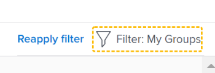

# Navegar na seção Alinhamento da meta em Metas do Adobe Workfront

Use a seção Alinhamento da meta para exibir uma exibição holística do alinhamento da meta em toda a organização em um fluxograma. As metas alinhadas são exibidas em cartões que se interconectam em uma árvore hierárquica.

Para obter informações sobre o alinhamento da meta e como alcançá-la, consulte também os seguintes artigos:

* [Visão geral do alinhamento da meta em Metas da Adobe Workfront](../../workfront-goals/goal-alignment/goal-alignment-overview.md)
* [Alinhar metas ao conectá-las às metas da Adobe Workfront](../../workfront-goals/goal-alignment/align-goals-by-connecting-them.md)

## Requisitos de acesso

<!-- drafted for P&P release: 

You must have the following to perform the activities described in this article:

<table style="table-layout:auto">
 <col>
 </col>
 <col>
 </col>
 <tbody>
  <tr>
   <td role="rowheader">Adobe Workfront plan*</td>
   <td>
   
Current plan: Select or higher

   Or
   
Legacy plan: Pro or higher

   
   </td>
  </tr>
  <tr>
   <td role="rowheader">Adobe Workfront license*</td>
   <td>
   
Current license: Contributor or higher

   Or
   
Legacy license: Request or higher
 
For more information, see <a href="../../administration-and-setup/add-users/access-levels-and-object-permissions/wf-licenses.md" class="MCXref xref">Adobe Workfront licenses overview</a>.
 </td>
  </tr>
  <tr>
   <td role="rowheader">Product</td>
   <td>
   
 Current product requirement: If you have the Select or Prime Adobe Workfront plan, you must also buy an additional Adobe Workfront Goals license.  Workfront Goals are included in the Ultimate Workfront Plan.

   Or
   
Legacy product requirement: You must purchase an additional license for the Adobe Workfront Goals to access functionality described in this article. 
 
For information, see <a href="../../workfront-goals/goal-management/access-needed-for-wf-goals.md" class="MCXref xref">Requirements to use Workfront Goals</a>. 
 </td>
  </tr>
  <tr>
   <td role="rowheader">Access level*</td>
   <td> 
Edit access to Goals
 
<b>NOTE</b>
If you still don't have access, ask your Workfront administrator if they set additional restrictions in your access level. For information on how a Workfront administrator can change your access level, see:

     <ul>
      <li> 
<a href="../../administration-and-setup/add-users/configure-and-grant-access/create-modify-access-levels.md" class="MCXref xref">Create or modify custom access levels</a> 
 </li>
      <li> 
<a href="../../administration-and-setup/add-users/configure-and-grant-access/grant-access-goals.md" class="MCXref xref">Grant access to Adobe Workfront Goals</a> 
 </li>
     </ul> 
 </td>
  </tr>
  <tr data-mc-conditions="">
   <td role="rowheader">Object permissions</td>
   <td>
    

     
View or higher permissions to the goal to view it

     
Manage permissions to the goal to edit it

     
For information about sharing goals, see <a href="../../workfront-goals/workfront-goals-settings/share-a-goal.md" class="MCXref xref">Share a goal in Workfront Goals</a>. 

    
 </td>
  </tr>
 </tbody>
</table>

-->

Você deve ter o seguinte para executar as atividades descritas neste artigo:

<table style="table-layout:auto"> 
 <col> 
 <col> 
 <tbody> 
  <tr> 
   <td role="rowheader">Plano Adobe Workfront*</td> 
   <td> 
Pro ou superior
 </td> 
  </tr> 
  <tr> 
   <td role="rowheader">Adobe Workfrontlicense*</td> 
   <td> 
Solicitação ou superior
 
Para obter mais informações, consulte <a href="../../administration-and-setup/add-users/access-levels-and-object-permissions/wf-licenses.md" class="MCXref xref">Visão geral das licenças do Adobe Workfront</a>.
 </td> 
  </tr> 
  <tr> 
   <td role="rowheader">Produto</td> 
   <td> 
Você deve comprar uma licença adicional para a funcionalidade Metas da Adobe Workfront para acessar descrita neste artigo. 
 
Para obter mais informações, consulte <a href="../../workfront-goals/goal-management/access-needed-for-wf-goals.md" class="MCXref xref">Requisitos para usar as metas do Workfront</a>. 
 </td> 
  </tr> 
  <tr> 
   <td role="rowheader">Nível de acesso*</td> 
   <td> 
Editar o acesso às Metas
 
<b>Nota</b>
Caso ainda não tenha acesso, pergunte ao administrador do Workfront se ele definiu restrições adicionais em seu nível de acesso. Para obter informações sobre como um administrador do Workfront pode alterar seu nível de acesso, consulte:
 
     <ul> 
      <li> 
<a href="../../administration-and-setup/add-users/configure-and-grant-access/create-modify-access-levels.md" class="MCXref xref">Criar ou modificar níveis de acesso personalizados</a> 
 </li> 
      <li> 
<a href="../../administration-and-setup/add-users/configure-and-grant-access/grant-access-goals.md" class="MCXref xref">Conceder acesso às Metas da Adobe Workfront</a> 
 </li> 
     </ul> 
 </td> 
  </tr> 
  <tr data-mc-conditions=""> 
   <td role="rowheader">Permissões de objeto</td> 
   <td> 
    
 
     
Visualizar ou aumentar permissões para metas
 
     
Para obter informações sobre como compartilhar metas, consulte <a href="../../workfront-goals/workfront-goals-settings/share-a-goal.md" class="MCXref xref">Compartilhar uma meta na Workfront</a>. 
 
    
 </td> 
  </tr> 
 </tbody> 
</table>

*Para descobrir qual plano, tipo de licença ou acesso você tem, entre em contato com o administrador da Workfront.

## Pré-requisitos

Você deve ter o seguinte antes de começar:

* Um modelo de layout que inclui a área Metas no Menu principal.

## Navegar na seção Alinhamento da meta

1. Clique no botão **Menu principal** ícone  no canto superior direito da tela, clique em **Metas**.

   <!-- Add this when Shell is available to all: or (if available), click the **Main Menu** icon  in the upper-left corner)
   -->
1. Clique em **Alinhamento da meta** no painel esquerdo.
1. Use os filtros no canto superior direito do gráfico de alinhamento para selecionar somente metas importantes para você. Para obter informações sobre como usar filtros em Metas do Workfront, consulte [Filtrar informações em metas do Adobe Workfront](../../workfront-goals/goal-management/filter-information-wf-goals.md).

   As metas que correspondem aos filtros são exibidas no gráfico de alinhamento nos cartões.

   As seguintes informações são exibidas em um cartão de meta:

   <table style="table-layout:auto"> 
    <col> 
    <col> 
    <tbody> 
     <tr> 
      <td role="rowheader">Datas do período de tempo </td> 
      <td> 
Este é o período para o qual a meta está aberta. O objetivo deve ser atingido até a data de término do período. As Metas do Workfront calculam o progresso na meta com base na duração do período da meta e na data atual.
 </td> 
     </tr> 
     <tr> 
      <td role="rowheader">Indicadores de progresso</td> 
      <td>O número de indicadores de progresso para a meta. Os indicadores de progresso podem ser metas, resultados ou atividades alinhadas. </td> 
     </tr> 
     <tr> 
      <td role="rowheader">Nome do proprietário</td> 
      <td>O nome do usuário, da equipe, do grupo ou da organização designada como o Proprietário da meta. </td> 
     </tr> 
     <tr> 
      <td role="rowheader">Nome da meta</td> 
      <td>O nome da meta. </td> 
     </tr> 
     <tr> 
      <td role="rowheader">Barra de progresso da meta e progresso</td> 
      <td> 
O progresso do objetivo indica quanto do objetivo foi alcançado atualmente. Este é um cálculo automático da média do progresso de todas as metas, resultados e atividades alinhadas para a meta com base no tempo decorrido desde o início do período de tempo da meta. Para obter informações sobre como calcular o progresso em metas, consulte <a href="../../workfront-goals/goal-management/calculate-goal-progress.md" class="MCXref xref">Visão geral do progresso e condição da meta nas Metas da Adobe Workfront</a>. 
 
       
 
        
O progresso real da meta até a data atual. Os valores e cores de progresso a seguir indicam a probabilidade da meta ser alcançada a tempo: 
 
        <ul> 
         <li>No Target (indicador verde): o objetivo é a tempo e será atingido a tempo.</li> 
         <li> Em Risco (indicador amarelo): a meta fica para trás e pode não ser alcançada a tempo.</li> 
         <li> Em problemas (indicador vermelho): o objetivo corre o risco de não ser atingido a tempo. </li> 
        </ul> 
       
 </td> 
     </tr> <!--
      <tr data-mc-conditions="QuicksilverOrClassic.Draft mode"> 
       <td role="rowheader">Updated on date </td> 
       <td> 
The date when the goal was last updated
 
(NOTE: drafted because I think this was removed with the alignment chart redesign - 21.1) 
 </td> 
      </tr>
     --> 
     <tr> 
      <td role="rowheader">Status</td> 
      <td>As metas em todos os status são exibidas na seção Alinhamento da meta . </td> 
     </tr> 
    </tbody> 
   </table>

   Metas que estão alinhadas a outras metas exibem o número de metas alinhadas no cartão de meta.

   

1. Clique no botão **seta para baixo** ícone sob uma meta para expandir e visualizar ainda mais as metas secundárias.

   

   >[!TIP]
   >
   >As metas que têm metas secundárias alinhadas a elas exibem o número de metas alinhadas em seus respectivos cartões.

1. (Condicional) Se o filtro atual excluir algumas das metas que participam de um alinhamento, uma mensagem de aviso será exibida para indicar que nem todas as metas são exibidas.

   

1. Clique em **Mostrar** para exibir as metas eliminadas atualmente pelo filtro.

   Observe as seguintes alterações no gráfico de alinhamento:

   * As metas conectadas eliminadas anteriormente pelo filtro agora são exibidas no gráfico de alinhamento.
   * O filtro no canto superior direito é contornado em amarelo para indicar que não está sendo aplicado no momento.

      

      Um link Reapply filter é exibido à esquerda do nome do filtro.

1. (Opcional) Clique em **Reaplicar filtro** para retornar aos resultados originais e exibir a hierarquia de meta.
1. (Opcional) Passe o mouse sobre o indicador de progresso para entender onde o progresso da meta deve estar no dia atual.

   

   As seguintes informações são exibidas:

   <table style="table-layout:auto"> 
    <col> 
    <col> 
    <tbody> 
     <tr> 
      <td role="rowheader">A partir de hoje</td> 
      <td>O status do progresso é sempre atual. </td> 
     </tr> 
     <tr> 
      <td role="rowheader">Efetivo </td> 
      <td>O progresso real (uma porcentagem) da meta na data atual, conforme calculado levando em conta todos os indicadores de progresso da meta. Os indicadores de progresso de metas são metas, atividades e resultados alinhados. </td> 
     </tr> 
     <tr> 
      <td role="rowheader">Esperado</td> 
      <td> 
O progresso esperado (uma porcentagem) da meta até a data atual, supondo que você atingirá a meta a tempo.
 </td> 
     </tr> 
    </tbody> 
   </table>

1. Clique em um cartão de meta para abrir a página de meta. Para obter informações sobre como editar metas existentes, consulte [Editar metas em metas do Adobe Workfront](../../workfront-goals/goal-management/edit-goals.md). Para obter informações sobre como atualizar o progresso das metas, consulte [Atualizar o progresso da meta nas Metas da Adobe Workfront](../../workfront-goals/goal-review-and-workfront-goals-sections/check-in-goals.md).

1. Clique na seta para cima da meta de nível atual para retornar ao nível anterior na hierarquia do gráfico.

   Ou

   (Opcional) Clique em **Hierarquia de meta de saída** para exibir os cartões de todas as metas que correspondem ao filtro atual, sem exibir sua conexão umas com as outras.

