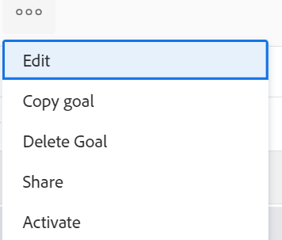

# Ativar metas no Adobe Workfront Goals

<!--Audited for P&P only: 4/2025-->

Ao criar uma meta, o Adobe Workfront Goals a salva com o status Rascunho. Metas rascunhadas não fazem parte do gerenciamento de metas.

Para rastrear a proximidade de atingir uma meta ao atualizar o progresso dela, é necessário ativá-la. Isso altera seu status para Ativo.

Para obter informações sobre como criar uma meta, consulte [Criar metas nas Metas do Adobe Workfront](../../workfront-goals/goal-management/create-goals.md).

>[!IMPORTANT]
>
>Você deve ativar uma meta antes de atualizar o progresso de seus resultados e atividades.

## Requisitos de acesso

>[!NOTE]
>
>Sua empresa pode continuar usando o Adobe Workfront Goals se este pacote foi comprado no passado. Você precisa falar com o seu representante de conta para obter mais detalhes.
>
>O Adobe Workfront Goals não está mais disponível para compra.

+++ Expanda para visualizar os requisitos de acesso da funcionalidade neste artigo. 

<table style="table-layout:auto">
<col>
</col>
<col>
</col>
<tbody>
  <tr>
  <td> 
Pacote do Adobe Workfront
 </td> 
   <td> 
   
Adobe Workfront Ultimate

<b>Nota</b>

Fale com o representante da Workfront se tiver um pacote do Workfront diferente.

   </td> 
  </tr> 
  <tr>
 <td role="rowheader">Configurações de nível de acesso</td>
 <td> 
Editar acesso às Metas
 </td>
 </tr>
 <tr>
 <td role="rowheader">Permissões de objeto</td>
 <td>
  

  
Exibir permissões ou mais altas para a meta para exibi-la

  
Gerenciar permissões para a meta para editá-la

  
 </td>
 </tr>
<tr>
   <td role="rowheader">
Modelo de layout
</td>
   <td> 
Todos os usuários, incluindo Administradores do sistema, devem receber um modelo de layout que inclua a área Metas no Menu principal. 
  
</td>
  </tr>
</tbody>
</table>

Para obter mais informações, consulte [Requisitos de acesso na documentação do Workfront](/help/quicksilver/administration-and-setup/add-users/access-levels-and-object-permissions/access-level-requirements-in-documentation.md).

+++

<!--
Old:
<table style="table-layout:auto">
<col>
</col>
<col>
</col>
<tbody>
 <tr> 
   <td role="rowheader">Adobe Workfront plan*</td> 
   <td> 
   
For the new plan and license structure:
  <ul><li>An Ultimate plan </li></ul>
   

For the current plan and license structure: 
<ul><li> A Pro or higher </li>
  <li>An Adobe Workfront Goals license in addition to a Workfront license.</li></ul>

   </td> 
  </tr>
 <tr>
 <td role="rowheader">Adobe Workfront license*</td>
 <td>
 
New license: Contributor or higher

 Or
 
Current license: Request or higher
 
For more information, see <a href="../../administration-and-setup/add-users/access-levels-and-object-permissions/wf-licenses.md" class="MCXref xref">Adobe Workfront licenses overview</a>.
 </td>
 </tr>
 <tr>
 <td role="rowheader">Product*</td>
 <td>
  
 New product requirement: Workfront

 
Or

  
Current product requirement: In addition to a Workfront license, you must purchase a license for Adobe Workfront Goals. 
 
For information, see <a href="../../workfront-goals/goal-management/access-needed-for-wf-goals.md" class="MCXref xref">Requirements to use Workfront Goals</a>. 
 </td>
 </tr>
 <tr>
 <td role="rowheader">Access level</td>
 <td> 
Edit access to Goals
 </td>
 </tr>
 <tr data-mc-conditions="">
 <td role="rowheader">Object permissions</td>
 <td>
  

  
View or higher permissions to the goal to view it

  
Manage permissions to the goal to edit it

  
For information about sharing goals, see <a href="../../workfront-goals/workfront-goals-settings/share-a-goal.md" class="MCXref xref">Share a goal in Workfront Goals</a>. 

  
 </td>
 </tr>
<tr>
   <td role="rowheader">
Layout template
</td>
   <td> 
All users, including Workfront administrators,  must be assigned a layout template that includes the Goals area in the Main Menu. 
  
</td>
  </tr>
</tbody>
</table>
-->

## Pré-requisitos

Para ativar uma meta, é necessário que ela esteja associada a um indicador de progresso como uma atividade, resultado, projeto ou que esteja alinhada a outra meta ativa.

Execute pelo menos um dos seguintes procedimentos para ativar uma meta:

* Adicionar um resultado à meta

  Para obter informações, consulte [Adicionar resultados às metas nas Metas do Adobe Workfront](../../workfront-goals/results-and-activities/add-results-to-goals.md).

* Adicionar uma atividade à meta

  Para obter informações, consulte [Adicionar atividades às metas nas Metas do Adobe Workfront](../../workfront-goals/results-and-activities/add-activities-to-goals.md).

* Conectar um projeto à meta

  Para obter informações, consulte [Adicionar projetos às metas no Adobe Workfront Goals](../results-and-activities/connect-projects-to-goals-overview.md).

* Alinhar outra meta à meta que você deseja ativar

  Para obter informações, consulte [Alinhar metas ao conectá-las às Metas do Adobe Workfront](../../workfront-goals/goal-alignment/align-goals-by-connecting-them.md).

## Ativar metas

Você pode ativar metas criadas ou uma meta para a qual tenha permissões de gerenciamento.

1. Vá para uma meta que você deseja ativar. A página de meta é aberta.

1. Clique no **Mais** ícone  à direita do nome da meta e clique em **Ativar**.

   

   O status da meta é alterado para Ativo. Agora é possível rastrear o progresso da meta, e a meta é exibida na seção Check-in, e também é considerada nas seções Gráficos das Metas do Workfront
