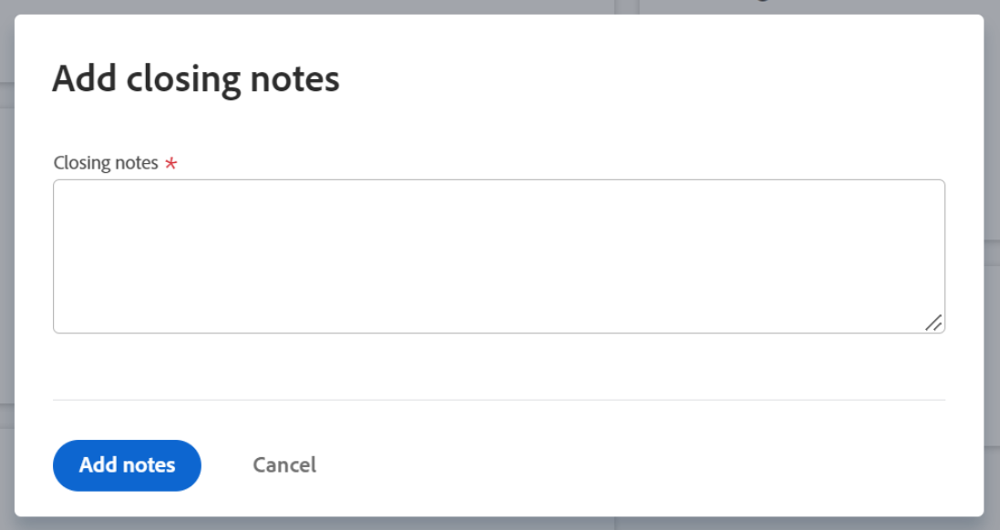

# Fechar e reabrir metas no Adobe Workfront Goals

Você pode fechar uma meta quando quiser indicar o seguinte:

* A meta está concluída, seja porque você a atingiu ou porque o período decorreu.
* Você não está mais trabalhando nisso nem planeja fazê-lo no futuro imediato.

Você pode reabrir metas que foram fechadas quando se tornaram relevantes novamente.

## Requisitos de acesso

Você deve ter o seguinte:

<table style="table-layout:auto">
<col>
</col>
<col>
</col>
<tbody>
 <tr> 
   <td role="rowheader">plano do Adobe Workfront*</td> 
   <td> 
   
Para o novo plano e estrutura de licença:
  <ul><li>Um plano Ultimate </li></ul>
   

Para o plano e a estrutura de licença atuais: 
<ul><li> A Pro ou superior </li>
  <li>Uma licença do Adobe Workfront Goals, além de uma licença da Workfront.</li></ul>

   </td> 
  </tr>
 <tr>
 <tr>
 <td role="rowheader">Licença da Adobe Workfront*</td>
 <td>
 
Nova licença: Contributor ou superior

 Ou
 
Licença atual: Solicitação ou superior
 
Para obter mais informações, consulte <a href="../../administration-and-setup/add-users/access-levels-and-object-permissions/wf-licenses.md" class="MCXref xref">visão geral das licenças da Adobe Workfront</a>.
 </td>
 </tr>
 <tr>
 <td role="rowheader">Produto*</td>
 <td>
 
 Novo requisito de produto, um dos seguintes: 

<ul>
<li>Um plano Select ou Prime do Adobe Workfront e uma licença adicional do Adobe Workfront Goals.</li>
<li>Um plano do Ultimate Workfront que inclui o Workfront Goals por padrão. </li></ul>
 
Ou

 
Requisito atual do produto: um plano do Workfront e uma licença adicional para o Adobe Workfront Goals. 
 
Para obter informações, consulte <a href="../../workfront-goals/goal-management/access-needed-for-wf-goals.md" class="MCXref xref">Requisitos para usar as Metas do Workfront</a>. 
 </td>
 </tr>
 <td role="rowheader">Nível de acesso</td>
 <td> 
Editar acesso às Metas
 </td>
 </tr>
 <tr data-mc-conditions="">
 <td role="rowheader">Permissões de objeto</td>
 <td>
  

  
Exibir permissões ou mais altas para a meta para exibi-la

  
Gerenciar permissões para a meta para editá-la

  
Para obter informações sobre como compartilhar metas, consulte <a href="../../workfront-goals/workfront-goals-settings/share-a-goal.md" class="MCXref xref">Compartilhar uma meta no Workfront Goals</a>. 

  
 </td>
 </tr>
<tr>
   <td role="rowheader">
Modelo de layout
</td>
   <td> 
Todos os usuários, incluindo administradores do Workfront, devem receber um modelo de layout que inclui a área Metas no Menu principal. 
  
</td>
  </tr>
</tbody>
</table>

*Para obter mais informações, consulte [Requisitos de acesso na documentação do Workfront](/help/quicksilver/administration-and-setup/add-users/access-levels-and-object-permissions/access-level-requirements-in-documentation.md).

## Considerações ao fechar ou reabrir metas

* Você deve ter acesso a Editar Metas no seu nível de acesso antes de fechar e reabrir metas. Para obter informações sobre como conceder acesso às Metas, consulte [Conceder acesso às Metas do Adobe Workfront](../../administration-and-setup/add-users/configure-and-grant-access/grant-access-goals.md).
* Você pode fechar somente metas ativas. Não é possível fechar metas que estejam no status de Rascunho.

  Para obter informações sobre status de meta, consulte [Visão geral sobre status de meta em Metas do Adobe Workfront](../../workfront-goals/goal-management/goal-status-overview.md).

* Fechar metas bloqueia seu progresso e permite que você classifique o desempenho de realizá-las.

  >[!CAUTION]
  >
  >Ao fechar uma meta que tenha metas de contribuição ativas, seu progresso muda após o fechamento para indicar o progresso das metas ativas de contribuição. Para obter informações sobre como alinhar metas, consulte [Alinhar metas ao conectá-las às Metas do Adobe Workfront](../../workfront-goals/goal-alignment/align-goals-by-connecting-them.md).

* Atualize os indicadores de progresso da meta antes de fechá-la, para garantir que a meta seja fechada com um valor de progresso preciso. Se todos os indicadores de progresso tiverem sido atingidos, o percentual de conclusão da meta deverá ser de 100% e a meta tiver sido atingida. Para obter informações sobre como atualizar suas metas, consulte [Atualizar progresso da meta nas Metas da Adobe Workfront](../../workfront-goals/goal-review-and-workfront-goals-sections/check-in-goals.md).
* Deixe qualquer comentário final como uma atualização das metas que você fecha. Para obter informações sobre como adicionar comentários às metas, consulte [Gerenciar comentários de meta nas Metas da Adobe Workfront](../../workfront-goals/goal-management/manage-goal-comments.md).
* Não é mais possível atualizar o progresso dos resultados e das atividades em uma meta que você fechar.
* Você pode reabrir uma meta fechada se quiser continuar trabalhando nela.
* Se a meta não tiver sido atingida, considere copiar a maioria de suas informações para o próximo período (trimestre ou ano). Essa é uma ótima opção para metas que são as mesmas de um período para o próximo ou metas que você ainda precisa atingir no próximo período. Para obter informações sobre como copiar metas, consulte [Copiar metas nas Metas da Adobe Workfront](../../workfront-goals/goal-management/copy-goals.md). Você também pode atualizar o período de tempo na meta em vez de copiá-lo para outro período.
* O Workfront exclui os comentários de uma meta encerrada quando você a reabre. Se precisar manter os comentários, recomendamos copiar a meta fechada, incluindo os resultados associados a ela, em vez de reabri-la.

## Fechar metas

<!--
Closing goals differs depending on what environment you use. 

### Close goals in the Production environment

1. Click the **Main Menu** icon  > **Goals** in the upper-right corner.

   (!-- Add this when Shell is available to all: or (if available), click the **Main Menu** icon  in the upper-left corner)
   --)

   The Goal List opens. 

1. (Optional) Modify your filters to display only goals that are active.

   For information about filtering information in Workfront Goals, see [Filter information in Adobe Workfront Goals](../../workfront-goals/goal-management/filter-information-wf-goals.md). 

1. Click an active goal.

   The Goal Details panel displays on the right. 

1. (Optional and recommended) Click the **Updates** tab and add an update in the **Comment here** field about the reason you are closing the goal, then click **Post**. 

1. Click the **More icon**  to the right of the goal name, then click **Close** > **Close Goal**.

   This closes the goal and saves the current progress on the goal and its results and activities.

   >[!IMPORTANT]
   >
   >If the goal has contributing goals that are still active, the progress of the goal continues to update based on the progress of the aligned goals.
   >
   >
   >   >
   >

1. (Optional) Modify your filters again to display only closed goals. The goals you closed display on the screen.
-->

1. Clique no ícone  > **Metas** do **Menu Principal** no canto superior direito.

   A Lista de metas é aberta.

   <!-- Add this when Shell is available to all: or (if available), click the **Main Menu** icon  in the upper-left corner)
   -->

1. (Opcional) Modifique seus filtros para exibir somente as metas que estão ativas.

   Para obter informações sobre como filtrar informações no Workfront Goals, consulte [Informações de filtro no Adobe Workfront Goals](../goal-management/filter-information-wf-goals.md).
1. Clique em uma meta ativa.

   A página de meta é aberta.

   
1. Clique no menu **Mais**  à direita do nome da meta e clique em **Fechar**.

   A meta é fechada e você recebe uma confirmação no canto superior direito da tela.

   

1. (Opcional) Na caixa de confirmação, clique em **Adicionar notas de fechamento** para adicionar comentários sobre esta meta e por que você precisa fechá-la.
1. Adicione notas de fechamento, depois clique em **Adicionar notas**.

   

   Os comentários são exibidos na seção Detalhes da meta da página da meta, na área Notas finais.

   >[!NOTE]
   >
   >O Workfront exclui as notas de fechamento se você reabrir uma meta fechada posteriormente.

## Reabrir metas

Você pode reabrir metas fechadas se decidir que elas se tornaram relevantes novamente e que é necessário continuar atualizando seu progresso.

<!--
Reopening goals differs depending on what environment you use.

### Reopen goals in the Production environment

1. Click the **Main Menu** icon  > **Goals** in the upper-right corner.

   (!-- Add this when Shell is available to all: or (if available), click the **Main Menu** icon  in the upper-left corner)
   --)

   The Goal List opens. 

1. (Optional) Modify your filters to display only goals that are closed.

   For information about filtering information in Workfront Goals, see [Filter information in Adobe Workfront Goals](../../workfront-goals/goal-management/filter-information-wf-goals.md).

1. Click a closed goal.

   This opens the Goal Details panel on the right. 

1. Click the **More icon**  to the right of the goal name, then click **Reopen** > **Reopen**.

   This reopens the goal and places it in a status of Active. The progress of the goal is recalculated starting with the current date. 

1. (Optional) Modify your filters again to display only active goals. The goals you opened display on the screen.

-->

1. Clique no ícone > **Metas** do **Menu Principal** no canto superior direito.

   A Lista de metas é aberta.

   <!-- Add this when Shell is available to all: or (if available), click the **Main Menu** icon  in the upper-left corner)
   -->

1. (Opcional) Modifique seus filtros para exibir somente as metas que estão fechadas.

   Para obter informações sobre como filtrar informações no Workfront Goals, consulte [Informações de filtro no Adobe Workfront Goals](../goal-management/filter-information-wf-goals.md).
1. Clique no nome de uma meta fechada.

   A página de meta é aberta.
1. Clique no menu **Mais**  à direita do nome da meta e **Reabrir** > **Reabrir**.

   As seguintes situações ocorrem:
   * A meta agora está aberta e tem um status de Ativa.
   * O progresso da meta é recalculado a partir da data atual.
   * As notas de fechamento são excluídas da página Detalhes da meta. As notas de fechamento excluídas não podem ser recuperadas.

1. (Opcional) Modifique seus filtros novamente para exibir somente as metas ativas.

   As metas que você abriu são exibidas na tela.

