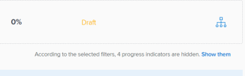

# Filtrar informações nos Adobe Workfront Goals

Você pode visualizar metas que você ou qualquer outra pessoa adicionou nas Metas do Adobe Workfront. Para obter informações sobre como criar metas, consulte [Criar metas no Adobe Workfront Goals](../../workfront-goals/goal-management/create-goals.md). Ao exibir metas, você pode filtrar informações no Workfront Goals para exibir apenas as metas que são importantes para você.

## Requisitos de acesso

Você deve ter o seguinte acesso para executar as ações descritas neste artigo:

<table style="table-layout:auto">
<col>
</col>
<col>
</col>
<tbody>
 <tr>
 <td role="rowheader">plano do Adobe Workfront</td>
 <td>
 
Qualquer

</td>
 </tr>
 <tr>
 <td role="rowheader">Licença da Adobe Workfront*</td>
 <td>
 
Nova licença: Contributor ou superior

 Ou
 
Licença atual: Solicitação ou superior
 
Para obter mais informações, consulte <a href="../../administration-and-setup/add-users/access-levels-and-object-permissions/wf-licenses.md" class="MCXref xref">Visão geral das licenças do Adobe Workfront</a>.
 </td>
 </tr>
 <tr>
 <td role="rowheader">Produto*</td>
 <td>
 
 Novo requisito de produto, um dos seguintes: 

<ul>
<li>Um plano Select ou Prime do Adobe Workfront e uma licença adicional do Adobe Workfront Goals.</li>
<li>Um plano do Ultimate Workfront que inclui o Workfront Goals por padrão. </li></ul>
 
Ou

 
Requisito atual do produto: um plano do Workfront e uma licença adicional para o Adobe Workfront Goals. 
 
Para obter informações, consulte <a href="../../workfront-goals/goal-management/access-needed-for-wf-goals.md" class="MCXref xref">Requisitos para usar as metas do Workfront</a>. 
 </td>
 </tr>
 <tr>
 <td role="rowheader">Nível de acesso</td>
 <td> 
Editar acesso às Metas
 </td>
 </tr>
 <tr data-mc-conditions="">
 <td role="rowheader">Permissões de objeto</td>
 <td>
  

  
Exibir permissões ou mais altas para a meta para exibi-la

  
Gerenciar permissões para a meta para editá-la

  
Para obter informações sobre como compartilhar metas, consulte <a href="../../workfront-goals/workfront-goals-settings/share-a-goal.md" class="MCXref xref">Compartilhar uma meta no Workfront Goals</a>. 

  
 </td>
 </tr>
 <tr>
   <td role="rowheader">
Modelo de layout
</td>
   <td> 
Todos os usuários, incluindo administradores do Workfront, devem receber um modelo de layout que inclui a área Metas no Menu principal. 
  
</td>
  </tr>
</tbody>
</table>

*Para obter mais informações, consulte [Requisitos de acesso na documentação do Workfront](/help/quicksilver/administration-and-setup/add-users/access-levels-and-object-permissions/access-level-requirements-in-documentation.md).

## Visão geral dos filtros no Workfront Goals

>[!NOTE]
>
>Para encontrar e se concentrar nas metas certas de maneira eficiente, recomendamos que você use filtros nas Metas do Workfront. Isso permite exibir as informações corretas antes de começar a gerenciar metas importantes para você. Por padrão, o Workfront Goals exibe todas as metas no sistema.

Você pode localizar e filtrar metas nas seguintes seções da área Metas no Workfront:

* Lista de metas
* Gráficos
* Alinhamento de metas

Para obter informações sobre as seções da área Metas, consulte [Visão geral das seções de Metas do Adobe Workfront](../../workfront-goals/goal-review-and-workfront-goals-sections/overview-of-wf-goals-sections.md).

>[!IMPORTANT]
>
>É possível configurar filtros para uma seção e eles permanecem persistentes ao passar para outra seção do Workfront Goals.

Considere o seguinte ao trabalhar com filtros nas Metas do Workfront:

* É possível criar e aplicar um filtro sem salvá-lo ou salvar um filtro para reutilização posterior.

  Existem os seguintes cenários:

   * Ao salvar um filtro, ele se torna o filtro padrão sempre que você faz logon no Workfront Goals.
   * Ao aplicar um filtro sem salvá-lo, é possível reverter para as listas originais atualizando a página.

* Só é possível exibir e aplicar filtros criados. Os filtros criados por outros usuários são exibidos somente para esses usuários.
* Não é possível compartilhar filtros criados com outros usuários.

## Aplicar um filtro rápido nos Objetivos do Workfront

Você pode usar um filtro rápido em uma lista de metas para ajudar a localizar apenas itens importantes para você. Não é possível salvar filtros rápidos e eles não são persistentes. O Workfront apaga os resultados de um filtro rápido ao atualizar a página.

Para obter mais informações, consulte [Aplicar o filtro rápido a uma lista](../../workfront-basics/navigate-workfront/use-lists/apply-quick-filter-list.md).

## Criar e aplicar um filtro nos Objetivos do Workfront

O processo de criação de filtros é o mesmo para qualquer seção das Metas do Workfront.

É possível criar um filtro do zero ou editar um dos filtros incorporados.

1. Vá para as Metas do Workfront.

   Para obter informações sobre como acessar o Workfront Goals, consulte [Acessar e abrir metas no Adobe Workfront Goals](../../workfront-goals/goal-management/access-goals-in-wf-goals.md)

   Por padrão, a seção Lista de metas é exibida.

1. Clique em **Filtro** no canto superior direito da lista.

   

   Por padrão, o Workfront aplica o **Todos** filtro que exibe todas as metas no sistema.

   >[!TIP]
   >
   >Não é possível editar ou excluir o filtro Todos.

1. Siga um destes procedimentos:

   * Clique em qualquer um dos filtros predefinidos a seguir para exibir metas somente para os seguintes proprietários:

     <table style="table-layout:auto"> 
      <col> 
      <col> 
      <tbody> 
       <tr> 
        <td>Todos</td> 
        <td> 
Todas as metas no sistema, independentemente de quem as criou, qual é o período de tempo para elas ou quem é o proprietário. Esse é o filtro padrão e não é possível editá-lo. 
 <!--
          
(NOTE: what the ALL filter displays might change; right now, it displays all, regardless of status, period, owner, etc)

         --> </td> 
       </tr> 
       <tr> 
        <td>Pessoal</td> 
        <td>As metas para as quais você é o proprietário.</td> 
       </tr> 
       <tr> 
        <td>Minhas equipes</td> 
        <td> 
As metas para as quais qualquer uma de suas equipes está selecionada como proprietária. 
 
<b>DICA</b>

     Nenhuma meta é exibida quando você não está atribuído a nenhuma equipe. 
 </td>
     </tr> 
       <tr> 
        <td>Meus grupos</td> 
        <td>As metas para as quais qualquer um dos seus grupos é selecionado como proprietário. </td> 
       </tr> 
       <tr> 
        <td>Empresa</td> 
        <td> 
As metas associadas à sua organização. 
 
<b>DICA</b>
        
No Adobe Workfront Goals, o filtro Empresa exibe as metas para as quais sua organização está selecionada como proprietária. 
 
Não é possível pesquisar empresas que usam esse campo. Por padrão, somente a organização que é a proprietária da instância do Workfront é selecionada. 
 
 </td> 
       </tr> 
      </tbody> 
     </table>

   * Passe o mouse sobre o nome de um filtro, em seguida, clique no **Editar** ícone  ao lado do nome para personalizá-lo e adicionar nomes específicos de usuários, equipes, grupos ou o nome de sua organização, em seguida, selecione-o quando eles aparecerem na lista.

   * Clique em **Novo Filtro** para criar um novo filtro, selecione uma das seguintes opções para personalizar o novo filtro:

     <table style="table-layout:auto"> 
      <col> 
      <col> 
      <tbody> 
       <tr> 
        <td role="rowheader">Período</td> 
        <td>Selecione um período no menu suspenso. Você pode selecionar vários períodos de tempo. </td> 
       </tr> 
       <tr> 
        <td role="rowheader">Status</td> 
        <td> 
Selecione um status no menu suspenso das seguintes opções:
 
         <ul> 
          <li> 
Ativo
 </li> 
          <li> 
Rascunho
 </li> 
          <li> 
Inativo
 </li> 
          <li> 
Fechado
 </li> 
         </ul> </td> 
       </tr> 
       <tr> 
        <td role="rowheader">Progresso</td> 
        <td> 
Selecione um progresso no menu suspenso das seguintes opções: 
 
         <ul> 
          <li> 
Com problemas
 </li> 
          <li> 
Em Risco
 </li> 
          <li> 
No Prazo
 </li> 
         </ul> </td> 
       </tr> 
       <tr> 
        <td role="rowheader">Proprietário</td> 
        <td> 
Comece digitando o nome de um proprietário e, em seguida, selecione-o quando ele aparecer na lista. 
 
É possível digitar os nomes de usuários, equipes, grupos ou o nome de sua organização, ou você pode selecionar a partir de opções predefinidas. 
 
As opções de filtro predefinidas a seguir sempre se referem ao usuário que está conectado no momento: 
 
         <ul> 
          <li> 
<strong>Eu</strong>: exibe as metas nas quais você é o proprietário.
 </li> 
          <li> 
<strong>Minha equipe inicial</strong> e <strong>Todas as minhas equipes</strong>: exibe as metas nas quais sua Equipe inicial ou qualquer uma de suas equipes é designada como proprietária. 
 
Dica: nenhuma meta é exibida quando você não está atribuído a nenhuma equipe. 
 </li> 
          <li> 
<strong>Meu Grupo Padrão</strong> e <strong>Todos os Meus Grupos</strong>: exibe as metas nas quais o Grupo inicial ou qualquer um dos grupos é designado como proprietário.
 </li> 
         </ul> </td> 
       </tr> 
      </tbody> 
     </table>

1. (Opcional) Clique em **Redefinir** no canto inferior direito da caixa de filtro para limpar todos os campos selecionados e começar a criar o filtro do zero.
1. (Opcional) Clique em **Aplicar** para aplicar o filtro sem salvar.

   O filtro é exibido no campo **Não salvo** área do construtor de filtros como **Novo Filtro**.

   Não é possível renomear um filtro não salvo.

   Os filtros não salvos são removidos da área Metas na próxima vez que você sair do Workfront e fizer logon novamente.

   >[!TIP]
   >
   >Você pode ter somente um Novo Filtro não salvo de cada vez.

1. Clique em **Salvar** para salvar o filtro e usá-lo posteriormente, adicione um nome para o filtro na **Adicionar nome do filtro** e clique em **Concluído**.

   Isso salva o filtro na variável **Salvo** seção do construtor de filtros. Você pode usar esse filtro no futuro.

   O último filtro salvo e aplicado é exibido por padrão na próxima vez que você fizer logon novamente no Workfront

1. (Opcional) Clique no link **seta para a esquerda** ao lado de **Novo Filtro** para sair do construtor de filtros e retornar à lista de filtros.
1. (Opcional) Passe o mouse sobre o nome de um filtro personalizado, clique no **Mais** e clique em **Excluir**, depois **Excluir**. Isso exclui o filtro e não é possível recuperá-lo.

   >[!TIP]
   >
   >Não é possível excluir nenhum dos filtros predefinidos.

1. Clique em **Ícone X** no canto superior direito do construtor de filtros, para fechar o construtor de filtros.

   O nome do filtro aplicado no momento é exibido à direita do ícone Filter, no canto superior direito da lista de metas.

   A lista de metas é filtrada pelos seus critérios de filtro.

1. (Opcional e condicional) Ao exibir metas na seção Alinhamento de metas, clique em **Mostre-lhes** se quiser exibir as metas filtradas.

   

   O nome do filtro é contornado em amarelo para indicar que está sendo ignorado.

   

1. (Opcional e condicional) Clique em **Reaplicar filtro** para aplicar o filtro e omitir os itens exibidos na etapa anterior.

