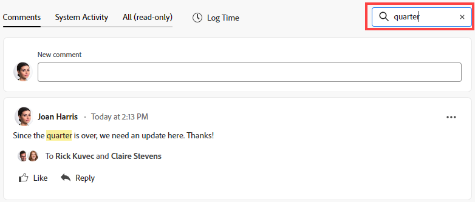
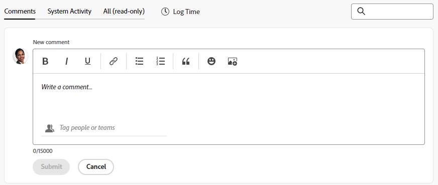

# Gerenciar comentários de meta em Metas do Adobe Workfront

{{highlighted-preview}}

<!--Audited: 01/2024-->

<!--consider retiring this article when goals and all objects are in parity and we remove the legacy commenting from the system. From then on, there is just ONE way to comment and that will be documented in the Update Work article-->

<!--take "legacy" and "new commenting" references out when we remove the legacy - April 2024???-->

<!--The highlighted information on this page refers to functionality not yet generally available. It is available only in the Preview environment for all customers. 

For information about the current release schedule, see [First Quarter 2024 release overview](../../product-announcements/product-releases/24-q1-release-activity/24-q1-release-overview.md).-->

<!--
After the monthly releases to Production, the same features are also available in the Production environment for customers who enabled fast releases.   
For information about fast releases, see [Enable or disable fast releases for your organization](../../administration-and-setup/set-up-workfront/configure-system-defaults/enable-fast-release-process.md)  
-->

É possível adicionar comentários a todas as metas que você pode exibir no Adobe Workfront Goals.

## Requisitos de acesso

Você deve ter o seguinte acesso para executar as ações descritas neste artigo:

<table style="table-layout:auto">
<col>
</col>
<col>
</col>
<tbody>
 <tr>
 <td role="rowheader">plano do Adobe Workfront</td>
 <td>
 
Qualquer

</td>
 </tr>
 <tr>
 <td role="rowheader">Licença da Adobe Workfront*</td>
 <td>
 
Nova licença: Contributor ou superior

 Ou
 
Licença atual: Solicitação ou superior
 </td>
 </tr>
 <tr>
 <td role="rowheader">Produto*</td>
 <td>
 
 Novo requisito do produto: se você tiver o plano Select ou Prime Adobe Workfront, também deverá comprar uma licença adicional do Adobe Workfront Goals. As Metas do Workfront estão incluídas no Plano Ultimate Workfront.

 Ou
 
Requisito atual do produto: você deve adquirir uma licença adicional para que o Adobe Workfront Goals acesse a funcionalidade descrita neste artigo. 
 
Para obter informações, consulte <a href="../../workfront-goals/goal-management/access-needed-for-wf-goals.md" class="MCXref xref">Requisitos para usar as metas do Workfront</a>. 
 </td>
 </tr>
 <tr>
 <td role="rowheader">Configuração do nível de acesso</td>
 <td> 
Acesso maior ou igual a Metas
 
<b>Nota</b>
Se você não tiver acesso, pergunte ao administrador do Workfront se ele definiu restrições adicionais em seu nível de acesso. Para obter mais informações, consulte <a href="../../administration-and-setup/add-users/configure-and-grant-access/grant-access-goals.md" class="MCXref xref">Conceder acesso ao Adobe Workfront Goals</a></td>
 </tr>
 <tr data-mc-conditions="">
 <td role="rowheader">Permissões de objeto</td>
 <td>
  

  
Exibir ou aumentar as permissões para a meta

  
Por padrão, os usuários não têm acesso às metas do 

 
Para obter informações sobre como compartilhar metas, consulte <a href="../../workfront-goals/workfront-goals-settings/share-a-goal.md" class="MCXref xref">Compartilhar uma meta no Workfront Goals</a>. 

  
 </td>
 </tr>
</tbody>
</table>

*Para descobrir que plano, tipo de licença ou acesso você tem, entre em contato com o administrador do Workfront. Para obter mais informações, consulte [Requisitos de acesso na documentação do Workfront](/help/quicksilver/administration-and-setup/add-users/access-levels-and-object-permissions/access-level-requirements-in-documentation.md).

## Pré-requisitos

Você deve ter o seguinte antes de iniciar:

* Um Modelo de layout que inclui a área Metas no Menu principal.

## Gerenciar comentários da meta

Você pode adicionar comentários às metas na seção Atualizações da página de uma meta.

Você pode responder ou curtir um comentário que você ou outras pessoas adicionaram nesta área.

1. Clique em **Menu principal** ícone  no canto superior direito, ou na guia **Menu principal** ícone  no canto superior esquerdo, se disponível, clique em **Metas**.
Isso abre a lista de metas.
1. Localize a meta à qual deseja adicionar comentários e clique no nome dela para abrir a página de metas.
1. Clique em  **Atualizações** no painel esquerdo.
1. (Opcional) Para localizar um comentário existente, comece digitando uma palavra-chave <!--or a user's name--> no **Pesquisar** no canto superior direito da caixa **Comentários** guia.

   

   Exemplo no ambiente de Pré-visualização:
   

   

   Exemplo no ambiente de Produção:
   

   A palavra-chave <!--or user--> pesquisado for realçado e os comentários que o contêm serão exibidos na parte superior da seção Atualizações.

   <!--change the NOTE below when functionality changes-->

   >[!NOTE]
   >
   >Você deve procurar uma palavra incluída em um comentário ou resposta. Não é possível procurar um usuário ou uma equipe marcada.

   Para obter mais informações, consulte [Atualizar trabalho](../../workfront-basics/updating-work-items-and-viewing-updates/update-work.md).

1. Clique em **x** no campo de pesquisa para limpar os resultados da pesquisa e retornar à atualização completa.
1. Clique em **Comentários** no canto superior esquerdo da área Atualizações.
1. Comece a inserir um comentário no **Novo comentário** caixa.

   

   Exemplo de nova caixa de comentário no ambiente de Pré-visualização:
   

   

   Exemplo de nova caixa de comentário no ambiente de Produção:
   

   >[!TIP]
   >
   >Sair da seção Atualizações antes de terminar de digitar e enviar um comentário mantém o comentário na página no modo de rascunho mesmo depois de fazer logoff e logon novamente. As imagens adicionadas ao comentário também são salvas no rascunho. Os rascunhos são salvos por 7 dias após os quais são descartados e não podem ser recuperados. Comentários em rascunho só ficam visíveis para o usuário que os digita.

1. (Opcional) Para desfazer ou refazer uma alteração, use as seguintes teclas de atalho:
   * CTRL + Z (⌘+z para Mac) para desfazer uma alteração
   * CTRL + Y (⌘+y para Mac) para refazer uma alteração
1. (Opcional) Para adicionar formatação de rich text à atualização, a um hiperlink ou a uma imagem, use as opções na barra de ferramentas Rich Text ou nos ícones adjacentes a ela. Para obter mais informações, consulte [Atualizar trabalho](../../workfront-basics/updating-work-items-and-viewing-updates/update-work.md).
1. (Opcional) Na **Marcar pessoas ou equipes** digite o nome ou o email de um usuário ou de uma equipe que deseja incluir neste comentário e, em seguida, selecione-o quando ele for exibido na lista.
1. Selecione o **Privativo(s) de minha empresa** ativar para tornar o comentário visível somente para pessoas em sua empresa.

   >[!TIP]
   >
   >É necessário ter uma Empresa especificada em seu perfil para disponibilizar essa opção na área Atualizações.

1. Clique em **Enviar**.

   >[!TIP]
   >
   >Se outro usuário enviar um comentário para o mesmo item que você está atualizando, haverá uma linha vermelha com um indicador &quot;Novo&quot; para informá-lo sobre os comentários mais recentes, bem como uma notificação azul na parte inferior da tela indicando o número de novos comentários.
   >
   >O indicador só é exibido depois que o comentário foi enviado sobre o item, e não quando o comentário ainda está composto.
   >

1. Para editar um comentário, clique no link **Mais** menu  à direita do ícone Curtir e, em seguida, clique em **Editar**.
1. Edite as informações no comentário, adicione ou remova imagens ou remova qualquer um dos usuários marcados.
Você pode editar seu comentário dentro de 15 minutos a partir do envio. Um indicador &quot;editado&quot; é adicionado à esquerda do carimbo de data que é exibido quando o comentário é atualizado.

   

   >[!TIP]
   >
   > * Um email é gerado para notificar os usuários sobre sua atualização somente quando você envia a atualização original. Nenhum email é gerado após a edição da atualização.
   >
   > * O carimbo de data é a data do comentário original e não a data da última atualização.

1. (Opcional) Clique no link **Mais** menu , em seguida, clique em qualquer uma das seguintes opções para copiar informações de um comentário para a área de transferência ou para uma nova resposta:

   * **Copiar link** para copiar o link de uma atualização, sem as respostas.
   * **Copiar texto do corpo** para copiar o texto de uma atualização.
   * **Citar resposta** para abrir uma nova caixa de comentário onde o comentário original é citado em uma nova resposta e é marcado como uma citação em bloco.

     Para obter mais informações, consulte [Atualizar trabalho](../../workfront-basics/updating-work-items-and-viewing-updates/update-work.md).

1. (Opcional) Clique no link **Mais** menu  à direita de um comentário e clique em **Excluir** para excluir um comentário adicionado. Para obter mais informações, consulte [Atualizar trabalho](../../workfront-basics/updating-work-items-and-viewing-updates/update-work.md).
1. (Opcional) Clique em **Responder** para responder a um comentário existente, siga as etapas 5 a 9 acima. Para obter mais informações sobre como responder a atualizações, consulte [Responder a atualizações](../../workfront-basics/updating-work-items-and-viewing-updates/reply-to-updates.md). <!--insure this stays accurate-->
1. (Condicional e opcional) Se outros usuários tiverem adicionado comentários que são exibidos fora da área visível na seção Atualizações, clique em **Exibir** dentro do azul **novo banner de comentários** na parte inferior da tela para exibir esses comentários.

   

   Comentários adicionais são exibidos na parte inferior da tela.
1. (Opcional) Clique no link **Curtir** ícone para gostar de um comentário que outra pessoa adicionou. O ícone é atualizado com o número de curtidas.

1. (Opcional) Clique no link **Atividade do sistema** para ver as atualizações registradas pelo sistema. Quando uma meta é atualizada, o Workfront gera uma observação sobre essa atualização e a exibe na guia Atividade do sistema. O Workfront também registra uma atualização do sistema quando um resultado, atividade ou projeto é adicionado à meta ou quando é atualizado. <!--ensure the casing on the tab has not changed-->

1. (Opcional) Clique no link **Todos** para exibir comentários do usuário e comentários de atividades do sistema em um local. Para responder a um comentário na guia Todos, clique em **Responder em Comentários** para abrir o comentário na guia Comentários. Não é possível responder na guia All.

