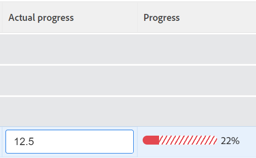

# Analisar metas em andamento nas metas da Adobe Workfront

<!--

(NOTE: the status of goals in "red" used to be called At Risk. Now, it is "in trouble") 

-->

Os objetivos com o Progresso da Solução de Problemas correm o risco de não serem alcançados e são representados por uma barra de progresso vermelha nos Objetivos do Adobe Workfront. Você deve rever seus objetivos com frequência e entender por que o progresso está atrasando. Para obter informações sobre o progresso da meta, consulte [Visão geral do progresso e condição da meta nas Metas da Adobe Workfront](../../workfront-goals/goal-management/calculate-goal-progress.md).

## Requisitos de acesso

<!--drafted for P&P release: replace the existing requirements with this:

You must have the following: 

<table style="table-layout:auto">
 <col>
 </col>
 <col>
 </col>
 <tbody>
  <tr>
   <td role="rowheader">Adobe Workfront plan*</td>
   <td>
   
Current plan: Select or higher

   Or
   
Legacy plan: Pro or higher

   
   </td>
  </tr>
  <tr>
   <td role="rowheader">Adobe Workfront license*</td>
   <td>
   
Current license: Contributor or higher

   Or
   
Legacy license: Request or higher
 
For more information, see <a href="../../administration-and-setup/add-users/access-levels-and-object-permissions/wf-licenses.md" class="MCXref xref">Adobe Workfront licenses overview</a>.
 </td>
  </tr>
  <tr>
   <td role="rowheader">Product</td>
   <td>
   
 Current product requirement: If you have the Select or Prime Adobe Workfront plan, you must also buy an additional Adobe Workfront Goals license.  Workfront Goals are included in the Ultimate Workfront Plan.

   Or
   
Legacy product requirement: You must purchase an additional license for the Adobe Workfront Goals to access functionality described in this article. 
 
For information, see <a href="../../workfront-goals/goal-management/access-needed-for-wf-goals.md" class="MCXref xref">Requirements to use Workfront Goals</a>. 
 </td>
  </tr>
  <tr>
   <td role="rowheader">Access level*</td>
   <td> 
Edit access to Goals
 
<b>NOTE</b>
If you still don't have access, ask your Workfront administrator if they set additional restrictions in your access level. For information on how a Workfront administrator can change your access level, see:

     <ul>
      <li> 
<a href="../../administration-and-setup/add-users/configure-and-grant-access/create-modify-access-levels.md" class="MCXref xref">Create or modify custom access levels</a> 
 </li>
      <li> 
<a href="../../administration-and-setup/add-users/configure-and-grant-access/grant-access-goals.md" class="MCXref xref">Grant access to Adobe Workfront Goals</a> 
 </li>
     </ul> 
 </td>
  </tr>
  <tr data-mc-conditions="">
   <td role="rowheader">Object permissions</td>
   <td>
    

     
View or higher permissions to the goal to view it

     
Manage permissions to the goal to edit it

     
For information about sharing goals, see <a href="../../workfront-goals/workfront-goals-settings/share-a-goal.md" class="MCXref xref">Share a goal in Workfront Goals</a>. 

    
 </td>
  </tr>
 </tbody>
</table>

-->

Você deve ter o seguinte:

<table style="table-layout:auto"> 
 <col> 
 <col> 
 <tbody> 
  <tr> 
   <td role="rowheader">Plano Adobe Workfront*</td> 
   <td> 
Pro ou superior
 </td> 
  </tr> 
  <tr> 
   <td role="rowheader">Licença da Adobe Workfront*</td> 
   <td> 
Solicitação ou superior
 
Para obter mais informações, consulte <a href="../../administration-and-setup/add-users/access-levels-and-object-permissions/wf-licenses.md" class="MCXref xref">Visão geral das licenças do Adobe Workfront</a>.
 </td> 
  </tr> 
  <tr> 
   <td role="rowheader">Produto</td> 
   <td> 
Você deve comprar uma licença adicional para a funcionalidade Metas da Adobe Workfront para acessar descrita neste artigo. 
 
Para obter mais informações, consulte <a href="../../workfront-goals/goal-management/access-needed-for-wf-goals.md" class="MCXref xref">Requisitos para usar as metas do Workfront</a>. 
 </td> 
  </tr> 
  <tr> 
   <td role="rowheader">Configurações de nível de acesso*</td> 
   <td> 
Editar o acesso às Metas ou superior
 
<b>Nota</b>
Caso ainda não tenha acesso, pergunte ao administrador do Workfront se ele definiu restrições adicionais em seu nível de acesso. Para obter informações sobre como um administrador do Workfront pode alterar seu nível de acesso, consulte:
 
     <ul> 
      <li> 
<a href="../../administration-and-setup/add-users/configure-and-grant-access/create-modify-access-levels.md" class="MCXref xref">Criar ou modificar níveis de acesso personalizados</a> 
 </li> 
      <li> 
<a href="../../administration-and-setup/add-users/configure-and-grant-access/grant-access-goals.md" class="MCXref xref">Conceder acesso às Metas da Adobe Workfront</a> 
 </li> 
     </ul> 
 </td> 
  </tr> 
  <tr data-mc-conditions=""> 
   <td role="rowheader">Permissões de objeto</td> 
   <td> 
    
 
     
Gerenciar permissões para a meta
 
     
Para obter informações sobre como compartilhar metas, consulte <a href="../../workfront-goals/workfront-goals-settings/share-a-goal.md" class="MCXref xref">Compartilhar uma meta na Workfront</a>. 
 
    
 </td> 
  </tr> 
 </tbody> 
</table>

&#42;Para descobrir qual plano, tipo de licença ou acesso você tem, entre em contato com o administrador da Workfront.

## Pré-requisitos

Você deve ter o seguinte antes de começar:

* Um modelo de layout que inclui a área Metas no Menu principal.

## Recommendations para impedir que metas atinjam um progresso de Em problemas

Antes de atingir o progresso do Em problemas, você pode monitorá-los com frequência e ajustar o progresso quando atingir o progresso do Em risco. Os objetivos que estão em risco correm o risco de se tornarem em perigo. Para obter mais informações sobre o progresso da meta, consulte [Visão geral do progresso e condição da meta nas Metas da Adobe Workfront](../../workfront-goals/goal-management/calculate-goal-progress.md)

Antes de suas metas atingirem o progresso do Em problemas, recomendamos o seguinte:

* Analise as metas que geralmente são atribuídas a você, bem como as metas organizacionais atribuídas a suas equipes, grupos ou à sua organização, e que podem ser afetadas pelo progresso das metas. Os objetivos de risco correm o risco de se tornarem objetivos difíceis. Os objetivos em risco são marcados por uma barra de progresso amarela. Use a Lista de metas para exibir metas que pertencem a você, suas equipes, grupos ou sua organização.

## Analise as metas em andamento na Lista de metas

Você pode revisar as metas em qualquer seção das Metas da Workfront. Para obter informações sobre as seções Metas da Workfront , consulte [Visão geral das seções Metas da Adobe Workfront](../../workfront-goals/goal-review-and-workfront-goals-sections/overview-of-wf-goals-sections.md).

Este artigo descreve como revisar metas na Lista de metas.

1. Clique no botão **Menu principal** ícone  > **Metas** no canto superior direito.

   <!-- Add this when Shell is available to all: or (if available), click the **Main Menu** icon  in the upper-left corner)
   -->

   Isso abre a área Metas do Workfront e a seção Lista de metas é exibida por padrão.

1. (Recomendado) Ajuste os seguintes filtros para a área Lista de metas para analisar as metas de risco:

   * Clique em **Empresa**, em seguida **Minhas equipes**, em seguida **Meus grupos**, em seguida **Pessoal** nesta ordem para visualizar metas que pertencem à sua organização, às suas equipes, grupos e, em seguida, às suas próprias metas.

      >[!TIP]
      >
      >Nas Metas da Adobe Workfront, o filtro Empresa exibe as metas para as quais sua organização está selecionada como proprietária.
      >
      >
      >Não é possível pesquisar empresas usando esse campo. Somente sua organização, que é a proprietária da instância do Workfront, é selecionada por padrão.

   * Para cada uma das unidades organizacionais selecionadas acima, clique em **Novo filtro** > **Andamento** > **Em problemas** >**Aplicar.**
   * (Opcional) Selecione o período de tempo para o qual deseja exibir as metas.

      O indicador da barra de progresso é exibido em vermelho para cada meta na lista de metas.

      Para obter mais informações sobre como filtrar metas usando todos os outros critérios no painel direito, consulte [Filtrar informações em metas do Adobe Workfront](../../workfront-goals/goal-management/filter-information-wf-goals.md).

1. Passe o mouse sobre o indicador da barra de progresso para ver qual é a porcentagem de progresso real e qual é o valor esperado para o dia atual.

   

1. (Opcional) Use os filtros para encontrar metas que pertencem a um proprietário específico.

   As metas em andamento para os usuários selecionados são exibidas na lista de metas.

1. Clique em um nome de meta para abrir a página de meta e, em seguida, clique em **Indicadores de progresso** no painel esquerdo. Exibir qual indicador de progresso faz com que a meta fique atrás e atualizar o progresso do indicador em linha, na **Progresso real** coluna da lista Indicadores de progresso.

   Para obter informações sobre como atualizar resultados e atividades, consulte [Atualizar o progresso da meta nas Metas da Adobe Workfront](../goal-review-and-workfront-goals-sections/check-in-goals.md)

   

   >[!NOTE]
   >
   >Você pode atualizar apenas os resultados e atividades na lista de Indicadores de progresso. Você deve atualizar os indicadores de progresso das metas secundárias acessando as metas e atualizar as tarefas nos projetos conectados para atualizar o progresso dos projetos.

