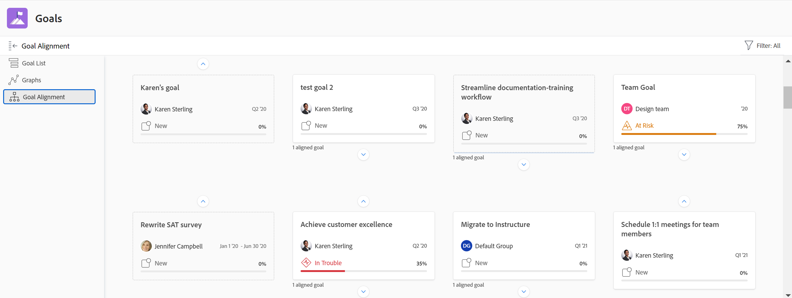

# Visão geral das seções de Metas do Adobe Workfront

>[!IMPORTANT]
>
>Sua organização deve ter as seguintes opções para usar a funcionalidade descrita neste artigo:
>
>* Para o novo plano e estrutura de licença:
>
>   * O plano Ultimate Workfront
>    
>* Para o plano e a estrutura de licença atuais:
>
>   * Um plano Pro ou superior do Workfront
>   * Uma licença do Adobe Workfront Goals, além de uma licença da Workfront.
>
>Entre em contato com o gerente de conta da Workfront para saber mais sobre uma licença do Workfront Goals.
> 
>Para obter informações adicionais sobre o acesso às Metas do Workfront, consulte [Requisitos para usar as Metas do Workfront](/help/quicksilver/workfront-goals/goal-management/access-needed-for-wf-goals.md).

Depois que o administrador do Workfront conceder acesso às Metas do Workfront, você poderá visualizar as metas que você ou qualquer outra pessoa na organização criou na área Metas da Workfront.

Você pode acessar listas de metas ou metas individuais e gerenciá-las de várias seções das Metas do Workfront. A seção usada depende do propósito que você deseja atingir ao trabalhar com metas.

Aplique filtros para exibir somente as metas que são importantes para você em cada seção.

>[!TIP]
>
>Os filtros atualizados em uma seção são aplicados automaticamente às seções Lista de metas, Gráficos e Alinhamento de metas. Dessa forma, você pode atualizá-los apenas uma vez. Para obter mais informações, consulte [Filtrar informações em Metas do Adobe Workfront](../../workfront-goals/goal-management/filter-information-wf-goals.md).

A seguir, há uma breve visão geral das seções de Metas do Workfront e das opções disponíveis para gerenciar metas. Para obter mais informações sobre ações adicionais que você pode executar em cada seção das Metas do Workfront, também recomendamos os seguintes artigos:

* [Criar metas nas Metas do Adobe Workfront](../../workfront-goals/goal-management/create-goals.md)
* [Atualizar progresso da meta nas Metas do Adobe Workfront](../../workfront-goals/goal-review-and-workfront-goals-sections/check-in-goals.md)
* [Filtrar informações em Metas do Adobe Workfront](../../workfront-goals/goal-management/filter-information-wf-goals.md)

## Lista de metas

Você pode usar a Lista de metas para analisar metas que pertencem a você, suas equipes, grupos ou sua organização. Você pode visualizar metas em qualquer status e a partir de qualquer período de tempo.

Para obter informações sobre como navegar na Lista de Metas e gerenciar metas, consulte [Gerenciar metas na Lista de Metas da Adobe Workfront](../../workfront-goals/goal-review-and-workfront-goals-sections/manage-goals-in-goal-list.md).

Use a Lista de metas para fazer o seguinte:

* Exibir metas que pertencem a você, suas equipes, grupos ou organização.
* Analise as metas e suas informações (por exemplo, nome, proprietário, progresso ou condição).
* Adicionar novas metas.

  Para obter mais informações, consulte [Criar metas nas Metas do Adobe Workfront](../../workfront-goals/goal-management/create-goals.md).

* Acessar a página de uma meta e editar e atualizar a meta, seus resultados ou atividades

  Para obter mais informações, consulte [Editar metas nas Metas da Adobe Workfront](../../workfront-goals/goal-management/edit-goals.md).

* Editar metas.

## Gráficos

Você pode usar a seção Gráficos para obter uma visualização integral da integridade das metas que pertencem a você ou à sua organização. Você pode exibir informações de progresso das metas em qualquer status de qualquer período nesta seção.

Para obter informações sobre como usar a seção Gráficos, consulte [Revisar gráficos para entender as tendências de progresso das metas nas Metas do Adobe Workfront](../../workfront-goals/goal-review-and-workfront-goals-sections/review-goal-graphs.md).

Use a seção Gráficos para fazer o seguinte:

* Veja o desempenho das metas que pertencem a você, suas equipes, grupos ou organização.
* Visualizar o número de metas com um determinado status de progresso.
* Entenda o desempenho de suas metas semanalmente.

## Alinhamento de metas

Se suas metas estiverem alinhadas umas às outras, você poderá usar a seção Alinhamento de metas para exibir e revisar todas as metas na organização e o alinhamento entre elas. As metas alinhadas são exibidas aqui nas placas conectadas para ilustrar seu alinhamento umas com as outras. As metas principais são exibidas primeiro e as metas secundárias são empilhadas por trás delas. Você pode visualizar as metas em qualquer status e período nesta seção.

Para obter informações sobre como navegar na seção Alinhamento de Metas para gerenciar metas, consulte [Navegar na seção Alinhamento de Metas no Adobe Workfront Goals](../../workfront-goals/goal-alignment/navigate-goal-alignment-chart.md).

Para obter informações sobre como alinhar metas, consulte os seguintes artigos:

* [Alinhar metas ao conectá-las às Metas do Adobe Workfront](../../workfront-goals/goal-alignment/align-goals-by-connecting-them.md)
* [Alinhar metas convertendo resultados e atividades em metas](../../workfront-goals/goal-alignment/align-goals-by-converting-results-activities.md)

Use a seção Alinhamento de metas para fazer o seguinte:

* Visualize metas que pertencem a você ou a sua organização em um formato de cartão.
* Exibir a hierarquia de metas e visualizar metas secundárias alinhadas.
* Acesse a página de metas e atualize a meta, seus resultados ou atividades.

<!--
## Pulse

 The Pulse section has been removed from the Preview environment and will be removed from Workfront Goals with the 23.1 release. Use the Goal List area to review goals that you or your teams are responsible for. 

You can use the Pulse section to review and request updates to goals that might influence the progress of your goals. These could be your own goals, or goals that belong to your teams, groups, or your organization. You can view goals in any status and from any time period in this section.

>[!TIP]
>
>Only goals that have been checked in on at least once display in the Pulse section.

For information about reviewing goals using the Pulse section, see [Review goals in the Adobe Workfront Goals Pulse section](../../workfront-goals/goal-review-and-workfront-goals-sections/review-goals-in-pulse.md).

Use the Pulse section to do the following:

* View goals that belong to your teams, groups, or organization. 
* Review goal progress and updates, including aligned goals, their results, and activities. 
* Make or ask for updates to a goal by adding a comment. 
* Access the Goal Details panel and edit and update the goal, its results, or activities.
* Add new goals. 
* Check in on goals.

  >[!TIP]
  >
  >Clicking Check in opens the Check-in section in the left panel.

## Check-in

 The Check-in section has been removed from the Preview environment and will be removed from Workfront Goals with the 23.1 release. Use the Goal List area to review goals that you or your teams are responsible for.

You must have access to Edit Goals in your access level before you can access the Check- in section. For information about granting access to Goals, see  [Grant access to Adobe Workfront Goals](../../administration-and-setup/add-users/configure-and-grant-access/grant-access-goals.md).

You can use the Check-in section to update active goals and any results and activities that you are the owner of. You can primarily view only goals in an Active status in this section. Children goals aligned to active parents also display in the Check-in section, regardless of their status.

>[!IMPORTANT]
>
>* A goal displays in the Check-in section only if it is assigned to you or if it has a result or activity that is assigned to you. 
>* If a goal assigned to you is the child goal of a parent that is not assigned to you and your goal (the child goal) is closed, inactive, or a draft, the parent goal does not display in your Check-in section. 
>

For information about managing goals in the Goal List, see [Manage goals in the Goal List of Adobe Workfront Goals](../../workfront-goals/goal-review-and-workfront-goals-sections/manage-goals-in-goal-list.md).

Use the Check-in section to do the following:

* Review goal progress and updates, including aligned goals, their results, and activities. 
* Update the progress on the results and activities that are assigned to you. For information about updating goals by checking in on them, see [Update goal progress in Adobe Workfront Goals](../../workfront-goals/goal-review-and-workfront-goals-sections/check-in-goals.md).

  >[!IMPORTANT]
  >
  >You can check in only on the results and activities assigned to you in the Check-in section, and not those that are assigned to other entities.

* Add a comment to a goal, then click Post to make or ask for updates to a goal. 
* Access the Goal Details panel and edit and update the goal, its results, or activities.
* Add new goals.
-->
