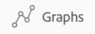

# Revise gráficos para entender as tendências de progresso das metas no Adobe Workfront Goals

<!-- drafted mostly for P&P release-->

Você pode visualizar a integridade geral de suas metas e a tendência do progresso delas no tempo na seção Gráficos das Metas do Adobe Workfront. Os gráficos nesta seção não detalham o progresso de cada meta, mas fornecem um instantâneo holístico do status de progresso de todas as metas, bem como sua tendência de progresso no tempo durante um período especificado.

>[!IMPORTANT]
>
>Você pode ver uma contagem total de suas metas na seção Gráficos para um período selecionado. No entanto, o Workfront Goals leva em conta apenas metas com status Ativo e Fechado ao calcular o status do progresso geral da meta e o percentual concluído.

## Requisitos de acesso

Você deve ter o seguinte acesso para executar as ações descritas neste artigo:

<table style="table-layout:auto">
<col>
</col>
<col>
</col>
<tbody>
 <tr>
 <td role="rowheader">plano do Adobe Workfront</td>
 <td>
 
Qualquer

</td>
 </tr>
 <tr>
 <td role="rowheader">Licença da Adobe Workfront*</td>
 <td>
 
Nova licença: Contributor ou superior

 Ou
 
Licença atual: Solicitação ou superior
 
Para obter mais informações, consulte <a href="../../administration-and-setup/add-users/access-levels-and-object-permissions/wf-licenses.md" class="MCXref xref">Visão geral das licenças do Adobe Workfront</a>.
 </td>
 </tr>
 <tr>
 <td role="rowheader">Produto*</td>
 <td>
 
 Novo requisito de produto, um dos seguintes: 

<ul>
<li>Um plano Select ou Prime do Adobe Workfront e uma licença adicional do Adobe Workfront Goals.</li>
<li>Um plano do Ultimate Workfront que inclui o Workfront Goals por padrão. </li></ul>
 
Ou

 
Requisito atual do produto: um plano do Workfront e uma licença adicional para o Adobe Workfront Goals. 
 
Para obter informações, consulte <a href="../../workfront-goals/goal-management/access-needed-for-wf-goals.md" class="MCXref xref">Requisitos para usar as metas do Workfront</a>. 
 </td>
 </tr>
 <tr>
 <td role="rowheader">
Nível de acesso
</td>
 <td> 
Editar acesso às Metas
 </td>
 </tr>
 <tr data-mc-conditions="">
 <td role="rowheader">Permissões de objeto</td>
 <td>
  

  
Exibir permissões ou mais altas para a meta para exibi-la

  
Gerenciar permissões para a meta para editá-la

  
Para obter informações sobre como compartilhar metas, consulte <a href="../../workfront-goals/workfront-goals-settings/share-a-goal.md" class="MCXref xref">Compartilhar uma meta no Workfront Goals</a>. 

  
 </td>
 </tr>
 <tr>
   <td role="rowheader">
Modelo de layout
</td>
   <td> 
Todos os usuários, incluindo administradores do Workfront, devem receber um modelo de layout que inclui a área Metas no Menu principal. 
  
</td>
  </tr>
</tbody>
</table>

*Para obter mais informações, consulte [Requisitos de acesso na documentação do Workfront](/help/quicksilver/administration-and-setup/add-users/access-levels-and-object-permissions/access-level-requirements-in-documentation.md).

## Tipos de gráficos nas Metas do Workfront

Os gráficos a seguir estão disponíveis na seção Gráficos ou Metas do Workfront:

<table style="table-layout:auto"> 
 <col> 
 <col> 
 <tbody> 
  <tr> 
   <td role="rowheader">Gráfico de integridade da meta</td> 
   <td> 
Um gráfico de medidores que mostra o seguinte:
 
    <ul> 
     <li>Um número total de metas para o período selecionado. Metas com qualquer status são consideradas. </li> 
     <li>O status do progresso das metas com status Ativo e Fechado.</li> 
    </ul> 
Para obter informações sobre como o Workfront Goals calcula o status do progresso, consulte <a href="../../workfront-goals/goal-management/calculate-goal-progress.md" class="MCXref xref">Visão geral do progresso e da condição da meta no Adobe Workfront Goals</a>.
 </td> 
  </tr> 
  <tr> 
   <td role="rowheader">O Gráfico de Progresso da Meta</td> 
   <td> 
Um gráfico de linha que mostra as atualizações feitas nas metas em incrementos semanais durante a duração da meta. O gráfico de progresso da meta exibe o seguinte:
 
    <ul> 
     <li>Uma porcentagem média de conclusão esperada e real de todas as metas ativas e fechadas no período selecionado. O progresso do percentual de conclusão é dividido em incrementos semanais marcados por nós. </li> 
     <li>A porcentagem média geral de progresso de metas ativas e fechadas desde a semana anterior. </li> 
    </ul> 
Dica: o gráfico de progresso da meta pode não exibir nenhuma informação quando as atualizações são feitas nas metas fora do período selecionado. 
 </td> 
  </tr> 
 </tbody> 
</table>

## Revisar o progresso da meta em gráficos

1. Clique em **Menu principal** ícone  > **Metas** no canto superior direito.

   <!-- Add this when Shell is available to all: or (if available), click the **Main Menu** icon  in the upper-left corner)
   -->

   Isso abre a área Metas do Workfront.

1. Clique em **Gráficos** no painel esquerdo.

   

   A seção Gráficos é exibida.

   Por padrão, as metas exibidas na seção Gráficos são limitadas pelos seguintes critérios:

   * Os filtros aplicados à área Gráficos.
   * Metas com status Ativo e Rascunho.

1. (Opcional) Selecione o tipo de informação que deseja exibir, atualizando os filtros no canto superior direito da seção Gráficos.

   Para obter mais informações sobre como filtrar metas, consulte [Filtrar informações nos Adobe Workfront Goals](../../workfront-goals/goal-management/filter-information-wf-goals.md).

   >[!TIP]
   >
   >Se você optou por exibir mais de um período, um gráfico de integridade (medidor) e um gráfico de progresso (linha) serão exibidos para cada período.

1. Revise as informações na tabela abaixo ao revisar o Gráfico de integridade da meta.

   

   | Número total de metas | O número na parte inferior do gráfico indica o número de todas as metas no período selecionado, em todos os status selecionados. |
   |---|---|
   | Percentual médio concluído | Na parte superior do gráfico, esse número indica o percentual médio de conclusão de metas ativas e fechadas no período selecionado. |
   | Metas e seu progresso | O número de metas para cada segmento de status de progresso, quando você passa o mouse sobre os segmentos do gráfico. Somente metas em um status Ativo ou Fechado são contadas nos segmentos. |

1. Revise as informações na tabela abaixo ao revisar o Gráfico de Progresso da Meta.

   

   <table style="table-layout:auto"> 
    <col> 
    <col> 
    <tbody> 
     <tr> 
      <td>Progresso da linha de base</td> 
      <td>A linha de inclinação verde indica a média geral concluída esperada de metas ativas e fechadas para o período selecionado. Espera-se que todas as metas em um período sejam concluídas, de modo que o progresso da linha de base seja sempre 100% no final do período. </td> 
     </tr> 
     <tr> 
      <td>Progresso real</td> 
      <td> 
A linha azul indica a média geral de porcentagem concluída real de metas ativas e fechadas para o período selecionado em incrementos semanais. Cada semana durante a duração da meta é marcada por um nó na linha. 
 </td> 
     </tr> 
    </tbody> 
   </table>

1. Passe o mouse sobre um nó semanal no gráfico de progresso da meta e analise o seguinte:

   * **Data da semana**: o mês, o dia e o ano da semana selecionada.
   * **Progresso**: uma média do percentual de conclusão real de todas as metas para a semana selecionada.
   * **Linha de base**: uma média do percentual de conclusão esperado de todas as metas para a semana selecionada.

1. (Opcional) Clique em **Progresso** na parte inferior do gráfico de progresso para remover a linha de progresso geral real

   Ou

   Clique em **Linha de base** na parte inferior do gráfico de progresso para remover o progresso esperado do gráfico.

 
