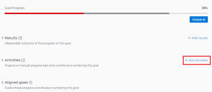

# Adicionar atividades às metas no Adobe Workfront Goals

<!--Audited for P&P only: 10/2025-->

As atividades medem o progresso de uma meta. Sem associar resultados, atividades, projetos ou metas alinhadas, não é possível ativar uma meta e registrar o progresso nela.

## Requisitos de acesso

>[!NOTE]
>
>Sua empresa pode optar por continuar usando o Adobe Workfront Goals se ele comprou esse pacote no passado. Você precisa falar com o seu representante de conta para obter mais detalhes.
>
>O Adobe Workfront Goals não está mais disponível para compra.

+++ Expanda para visualizar os requisitos de acesso para a funcionalidade neste artigo. 

<table style="table-layout:auto">
<col>
</col>
<col>
</col>
<tbody>
 <tr>
  <td> 
Pacote do Adobe Workfront
 </td> 
   <td> 
   
Adobe Workfront Ultimate

   </td> 
  </tr>
 <tr>
 <td role="rowheader">Licença do Adobe Workfront</td>
 <td>
 
Colaborador ou superior

Solicitação ou superior
</td>
 </tr>
  <tr>
 <td role="rowheader">Configuração do nível de acesso</td>
 <td> 
Editar acesso às Metas
 </td>
 </tr>
 <tr data-mc-conditions="">
 <td role="rowheader">Permissões de objeto</td>
 <td>
  

  
Exibir permissões ou mais altas para a meta para exibi-la

  
Gerenciar permissões para a meta para editá-la

  
 </td>
 </tr>
<tr>
   <td role="rowheader">
Modelo de layout
</td>
   <td> 
Todos os usuários, incluindo Administradores do sistema, devem receber um modelo de layout que inclua a área Metas no Menu principal. 
  
</td>
  </tr>
</tbody>
</table>

Para obter mais informações, consulte [Requisitos de acesso na documentação do Workfront](/help/quicksilver/administration-and-setup/add-users/access-levels-and-object-permissions/access-level-requirements-in-documentation.md).

+++

<!--Old:
<table style="table-layout:auto">
<col>
</col>
<col>
</col>
<tbody>
 <tr> 
   <td role="rowheader">Adobe Workfront plan*</td> 
   <td> 
   
For the new plan and license structure:
  <ul><li>An Ultimate plan </li></ul>
   

For the current plan and license structure: 
<ul><li> A Pro or higher </li>
  <li>An Adobe Workfront Goals license in addition to a Workfront license.</li></ul>

   </td> 
  </tr>
 <tr>
 <td role="rowheader">Adobe Workfront license*</td>
 <td>
 
New license: Contributor or higher

 Or
 
Current license: Request or higher
 
For more information, see <a href="../../administration-and-setup/add-users/access-levels-and-object-permissions/wf-licenses.md" class="MCXref xref">Adobe Workfront licenses overview</a>.
 </td>
 </tr>
 <tr>
 <td role="rowheader">Product*</td>
 <td>
 
 New product requirement, one of the following: 

<ul>
<li>A Select or Prime Adobe Workfront plan and an additional Adobe Workfront Goals license.</li>
<li>An Ultimate Workfront plan which includes Workfront Goals by default. </li></ul>
 
Or

 
Current product requirement: A Workfront plan and an additional license for Adobe Workfront Goals. 
 
For information, see <a href="../../workfront-goals/goal-management/access-needed-for-wf-goals.md" class="MCXref xref">Requirements to use Workfront Goals</a>. 
 </td>
 </tr>
 <tr>
 <td role="rowheader">Access level*</td>
 <td> 
Edit access to Goals
 </td>
 </tr>
 <tr data-mc-conditions="">
 <td role="rowheader">Object permissions</td>
 <td>
  

  
View or higher permissions to the goal to view it

  
Manage permissions to the goal to edit it

  
For information about sharing goals, see <a href="../../workfront-goals/workfront-goals-settings/share-a-goal.md" class="MCXref xref">Share a goal in Workfront Goals</a>. 

  
 </td>
 </tr>
 <tr>
   <td role="rowheader">
Layout template
</td>
   <td> 
All users, including Workfront administrators,  must be assigned a layout template that includes the Goals area in the Main Menu. 
  
</td>
  </tr>
</tbody>
</table>-->

## Pré-requisitos

Você deve ter uma meta existente para adicionar atividades a ela.

Para obter informações sobre como criar metas, consulte [Criar metas nas Metas do Adobe Workfront](../../workfront-goals/goal-management/create-goals.md).

>[!IMPORTANT]
>
>Uma meta não pode ter mais de 1.000 atividades, resultados ou metas alinhadas.

Para obter mais informações sobre atividades, consulte [Introdução a resultados e atividades nas Metas do Adobe Workfront](../../workfront-goals/results-and-activities/get-started-with-results-and-activities.md).

## Adicionar uma atividade a uma meta

<!--
Adding activities to goals differs depending on which environment you use.

### Add an activity to a goal in the Production environment

1. Go to the goal for which you want to add an activity and click the name to open the **Goal Details** panel.
1. Click **Add activities**.

   

1. From the **Activity Type** drop-down menu, select the type of activity you want to associate with your goal.&nbsp;Select **Manual progress bar** or **Project**. Manual progress bar is the default selection. 
1. (Conditional) Depending on which activity type you selected, do the following:

   1. If you selected **Manual progress bar**:

      1. Start typing a name for your activity in the **Activity** field. 
      1. (Optional) If you want to set the activity owner as someone other than yourself, click your name in the **Owner** field and begin typing the name of the user that you want to assign as the activity owner, then click it when it appears in the drop-down list.

         >[!NOTE]
         >
         >You cannot assign a team or group as an activity owner.

         When you update the progress of an activity, the progress of the goal automatically updates.

   1. If you selected **Project**:

      1. Click the **Connect projects** field.

         Existing projects that you have access to View display in the Connect projects list. Projects that are in a status of Dead do not display in the list. 
      
      1. Click the name of a project to add it as an activity to the goal. You can select several projects at one time.

         Workfront uses the project percent complete of all the attached projects to calculate the progress of the goal.

         For more information about associating projects with goals, see [Add projects to goals in Adobe Workfront Goals](../../workfront-goals/results-and-activities/connect-projects-to-goals-overview.md).

         >[!TIP]
         >
         >   
         >   * The owner of the project becomes the owner of this activity. If the project has no owner, then the activity has no owner. 
         >   * You cannot manually update the progress of a project. Workfront calculates the progress of the project based on the project percent complete. When the project percent complete updates in Workfront this also updates the connected project in Workfront Goals including the percent complete of the goal. 
         >   
         >

1. Click **Save**.

   The activity is saved for the selected goal. After you activate the goal, the progress of the goal automatically updates when you update the progress of an activity or when the percent complete of a project updates. For information about activating a goal, see [Activate goals in Adobe Workfront Goals](../../workfront-goals/goal-management/activate-goals.md).

-->

1. Clique no **Menu Principal**  e depois em **Metas**.
1. Na Lista de metas, clique no nome de uma meta para abrir a página da meta.
1. Clique em **Indicadores de progresso** no painel esquerdo.
1. No menu suspenso Novo indicador de progresso, clique em **Criar atividade**.

   A caixa Nova atividade é aberta.

   

1. Insira um nome para a atividade no campo Nome da atividade. Este campo é obrigatório.
1. (Opcional) Remova seu nome do campo **Proprietário da atividade** se desejar atribuir a atividade a outro usuário. Por padrão, você é o proprietário de uma atividade criada.

   >[!NOTE]
   >
   >Não é possível atribuir uma equipe, um grupo ou uma empresa como um proprietário de atividade.

1. Clique em **Criar atividade** para salvá-la e adicioná-la à meta selecionada.

   A atividade é exibida na seção Progress indicators da página de metas, no Agrupamento de atividades.

