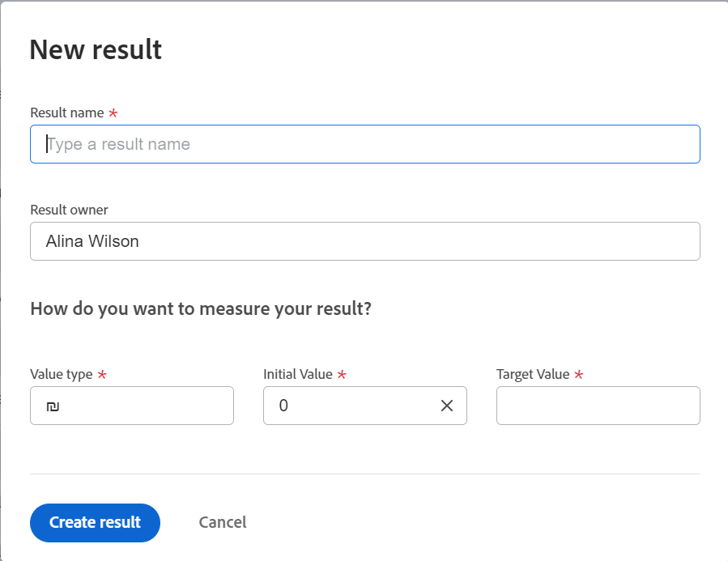

# Adicionar resultados às metas no Adobe Workfront Goals

Os resultados medem o progresso de uma meta. Sem associar resultados, atividades ou metas alinhadas a uma meta, você não pode ativar a meta e não pode registrar o progresso nela.

## Requisitos de acesso

Você deve ter o seguinte:

<table style="table-layout:auto">
<col>
</col>
<col>
</col>
<tbody>
 <tr>
 <td role="rowheader">plano do Adobe Workfront</td>
 <td>
 
Qualquer

</td>
 </tr>
 <tr>
 <td role="rowheader">Licença da Adobe Workfront*</td>
 <td>
 
Nova licença: Contributor ou superior

 Ou
 
Licença atual: Solicitação ou superior
 
Para obter mais informações, consulte <a href="../../administration-and-setup/add-users/access-levels-and-object-permissions/wf-licenses.md" class="MCXref xref">Visão geral das licenças do Adobe Workfront</a>.
 </td>
 </tr>
 <tr>
 <td role="rowheader">Produto*</td>
 <td>
 
 Novo requisito de produto, um dos seguintes: 

<ul>
<li>Um plano Select ou Prime do Adobe Workfront e uma licença adicional do Adobe Workfront Goals.</li>
<li>Um plano do Ultimate Workfront que inclui o Workfront Goals por padrão. </li></ul>
 
Ou

 
Requisito atual do produto: um plano do Workfront e uma licença adicional para o Adobe Workfront Goals. 
 
Para obter informações, consulte <a href="../../workfront-goals/goal-management/access-needed-for-wf-goals.md" class="MCXref xref">Requisitos para usar as metas do Workfront</a>. 
 </td>
 </tr>
 <tr>
 <td role="rowheader">
Nível de acesso
</td>
 <td> 
Editar acesso às Metas
  </td>
 </tr>
 <tr data-mc-conditions="">
 <td role="rowheader">Permissões de objeto</td>
 <td>
  

  
Exibir permissões ou mais altas para a meta para exibi-la

  
Gerenciar permissões para a meta para editá-la

  
Para obter informações sobre como compartilhar metas, consulte <a href="../../workfront-goals/workfront-goals-settings/share-a-goal.md" class="MCXref xref">Compartilhar uma meta no Workfront Goals</a>. 

  
 </td>
 </tr>
 <tr>
   <td role="rowheader">
Modelo de layout
</td>
   <td> 
Todos os usuários, incluindo administradores do Workfront, devem receber um modelo de layout que inclui a área Metas no Menu principal. 
  
</td>
  </tr>
</tbody>
</table>

*Para obter mais informações, consulte [Requisitos de acesso na documentação do Workfront](/help/quicksilver/administration-and-setup/add-users/access-levels-and-object-permissions/access-level-requirements-in-documentation.md).

## Pré-requisitos

Você deve ter o seguinte antes de iniciar:

* Um Modelo de layout que inclui a área Metas no Menu principal.
* Uma meta existente.

  Para obter informações sobre como criar metas, consulte [Criar metas no Adobe Workfront Goals](../../workfront-goals/goal-management/create-goals.md).

>[!IMPORTANT]
>Uma meta não pode ter mais de 1.000 atividades, resultados, projetos ou metas alinhadas.

## Adicionar um resultado a uma meta

<!--

Adding results to goals differs depending on which environment you use.

### Add a result to a goal in the Production environment

1. Go to the goal for which you want to add a result and click the name to open the **Goal Details** panel.
1. Click **Add results**.

   

1. Start typing the result you want to achieve in the **Result** field. This is the name of the result and it displays wherever the goal displays. 
1. (Optional) If you want to set the Result Owner as someone other than yourself, click your name in the **Owner** field and start typing the name of the user that you want to assign as the owner of the result, then click it when it appears in the drop-down list.

   >[!NOTE]
   >
   >You cannot assign a team or group as a result owner.

1. In the Value drop-down menu, select the type of value that you want to measure your success by.

   

   Select from the following options:

   |Option|Value type|
   |---|---|
   | # |Number value |
   | % |Percentage value |
   |$, CN¥, DKK, KR, Mex$, R, R$, zł, £ , ¥ , &euro; , ₹, ฿, MYR, ₪  |Currency values |

   For example, if you want to increase profit to 8%, and profit is currently at 4%, you can select % as the Measured Value.

   >[!TIP]
   >
   >The result Type is always Metric and cannot be edited.

1. In the Initial field, indicate the value that the result has in the beginning, before any progress on it has been recorded. For example, if you want to increase profit to 8%, and profit is currently at 4%, you can enter 4 as the Starting At value. 
1. In the Target field, indicate the value that the result aims to achieve. For example, if you want to increase profit to 8%, and profit is currently at 4%, you can enter 8 as the Ending At value.
1. Click **Save**.

   The result is saved for the selected goal. The progress of the goal automatically updates when you update the progress of a result.

-->

1. Clique no menu principal , depois **Metas**.

1. No **Lista de metas**, clique no nome de uma meta para abrir a página de metas.
1. Clique em **Indicadores de progresso** no painel esquerdo.
1. Expanda a **Novo indicador de progresso** e, em seguida, clique em **Criar resultado**.

   A caixa Novo resultado é aberta.

   

1. Insira um nome para o resultado no campo **Nome do resultado** campo. Este campo é obrigatório.
1. (Opcional) Remova seu nome da lista **Proprietário do resultado** se desejar atribuir o resultado a outro usuário. Por padrão, você é o proprietário de uma atividade criada.

   >[!NOTE]
   >
   >Não é possível atribuir uma equipe, grupo ou empresa como proprietário do resultado.

1. No **Como você deseja medir seu resultado?** especifique as seguintes informações:
   * **Tipo de valor**: indica como você deseja medir o progresso no resultado. Você pode medir o progresso numericamente, com um valor percentual ou usando um valor de moeda.

     Selecione um tipo de valor nas opções listadas na tabela a seguir:

     | Tipo de valor | Descrição |
     |---------------------------------------------------------|------------------|
     | Número | Valor numérico |
     | % | Valor percentual |
     | CN¥,DKK,KR,Mex$, R, R$, zł, £ , ¥ , € , Rt, ฿, MYR, Novo, $ | Valores de moeda |

   * **Valor inicial**: o valor que o resultado tem no início, antes que qualquer progresso nele tenha sido registrado.
   * **Valor de destino**: o valor que o resultado busca atingir quando é considerado concluído.
1. Clique em **Criar resultado**.

   O resultado é exibido na seção Indicadores de progresso da página de meta, no Agrupamento de resultados.

   Após ativar a meta, o progresso da meta é atualizado automaticamente ao atualizar o progresso de um resultado. Para obter informações sobre como ativar uma meta, consulte [Ativar metas no Adobe Workfront Goals](../goal-management/activate-goals.md).
