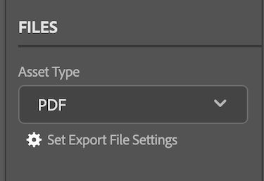

# Carregar documentos e provas de [!DNL Adobe Workfront plugin] para [!DNL Creative Cloud]

Você pode carregar seus projetos como documentos para revisão e aprovação rápidas ou simplesmente armazená-los em [!DNL Adobe Workfront].

>[!NOTE]
>
>Atualmente, o upload de documentos e provas não é suportado no Premiere Pro e no After Effects.

## Limitações do documento

Esta seção descreve as limitações conhecidas do documento no [!DNL Workfront for Adobe Creative Cloud plugins].

### Novas versões de documentos aceitam apenas um arquivo para upload

Como [!DNL Workfront] documentos não podem conter vários arquivos, algumas configurações devem ser desabilitadas para carregar novas versões de documentos para o Workfront.

>[!NOTE]
>
>Se precisar gerar vários arquivos, crie uma prova. A nova prova não será associada ao documento original.

Para alterar sua alternância de volta para um único arquivo em [!DNL InDesign]:

1. Abra a caixa de diálogo **Definir Configurações do Arquivo de Exportação**.

   

1. Encontre o tipo de ativo que deseja exportar e ajuste as configurações conforme descrito abaixo:

   <table>
    <tr>
    <td><strong>PDF e PDF-PRINT</strong>
    </td>
    <td>Desmarque <strong>Criar Arquivos PDF Separados</strong>.
    </td>
    </tr>
    <tr>
    <td><strong>EPS</strong>
    </td>
    <td>Selecione <strong>Intervalos</strong> e digite um único número de página. 
    

    <strong>Observação</strong>: se quiser carregar o documento completo, você deve criar uma prova. 
    </td>
    </tr>
    <tr>
    <td><strong>EPUB e EPUB-FIXED</strong>
    </td>
    <td>Não são necessários ajustes.
    </td>
    </tr>
    <tr>
    <td><strong>IDML</strong>
    </td>
    <td>Não são necessários ajustes.
    </td>
    </tr>
    <tr>
    <td><strong>JPG</strong>
    </td>
    <td>Selecione <strong>Intervalos</strong> e digite um único número de página. 
    

    <strong>Observação</strong>: se quiser carregar o documento completo, você deve criar uma prova. 
    </td>
    </tr>
    <tr>
    <td><strong>PNG</strong>
    </td>
    <td>Selecione <strong>Intervalos</strong> e digite um único número de página. 
    

    <strong>Observação</strong>: se quiser carregar o documento completo, você deve criar uma prova. 
    </td>
    </tr>
    <tr>
    <td><strong>XML</strong>
    </td>
    <td>Não são necessários ajustes. 
    </td>
    </tr>
    </table>
