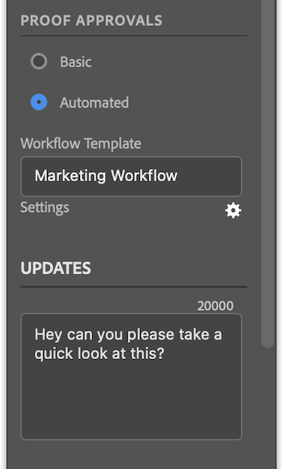

# Carregar provas de [!DNL InDesign]

Você pode fazer upload de seus quadros de arte como provas diretamente no [!DNL Adobe Workfront] para uma revisão e aprovação completas.

## Requisitos de acesso

+++ Expanda para visualizar os requisitos de acesso para a funcionalidade neste artigo.

Você deve ter o seguinte acesso para executar as etapas deste artigo:

<table style="table-layout:auto"> 
 <col> 
 <col> 
 <tbody> 
 <tr> 
   <td role="rowheader">[!DNL Adobe Workfront] plano*</td> 
   <td> 
Plano atual: [!UICONTROL Pro] ou superior
 
ou
 
Plano herdado: [!UICONTROL Premium]
 
Para obter mais informações sobre acesso de prova com os diferentes planos, consulte .
 </td> 
  </tr> 
  <tr> 
   <td role="rowheader">[!DNL Adobe Workfront] licença*</td> 
   <td> 
Plano atual: [!UICONTROL Trabalho] ou [!UICONTROL Prova]
 
Plano herdado: Qualquer um (Você deve ter a prova ativada para o usuário)
 </td> 
  </tr> 
  <tr> 
   <td role="rowheader">Produto</td> 
   <td>Você deve ter uma licença [!DNL Adobe Creative Cloud] além de uma licença [!DNL Workfront].</td> 
  </tr> 
  <tr> 
   <td role="rowheader">Perfil de Permissões de Prova </td> 
   <td>[!UICONTROL Manager] ou superior</td> 
  </tr> 
  <tr> 
   <td role="rowheader">Permissões de objeto</td> 
   <td> 
Editar acesso a [!UICONTROL Documentos]
 
Para obter informações sobre como solicitar acesso adicional, consulte <a href="../../workfront-basics/grant-and-request-access-to-objects/request-access.md" class="MCXref xref">Solicitar acesso aos objetos </a>.
 </td> 
  </tr> 
 </tbody> 
</table>

&#42;Para saber qual perfil de plano, função ou permissão de prova você tem, contate o administrador do [!DNL Workfront] ou do [!DNL Workfront Proof].

+++

## Pré-requisitos

* Você deve instalar o plug-in [!DNL Adobe Workfront for design and video] antes de carregar provas do [!DNL InDesign].

  Para obter instruções, consulte [Instalar [!DNL Adobe Workfront for design and video]](/help/quicksilver/workfront-integrations-and-apps/adobe-workfront-for-creative-cloud/wf-install-cc.md).

## Carregar uma prova básica

1. Clique no ícone **[!UICONTROL Menu]** no canto superior direito e selecione **[!UICONTROL Lista de Trabalho]**. Você também pode usar o menu para navegar até objetos principais.

   

1. Vá para o item de trabalho no qual deseja carregar uma prova.
1. Clique no ícone  do **[!UICONTROL Documento]** na barra de navegação.
1. Clique em **[!UICONTROL Novo arquivo]** próximo à parte inferior do plug-in.
1. Habilitar a opção **[!UICONTROL Criar uma prova]**.
1. (Opcional) Digite um nome para a prova na caixa de texto **[!UICONTROL Nome da Prova]**.
1. Na seção **[!UICONTROL Aprovações de revisões]**, selecione **[!UICONTROL Básico]**.
1. (Opcional) Adicione aprovadores.
1. (Opcional) Digite um comentário na área **[!UICONTROL Atualizações]**.

   

1. Escolha o **[!UICONTROL Tipo de ativo]** no menu suspenso.

1. (Opcional) Selecione **[!UICONTROL Adicionar arquivo externo]** para adicionar um arquivo do seu computador.
1. Clique em **[!UICONTROL Carregar]** e configure as opções de exportação desejadas com base no tipo de ativo escolhido acima.

   \
   O documento aparece na área [!UICONTROL Documentos] no plug-in e no aplicativo de desktop.

## Fazer upload de uma prova automatizada

1. Clique no ícone **[!UICONTROL Menu]** no canto superior direito e selecione **[!UICONTROL Lista de Trabalho]**. Você também pode usar o menu para navegar até objetos principais.

   

1. Vá para o item de trabalho no qual deseja carregar uma prova.
1. Clique no ícone  do **[!UICONTROL Documento]** na barra de navegação.

1. Clique em **[!UICONTROL Novo arquivo]** próximo à parte inferior do plug-in.
1. Habilitar a opção **[!UICONTROL Criar uma prova]**.
1. (Opcional) Digite um nome para a prova na caixa de texto **[!UICONTROL Nome da Prova]**.
1. Na seção **[!UICONTROL Aprovações de revisões]**, selecione **[!UICONTROL Automatizado]**.
1. (Opcional) Na caixa **[!UICONTROL Modelo de fluxo de trabalho]**, digite o nome de um modelo de fluxo de trabalho de prova.

{{adjust-proof-settings}}

>[!NOTE]
>
> Se houver campos obrigatórios em branco no modelo de fluxo de trabalho, as configurações de prova automatizada serão abertas automaticamente e será necessário preencher esses campos para fazer upload da prova.

1. (Opcional) Digite um comentário na área **[!UICONTROL Atualizações]**.

   

1. Escolha o **[!UICONTROL Tipo de ativo]** no menu suspenso.
1. (Opcional) Selecione **[!UICONTROL Adicionar arquivo externo]** para adicionar um arquivo do seu computador.
1. Clique em **[!UICONTROL Carregar]** e configure as opções de exportação desejadas com base no tipo de ativo escolhido acima.
O documento aparece na área [!UICONTROL Documentos] no plug-in e no aplicativo de desktop.

## Carregar uma nova versão de prova

Você pode fazer upload de uma nova versão de uma prova. O plug-in lembra o fluxo de trabalho de prova definido na versão anterior, mas você pode alterá-lo se desejar.

1. Clique no ícone **[!UICONTROL Menu]** no canto superior direito e selecione **[!UICONTROL Lista de Trabalho]**. Você também pode usar o menu para navegar até objetos principais.

   

1. Vá para o item de trabalho para o qual você precisa carregar um documento.
1. Clique no ícone **[!UICONTROL Documento]** na barra de navegação.

1. Clique em **[!UICONTROL Nova versão]** próximo à parte inferior do plug-in.
1. Habilitar a opção **[!UICONTROL Criar uma prova]**.

1. Na seção *[!UICONTROL *Aprovações de prova]**, escolha **[!UICONTROL Básico]** ou **[!UICONTROL Automatizado]**.

1. Adicione **[!UICONTROL Revisores]** ou um **[!UICONTROL modelo de fluxo de trabalho]** com base no tipo de aprovação selecionado na etapa 7.

1. (Opcional) Digite um comentário na área **[!UICONTROL Atualizações]**.
1. Escolha o **[!UICONTROL Tipo de ativo]** no menu suspenso.
1. Clique em **[!UICONTROL Carregar]** e configure as opções de exportação desejadas com base no tipo de ativo escolhido acima.
O documento aparece na área [!UICONTROL Documentos] no plug-in e no aplicativo de desktop.
