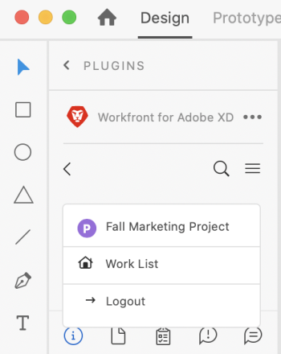

# Upload [!DNL XD] pranchetas como provas para [!DNL Workfront]

Você pode fazer upload de suas pranchetas como provas diretamente para o [!DNL Adobe Workfront] para uma análise e aprovação completas.

## Requisitos de acesso

Você deve ter o seguinte acesso para executar as etapas neste artigo:

<table style="table-layout:auto"> 
 <col> 
 <col> 
 <tbody> 
  <tr> 
   <td role="rowheader">[!DNL Adobe Workfront] plano*</td> 
   <td> 
Plano atual: [!UICONTROL Pro] ou superior
 
ou
 
Plano herdado: [!UICONTROL Premium]
 
Para obter mais informações sobre como revisar o acesso com os diferentes planos, consulte .
 </td> 
  </tr> 
  <tr> 
   <td role="rowheader">[!DNL Adobe Workfront] licença*</td> 
   <td> 
Plano atual: [!UICONTROL Trabalho] ou [!UICONTROL Prova]
 
Plano herdado: Qualquer (É necessário ter a prova ativada para o usuário)
 </td> 
  </tr> 
  <tr> 
   <td role="rowheader">Produto</td> 
   <td>Você deve ter um [!DNL Adobe Creative Cloud] além de um [!DNL Workfront] licença.</td> 
  </tr> 
  <tr> 
   <td role="rowheader">Perfil de Permissões de Prova </td> 
   <td>[!UICONTROL Manager] ou superior</td> 
  </tr> 
  <tr> 
   <td role="rowheader">Permissões de objeto</td> 
   <td> 
Editar acesso aos [!UICONTROL Documents]
 
Para obter informações sobre como solicitar acesso adicional, consulte <a href="../../workfront-basics/grant-and-request-access-to-objects/request-access.md" class="MCXref xref">Solicitar acesso a objetos </a>.
 </td> 
  </tr> 
 </tbody> 
</table>

&#42;Para descobrir qual plano, função ou Perfil de permissão de prova você possui, entre em contato com seu [!DNL Workfront] ou [!DNL Workfront Proof] administrador.

## Pré-requisitos

* Você deve instalar o [!DNL Adobe Workfront for XD] antes de fazer upload de provas no [!DNL Adobe XD].

   Para obter instruções, consulte [Instalar [!DNL Adobe Workfront for XD]](/help/quicksilver/workfront-integrations-and-apps/adobe-workfront-for-creative-cloud/wf-adobe-xd-install.md).

## Fazer upload de uma prova estática

1. Clique no botão **[!UICONTROL Menu]** no canto superior direito e selecione **[!UICONTROL Lista de Trabalho]**. Também é possível usar o menu para navegar até os objetos pai.

   

1. Vá para o item de trabalho onde deseja fazer upload de uma prova estática.
1. Clique no botão **[!UICONTROL Documento]** ícone  na barra de navegação.

1. Clique em **[!UICONTROL Novo arquivo]** próximo à parte inferior do plug-in.
1. Selecione as pranchetas que deseja fazer upload.

   >[!TIP]
   >
   >Para selecionar mais de uma prancheta, clique e arraste o mouse sobre as pranchetas desejadas.

1. Habilitar **[!UICONTROL Criar uma prova]**.

1. Dê um nome para a prova.

1. Escolha o tipo de aprovação de prova que deseja:

   <table style="table-layout:auto"> 
    <col> 
    <col> 
    <tbody> 
     <tr> 
      <td role="rowheader">[!UICONTROL Básico]: </td> 
      <td> 
Os processos básicos de aprovação são ad-hoc e podem incluir revisores diferentes conforme necessário: 
 
       <ul> 
        <li> 
(Opcional) Adicionar <strong>Aprovadores</strong> na caixa .
 </li> 
       </ul> </td> 
     </tr> 
     <tr> 
      <td role="rowheader">[!UICONTROL Automatizado]</td> 
      <td> 
Os processos de aprovação automatizados são pré-criados pelos administradores e incluem revisores e estágios específicos. Para obter mais informações, consulte <a href="../../review-and-approve-work/proofing/proofing-overview/automated-workflow.md" class="MCXref xref">Visão geral do fluxo de trabalho automatizado</a>.
 
       <ul> 
        <li> 
Escolha um [!UICONTROL Workflow Template] no menu suspenso.
 </li> 
       </ul> </td> 
     </tr> 
    </tbody> 
   </table>

{{adjust-proof-settings}}

1. (Opcional) Digite um comentário no **[!UICONTROL Atualizações]** área.

   

1. Escolha o formato de exportação no **[!UICONTROL Tipo de ativo]** menu suspenso.

1. (Opcional) Se você selecionar PDF como o tipo de ativo e tiver mais de uma prancheta selecionada, escolha se deseja exportar suas pranchetas como **[!UICONTROL Arquivo PDF único]s** ou **M[!UICONTROL Vários arquivos PDF]**.

1. (Opcional) Dê um nome ao PDF.

   

1. Clique em **[!UICONTROL Upload]**.\
   O documento é exibido na [!UICONTROL Documentos] no plug-in e no aplicativo de desktop.

## Fazer upload de uma prova interativa {#upload-an-interactive-proof}

Você pode criar uma prova interativa para suas pranchetas com a [!DNL Workfront for Adobe] plug-in. É um processo de duas etapas. Primeiro, é necessário criar um link interativo e, em seguida, fazer upload da prova para um item de trabalho.

### Criar um link interativo para a prancheta  {#create-an-interactive-link-for-your-art-board}

1. Abra o quadro e clique em **[!UICONTROL Compartilhar]** na área superior esquerda da tela.
1. Especifique as configurações do link:

   1. Dê um nome ao link.
   1. Escolha uma configuração de exibição.
   1. No **[!UICONTROL Acesso ao link]** seção , garantir **[!UICONTROL Qualquer pessoa com este link]** está selecionada.

      Você deve ativar esse tipo de acesso para gerar uma prova interativa.

   1. Clique em **[!UICONTROL Criar link]**.

1. Clique novamente para **[!UICONTROL Design]** na área superior esquerda da tela. Continue para a [Fazer upload de uma prova interativa](#upload-an-interactive-proof) abaixo.

   >[!NOTE]
   >
   >Talvez seja necessário reabrir o painel do plug-in no canto inferior esquerdo da tela.

### Fazer upload de uma prova interativa

1. Clique no botão **[!UICONTROL Menu]** no canto superior direito e selecione **[!UICONTROL Lista de Trabalho]**. Também é possível usar o menu para navegar até os objetos pai.

   

1. Vá para o item de trabalho onde deseja fazer upload de uma prova interativa.
1. Clique no botão **[!UICONTROL Documento]** ícone  na barra de navegação.

1. Clique em **[!UICONTROL Novo arquivo]** próximo à parte inferior do plug-in.
1. Habilitar **[!UICONTROL Criar uma prova]**.

1. Escolha o tipo de aprovação de prova que deseja:

   <table style="table-layout:auto"> 
    <col> 
    <col> 
    <tbody> 
     <tr> 
      <td role="rowheader">[!UICONTROL Básico]: </td> 
      <td> 
Os processos básicos de aprovação são ad-hoc e podem incluir revisores diferentes conforme necessário: 
 
       <ul> 
        <li> 
(Opcional) Adicionar <strong>Aprovadores</strong> na caixa .
 </li> 
       </ul> </td> 
     </tr> 
     <tr> 
      <td role="rowheader">[!UICONTROL Automatizado]</td> 
      <td> 
Os processos de aprovação automatizados são pré-criados pelos administradores e incluem revisores e estágios específicos. Para obter mais informações, consulte <a href="../../review-and-approve-work/proofing/proofing-overview/automated-workflow.md" class="MCXref xref">Visão geral do fluxo de trabalho automatizado</a>.
 
       <ul> 
        <li> 
Escolha um [!UICONTROL Workflow Template] no menu suspenso.
 </li> 
       </ul> </td> 
     </tr> 
    </tbody> 
   </table>

{{adjust-proof-settings}}

1. (Opcional) Digite um comentário no **[!UICONTROL Atualizações]** área.

   

1. No **[!UICONTROL Tipo de ativo]** no menu suspenso , escolha o link que acabou de criar no **Links compartilhados** guia . Para obter mais informações, consulte [Criar um link interativo para a prancheta](#create-an-interactive-link-for-your-artboard).\
   

1. Clique em **[!UICONTROL Upload]**.

   O documento é exibido na [!UICONTROL Documentos] no plug-in e no aplicativo de desktop.

   >[!IMPORTANT]
   >
   >Os usuários devem ter acesso ao [!UICONTROL Visualizador de prova de desktop] para revisar e aprovar provas interativas. Para obter mais informações, consulte [Instalar o [!UICONTROL Visualizador de prova para desktop]](../../review-and-approve-work/proofing/use-the-desktop-proofing-viewer/installing-desktop-proofing-viewer.md).

## Fazer upload de uma nova versão de prova

Você pode fazer upload de uma nova versão de uma prova. O plug-in lembra do fluxo de trabalho de prova definido na versão anterior, mas você pode alterá-lo se desejar.

1. Clique no botão **[!UICONTROL Menu]** no canto superior direito e selecione **[!UICONTROL Lista de Trabalho]**. Também é possível usar o menu para navegar até os objetos pai.

   

1. Vá para o item de trabalho para o qual você precisa carregar um documento.
1. Clique no botão **[!UICONTROL Documento]** ícone na barra de navegação.

1. Clique em **[!UICONTROL Nova versão]** próximo à parte inferior do plug-in.
1. Habilitar **[!UICONTROL Criar uma prova]**.
1. Selecione as pranchetas que deseja fazer upload.

   >[!NOTE]
   >
   >Para carregar uma nova versão de um .svg, .png ou .jpg, você pode carregar apenas uma prancheta.

1. Escolha o tipo de aprovação de prova que deseja:

   <table style="table-layout:auto"> 
    <col> 
    <col> 
    <tbody> 
     <tr> 
      <td role="rowheader">[!UICONTROL Básico]: </td> 
      <td> 
Os processos básicos de aprovação são ad-hoc e podem incluir revisores diferentes conforme necessário: 
 
       <ul> 
        <li> 
(Opcional) Adicionar <strong>Aprovadores</strong> na caixa .
 </li> 
       </ul> </td> 
     </tr> 
     <tr> 
      <td role="rowheader">[!UICONTROL Automatizado]</td> 
      <td> 
Os processos de aprovação automatizados são pré-criados pelos administradores e incluem revisores e estágios específicos. Para obter mais informações, consulte <a href="../../review-and-approve-work/proofing/proofing-overview/automated-workflow.md" class="MCXref xref">Visão geral do fluxo de trabalho automatizado</a>.
 
       <ul> 
        <li> 
Escolha um [!UICONTROL Workflow Template] no menu suspenso.
 </li> 
       </ul> </td> 
     </tr> 
    </tbody> 
   </table>

{{adjust-proof-settings}}

1. Escolha o formato de exportação no **[!UICONTROL Tipo de ativo]** menu suspenso.

   

1. (Opcional) Digite um comentário no **[!UICONTROL Atualizações]** área.

   

1. (Opcional) Se você selecionar PDF como o tipo de ativo e tiver mais de uma prancheta selecionada, escolha se deseja exportar suas pranchetas como **[!UICONTROL Arquivo PDF único]s** ou **M[!UICONTROL Vários arquivos PDF]**.

1. (Opcional) Dê um nome ao PDF.

   

1. Clique em **[!UICONTROL Upload]**.\
   O documento é exibido na [!UICONTROL Documentos] no plug-in e no aplicativo de desktop.
