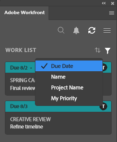

# Encontre seu trabalho usando o plug-in [!DNL Adobe Workfront]

Encontre o trabalho atribuído a você em [!DNL Adobe Workfront] sem sair dos [!DNL Adobe Creative Cloud] aplicativos a seguir:

{{cc-app-list}}

## Requisitos de acesso

Você deve ter o seguinte acesso para executar as etapas deste artigo:

<table style="table-layout:auto"> 
 <col> 
 <col> 
 <tbody> 
 <!-- <tr> 
   <td role="rowheader">[!DNL Adobe Workfront] plan*</td> 
   <td> 
[!UICONTROL Pro] or higher
 </td> 
  </tr> 
  <tr data-mc-conditions=""> 
   <td role="rowheader">[!DNL Adobe Workfront] license*</td> 
   <td> 
[!UICONTROL Work] or [!UICONTROL Plan]
 </td> 
  </tr> -->
  <tr> 
   <td role="rowheader">Produto</td> 
   <td>Você deve ter uma licença [!DNL Adobe Creative Cloud] além de uma licença [!DNL Workfront].</td> 
  </tr> 
 </tbody> 
</table>

&#42;Para saber qual plano, tipo de licença ou acesso você tem, contate o administrador do [!DNL Workfront].

## Pré-requisitos

{{cc-install-prereq}}

## Use a [!UICONTROL Lista de Trabalho] para acessar informações importantes

A [!UICONTROL Lista de Trabalho] permite exibir todas as tarefas e problemas atribuídos a você em um único local. Você pode usar a opção [!UICONTROL Classificar por] para agrupar itens e usar o [!UICONTROL Filtro] para se concentrar no trabalho que precisa ser concluído.

### Agrupar itens de trabalho semelhantes com a opção [!DNL Sort By]

Use a opção [!UICONTROL Classificar por] para agrupar itens semelhantes na [!UICONTROL Lista de Trabalho]. Você pode classificar por:

<table style="table-layout:auto"> 
 <col> 
 <col> 
 <tbody> 
  <tr> 
   <td> 
    <ul> 
     <li>[!UICONTROL Data de Conclusão]</li> 
     <li>[!UICONTROL Nome]</li> 
     <li>[!UICONTROL Nome do Projeto]</li> 
     <li>[!UICONTROL Minha Prioridade]</li> 
    </ul> </td> 
   <td>  </td> 
  </tr> 
 </tbody> 
</table>

### Restrinja seu foco com filtros

Use o [!UICONTROL Filtro] para restringir seu foco a itens de trabalho específicos. Há algumas maneiras de usar o filtro:

 

<table style="table-layout:auto"> 
 <col> 
 <col> 
 <tbody> 
  <tr> 
   <td> 
A primeira é filtrar com base apenas no tipo ou nos atributos do item de trabalho:
 
    <ul> 
     <li><strong>Item de trabalho</strong>: tarefas, subtarefas, problemas ou tarefas pessoais</li> 
     <li><strong>Estado do item de trabalho</strong>: [!UICONTROL Trabalhando], [!UICONTROL Pronto para Iniciar] ou [!UICONTROL Não Está Pronto]</li> 
    </ul> 
A segunda é filtrar usando o item de trabalho e o estado do item de trabalho juntos. Por exemplo, você pode selecionar Tarefas e [!UICONTROL Pronto para Iniciar] para encontrar todas as tarefas na lista de trabalho que estão prontas para trabalho.
 
Você também pode usar [!UICONTROL Correspondência de Campo] para procurar um item específico no seu conjunto de filtros. 
 </td> 
   <td>  </td> 
  </tr> 
 </tbody> 
</table>

## Procure por seu trabalho

Use a barra [!UICONTROL Pesquisa] para localizar projetos, tarefas, problemas e documentos necessários.

<table style="table-layout:auto"> 
 <col> 
 <col> 
 <tbody> 
  <tr> 
   <td> 
    <ul> 
     <li>Ver itens recentes: você pode visualizar até 5 dos itens de trabalho mais recentes acessados pelas versões de desktop ou plug-in do Workfront.</li> 
     <li>Localizar itens fixados: você pode acessar projetos, tarefas, problemas e documentos fixados na nova experiência do Adobe Workfront.</li> 
     <li>Encontre seus favoritos: você pode ver qualquer projeto, tarefa, problema ou documento que tenha salvo como favorito.</li> 
    </ul> </td> 
   <td>  </td> 
  </tr> 
 </tbody> 
</table>

## Use o [!UICONTROL Menu] para navegar pelos projetos

Você pode usar o ícone [!UICONTROL Menu] para navegar até os itens principais de um projeto.

