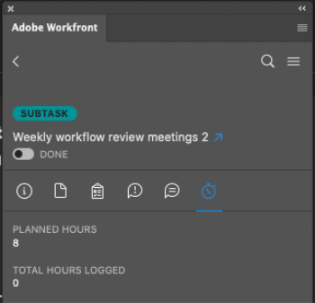

# Registrar tempo usando o plug-in [!DNL Adobe Workfront]

Você pode registrar horas para projetos, tarefas e problemas nos quais está trabalhando diretamente em qualquer um dos [!DNL Adobe Creative Cloud] aplicativos a seguir:

{{cc-app-list}}

## Requisitos de acesso

+++ Expanda para visualizar os requisitos de acesso para a funcionalidade neste artigo.

Você deve ter o seguinte acesso para executar as etapas deste artigo:

<table style="table-layout:auto"> 
 <col> 
 <col> 
 <tbody> 
  <tr> 
   <!--<td role="rowheader">[!DNL Adobe Workfront] plan*</td> 
   <td> 
[!UICONTROL Pro] or higher
 </td> 
  </tr> 
  <tr data-mc-conditions=""> 
   <td role="rowheader">[!DNL Adobe Workfront] license*</td> 
   <td> 
[!UICONTROL Work] or [!UICONTROL Plan]
 </td> 
  </tr> 
  <tr> 
   <td role="rowheader">Product</td> 
   <td>You must have an [!DNL Adobe Creative Cloud] license in addition to a [!DNL Workfront] license.</td> 
  </tr> -->
  <tr> 
   <td role="rowheader">Configurações de nível de acesso*</td> 
   <td> 
[!UICONTROL Editar] acesso a tarefas ou problemas
 
Observação: se você ainda não tiver acesso, pergunte ao administrador do [!DNL Workfront] se ele definiu restrições adicionais no seu nível de acesso. Para obter informações sobre como um administrador do [!DNL Workfront] pode modificar seu nível de acesso, consulte <a href="../../administration-and-setup/add-users/configure-and-grant-access/create-modify-access-levels.md" class="MCXref xref">Criar ou modificar níveis de acesso personalizados</a>.
 </td> 
  </tr> 
  <tr> 
   <td role="rowheader">Permissões de objeto</td> 
   <td> 
Permissão [!UICONTROL Log Hours] para a tarefa ou problema
 
Para obter informações sobre como solicitar acesso adicional, consulte <a href="../../workfront-basics/grant-and-request-access-to-objects/request-access.md" class="MCXref xref">Solicitar acesso aos objetos </a>.
 </td> 
  </tr> 
 </tbody> 
</table>

&#42;Para saber qual plano, tipo de licença ou acesso você tem, contate o administrador do [!DNL Workfront].

+++

## Pré-requisitos

{{cc-install-prereq}}

## Registrar tempo usando o plug-in do Adobe Workfront

O administrador [!DNL Workfront] determina quais tipos de horas específicos do projeto estão disponíveis, conforme descrito em [Gerenciar tipos de horas](../../administration-and-setup/set-up-workfront/configure-timesheets-schedules/hour-types.md).

Para registrar tempo usando o plug-in do Workfront:

1. Clique no ícone **[!UICONTROL Menu]** no canto superior direito e selecione **[!UICONTROL Lista de Trabalho]**. Você também pode usar o menu para navegar até objetos principais.

   

1. Na **[!UICONTROL Lista de Trabalho]**, selecione o item de trabalho para o qual você precisa registrar horas.
1. Clique em **[!UICONTROL Tempo]** na barra de navegação.

   

1. (Opcional) Escolha o **[!UICONTROL Tipo de Hora]** no menu suspenso.
1. Insira o tempo em horas do dia necessário.

   

1. Clique em **[!UICONTROL Enviar]**.
