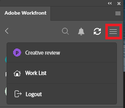

# Registrar tempo usando o plug-in [!DNL Adobe Workfront]

Você pode registrar horas para projetos, tarefas e problemas nos quais está trabalhando diretamente em qualquer um dos [!DNL Adobe Creative Cloud] aplicativos a seguir:

{{cc-app-list}}

## Requisitos de acesso

+++ Expanda para visualizar os requisitos de acesso da funcionalidade neste artigo.

<table style="table-layout:auto"> 
 <col> 
 <col> 
 <tbody> 
  <tr> 
   <!--
   <td role="rowheader">[!DNL Adobe Workfront] package</td> 
   <td> Any</td> 
  </tr> 
  <tr data-mc-conditions=""> 
   <td role="rowheader">[!DNL Adobe Workfront] license</td> 
   <td>
   
Standard

    
Work or higher
 </td> 
  </tr>
  -->
  <tr> 
   <td role="rowheader">Produtos adicionais</td> 
   <td>Você deve ter uma licença [!DNL Adobe Creative Cloud] além de uma licença [!DNL Workfront].</td> 
  </tr> 
  <tr> 
   <td role="rowheader">Configurações de nível de acesso</td> 
   <td> 
[!UICONTROL Editar] acesso a tarefas ou problemas
</td> 
  </tr> 
  <tr> 
   <td role="rowheader">Permissões de objeto</td> 
   <td> 
Permissão [!UICONTROL Log Hours] para a tarefa ou problema
 </td> 
  </tr> 
 </tbody> 
</table>

Para obter informações, consulte [Requisitos de acesso na documentação do Workfront](/help/quicksilver/administration-and-setup/add-users/access-levels-and-object-permissions/access-level-requirements-in-documentation.md).

+++

## Pré-requisitos

{{cc-install-prereq}}

## Registrar tempo usando o plugin do Adobe Workfront

O administrador [!DNL Workfront] determina quais tipos de horas específicos do projeto estão disponíveis, conforme descrito em [Gerenciar tipos de horas](../../administration-and-setup/set-up-workfront/configure-timesheets-schedules/hour-types.md).

Para registrar tempo usando o plug-in do Workfront:

1. Clique no ícone **[!UICONTROL Menu]** no canto superior direito e selecione **[!UICONTROL Lista de Trabalho]**. Você também pode usar o menu para navegar até objetos principais.

   

1. Na **[!UICONTROL Lista de Trabalho]**, selecione o item de trabalho para o qual você precisa registrar horas.
1. Clique em **[!UICONTROL Tempo]** na barra de navegação.

   

1. (Opcional) Escolha o **[!UICONTROL Tipo de Hora]** no menu suspenso.
1. Insira o tempo em horas do dia necessário.

   

1. Clique em **[!UICONTROL Enviar]**.
