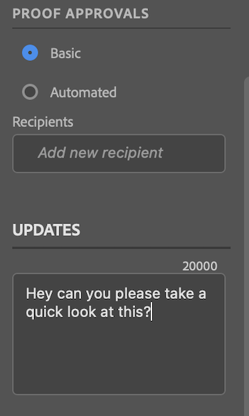

# Carregar provas de [!DNL Photoshop]

Você pode fazer upload de certos tipos de predefinição de documento do Photoshop como provas diretamente para [!DNL Adobe Workfront] para uma revisão completa e aprovação.

>[!IMPORTANT]
>
>O arquivo deve ser uma Predefinição de Documento de Foto, conforme descrito em [Modelos e Predefinições no Photoshop](https://helpx.adobe.com/photoshop/using/create-documents.html).

## Requisitos de acesso

+++ Expanda para visualizar os requisitos de acesso da funcionalidade neste artigo.

<table style="table-layout:auto"> 
 <col> 
 <col> 
 <tbody> 
  <tr> 
   <td role="rowheader">[!DNL Adobe Workfront] pacote</td> 
   <td> Qualquer</td> 
  </tr> 
  <tr> 
   <td role="rowheader">[!DNL Adobe Workfront] licença</td> 
   <td> 
   
Padrão

   
Trabalho ou maior
 </td> 
  </tr> 
  <tr> 
   <td role="rowheader">Produtos adicionais</td> 
   <td>Você deve ter uma licença [!DNL Adobe Creative Cloud] além de uma licença [!DNL Workfront].</td> 
  </tr> 
  <tr> 
   <td role="rowheader">Perfil de Permissões de Prova </td> 
   <td>[!UICONTROL Manager] ou superior</td> 
  </tr> 
  <tr> 
   <td role="rowheader">Permissões de objeto</td> 
   <td> 
Editar acesso a [!UICONTROL Documentos]
  </td> 
  </tr> 
 </tbody> 
</table>

Para obter informações, consulte [Requisitos de acesso na documentação do Workfront](/help/quicksilver/administration-and-setup/add-users/access-levels-and-object-permissions/access-level-requirements-in-documentation.md).

+++

## Pré-requisitos

* Você deve instalar o [!DNL Adobe Workfront for Photoshop] antes de carregar provas do [!DNL Adobe Photoshop].

  Para obter instruções, consulte [Instalar [!DNL Adobe Workfront for Photoshop]](../../workfront-integrations-and-apps/adobe-workfront-for-creative-cloud/wf-cc-install-ps.md).

## Carregar uma prova básica

1. Clique no ícone **[!UICONTROL Menu]** no canto superior direito e selecione **[!UICONTROL Lista de Trabalho]**. Você também pode usar o menu para navegar até objetos principais.

   

1. Vá para o item de trabalho no qual deseja carregar uma prova.
1. Clique no ícone **[!UICONTROL Documento]**  na barra de navegação.
1. Clique em **[!UICONTROL Novo arquivo]** próximo à parte inferior do painel [!DNL Workfront].
1. Habilitar a opção **[!UICONTROL Criar uma prova]**.
1. (Opcional) Digite um nome para a prova na caixa de texto **[!UICONTROL Nome da Prova]**.
1. Na seção **[!UICONTROL Aprovações de revisões]**, selecione **[!UICONTROL Básico]**.
1. (Opcional) Adicione aprovadores.
1. (Opcional) Digite um comentário na área **[!UICONTROL Atualizações]**.

   

1. Escolha o **[!UICONTROL Tipo de ativo]** no menu suspenso.

1. (Opcional) Selecione **[!UICONTROL Adicionar arquivo externo]** para adicionar um arquivo do seu computador.
1. Clique em **[!UICONTROL Carregar]** e configure as opções de exportação desejadas com base no tipo de ativo escolhido acima.

   \
   O documento aparece na área [!UICONTROL Documentos] no painel [!DNL Workfront] do [!DNL Photoshop] e no aplicativo de desktop [!DNL Workfront].

## Fazer upload de uma prova automatizada

1. Clique no ícone **[!UICONTROL Menu]** no canto superior direito e selecione **[!UICONTROL Lista de Trabalho]**. Você também pode usar o menu para navegar até objetos principais.

   

1. Vá para o item de trabalho no qual deseja carregar uma prova.
1. Clique no ícone **[!UICONTROL Documento]**  na barra de navegação.

1. Clique em **[!UICONTROL Novo arquivo]** próximo à parte inferior do painel [!DNL Workfront].
1. Habilitar a opção **[!UICONTROL Criar uma prova]**.
1. (Opcional) Digite um nome para a prova na caixa de texto **[!UICONTROL Nome da Prova]**.
1. Na seção **[!UICONTROL Aprovações de revisões]**, selecione **[!UICONTROL Automatizado]**.
1. (Opcional) Na caixa **[!UICONTROL Modelo de fluxo de trabalho]**, digite o nome de um modelo de fluxo de trabalho de prova.

{{adjust-proof-settings}}

>[!NOTE]
>
> Se houver campos obrigatórios em branco no modelo de fluxo de trabalho, as configurações de prova automatizada serão abertas automaticamente e será necessário preencher esses campos para fazer upload da prova.

1. (Opcional) Digite um comentário na área **[!UICONTROL Atualizações]**.

   

1. Escolha o **[!UICONTROL Tipo de ativo]** no menu suspenso.
1. (Opcional) Selecione **[!UICONTROL Adicionar arquivo externo]** para adicionar um arquivo do seu computador.
1. Clique em **[!UICONTROL Carregar]** e configure as opções de exportação desejadas com base no tipo de ativo escolhido acima.
O documento aparece na área [!UICONTROL Documentos] no painel [!DNL Workfront] do [!DNL Photoshop] e no aplicativo de desktop [!DNL Workfront].

## Carregar uma nova versão de prova

Você pode fazer upload de uma nova versão de uma prova. O plug-in lembra o fluxo de trabalho de prova definido na versão anterior, mas você pode alterá-lo se desejar.

1. Clique no ícone **[!UICONTROL Menu]** no canto superior direito e selecione **[!UICONTROL Lista de Trabalho]**. Você também pode usar o menu para navegar até objetos principais.

   

1. Vá para o item de trabalho para o qual você precisa carregar um documento.
1. Clique no ícone **[!UICONTROL Documento]** na barra de navegação.

1. Clique em **[!UICONTROL Nova versão]** próximo à parte inferior do painel [!DNL Workfront].
1. Habilitar a opção **[!UICONTROL Criar uma prova]**.

1. Na seção *[!UICONTROL *Aprovações de prova]&#x200B;**, escolha &#x200B;** [!UICONTROL Básico] **&#x200B; ou &#x200B;** [!UICONTROL Automatizado]**.

1. Adicione **[!UICONTROL Revisores]** ou um **[!UICONTROL modelo de fluxo de trabalho]** com base no tipo de aprovação selecionado na etapa 7.

1. (Opcional) Digite um comentário na área **[!UICONTROL Atualizações]**.
1. Escolha o **[!UICONTROL Tipo de ativo]** no menu suspenso.
1. Clique em **[!UICONTROL Carregar]** e configure as opções de exportação desejadas com base no tipo de ativo escolhido acima.
O documento aparece na área [!UICONTROL Documentos] no painel [!DNL Workfront] do [!DNL Photoshop] e no aplicativo de desktop [!DNL Workfront].
