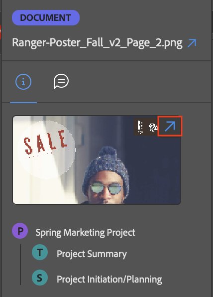

# Exibir informações do item de trabalho usando o plug-in [!DNL Adobe Workfront]

Você pode ver informações sobre projetos, tarefas, problemas e documentos dos seguintes aplicativos [!DNL Adobe Creative Cloud]:

{{cc-app-list}}

## Requisitos de acesso

+++ Expanda para visualizar os requisitos de acesso da funcionalidade neste artigo.

<table style="table-layout:auto"> 
 <col> 
 </col> 
 <col> 
 </col> 
 <tbody> 
  <!--
  <tr> 
   <td role="rowheader">[!DNL Adobe Workfront] package</td> 
   <td> 
Any
 </td> 
  </tr> 
  <tr data-mc-conditions=""> 
   <td role="rowheader">[!DNL Adobe Workfront] license</td> 
   <td> 
   
Standard

   
Work or higher
 </td> 
  </tr>
  -->
  <tr> 
   <td role="rowheader">Produtos adicionais</td> 
   <td>Você deve ter uma licença [!DNL Adobe Creative Cloud] além de uma licença [!DNL Workfront].</td> 
  </tr> 
  <tr> 
   <td role="rowheader">Configurações de nível de acesso</td> 
   <td> 
Acesso de [!UICONTROL View] a Projetos, Tarefas ou Problemas
  </td> 
  </tr> 
  <tr> 
   <td role="rowheader">Permissões de objeto</td> 
   <td> 
Acesso de visualização ao objeto que você deseja visualizar. 
</td> 
  </tr> 
 </tbody> 
</table>

Para obter informações, consulte [Requisitos de acesso na documentação do Workfront](/help/quicksilver/administration-and-setup/add-users/access-levels-and-object-permissions/access-level-requirements-in-documentation.md).

+++

## Pré-requisitos

{{cc-install-prereq}}

## Exibir detalhes e dados de formulário personalizados

1. Clique no ícone **[!UICONTROL Menu]** no canto superior direito e selecione **[!UICONTROL Lista de Trabalho]**. Você também pode usar o menu para navegar até objetos principais.

   

1. Selecione o item de trabalho que deseja exibir.

   >[!TIP]
   >
   >Use o ícone **[!UICONTROL Menu]** para ir para os objetos pai do item de trabalho.

1. Clique no ícone **[!UICONTROL Detalhes]**  na barra de navegação para exibir:

   * [!UICONTROL Descrição]
   * [!UICONTROL Data de Término Planejada]
   * [!UICONTROL Status]
   * [!UICONTROL Atribuído a]
   * [!UICONTROL Proprietário do Projeto] (somente Projetos)
   * Dados de formulário personalizados

## Exibir detalhes do documento

1. Clique no ícone **[!UICONTROL Menu]** no canto superior direito e selecione **[!UICONTROL Lista de Trabalho]**. Você também pode usar o menu para navegar até objetos principais.

   

1. Selecione o item de trabalho que deseja exibir.

   >[!TIP]
   >
   >Use o ícone **[!UICONTROL Menu]** para ir para os objetos pai do item de trabalho.

1. Clique no ícone **[!UICONTROL Documento]**  na barra de navegação e clique duas vezes em um documento para exibi-lo:

   * [!UICONTROL Descrição]
   * [!UICONTROL Tipo de arquivo]
   * [!UICONTROL Status da prova] (disponível somente para provas)
   * [!UICONTROL Versão]
   * [!UICONTROL Tamanho]
   * Dados do formulário personalizado

## Exibir detalhes da prova

1. Clique no ícone **[!UICONTROL Menu]** no canto superior direito e selecione **[!UICONTROL Lista de Trabalho]**. Você também pode usar o menu para navegar até objetos principais.

   

1. Selecione o item de trabalho que deseja exibir.

   >[!TIP]
   >
   >Use o ícone **[!UICONTROL Menu]** para ir para os objetos pai do item de trabalho.

1. Clique no ícone **[!UICONTROL Documento]**  na barra de navegação e clique duas vezes em uma prova.

1. Clique no ícone de seta no canto superior direito da miniatura para abrir os detalhes da prova no [!DNL Workfront].

## Exibir o status de uma prova

1. Clique no ícone **[!UICONTROL Menu]** no canto superior direito e selecione **[!UICONTROL Lista de Trabalho]**. Você também pode usar o menu para navegar até objetos principais.

   

1. Selecione o item de trabalho que deseja exibir.

   >[!TIP]
   >
   >Use o ícone **[!UICONTROL Menu]** para ir para os objetos pai do item de trabalho.

1. Clique no ícone **[!UICONTROL Documento]**  na barra de navegação e clique duas vezes em uma prova.

1. Role para baixo para visualizar o status atual da prova. Para obter mais informações sobre detalhes de Enviado, Aberto, Comentário, Decisão (SOCD), consulte [Visão geral de Detalhes do Documento](/help/quicksilver/documents/managing-documents/document-details-overview.md).

## Exibir subtarefas e problemas

1. Clique no ícone **[!UICONTROL Menu]** no canto superior direito e selecione **[!UICONTROL Lista de Trabalho]**. Você também pode usar o menu para navegar até objetos principais.

   

1. Selecione o item de trabalho que deseja exibir.

   >[!TIP]
   >
   >Use o ícone **[!UICONTROL Menu]** para ir para os objetos pai do item de trabalho.

1. Clique no ícone **[!UICONTROL Problema]** ícone  ou **Subtarefa** ícone .

1. Selecione a tarefa ou o problema e clique no ícone **[!UICONTROL Detalhes]**  na barra de navegação para exibir:

   * [!UICONTROL Data de Término Planejada]
   * [!UICONTROL Status]
   * [!UICONTROL Atribuído a]
   * Dados do formulário personalizado
